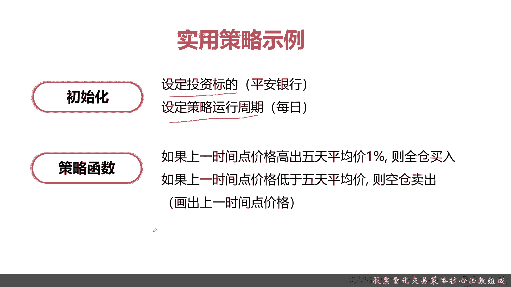
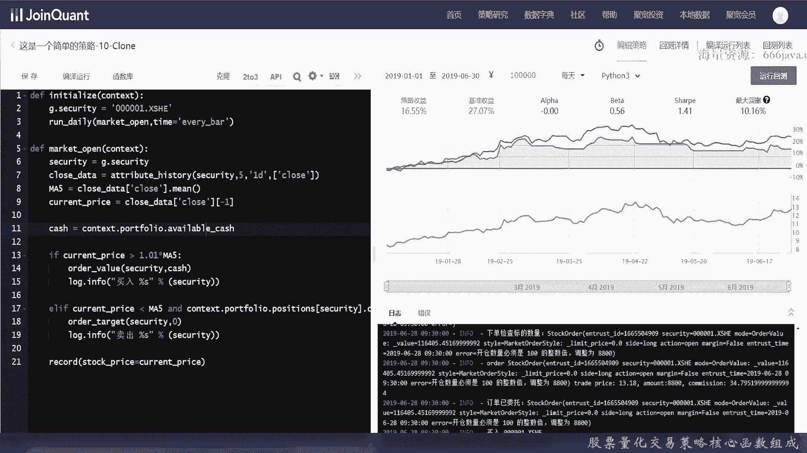
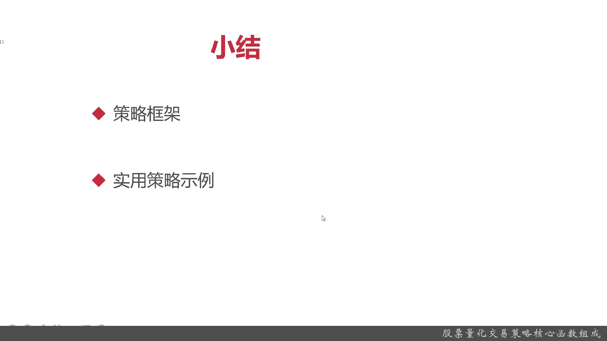

# 基于Python的股票分析与量化交易入门到实践 - P22：7.1 量化策略编写-Python量化交易编程第一步_股票量化交易策略核心函数组成 - 纸飞机旅行家 - BV1rESFYeEuA

大家好，我是米铁，在前面几章中呢，我们分别给大家介绍了用于金融计算的框架，南派，以及用于时间序列数据处理的pandas，还有用于画质专业的金融图形的框架matter prolab，那么从这一章开始呢。

我们即将让大家开始进行量化交易策略实战，那作为整个系列章节的第一章呢，我们选择给大家介绍一些，如何去编写简易的量化交易策略，那么本节呢我们先先向大家介绍策略框架。

本节呢我们将从两个方面给大家介绍策略框架，首先呢我们给大家介绍一下策略框架的定义，还有策策略框架的一些组成，接着呢我们给大家再介绍一下策略框架，这些组成函数啊，它具体是什么，举个例子。

然后呢我们给大家介绍一个实用的策略框架，也当然了，这个实用策略框架是比较简单的，在后面我们带领大家进行coding实战，那么接下来呢我将向大家介绍策略框架，那这个策略框架是个啥呢，它由什么组成部分呢。

OK主要是两部分组成，一个是初始化，一个是策略函数，初始化就是整个策略框架，一开始设置的一些内容，而策略函数就是整个拟策略化最核心的部分，那么接下来我们给大家详细介绍一下这两，首先是初始化。

初始化可以设置各种基准，也可以设置其他的一些参数，它整体只会被运行一次，主要是用来初始化全局变量的，记住是初始化全局变量，接着是策略函数，策略函数就是重复执行你测交易策略，这个是你质量化交易的核心，好。

接下来呢我分别向大家详细介绍一下，初始化和策略函数，这是初始化的定义，我们就快速过了，好我们给大家看一个例子，初始化一般的函数都是initialize，然后它有个变量叫context。

context是我们这个距宽框架里面的全局对象，一般会存有股票账户，持仓等等等等等等等，我们接下来可以举个例子，这里internationalize有个context，那这里面有一个这两个例子。

大家要记牢记点，security既是全局变量，然后呢security就是证券，那证券代码就是0001点叉SHE，这个代表是深交所的平安银行，OK好，接下来给大家介绍一下策略函数，定义跟之前一样。

也是快速过策略函数，有以下实例，它有一个函数名，然后全局变量这个参数是可定义的，函数名是用户自定义的，然后这个order也是区块链化平台常用的API，那这两句代码的意思分别是下单1000股。

并且卖出800，Ok，那么再接下来，我们给大家介绍一个实用的策略函数，那我们给大家介绍实用策略函数的时候，我们是按照之前的框架初始化和策略函数，分别给大家介绍，在初始化部分。

我们需要设定投资标的就是平安银行，然后运行策略就是每天都运行，然后它的策略函数是什么呢，如果上一时间点的价格，高于五天内的平均的1%，那就全仓买入，如果上一时间点价格低于五天平均价，则空仓卖出。

这个全仓就是全部买入，空仓就是把所有的账号里面所有的股票都抛出，然后划出上映时间的价格，OK这就是一个最简单对，但是相对也比较实用的策略函数，那么接下来呢我将向大家通过coding实战。

给大家讲解这个策略通过代码是怎么实现的好。

那么我们接下来呢我们进入实战coding阶段，我们因为是在用区宽量化交易平台，那他们现在呢就是这个量化交易平台的，有一个特色，它就是他要用这些代码，策略代码要要写在自己的那个id里面。

不是基本不是在用PH，当然如果你只是用他的数据，那你可以用PY项目，或者你自己ID也可以，但是否则像巨宽啊，米框啊这些它都是有自己的编程的IDE，那你的投资策略。

代码交易这些API必须写在他的指定的IDE里面，也有一些开源的量化交易框架，但是呢这个比较复杂，因为我们这个课程还是只是现在，还只是在加加入门阶段，我们可以先采用，先给大家区块链化品交易平台来进行演示。

那我们简单介绍一下id啊，这个是一个编写策略的框架，那具体这里是编写策略，然后这里可以看实际的回测结果，这里是一个运行的log日志，你这里直接运行就行了，大其实大同小异样。

你还可以看到回测你冰心月亮这些都可以，一般来说它都是python3的那点的，这里可以看到API的样子，然后呢这是基本的函数库的描述，那好那我们接下来就给大家实现一下，刚才给大家介绍的那个实用框架。

首先我们要定义初始化的呃，你可以看到这其实也也有很多提示啊，我们给大家定义一下初始化的一个函数，当然了，它不像IDE那么方便，所有的基本函数呢都已经做成这样，然后呢，好这个倒是它可以实现。

你看这股票代码他是可以立刻的认识的，这个pass是没有用的，Sualize，接着呢，我们要定义一个运行函数，我们每天才给它运行，我们预先定义好我们要运行函数的名称，这个运行函数就是具体的策略函数名。

这是主函数啊，这个IDE呢还不是那么成熟，提示其实做的不是不是特别好好，我们接着定义策略函数好，这个他倒是认识了market open，好context他也是认识，好我们先获取股票的价格，就是收盘价。

这是肯定要获取的，这应该是attribute，它有几个变量security，然后运行的频率，这个是它具体的函数，在后面我们会给大家详细介绍这些API，只有这些API用的很熟。

你才能快捷的编写自己的相关资料，然后这也比较方便他们取5日均线，因为非常方便，直接这样写就可以了，这其实也是类似于，pandas的写法，CONQUENT当前价格试点，好那我们下面要看现金了。

这也是他们常见的，变量当然了，一开始可能诸位同学对这个不是特别熟悉，没关系，可以一边看着我的视频，然后也参考着据宽这里的社区文档，来自己练练手，我们一开第一个例子都是非常简单的，好判断他的买入时间。

就像之前说的，要比均价高55%，我们下单，这意思就是买入这只股票，同时我们记录，然后打log，这里呢跟区宽跟就不太一样了，他是这样的log方式，它不是用format at，好然后呢，卖出的时候。

也记录一下，在log里面把卖出给记录一下，好最后呢我们画图，好了，这个呢就是我们写的简单的使用策略，可以很简单，20行代码，然后呢我们先调试一下，看结果，嗯跑错了，我们看一下log啊，我们看一下log。

他这里竟然报错了，我们看看什么问题啊，open没错呀，哦少写了个冒号嗯，好这又和这次不一样的错误了，是不是某种变量名写错了，Available，再来试一下啊，好的，可以看到这样的结果就出来了。

你看它还在正常编译运行，这他们速度回测还是很快的，可以看到，从2019年1月1日到20年6月30日，假设每天一共有10万块钱的话，他的贝塔收益和大小结果就是在这里，那我们可以通过我们平台。

可以看到我们的收益的具体情况，最终我们的这个策略呢其实坦白来说，在这段时间半年内，我们可以看到，在这里是策略收益16。5%，但是这个策略嘛它是和基准收益基数，其实就是沪深300类似，一些上证指数啊。

这些基准呢这段时间呢涨了27%，那其实我们的策略还不是特别好，后面呢我们会给大家告诉我呃，一下简单的简单的，后面我们会逐步进行优化，那可以看到这是具体的log，感兴趣的同学们可以自己去看。

有的时候可以买，有的时候还会有报错，这个其实代码量非常少，如果你是完全要自己搭一个框架，那可不是这么一点的工作量好。

我们可以再运行一下回测看一下好，这个呢其实比刚才更详细了，大家可以看到每天看的情况，那阿尔法就说贝塔是多少，OK感兴趣同学们可以自己去来编写一下，好那么呢我们接下来进行一下本章小结。

好我们接下来呢进行下本章小学，大家，这章呢最主要的就是给大家介绍一下策略框架，那我们采用的是距宽的这个策略框架，那他其实不论是哪一种量化交易平台，它其实在于要编写一个量化交易策略，它都有两块。

一块就是你的初始化，接着呢就是你的策略函数，那初始化是啥呢，初始化就是你全局实例化运行的时候，在一些设定下，全局变量它只会被运行一次，或者呢运行频率等等等，这都是初始化。

而那个你的策略函数呢就是你具体的交易函，它包括这样，我之前介绍的买入和卖出的交易信号，然后具体的动作买多少卖多少等等，这就是策略框架，接着呢我们给大家介绍了一个实用的策略，那还记得吗。

这个刚才给大家介绍，那是买的是那个深圳平安，然后呢啊平安银行每天进行一次，然后呢它的核心，它的量化策略就是如果上一时间点的价格，高出五天的平均价的1%就全仓买入，当然了。

实际情况各种策略其实你不用全仓买入，这在你可以进行阶梯式的网格式的等等等等，然后呢我们这个策略，如果上一时间点价格低于五天平均价，这空仓卖出，他其实就是看这1%的这个，赚这1%的差价，OK好。

以上呢就是本节的内容，这是我们给大家介绍呃，编写的介绍的第一个实际的量化交易策略。

好我是米tea。