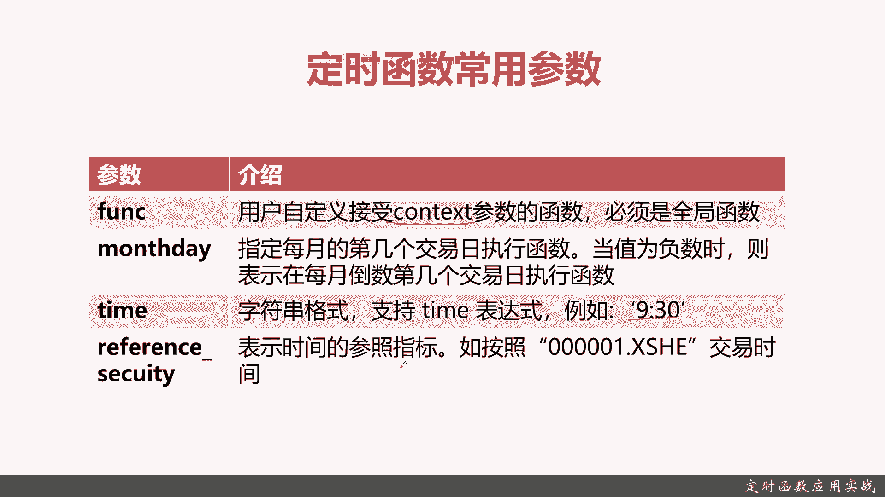
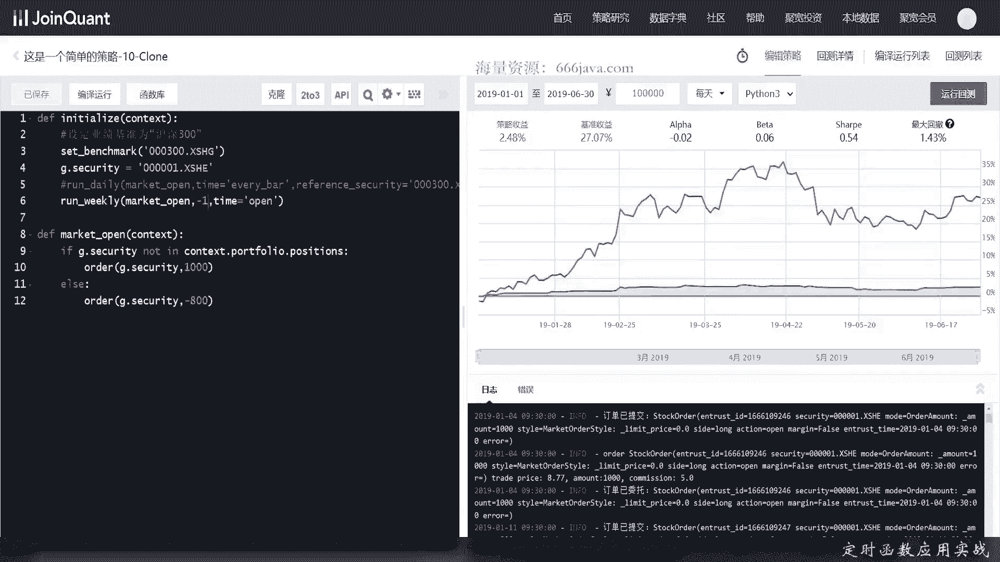
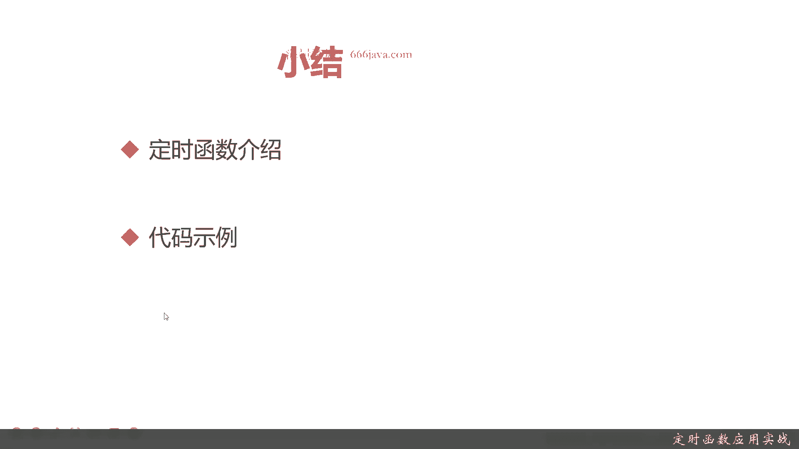

# 基于Python的股票分析与量化交易入门到实践 - P24：7.3 量化策略编写-Python量化交易编程第一步_定时函数应用实战 - 纸飞机旅行家 - BV1rESFYeEuA

大家好，我是meta，在上一节呢我给大家介绍了，初始化里面一个非常重要的函数设置函数，那么这一节呢我给大家介绍初始化时候，另一个非常重要的函数定时函数，本节呢我们将从两个方面给大家介绍定时函数。

首先是定时函数的定义，还有它基本的分类，接着呢给大家介绍一下定时函数的参数，后面呢我们给大家进入coding实战环节，首先呢我们给大家介绍一下定时函数，那定时函数是什么呢，重点是回测和模拟交易。

它的重作用是设定他们的时间，定时函数呢有以下三个常见的，首先是阅读，阅读呢就是run monthly，可以看到他们有下面几个参数，Function，Monthday。

time和reference security，具体呢我们会在后面给大家介绍，接下来的呢是周度，周度其实和阅读差不多啊，其实就是monthly变成weekly，然后呢其中有个参数。

weekday和month day有差异，最后呢是日读，它就是daily日录就没有呃，month day或者是weekly，其他参数都类似，那么接下来呢我们给大家介绍一下，定时函数的参数。

常用的具体参数呢有以下几个，第一个function，它是一个context参数的函数，什么意思呢，就是是用户自定义的函数，常见的呢是给大家把function传递一个策略的函数。

具体呢我们在代码里面详细解释，下一个呢是MONTHDAY，MONTHDAY指的是每月第几个交易日，执行正数是第几个负数是倒序，然后呢v day是同理加哎，再下一个是汤姆是具体的时和分。

那它支持很多表达式，我们这里举个例子，比如说是9。30，它还支持every8等等等等，具体我们在实际的例子里面给大家给展示，最后一个呢是reference security参考的标的物。

它主要是一个时间参考指标，比如说你可以把这个值传给平安银行，或者是沪深300等等等等等都可以，那么接下来呢我们进入coding实战环节。

那我们来接下来呢进入coding实战环节，首先呢可以看看给大家看看代码，这个代码呢还是和之前上一次是一样的，上一次呢我们用这个这一套策略代码，给大家详细的演示了不同的设置函数，它的set是什么样的。

那我们这次呢给大家来说一下定时函数，现在呢这个函数其实就是function函数，就是我们自己的策略函数，那这里呢就是time time呢，意思是每天上午十点，我们呢给他稍微改一改。

比如说我们加一个沪深占300作为指标周期，还是这个IDE不不会提示，我们来给大家运行一下回测，可以看到那就是每天十点钟交易一次，看到吗，具体的都是每天十点钟交易，这个是定时。

那我们把参数time参数变一变，我们把它变成每分钟，这个every bar呢就是每分钟我们来运行一下，啥都不变，稍微有点长，因为这个计算量还是非常大的，之前呢我们每个交易日只是交易一次，无论是买或者卖。

那现在呢变成每个交易日日等于是要要交易，多了几个数量，几百大概多了几百次交易，他的时间长度可想而知啊，出来了可以看到你看这个它是非常的长的，到现在那个因为交易非常频繁。

分中型呢可以已经接近了高频的交易的门槛，当然高频实际上是秒级，可以看到每天都从09：30开始好，一直在交易啊，那我们呢把这个改成另外一个，那我们刚才呢把每分钟的运行结果，给大家呈现了。

可以看到其实这种时间呢，每天每分钟他会那个回撤时间非常长，因为你交易频频率高了嘛，那我们接下来呢给大家看一下，按照那个月份来运行是啥样，月份就应该是MONTHDAY，那个周度呢我们就不演示了。

因为差不多，我们还是传market open，我们传个一每月的第一次，然后呢设定开盘价而设置开盘的时候，说我拼错了，On stay，不好意思，确实拼错了，可以看到这收益反而挺高的。

因为我们交易的次数少了，然后呢可以看到1月份就变成，你看他是每个月的交易日，这个open呢就是交易日的意思，因为1月嘛这个其实他这个open有点一，理论上1月2号应该是不交易的，应该是1月4号开始。

这可能是有问题，到时候我们要查一下，但是你看2月3月这个日期，4月都是对的，5月它规避了交易日，报非A交易日，5月6号开始，那6月3号一月份1月2号是交易日吗，2019年应该不是交易日吧。

每月的第一个交易日，那就是MONTHDAY就好了，我们最后再给大家演示一下weekday，其实这个很好解释，我们还是这样下单，我们是最后一个交易来run一下，可以看到每周最后一天，最后一个交易日。

然后呢反而你看策略收益这种情况就更高了，其实这些只是调时间的参数呢，它并不是影响多少策略收益，那关于定时函数，这里今天就给大家演示到这里了，然后呢接下来呢我们进入本节小结。

本节呢首先我们给大家介绍了定时函数的定义，那定时函数其实主要就是设置模拟交易，还有回测，它主要是给限定了，模拟交易和回测里面的运行的时间，可以额可以是月，可以是周，可以是天，还有频率可以是每分钟执行。

可以是每隔几小时运行表达式，然后呢可以定点是每天的10：30等等等等，这都OK，这个功能还是比较简单了，然后定时函数有三种，Monthly，Weekly，还有daily就是日度呃，月度周度日度。

然后呢定时函数有四个常用的参数，第一个是输入function，第二个呢定时函数有四个常用的参数，第一个呢是function，他呢一般是用户自定义的函数，一般是策略。

第二个呢是MONTHDAY或者是weekday，但是正面呢按照它是正数，就是那倒数呢就是倒序，关键是第几个交易日，MONTHDAY就是月级别，victor呢就是周级别，然后time呢就是个字符串。

它支持各种表达式，然后呢open它支持every body啊，open啊，before open啊，after clothes啊，clothes啊等等等等等等等。

然后呢还有最后一个呢就是reference security，是参照某呃，一般来说是参照某只股票，OK后面是代码示例，感兴趣的同学可以回到这前面，可以把视频再重新去好好的看一遍，复习一下。

以上呢就是我们本节的内容。

我们下次再见，我是米切尔。