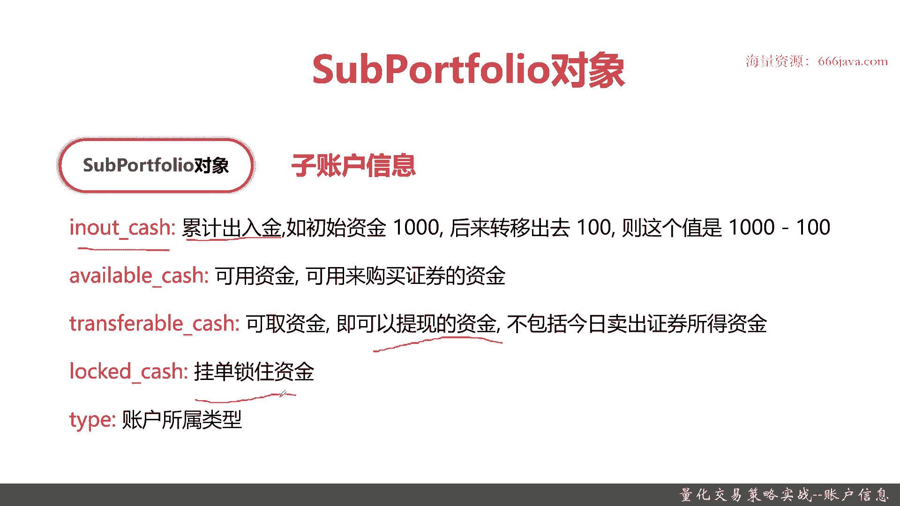
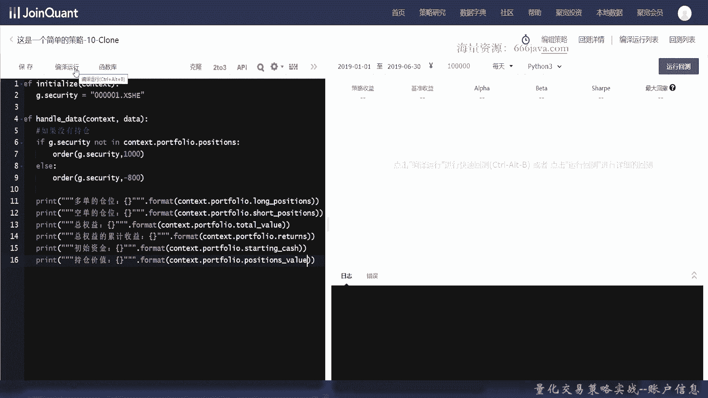
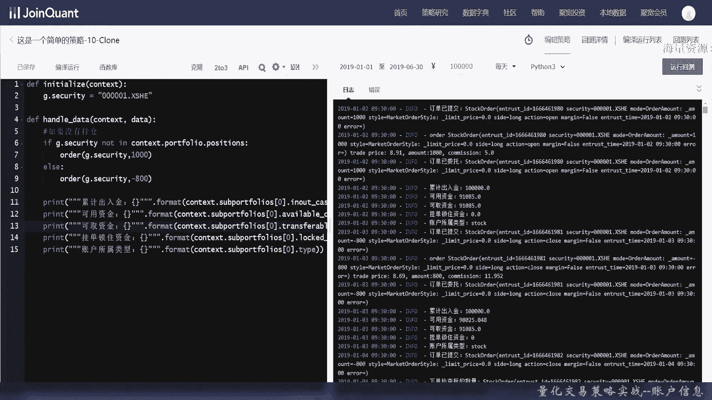
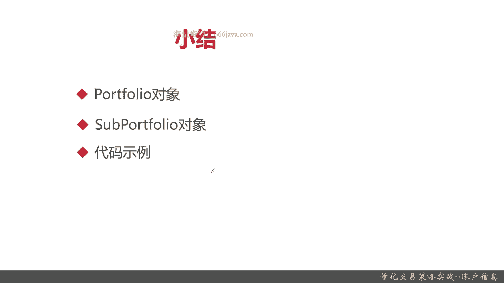

# 基于Python的股票分析与量化交易入门到实践 - P28：7.7 量化策略编写-Python量化交易编程第一步_量化交易策略实战--账户信息 - 纸飞机旅行家 - BV1rESFYeEuA

大家好，我是米铁，在上一节呢我给大家介绍了策略信息，那么这一节呢我将给大家介绍账户信息，账户信息呢有两个非常重要的对象，一个呢是portfolio对象，它们存放的是呢总账户的信息。

另一个呢是support portfolio对象，它存放的是子账户信息，这两个的对象都给大家介绍完以后，我们将向大家进行coding实战环节，首先呢我们给大家介绍一下PTFLAO对象的定义。

它呢就是总账户信息，是整个你这个策略下所有的总账户的信息，它呢有以下这些重要的属性和参数，首先呢是long positions，这个呢之前给大家看了是多单的仓位。

它呢注意是一个dictionary key是正确代码，value是position对象，下面应该是short position，其实类似的也是一个dictionary key是真正代码。

value是position，在上一节给大家进行position便利的时候，已经给大家展示了，接着呢是total value，总权益包括现金，其实权益其实就是现金啊，期货啊，保证金啊，仓位啊。

股票等等等，总价值可以用来计算收益，主要是来去计算收益的，接着呢是returns累计收益，这个是他公司当前总资产加今日出，今日的出入金减去昨日总值资产，最后呢除以昨日的总资产。

这里其实就是算今日的总资产，总资产的今日比昨日其实就是累计收益，这个呢就是累计收益的算法，它是总的资产数，算上历史，OK再比上昨日的总资产，接着呢是starting cash，初始资金。

现在呢基本上就等于in out cash，最后是position value持仓的价值，OK这是总账户信息，portfolio信息for，这是总账户信息，portfolio对象。

接下来给大家看一下子账户信息，此账户信息这个对象呢其实就是sub portflao，定义也很简单，就是此账户信息它有哪些属性呢，一个in out cash，它的算法其实就是一个简单的加减法。

它的中文名其实叫累积的出入境，比如说初始资金1000，他移出去了-一一百，那其实就是900，那如果又加了100，就是1100，接下来是可用词形available cash。

然后呢还有一个transformer cash，可取次型，就是可以提现的次型，但是呢因为你今天刚卖出能证券，所以呢他可能这些是不包括的，比如说你买了这个跟你买的证券类型，股票基金期货债券是不一样的。

比如说你买的是基金，你可能过一到两个跳一日以后你才能提现，最后呢是locked cash挂单所注的信息，你挂单了以后，这些钱在你的默认账号里是被锁掉的，直到交易完成或者交易失败才能返回你的账户。

还有呢是你的type账户所属类型，以上就是sub portfolio对象的介绍。

那么接下来呢我们进入代码的coding，我们接下来呢给大家进行账户信息，这一节的coding实战，那么接下来呢我们给大家进行本节的代码实战，首先呢给大家介绍一下hot for6对象的一些代码。

实现老样子啊，如果没有持仓，先进行下买卖嘛，Portfolio，Positions，好接着我们把基本的信息给打印出来，给大家看一下，portfolio对象里面还有哪些我们之前没有用到的。

这些对象也都是在context对象里面，好之前给大家介绍了，他就是lump position，这个是空单的，其实就是short pations，有没有拼错，应该是没有拼错的，好，Total will。

累计收益就应该是return，初始资金，Starting cash，好持仓的价值就是positions value，OK我们接下来编译运行，看一下结果。

OK算完了，可以看到波兰的仓位是这样，空单的仓位是这样，总收益是这么多，总权益是这么多，初始资金是这么多，持仓价值是这么多，因为我们呢很少A股就没有空，但做空的，所以呢空单的仓位基本上都是没的，当然了。

如果你用其他的证券交易类型的，可能也会有，那么呢这个是position，那么好呢，这个是总账户信息，portfolio这个对象给大家解代码的coding实战，那么接下来呢我们给大家介绍一下子账户对象。

support flao对象的代码的实现，OK我们就为了时间关系，我们为了快点，上面的基本还是保持不变，我们把输出的内容给改一改，累计入侵好可用资金，可以同学们可以看到。

之前呢那个portfolio对象主要是跟一些股票啊，债券的权益的一些有关系，就是债券呃，证券类型有关系，而我们的这个子账户信息呢，很多属性都和这个账户资金本身有关系，其实都是各种统计维度啊。

transform cash就是可取次性好，接下来呢大家再看看挂单所处，事情，最后呢是账户的所属类型，好，那么呢我们给大家看一下结果，嗯他报错了，Trans transform cash。

应该是少一个对，确实是没有的，好，可以看到了，这就是每天的结果，累计出五金可用资金，可取资金挂单所注资金账户所属类型，stock是股票，可能还会有基金啊，债券等等等等等，好勾引。

实战部分呢就给大家完成了，那么接下来呢是本章小结。

那么接下来呢是本章小结，本章呢主要给大家介绍，那么接下来呢是本节内容的小结，本节呢主要给大家介绍了账户对象，两个最重要的对象，一个呢是portfolio对象，它呢是总存储的呢是总账户信息。

有各种各样的属性，主要呢比方说law positions short prt，它主要存储的是一些账户持仓相关的，当然也包括一些returns啊，还有toto value啊，总权益价值啊。

还有累计收益等等等等等等等，下面呢是子账户信息，Support files，它呢主要是存储这个子账户相关的，一些资金类的，比如说累积出入金，可用资金，可取资金等等。

后面呢我们给大家进行了coding实战，感兴趣的同学呢，可以自己去翻看我们这些视频内容，或者呢查看我们的源码，以上呢就是本节的全部内容。

我是METEA。