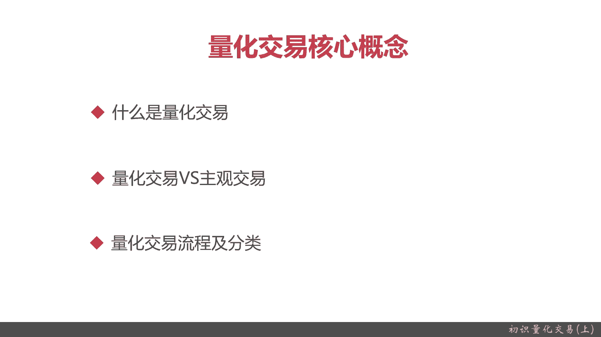
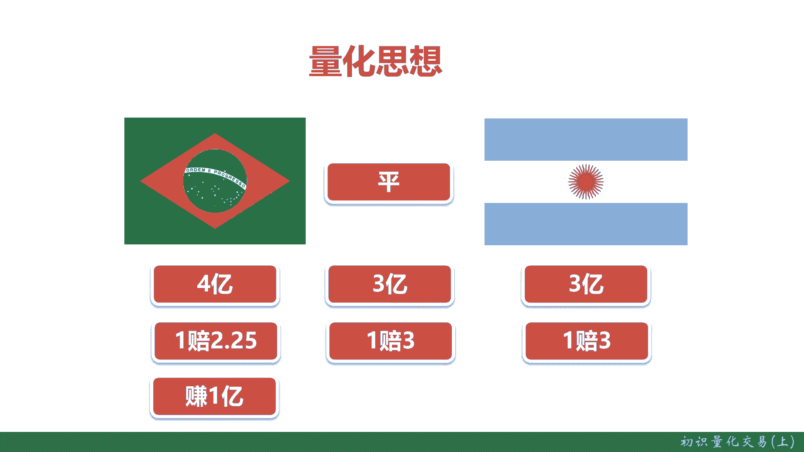
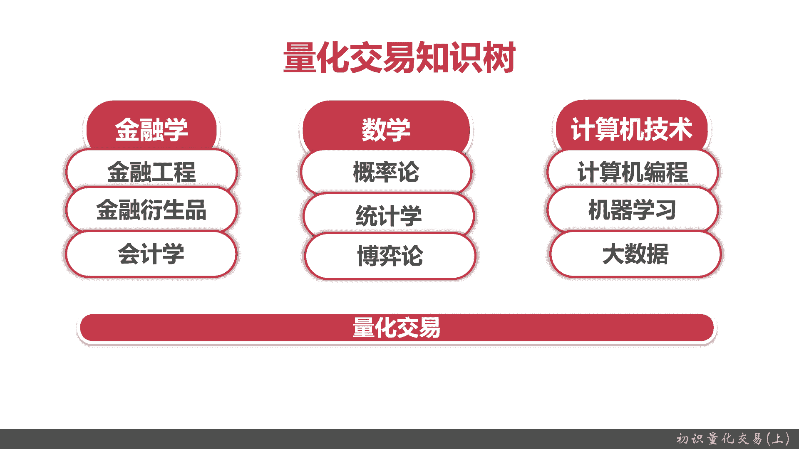
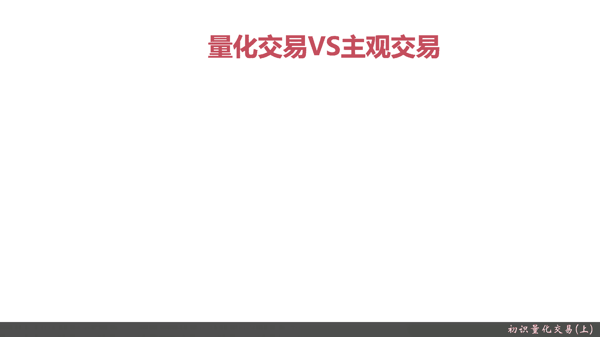
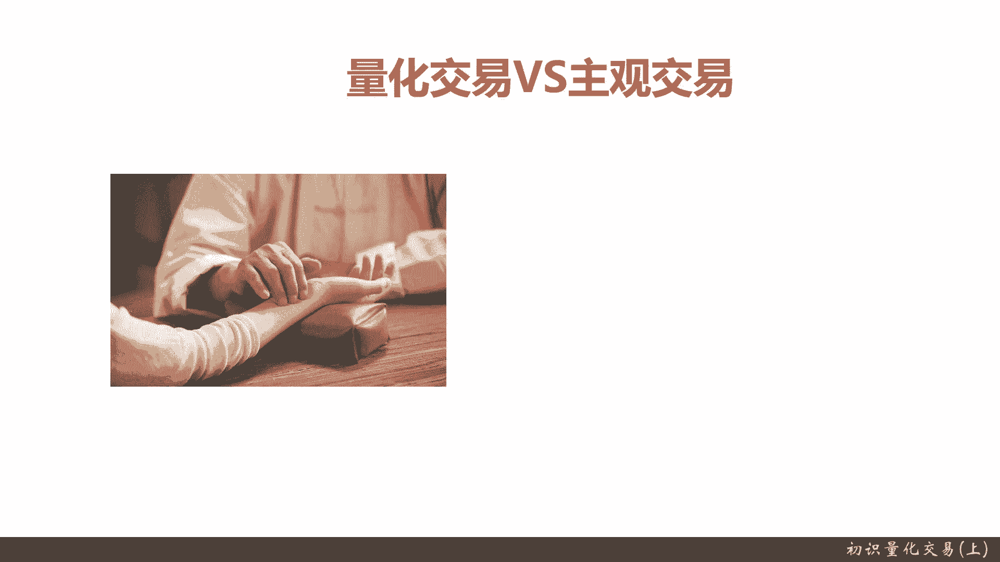
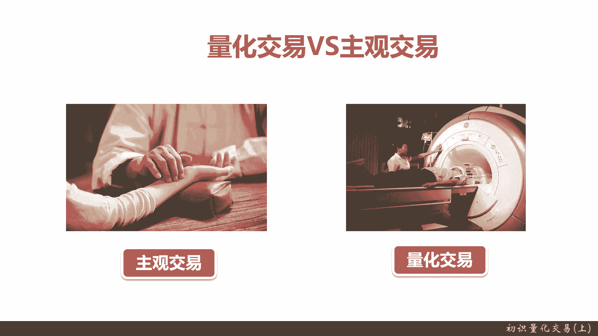
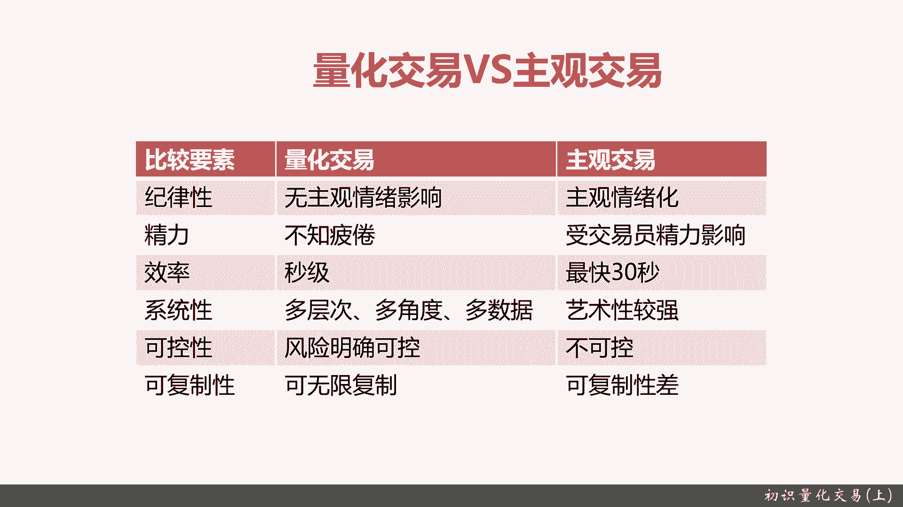
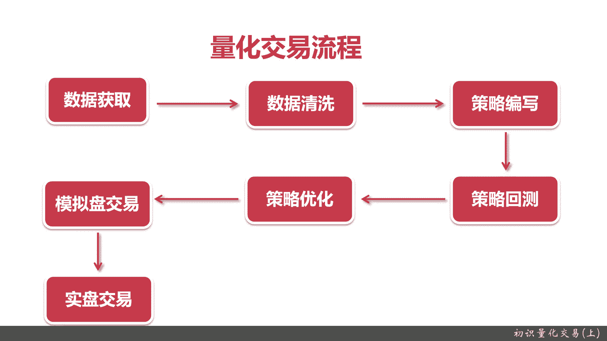

# 基于Python的股票分析与量化交易入门到实践 - P2：2.1 初识量化交易-必知的量化交易基础_初识量化交易(上) - 纸飞机旅行家 - BV1rESFYeEuA

大家好，我是你们的导师人李田，上一章节我们主要是给大家介绍了，我们这整个一章的课程安排和学习目标，那么这一节我们就正式的进入，整个初始量化交易的一个正式的学习，这一节我们主要给大家介绍一下。

量化交易还有哪些核心的概念，让大家嗯从一个比较具体的方面来理解。

什么是量化交易，这一章量化交易的核心概念，由以下几部分给大家组成，第一个就是给大家介绍一下量化交易，什么是量，就是量化项经济基本的一些定义，然后量化交易和主观交易之间的一些区别。

量化交易的主要流程和分类好。

量化交易最核心的就是量化思想，那下面我们给大家看一个例子啊，这个图大家应该都认识啊，左边是巴西，右边是阿根廷，然后中间是平一场足球赛吗，左边无非就是巴西胜，阿根廷胜和那个批评这三个结果。

那假如你是博彩公司，如何去设计你的赔率，才能使你无论在任何情况下都能盈利，这就是我们的一个量化思想，在实际当中的一个具体的运用，记住你是博彩公司，当然了，反过来也行。

比如说你已知博彩的赔率如何去进行买和卖，保证你的保证你一定进行收益也是一个课题，不过这个不在我们今天讲，我们今天主要来给大家说，量化思想应用在博彩领域的一个具体的例子，好回到这里。

波菜公司已知买巴西剩的有4亿减额资金，买平的有3亿，买阿根廷剩的有3亿，OK这是我们不坏公投资已经能拿到的数据，怎么样去设计赔率呢，大家考虑考虑，我给大家那个就是一会想一想，那我们来介绍答案啊。

首先既然你是波兰公司，那你肯定知道我们整体的资金比例，以及知道的下注比例以后，那我们要设定一个，其实这就是总共的本金嘛，假设有个概率，有个剩也有剩，其实就是赔率，只要我们合理的剩余的赔率。

我们就可以假设我们的预期是，无论怎么样，我们都是可以是10%，现在总奖金大概是10亿嘛，那我们就是要赚取1亿的利润，赔率应该怎么设计呢，请看下面结果，我们对巴西就应该一赔2。25。

我们是赔就应该是一赔三，我们对阿根廷也是胜，也是一赔三，这样就保证了，无论是哪种结果，我们作为博彩公司，我们都可以净赚1亿。

上面呢我给大家介绍了什么是量化思想，大家可以从国产的那个例子里面，就是主要是培训例子，可以理解一下什么是量化的思想，那现在我们来看一下什么是量化交易，下面这段是百度百科的定义啊。

就是量化大义其实就是只用先进的数学本质，重要点数学模型，然后替代人的主观判断，利用计算机技术，还有一个重点是计算机技术，从庞大的历史中海选出你代表超过十里，就是什么是超越，就是无论如何。

无论发生什么结果，你都能胜利，你都能获取收益，这就叫超额收益的一种，大概率事件当然也很，我们从数学角度只能是大概率数据，百分之百的事情是不存在的，极大地减少了投资者情绪的波动。

避免注意要避免做出非理性的投资决策，人往往会做出非理性的投资者，这个很有可能带来你的投资失败，而量化交易可以避免这种情况，OK这是百度的百科，大家看一下，基本理解一下就行了。

然后给大家介绍一下量化交易之数，量化交易呢其实主要涉及三个领域，一个金融学，一个数学，还有一个计算机技术，金融学呢主要会也是用到这些，以下的具体的金融学分支，金融工程，金融衍生品，会计学。

什么是金融工程呢，其实画像宇，本质背后是构成各种金融工程的数学模型，那这些数学人怎么去设计，怎么去实现，怎么能映射到实际的收益买卖情况，那就是金融工程要解决的问题，金融危险品，股票债券期货。

各种各样其实都是应收入水平，都涉及到金融肯定的知识，那怎么能获利，怎么能无风险的获利，这就是金融学生水平，这个分门学科要解决事情，会计学嘛那也很简单，你怎么算你的收益，你怎么评估你这模型是合理。

是亏的还是赚的，那怎么比较A模型和B模型之间它是好还是劣，这其实都是会计学要解决的问题，数学涉及到概率论，这个毋庸置疑的才记住刚才这些定义吗，大概率我们要让它大概率获胜。

概率论统计学要从统计的角度来进行核算，还有博弈论，其实金融本质上，金融和经济就是一个博弈的过程，计算机技术它涉及到计算机编程这个无用之，你必须会写代码，会扣点是L机器学习。

现在很多技术都已经涉及到机器学习的技术，大数据量化交易是一个非常需要大数据技术的，它的数据维度，数据的复杂度，数据的量级都是实验的大数据数据，而整个经验和条件，其实是最先运用在大数据技术一个领域。

这些整体支撑了量化交易的基本知识。

Ok，下一节我们给大家介绍一下，那个量化制约发展历史，从先从国外来说，1952年那个现代投资理论联合被奠定了，他是谁呢，哈里马科维茨，这个大家应该记住一下，他提出了现代投资理论的基础，1952年。

然后到1964年呢，资产的定价模型，关键是如何去评估现代金融学的定价，有个william sharp，他也很有名，夏普模型，相信对金融有点了解的同学都可以了解，关键是资本资产定价模型被设计和研发出来了。

再到1982年，量化交易之父西蒙斯串遍了文艺复兴科技公司，这家公司很牛逼啊，就是巴菲特，代价，他几十年在下平均收益年化收益20%，已经是被誉为股票学，但是大家不知道的是，西蒙斯用文艺或创办了文艺复兴。

他其实用的是量化制，本质上他招聘的都是数学家，然后会计算机编程的人，在整整40年的时间成立，年化收益率高达35%，巴菲特是神啊，才20%，你可想而知吧，当然了，量化交易也会发生任何技术嘛都会先有一个肾。

这个衰在2008年美国次贷危机，大家都知道这个过程，很多同学们都应该经历过，在次贷危机的时候，量化交易首先也受了很大的冲击，从最鼎盛的2500亿美元一下下降到远程，为原先的20%，只有500亿美元。

再到2011年，然后从08年的一个嗯非常颓势，然后又开始复兴了，到2001年时候，被称为美国量化交易元年，这个呢在那个，你们可以去看华尔街运行日报和资料上，这都有官方的说明。

那个时候有个著名的里程碑事件，就是2012年高盛嗯，大家都应该听到华尔街非常著名的一家公司，整个代基本上是华尔街的代言人吧，他们将原先600名人工的交易员裁剪为两名。

其他的全部变为coding工程数学家，还有计算机工程师，就是量化交易工程师，再到现在量化碳经发展了，日趋技术日趋成熟了，在美国，现在量化投资比例约占50%，那已经是数万亿的规模了，数万亿美元的规模。

OK下一步，我们来看看国内的量化教育发展的历史，上一页呢，我们给大家介绍了一下，国外的量化交易发展历史，现在来接着介绍一下国内的量化交易发展历史，我国量化量交易的发展历史跟国外比较比，大概玩了。

整体来说应该可能有四五十年吧，到2004年8月才由光大第一次发布了，国内第一只量外资量化交易，叫汪大宝的金量化合金基金，但是呢这个时候一直到2010年，国的量化交易发展其实都是非常的平缓。

或者叫没怎么发展，因为到2010年的4月16日，中国第一支股指期货，沪深300股指期货才正式上市，那个时候才标志着中国可以进行做空和杠杆，杠杆的前面那一列量化交易，那你也既要做多，那也要做空。

多和空有才有了，就是2011年我们才有第一次的土壤，然后2015年呢，基本上就是我国量化交易的启蒙期，这个时候到2015年4月16号，中证500股指期货上市，它就标志着量化交易基金。

他就可以有更多的发展空间了，它可以做很小盘股的对冲，不需要大资金，而且可以进行方方便快捷的高频交易，再到2015年到2019年的量化交易，基本上是在一个我国的量化交易，量化产经济基本上是在一个发展期。

主要是因为2019年6月，证监会开始了公募基金转融通业务，这是什么意思呢，就是说可以融资融券了，就量化交易，它可以有杠杆，然后有杠杆，杠杆的放开才能表示时间量化量有更多的土壤，所以呢从2019年到现在。

就是到今年已经2021年，我国的量化交易可以说是飞速的发展，从之前2014年的第一支量化交易，到现在，我们现在已经是黄金期了，我们的融资融券发展起来，我们又我国又快速的加入了人工智能，那到目前为止。

2021年，我国的量化公募基金它已经超了2000亿规模，2014年的时候才第一只，现在已经超2000亿了，然后呢，私募的量化经营估已经超过1。5万亿了，也就是说公司目加起来接近2万亿，那实际也超过1。

7万亿，这个发展速度还是非常快的，而且从目前看来说，加速度这发展趋势有越来越好的发展趋势，然后呢，我们下一下一节节呢，我们给大家介绍一下，量化交易和主观交易的区别，在量化交易里面有个段子。

量化交易就像西医。

主观交易就像中医，就比如说呀中医讲究望闻问切，它主要是个人的经验，这个跟主观特性很相似，主要是靠你个人最多是有个师傅对吧。

这就是主干交易，而量化交易呢它其实是重点是在量化，他不是靠你个人的经验，他是靠仪器，计算机，数学模型，金融工程模型，那具体的量化交易和主观经济有什么区别呢。

可以给大家从下面六个方面看看，第一点纪律性就是量化加E它是无主观经历，因为它完全是计算机的，完全是基于量化的，基于概率的，基于金融统计的，而主观交易呢它非常有情绪化，就是首先你如果要把主观交易的号。

你要逐步把自己变成一个机器人，不会被自己的情绪所左右，既没有悲观的情绪，也没有那个就是得胜了也积极的情绪，就是非常平淡的，而那个这点人能真就不计算机了，第二点精力量化交易它是永远不持平的。

计算机嘛只要有电就行，而主观交易，那你交易员你必须必无时无刻盯盘，一年250个交易日，然后每天大概是六个小时，这六个小时之间，一般真正的交易员，他盯盘时候连厕所都不上的竹叶不可，但这样也会受教育员。

你会人会生病嘛对吧，然后效率量化效率也是秒级，甚至很多江门西蒙斯的，他们是专门找一些计算机学家，还有数学家，他研究到毫秒，因为网络波动他也考虑进去了，一般来说量化交易都至少是个秒期。

一秒钟可以交易几千次，几百次，甚至而主观交易呢，你因为是人嘛，你从下单到捕捉信号到下单，你最快也得30秒，你还得键盘打字，输入你的手交易笔数和金额，然后LEL加E它是多层次多角度多数据。

当然这个具体我们会在下一页跟大家详细解说，也就是说他用了大数据，它可以看历史的数据来看，看了看不同板块，不同行业，所有的股票，所有历史数据都可以和，而主观交易它就是个艺术了，就是它属于下限非常低。

但是上限也很高的一个情况，那巴菲特他就是主观交易的代言人，而西蒙斯就是量化交易的代言人，消化调节液和和和主观条约是可控性，那明显量化等于更加，它是完全否，因为他完全是把它进行量化，完全都是概率。

都是统计学交易的次数越多越符合概率，而主观交易那就完全不可控的，因为都完全看个人可复制性，量化交易可以被无限复制，你只要有段代码，你在什么时候都可以跑起来，主观定义他就不行，主观加义可复性就是差。

因为艺术是没法复制的。

就看你个人量化加进主要流程，其实它跟计算机和大数据很多东西很像，所以大家可以去看一下，第一个是数据获取，你要获取行情数据，你要获取历史数据，你要先取个股的那个基本信息，交易信息是EMETRACTION。

这都是数据获取，下一步是数据清洗，就是你从你从你的数据源，那无论你是采集的还是从交易所呃，第三方数据披露调用API，你都得进行数据，因为它和你本机的那个系统，和你设计的数据格式很有可能不同。

这点大家做过大数据或者做过数据，在数据方面应该都很少了解，然后策略编写量化交易的核心就是策略，你的策略好与坏，直接导致或者直接影响到你最终的收益，然后再加影视策略回测，为什么策略回测这能量呢。

就是量化交易策略是一部分，回测才是个真正科学的问题，你可以想到西医，它重点是你各种指标数据策略，也就是你可能指标策略做得好，但是你不知道呀对吧，量化交易的策略回测，就是告诉你你的策略到底好不好。

好在什么地方不好，在那它怎么去修改这个策略，回撤和策略优化其实是一个循环工作，就是你写了回撤以后，你会发现你的策略肯定可能不好，可能有各种bug，可能有各种情况没有考虑到，当然了，这个策略优化。

还仅仅指的是基于历史的策略优化，就是说呃今天是2020年的那个5月份，那这个5月份假设我们拿A股一序列，我假设我有10年的策略，说成了历史数据，那我进行了回测，可能效果挺好，可能效果不好不好。

我就进行优化，直到我优化好为止，那这叫策略优化，但是你是基于历史的，下一步叫模拟盘，模拟盘交易是什么，你要把这些策略在模拟盘上进行跑数据，就比如说我随时根据今天是5月份，那我这个策略写好了。

我要在模拟盘上一直跑，跑到那个就至少半年一年，一般来说都是要半年和一年的模拟盘交易，什么叫模拟盘交易，就是说我不投钱，但是呢我的这些数据和真实的实际的股价涨跌，完全绑定。

那我就可以看见我的策略究竟好不好，因为你只能平行历史的话有各种各样的局限，最多的就是过拟合，这个在休息学习稍微懂一大家都知道，但未来的事情谁也没法预料，所以第一点就是模拟盘交易。

也就是只有你有经过半年或者一年的，量化的模拟和交易，你才能觉得你的策略究竟是好不好，你才能进行下一步，当然了，近期模拟和交易不再用你的策略，OK了，再下一步就是实盘交易，什么是实盘点，就是自己开个户。

把钱投进去，然后让计算机进行跑，中间你可能收益挺多，然后可能不好，赔的一塌糊涂，有可能你一开始投的1万块钱，5万块钱，10万块钱，一分钱都没有，但这就是实际情况。

任何一个量化交易策略都要进行这个实盘交易，而且这实盘教育比摸拟盘交易时间还长，一般来说都要走3年到5年一个周期，所以研发一个非常有效的量化交易流程，时间是很长的，这跟一个就是药物里面。

比如给研发一份新药或者一秒时间，周期都是要长，在这个过程中，你可能要经过各种情况，因为个实际股价和股票，甚至是那个金融交易的市场，它会有各种不同的波段，你的交易策略只能是适应某一种情况。

这个当然具体的展我们现在就不展开了，整体的流程就是数据讲获取数据清洗策略，编写策略回测，策略优化，记住这是一个迭代的过程，策略回测和优化，然后再到模拟盘，模拟盘交易以后。

又会是一个策略回测和策略优化的过程，再到实再到实盘交易。

