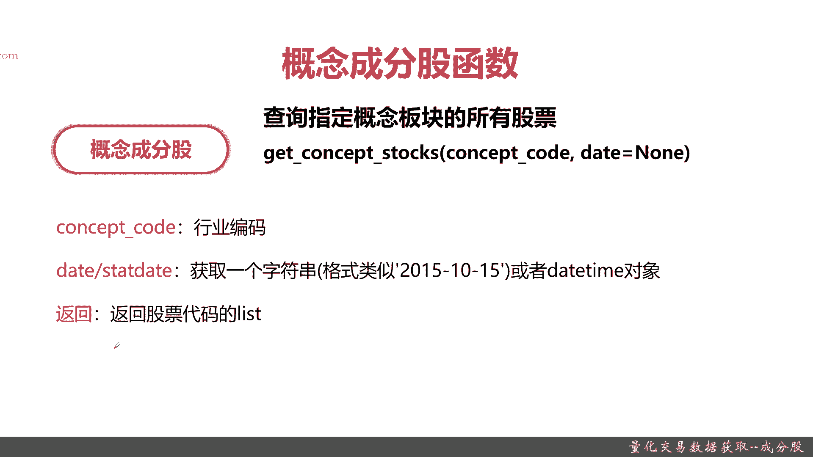
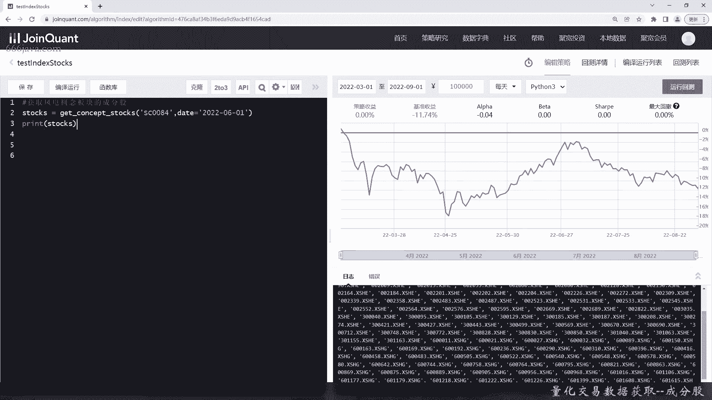
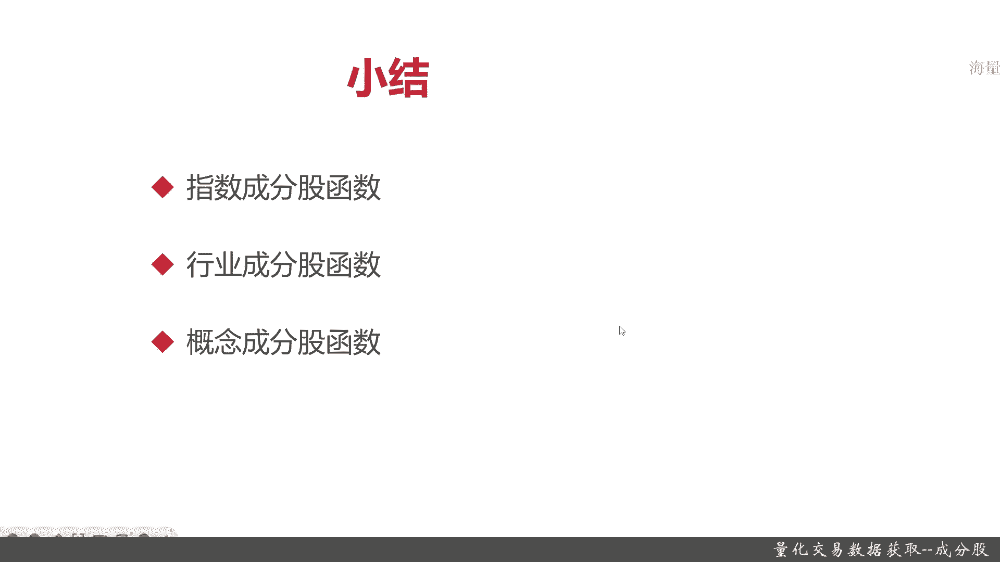

# 基于Python的股票分析与量化交易入门到实践 - P30：8.3 量化交易的前提-Python量化交易数据获取_量化交易数据获取--成分股 - 纸飞机旅行家 - BV1rESFYeEuA

大家好，我是米铁，在上一节呢，我向大家介绍了，如何通过聚宽量化交易的平台，获取股票的财务数据，那么这一节呢，我今天向大家介绍一个股票里面，非常重要的概念成份股，我们是如何去通过区块量化交易平台来获取。

股票的成分股数据呢，那么这一节就给大家详细的讲一讲，本节我们会从三个方面给大家介绍，如何去获取成分股数据，首先呢我们会给大家介绍指数，成份股函数是怎么获取指数成分股的，接着是行业成分股函数。

如何去获取行业成分股，最后我们再通过概念成分股，去获取股票的概念板块数据，那么接下来呢呢详细给大家讲一讲，首先我们向大家介绍指数成分股函数，指数成份股这个函数啊，顾名思义就是查询指定指数在指定日期。

然后可交易的成分股列表，听着比较绕，其实就是给定一个指数，然后给定一个日期，当然了，你默认不填为空，然后呢就获取这个指数下面所属的股票的列表，他们的查询函数就是get index box。

然后这个函数呢有两个参数，一个是index semble，还有一个是data，然后呢intel symbol就是指数代码，比如说那个沪常见的沪深300，就是深圳交易所沪额上证交易所由官方评定的。

其实就是证监会评定的最好的300只股票，或者是上证五零或者是中证500等等等等等等，一个时间为什么要有时间这个参数呢，因为每一个指数的成分股在一段时间，在时间的维度上，它不是一成不变的。

它也是一个筛选的过程，你的效益好，那O他就是在这个时期内，它就属于这个成分指数，算遇不好，那就被踢掉，然后它的返回就是股票在买的list，记住是股票代码的list，待会呢我们给大家在coding的时候。

给大家看看例子，指数成分股就在这里好，接下来是行业成分股，参考指数成分股，那行业成分股其实也很好理解，指定行业的所有股票，那函数名单是get industrial stocks。

重点参数是industrial code，那这个行业编码呢有一定的那个讲究了，还记得我们之前给大家分享了，如何去给股票分类吗，其中重要一点就是行业，行业分类里面比较常见的有证监会的行业分类。

还有申万的行业分类，这回呢我们就不给大家详细的复习了，在行业成分股里面，这些证监会和申万的这个行业分类呢，在区块链上面也很容易查到，你只要查的群对应的这两块的行业的代码，那就是零。

相应的industrial code，有一级代码，二级代码，三级代码等等等等，当然了，距宽这里还有个自己独立的，一个是巨宽的行业分类，他们是自己编的，那在市面上不通用，但是在这个平台上是通用的。

同学们有感兴趣的，可以自己去查询常见的行业编码，还有区宽自己的行业编码，第二个参数是date参数，这个date参数呢其实跟刚才一样，它也是整个行业成分股的查询函数，其实也是返回股票代码list的。

那么最后一个呢可能同学们有了解，但是今后在量化里面呢肯定会常用，就是概念成分股，之前给大家介绍了概念板块的意思，比如说农林玉木或者是核电，风电5G啊等等，这都可以算是概念概念的形成和转移。

其实是一个金融影响股价的一个重要的参数，那在这里你要查询什么概念，其实函数就是get concept stocks，重点是概念的code，跟前面两个函数类似，这个概念成分狗的查询。

主要的函数呢它的code也是concept code，当然了，每年每月当前时刻有哪些概念的编码，和它具体业务是意义是什么，我们的那个区块链网平台，这里的AAPI文档也有，它也甚至也提供相应的概念查询啊。

还有行业查询等等等等，这个同学们可以自己去研究，我在这里就不展开了，我们待会呢也会给大家一个例子来解释一下，然后概念成分股呢的查询的函数，第二个也是时间，它返回的也是股票代码list，好。

那么接下来呢我们就进入coding实战，让大家看一看这三个指数成分股，行业成分股，还有概念成分股，这三个查询函数在实战里面究竟是怎么样的。

那么接下来呢我们进入本节的coding实战，那首先呢我们是要进行指数成分股的查询，很简单，我们首先来查询一下沪深300，我们因为由于沪深300一共有300只啊，太多了，我们就给大家返回1000只吧。

因为它返回的是个list嘛，那函数就index了stocks，然后呢，好这个就是沪深300了，我们暂时不加时间吧，给大家看一看默认是什么样，然后呢，好我们来保存，然后便于运行一下，好他时间有点慢啊。

这个可能是卡住了吧，不过不要紧，所以大家看到这就是沪深300前100只，我们如果同学们对股票代码不熟，我们可以到时候自己去查询一下，比如说我们查询随便查询一次，30003，那乐普医疗。

这是一个表现很好的，2142，宁波银行，OK好，那指数成分股的查询就到这里了，好接下来我们查询行业成分股，获取去查计算机互联网行业吧，当然了，同学们感兴趣可以自己去试一下，其他的抗性查法。

那我们这个行业的查询呢就只是一个例子，计算机的话应该是I64，那互联网和相关服务，像这些code呢，这点区块做的还挺好，都可以立刻提示出来，为了保存，然后编译运行一下，好这次还挺快的。

可以看到这个就是巨宽，这里的互联网行业的一些股票代码，我们可以随便看两只30052IAH，中青宝好像是个做游戏的，再看一个，s st天润，哈哈哈哈好，剩下的我们就不展开了，好。

那么下面呢就来给大家展示一下概念，成分股获取的函数，我们去举个例子，用风电板块吧啊啊，应该是concept spx，这个呢板块的code他就做不到自动提示了，我们，6月1号吧，好，编译运行一下。

OK很快就出来了，那大概就这么多，我们给给大家随便看几次吧，正微正微星材可能是做风电材料的，太原重工应该也是做风电相关的一些材料，反正他被划到这个封建概概念板块里面，肯定有他的道理。

我们这块呢就不展不具体展开了，以上呢就是本节的coding内容。

那么下面呢我们进入本章小结，下面呢我们要进行本章小结，本章呢我们主要给大家介绍了，成份股获取的相关的查询函数，在区块量化交易平台呢主要有三种查询函数，首先是指数的成分股函数，那这个函数非常方便。

只要传入你所感兴趣的要查询的指数的code，然后呢再加上时间段，那他就可以把相关的所有这个指数，包含的成分股发挥出来，接着呢是行业的成分股，常见的股票的分类呢，它有证监会分类，申万分类，然后在此之上呢。

区块量化全平台，还有一个区块自己的分类，这些行源代码都是可以在区块提供的数据，字典达表里面可以很方便的查到的，当然了，如果你觉得这个麻烦，它也有可以get的industry code这个函数。

那感兴同学自己去看看，也会返回起来，方法也返回起来，查询起来也是相当方便的，那说完行业成分股，最后就给大家介绍了概念成分股，这个概念板块呢，一般来说可能是主要是返回，2016年以后的吧。

那这些板块的更替变化，其实是相对于行业和指数来说，还是比较的比较快的，因为有概念，比如说元宇宙啊，比如说5G啊，都是最近几年才兴起的，以上就是本节的三个向大家介绍，用于查询股票成分股的三个常用的函数。

我是米田。