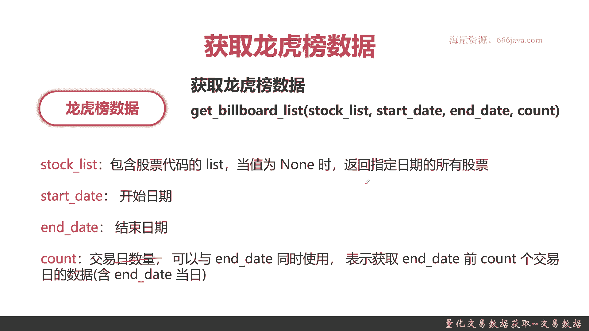
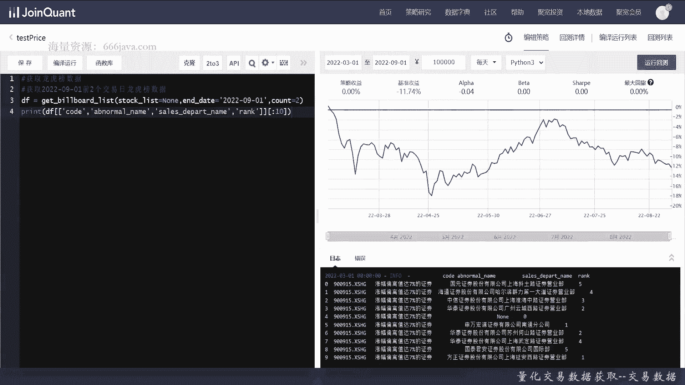

# 基于Python的股票分析与量化交易入门到实践 - P32：8.5 量化交易的前提-Python量化交易数据获取_量化交易数据获取--交易数据 - 纸飞机旅行家 - BV1rESFYeEuA

大家好，我是米铁，在上一节呢，我向大家介绍了如何去获取标的信息，那么在这一节呢，我先向大家介绍量化交易平台里最常用的数据，交股票的交易数据，那本节呢我将从三个方面给大家介绍，如何获取股票的交易数据。

首先呢我们给大家介绍一下，获取常用的行情数据的函数和否，接着呢我再给大家介绍一下，如何获取龙虎榜的数据，最后就是我们常见的coding实战环节了，那么接下来呢我先跟大家介绍，如何获取行情数据。

那获取行情数据呢非常简单，就是一个经典的函数get price，那这个行情数据呢它主要是证券行情数据，它可以有多种标的，像之前给大家介绍的股票，债券基金等等等等，它都支持。

它可以支持多个标记的多个数据字段，大家可以看到它有这么多可支持的参数，那么接下来呢我给大家详细介绍一下这些参数，首先是security security呢，它支持一只股票代码。

或者一个股票代码的历史的数组，当然它不仅仅是股票，它也支持债券啊，基金啊等等，因为我们本系列课程，主要是介绍如何进行股票交易，那这里呢主要是股票代码，然后下面一个呢是count count呢。

下面的start date是二选一的，不可同时数列，然后count呢主要是返回数量，然后start date呢是一个开始时间，然后started如果要开始使用了。

它和下面的any time是end date是一致的，那么接下来呢是FREQUENCE这个参数，这个参数挺有意思的，它指的是单位时间的长度，可以是几天，可以也可以是几分钟，那x day xd或者XM。

然后daily呢就几乎就等同于一天，minute呢就等于等等同于一分钟，然后X呢是个正整数，表示某天或者某某分钟，这是你的获取行情数据的频率，默认是data啊，那么再接下来呢是files这个字段。

files呢它是一个list，默认呢是呢你不传，那也就是说他这个做成的意思，也就是说你要查询获取的行情数据的字段，常见的是开盘价，收盘价，最高价，最低价，交易量金额等等等等等等。

当然了他要支持其他一些扩展，这个呢感兴趣的同学可以自己去查看聚宽的API，再下一个呢是speak呃，Skip skip post，那这个呢就是看是否跳过非交易日，那包括停牌啊，或者未上市啊。

或者退市后的日期，然后默认的是false，再接下来是复权赋权，主要是跟股票和基金有关系的，那之前给大家介绍过，这个主要是以由分红影响的，再后来呢是一个account，我们已经介绍过了，我们这就不再提了。

赛后的呢是个panel，panel呢在默认的情况，它主要主要是为了一个返回的，多标记的数据格式，那在pandas40。25版本以后，panda就被彻底移除了，如果同学们现在去使用的话。

它平台呢它的API的返回，它会让你提示尽量不要用panel，所以默认呢原先的代码里面默认是原先的API里，默认是true，我们现在普通就是force就好，最后呢是fail post，那就是停牌价格。

它是不是做处理，也就是说如果停牌那个股票在某几天停牌了，默认是true，就表示他用之前的前一天的，或者是最近一个上一个交易日的收盘价，作为价格填充，否则呢他就是用空进行提充。

那么整个呢就是get price这个行情数据，这个接口如果在用量化交易的时候，会经常会使用到，当然了他还没到tick7，数据最多是分钟嘛，不过大家用来练手足够了，接下来呢给大家介绍介绍。

一个也是很常用的函数，龙虎榜数据，那什么是龙虎榜呢，就是股票交易啊，总有一些红黑榜，那买的最多啊，卖的最多啊，他的买的人是谁，哪些营业部啊等等的，这个就是龙虎榜的数据，那我们的一般来说各大量化交易平台。

比如说我们这区宽，它也会把龙虎榜数据直接提供给大家，那函数呢其实名字很有意思啊，Get billboard list，那它支持呢以下几个参数，一个是stock list，那就是股票代码的list。

就是一个数组，那如果它为空的时候呢，他就返回指定日期内所有股票，start date和end date比较好理解，就是开始和结束，然后count呢就是数量。

然后呢这个count呢和之前的start date和end，date n和之前的snack也一样，一般都是它只能二者取其一的，以上呢就是我们给大家介绍的，关于获取交易数据。

主要是一个获取行情数据和龙虎榜数据，这两个常用的函数，它的一些基本介绍。

那么接下来呢我们进入coding实战环节，首先呢我们给大家介绍一下，如何用黄情数据来查询，那行情数据接支持两种嘛，一种是获取单只股票的，还是以001来试验一下，它返回是个DF，好提示出来了。

那我们直接把打出来，好可以看到这就是它的结果了，那开盘价，收盘价，最高价，最低价，交易量交易额，OK常用的机器就是这几个字段了，那我们来给它来，我们来获取一个时间段的数据，这些都不变。

但是呢有几个参数是要调整的，这是start date，那you study里最好有end date，然后呢他可以支持到什么，实际上没有这么夸张，因为股票到时间他就不交易了，收盘就不交易了，Frequ。

我们给它一分钟，然后呢，我们就只把收盘价和开盘价给打出来就可以了，好我们来看一下结果，OK这个就是结果好，这个实验也成功了，就是分钟级数据，那么接下来呢来看一下2016年2月份额，3月份吧。

好这里呢也是稍微改一下就行了，然后FS呢这次我们就不要这么多，我们就都放出来，我们看一下这个结果是啥好，我们看一下结果是啥好，我们可以看到结果了，3月你可以看到3月1号，那这段时间从下午两点到这段时。

它是非交易日，所以它就不显示那只从3月2好开始，OK这是单只股票的，下面呢我们来获取多支股票，那么接下来呢我们之前获取了单只股票，那我们现在呢来给大家看一下多只股票的意思，然后我们就是获取。

就以这个例子吧，中证100所有成份股，然后默认呢还是每天的数据，那我们就具体就不打了，还是get price，但是除了用get price呢，我们这次要用一个之前给大家介绍的，获取成分股的数据的接口。

就是get index stocks，中证100应该是00903，这个要关掉它，不然不认识好，那PANDON呢我们默认给它为fourth，让我们把DF打出来，数据量还是有一些的可以给大家看到。

那2万多条数据是比较多，这个呢，感兴趣的同学可以把它更打印的更多一点，比如说是获取里面某一支股票的数据code，其他因为他是个DF嘛，那DF就比如说像这样，比如说就是看平安银行的数据，这样就比较快了。

因为数据量会少很多，刚才是2万多条，现在只有几百条，那同学们也可以感兴趣的，可以把自己的字段打出来，那这些字段都已经有了，OK那么关于行情的接口呢，咱们就测试到这里。

那么接下来呢我们来进行龙虎榜数据的实战，获取比较新的龙虎榜吧，还是老样子，嗯count默认就等于一吧，好，我们来运行一下，这就是结果，那么接下来呢我们来稍微改一下，这是一个交易日的9月1号。

那我们接下来来来两个交易日的，好很简单，把它改为二就可以了，其他都不用变，但是呢我们这DF要进行一下修改，我们不要把这么多字段都打出来，然后呢具体龙红榜有哪些其他字段的，同学们感有兴趣的同学。

感兴趣的可以自己去查一下官方的API文档，说明和例子，能写的都比较清晰，那我们先选十条吧，Code abnormal name，异常波动，然后呢，Sales departname，营业部的名称。

最后是rank好，就把这些字段打出来，我们只看十条，嗯可以看到这个龙虎榜的数据挺详细的，当然你打印更多有更多，他的一些异常的数据了，看涨幅偏离，他的异常信息呢，就是涨幅偏离值达到7%的正确，就是它。

然后有这么多营业部排名也在这里了，好以上呢就是本期的coding实战部分了，那么接下来呢咱们进入本章小结。

下面呢进入本章小结，本章呢主要是给大家进行了，股票的交易数据的介绍，首先呢给大家介绍get price这个行情数据的接口，它非常的强大，支持各种查询的方法，支持那个获取单只股票的行情交易数据。

也支持多支股票，那甚至呢还可以跟我们之前给同学们演示例子，再结合之前的成分股啊，板块股啊，行业股啊等等等等等等等，来获取更多有用的行情的数据，那这个呢是同学们对已经知道的一些行情的，某只股票。

特定股票或者特定list的进行查询，然后呢是对一些针对总体，比如说交易链做大呀，交易异常啊等等等等，这个龙虎榜的交N函数，这个函数呢大家我刚才给大家举个例子啊，比如说可以看到按照加音量排前十大。

或者说呢是按照异常波动等等等等等等，这些呢根据同学们将来实现的量化交易策略呢，有不同，你可以有不同的查询方式，最后呢就是coding实战的环节了，好以上就是本节的全部内容，那么第六章。

如何去通过量化交易平台，获取一些量化交易的数据，那就已经完了，感性感谢同学们的收看，我是米切尔，大家下面大家以后再见。

