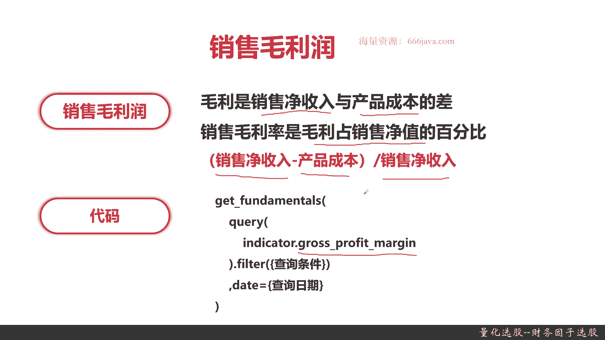
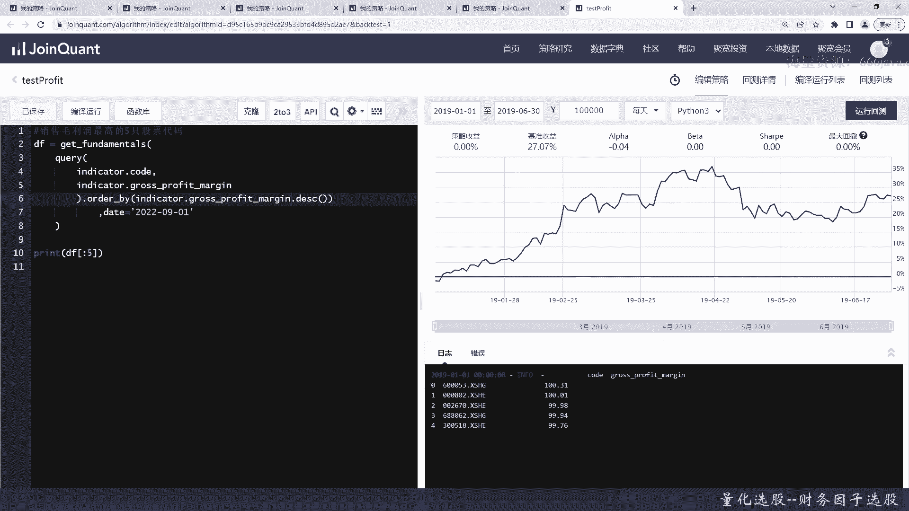
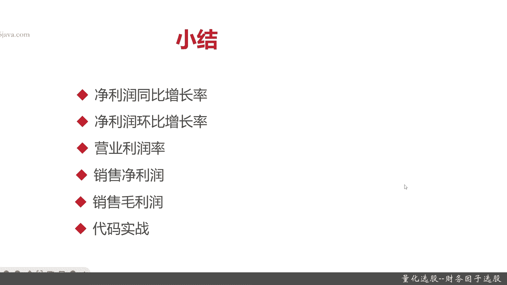

# 基于Python的股票分析与量化交易入门到实践 - P35：9.3 股市投资第一步-Python基本面量化选股_量化选股--财务因子选股 - 纸飞机旅行家 - BV1rESFYeEuA

大家好，我是meta，在上一节呢，我向大家介绍了关于财务因子下面的几种分类，以及财务因子当中成长类的，因此中的营收，因此他是如何去选股，那么这一节呢我将向要跟大家介绍成长类，因此中断另一个因子。

利润因子，本节我们将从以下六个方面给大家介绍，利润因子，首先是净利润同比增长率，接着是净利润的环比增长率，再接着是营业利润率，然后呢是销售净利润，最后就是销售毛利润，OK以上这五个指标。

就是常见的利润因子构成的五种指标，最后就是老样子，是我们的coding实战环节，那么接下来进入正题，我们先向大家介绍净利润同比增长率，在给大家介绍净利润同比增长率之前呢，我们先给大家介绍什么是净利润。

净利润就是企业的税后利润，就是说企业的利润利什么是利润，利润都明白啊，就是销售额减去它的成本，那就是利润，那净利润还要扣税，因为每家企业根据我国的税法规定，每种企业类型不一样，它的税率也是不一样的。

然后呢净利润同比增长率呢，其实就是当期净利润减去上期净利润，再除以上期净利润的绝对值乘以百分之百，为什么要这样算呢，因为净利润可能是负值，那为了能正确的得到结果，所以你除的分母就是上期净利润的绝对值。

那和之前就是营收的同比增长值率一样呢，这里的上期净利润指的就是上一年度，记住是上一年的同期的净利润好，那么接下来呢我们给大家介绍，净利润同比增长率的代码，实现主要的函数还是gun fomentals。

主要的字段就是i NC net profit profit year on year，OK这就是净利润同比增长率，那么接下来给大家介绍净利润环比增长率，净利润环比增长率呢。

它就是本期的净利率减上一期的净利润，然后再除以上一期净利润，那跟之前一样，环比增长率呢只针对上一期，就比如说4月和3月，而同比呢是上一年度同一期，今年的4月比上去年的4月，代码呢实现呢也比较容易。

这我们就快速过了，也是in DK的，这张表是i NC net profit annual，接下来给大家介绍稍微不一样的指标，营业利润率可能同学们有的听过，但是呢算法可能不太清楚。

营业利润率它指的是经营所得的，注意是经营所得的营业利润占销售净额，其实就是销售净收入的百分比，或只占投入资本额，什么叫投入资本呢，就是你的净投入的百分比，营业利润率，它就是营业利润除以全部业务收入。

乘以百分之百，它的分母一般来说是全部业务收入，那其实也跟你说占投入资本其实是一样的道理，然后营业利润率的coding实现呢，注意同学们，他也是INDEDICATE。

只不过呢它的字段名叫optional profit to total revenue，ok revenue是营业吗，total revenue就是总营收好的，那这个就是营业利润率。

那介绍完了营业利润率呢，再给大家介绍一个跟这个指标相关的一个指标，销售净利润，这个同学们可能没听过，这个指标也很有意思，它指的是企业实现净利润，净利润与销售收入的对比关系。

主要是一个净利润与销售收入的关系，那他衡量的是什么呢，它衡量的是企业一定时期内，销售收入的获取能力，什么意思啊，你们看他的公式，净利润除以销售收入乘以百分之比，它和净利润成正比，和销售收入成反比。

就是说这个指标，它不是那个就是销售收入越大越好，销售收入增长了，如果你的净利润没有增长，反而销售净利润它会下降，这就跟企业在表征企业的规模和效益，之间要做一个平衡，销售净利润主要表现的就是这一块。

然后呢销售净利润的代码coding实现是什么呢，是net profit margin，这个就是销售净利润，那么最后一个呢我们将向大家介绍销售毛利润，净利润和毛利润，同学们一定要搞清楚啊，一定要分清楚啊。

净利润是扣税的，毛利润是不扣税好，那销售毛利润是什么呢，首先跟大家说一下毛利，毛利就是销售净收入与产品成本的差，这个呢是不扣税的，然后呢销售毛利率也就是销售毛利润，销售毛利润也就是销售毛利率。

指的是毛利债，销售净值，净值就是净收入的百分比，那他的公式就是销售净收入减去产品成本，除以销售净收入，这个就是销售毛毛利润，他呢和销售净利润，其实主要是差的是税率的关系，OK这个是代码。

销售毛利润其实就是cross profit magic，好以上呢就是另一运因子相关的五个指标，它的意义还有它的算法以及它的代码基本实现。

那么下面呢我们进入coding实战环节，下面呢我们进入实战环节，首先我们来把那个净利润，来看净利润，同比增长率吧，就看第一个净利润同比增长率还是大于300，好我们来实现利净利润同比增长率。

然后输入query，然后应该是INDEDICATE，好，然后输入指标，好然后把filter输出来，好我们来看一下结果，好了这个就是净利润同比增长率的结果了，大家可以看到啊，额最高的，最高的还有这么高。

22万好，那么接下来呢我们抓紧时间，我们有一些因为很相近啊，我们直接环比增长率，好值大于500就行，我们其实只要把指标给换一换，好按钮大于500，我们这次不要太多，就缺五个吧。

好你可以看到这五个也是很强的，净利润环比最高都呃4万4万9000多，也就涨了将近500倍啊，很夸张，好，那么接下来呢，应该是，营业利润率，我们就大于200就行了，那营业利润润是什么指标呢。

Total revenue，这个我们只要大于200就行，好我们来看一看结果，好这就是objection，也就是营业利润率大于200，你看营业利润率就没这么高了，最高才那个1400。

那么接下来呢看营业净利，这次我们就可以不设一点，就不设filter吧，好吧，我们就不设filter了，好我们来看一下啊，好营业，净利润最高的50，最后我们来看销售毛利润最高的物质，销售毛利润是什么呢。

其实只要改一个单词就行，那么以上呢就是本节的所有的coding环节。

那么下面呢进入本章小结，在本节呢我们主要是给大家介绍了利润，因此相关的五个指标，首先是净利润同比增长率，接着呢是净利润环比增长率，那么这个同比和环比呢，我们在上一期给大家介绍过了。

同比就是今年这一期比上去年同期，一般是月份他的一个差额比值，而环比呢就是本月比上上月，比如说都是4月比3月，然后净利润呢就是利润扣除企业的税收，那后面就是净利润好，这两个指标给大家说完了呢。

那么接下来呢给大家介绍了营业利润率，营业利润率其实就是营业利润除以，全部的业务收入，它的占比，这个比较好理解啊，再接着呢是两个非常相关的指标，一个是销售净利润，还有一个是销销售毛利润。

销售净利润呢这个指标呢其实跟那个净利润，它的表征呢其实算法就是净利润除以销售收入，并不是销售收入越高越好，销它和销售收入是成反比的，然后销售净利润和净利润是成正比，这个指标它的表征是企业在一定时间内。

在一定销售收入下获取那个利润的能力，然后呢最后一个是销售毛利润，销售毛利润其实就是销售的净收入，注意是净收入减去产品的成本，再除以销售净收入，那毛利润和净利润最大的区别，就是看你含不含税好的。

那么以上呢就是我们介绍的利润，因此相关的五个指标的业务意义和算法，后面呢我们给大家进行了coding，其实呢它们的主要函数呢都是get fundamentals，那以上就是本节的全部内容，我是米天。

大家下期再见。

