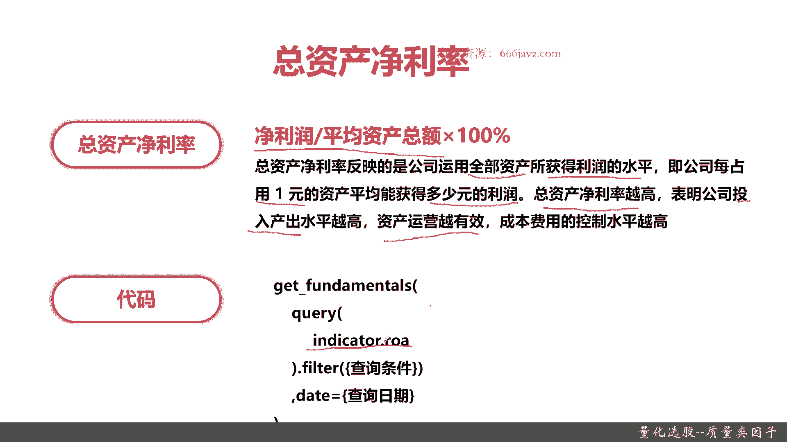
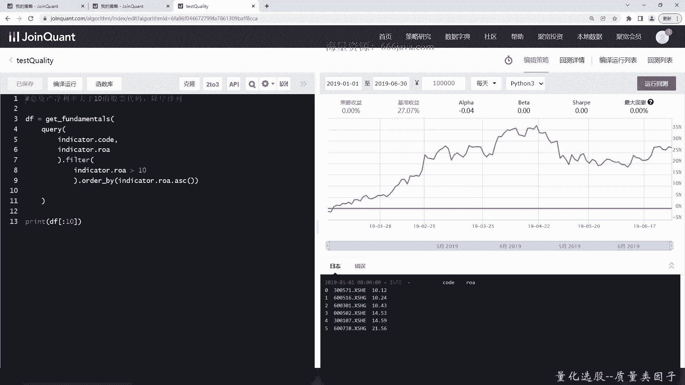

# 基于Python的股票分析与量化交易入门到实践 - P38：9.6 股市投资第一步-Python基本面量化选股_量化选股--质量类因子 - 纸飞机旅行家 - BV1rESFYeEuA

大家好，我是米tea，在上一节呢，我向大家介绍了价值类因子，选股的一些相关的内容，也就是关于价值投资这个投资策略如何去选股，那么这一节呢我先向大家介绍量化选股，最后一种因子质量因子的选股。

本节我们将从以下四个方面给大家介绍，质量类因子，首先我们给大家整体介绍一下质量的因子，接着我们给大家详细介绍一下，智能量因子的两个指标，第一个是净资产收益率，第二个是总资产净利率以上。

这两个指标呢就是质量类因子的常用指标，最后还是老样子，我们进行coding实战环节好，那么接下来呢我给大家介绍一下质量类因子，什么是质量类因子呢，那这就是质量类因子的定义，质量类因子指与股票的财务质量。

资本结构相关的因素，主要他的因素是公司的盈利能能力，盈利的稳定性，资本结构成长性，会计质量，派息摊薄投资能力等等等等，这些就是一个影响这支股票的质量类因子的，一些常见的因素，那说这么多。

其实大家可以理解为质量的一个因素，就是这支股票财务质量，还有它整体的资本结构，那质量的因子有哪些指标呢，一个就是净资产收益率，再一个就是总资产净利率好，那么接下来呢我们给大家详细介绍一下，这两个指标。

首先给大家介绍一下净资产的收益率，这个指标可能听着比较陌生啊，其实后面给大家稍微详细介绍一下，大家可能就清楚了，净资产收益率它的表征其实公式也很简单，税后利润除以所有者权益啊，这块两块可能不是学金融的。

同学们可能比较陌生啊，再乘以百分之百，其实呢呃大家理解一下净资产的收益率，其实就是企业的税后利润除以净资产，其实所有者权益就是净资产，然后得到了百分比，该指标的值越高，就说明投资的收益越高。

就是投资回报率可以这么简单，这么理解就是投资回报率，它的代码是什么呢，其实就是ie in DK的RV，每家公司的财报都会有这些披露，那IOE越高，说明这只股票的价值或者说质量越高。

这样子同学们是不是就好理解了，他的那个背后的数学逻辑或者算法，其实就是税后利润除以所有者权益，或者用一个比较，大家比较能听懂的，就是税后利润除以A净资产得到的百分比。

然后他的指标呢是同学们非常常见的ROE，OK这就是净资产的收益率，那么接下来是另外一个指标，总资产的净利率有点绕口啊，还是一样的，同学们先看他的介绍，他的公式是净利润除以平均资产的总额，这块嗯。

可能同学们就是对财务这块不是特别了解，那没关系，先看它的详细的定义，总资产净利率反映的是公司运用全部资产，注意是全部资产所获得利润的水平，有这么一个很好理解的例子啊，就是公司每用一元的资产。

平均能获得多少元的利润，这其实就是他反映，公司通过使用自己的那个资产，然后单位的产出是多少，其实那个同学们理解一下，总资产净利率越高，表明公司的投入产出水平越高，资产运营越有效，这家公司就是非常良好的。

那他的公式是这样的，那他的coding实现是什么呢，就是LOA记住LOE是净资产收益率，ROA是总资产净利率，如果同学们对这个财务不是，或者是金融方不是那么的了解，记住这两个LOE和IOA。

总之这两个指标都是越高越好，越高说明这这支股票它质量越好。

那么接下来呢我们进入coding实战环节，首先呢我们给大家已经，把这个那个test case例子写好，我们这个就叫test的quality，首先我们把净资产收益率写一下，大于多少呢，大于50吧。

这已经不低了，好实现起来也很简单，还是get ftomatoes，说股票代码要返回出来，这一块这两个字段求求了，后面我们把filter写一下，L1大于50就行，然后要降序排列，其实就是out by。

这时候我们换个时间吧，我们这次给他返回十只股票，好我们代码写好了，保存一下，然后看一下结果，初步检查没什么问题，我们运行一下，可以看到这就是基本的结果了，从2019年3月1号那个时候呢。

其实只有三只大于它，当然了，我们如果不限时，不限日期，我们把这日期去掉，它可能会有更多，因为时间段根据你的回测时间段来嘛，好吧也是只有三只50，可能是这个指数太高，这个与同学没关系，同学们可以自己去试。

根据你之后涉及的策略的，具体的参数进行调整好，那么接下来呢我们给大家看一下总资产净利率，这也不大于大于十吧，那我们接下来给大家看一下，总资产净利率大于100，有点多，大于十吧，那其实它很简单。

就是ROA，看一下大于十的是不是有多少，当然这是百分比啊，那我们把这个总价的经理就是ROA，我们要把这两个改了，这块还有这一块改了以后，我们应该就OK了，我们来运行一下。

好可以看到那个从十的来说大概有六尺，好，以上就是本节的两个指标的实战内容，好吧，那么接下来我们进入本章小结。

本章我们给大家首先介绍了质量的因子，质量因子主要是根据这家公司的财务允许，是财务质量，还有他的资产结构相关的，然后呢质量类因子呢它主要有以下两个指标，一个是净资产收益率，这个指标就是越高越好。

然后呢同学们记住它就是ROE，然后总资产净利率呢这个指标也是越高越好，它体征的表征的是我们这个公司的，单位的资产的投入产出的效率，而净资产收益率呢，它其实表征的整个公司的投资回报率。

这两个指标都是越高越好好的，那么最后呢我们就是代码实战环节了，这这一节的内容呢其实因为这两个指标，其实一个是ROOE，一个是ROA，相对来说比较容易，我们实现了起来也比较简单。

以上就是本节的质量类因子的介绍，我是米tea。

