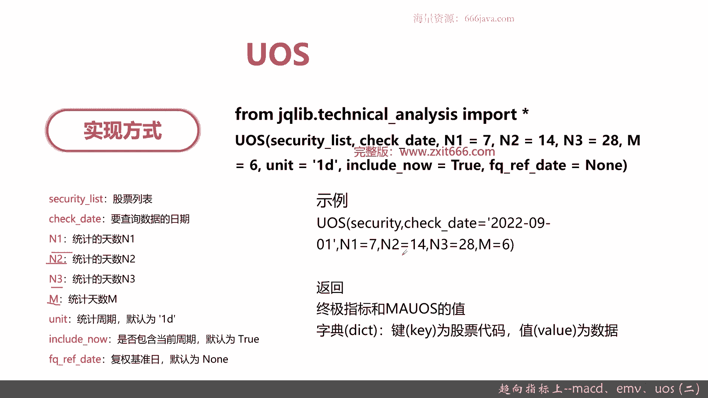
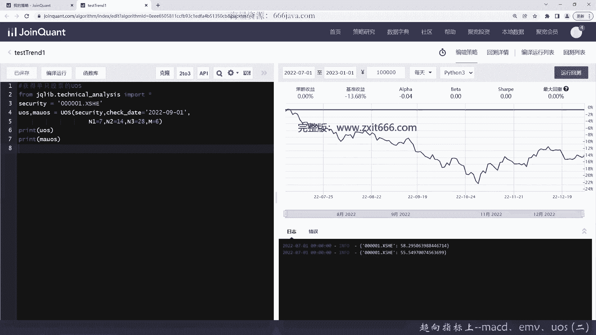
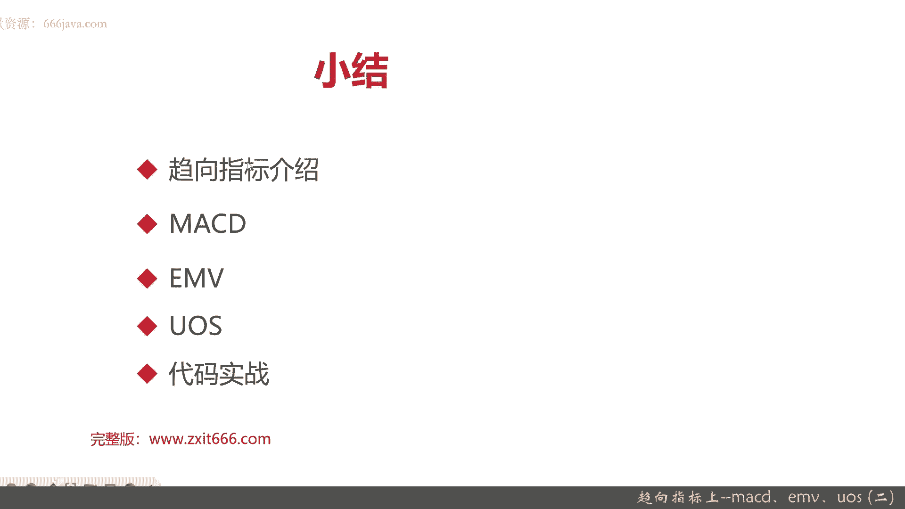

# 基于Python的股票分析与量化交易入门到实践 - P41：10.3 Python量化择时--技术指标函数_趋向指标上--MACD、EMV、UOS (二) - 纸飞机旅行家 - BV1rESFYeEuA

那么接下来呢给大家看一下，那个US代码也是一样啊，us s它也是用技术分析这个包，那us有个专门的那个函数，它分别有以下几个重要参数，security release跟前面的几个两个函数一样。

这个date也一样，它的特殊的参数呢是N1N2，N3和M1般来说呃N1等于七，N2等于14，那个三等于28，正好是二的倍数嘛，然后M等于六统计周期，Unit。

还有include now和复权ref date都是一样的参数，那us s它的实现呢跟上面类似，只不过你要把N1N2N3M给去掉，那个后面几个参数我们就可以不填充默认了，那它一般返回US和MIUS。

这两个都是dictionary，那么接下来呢我们进入代码实战环节。

老规矩，我们已经建好了这个计算计算例子，我们先写一个注释给大家看一下，这三个函数其实实现起来都比较容易啊，这个很容易，只要调用那个TECHUANALYSIS，不需要自己实现了，当然了，同学们有兴趣的话。

可以自己去实现，这里呢举一下例子，在那个区块链上下，怎么实现算MACD的值不难，重点是后续的根据MACD和这些趋向和指向，根据这些趋向指标，我们要给它进行整体的量化策略。

然后怎么样去找到它连续的股票交易，指的是在一个股价，其实是一个连续的趋势性的变化波动，那这个呢在后续的那个章节里面呢，我们会逐步给大家介绍好，我们先把001平安，001的结果给大家算出来。

好下一个参数应该是short，下头我们就12再写一个参数呢，应该是long，让我们等于26，然后是MACD的中位middle，我们是九好，这样就把结果给取出来了，他这个资源其实还是有些问题的。

先print df快线，然后再print慢写，最后，把MACD给print出来，好我们看下结果，先保存一下，可以看到平安银行这个在那一天的MACD，就是这样，当然你只通过这一天。

你是很难去判断出它是金叉还是死叉的，这个呢要在后面，我们要把那个整体的关于MACD的一个，量化策略写给大家的时候才可以，当然这不是本章内容，在未来的两章里面，会逐步给大家介绍这样的具体内容。

那么接下来我们来实现EMV，好我们就直接用多只股票了，它是一个list，当然了，像刚才给大家举的例MACD那样，举个例子，单只也行，万科，这个叫国泰君安吧，这个缩写一般他是不认的啊，虽然它有智能提示。

然后呢EMV它会返回两个参数，好参数变了，其他的check data还是一样，那它就不是short和long，还有MIT了，这是特殊的，那就是N，好有N和M就够了，好保存一下，我们来看一下EMV。

OK那这个呢就是2022年9月1号，这三只股票的EMV尺和那个mv em位置，那这个呢主要是要看他是不是穿过了零线对吧，可以看到这两个0。240。5就都蛮高了，然后0。09呢还好，但是要看前两天的指标。

接下来呢给大家看一下US，这次我就给大家看到单纯的us啊，其实都一样，就是一个diction的人，那无非是你是传list的进去还是传一个字符串，这次呢我们给大家还是看平安银行，那他应该是两个不一样的。

一个是US，一个是MAUS，那函数名很简单，就是us s一般是大写，虽然这个就是区块量化平台，已经帮咱们已经实现了这些量化指标，但是同学们如果有兴趣的，可以根据我放在教材里面的指标自己实现一下。

这个也是很简单，那同学们自己有兴趣自己实现以后，可以自己封装成自己的技术指标的函数库，那供调用就OK了，你们的那个参数呢，入参也可以参考这个区块量化平台，他已经做了一些抽象了，无非就是id。

然后data，然后和一些核心参数好，这个security list不是security，它可以按它可以按照名称来，其实我们就可以直接这样，其他参数，特殊的参数要传的M等于六，那我为了快一点，28。

这是N3N2等于17，要等于14好，那就是打出us s和，M a u s ok，那我们看一下，然后运行一下，结果，好这就是平安全区，在那个9月1号的US和MIUS好呃，他是58和55。

那其实它非常接近中呃，一个阈值50和65，看你是要用短线还是做中长线了，那么以上呢就是本节的内容，接下来呢咱们进入本章小结。

本章呢重点给大家介绍了一下趋向指标，趋向指标呢其实它就是DMI，就是又叫动向指标，它重点关注呢股下又是其实就是供需关系啊，供需关系受股价的变动带来的，均衡和到失衡的一个循环。

那通过这个均衡和失衡的循环呢，可以进行趋势研判，那它的重点的原理，它和其他的那个类型的指标呢不一样，就是动向指标，它会把每日的高低波动的幅度其实可以取，无论是MACD啊，US还是EVA。

它都是把每日的高低波动的幅度计算内，它都是甚至连续计算多天好，那么接下来呢我们也给大家介绍了MACDMACD，其实大家都很熟了，它主要是经过平滑处理后，均线的差异程度，它主要是用来研判股价变化的方向。

趋势和强度啊，MACD呢重点要大家给大家记住两块，金叉和死叉，那当他的快线上穿慢线，也就是地府创上传那个慢线DA的时候，也就是整个K线图里面红柱出现的第一天，称为金叉，是买姓的好机会。

当快线DNF下穿慢线，也就是绿柱出现第一天的时候就是死叉，是卖出空仓的好时机，那量化平台在聚划量化排平台呢，给了我们一个非常方便的函数啊，那算出每一天的MACD，具体判断金叉和死叉呢。

要在我们的量化测里面进行，再进行一步处理，OK那下一个呢是EMVEMV呢，就是简易波动指标，主要是把股价的中间呃，它主要关注的是股票中间价，然后带来的相对波动幅度，那它是怎么算的呢。

就是相对成交除以相对正负，然后呢，以此作为衡量股票中间价波动百分比的基数，EMV上升代表成交量增加，同时价格也会上升，EMV下跌代表缩量下跌，也是价格的下跌，那公式呢那个同学们感兴趣可以自己去翻看。

得见，我们这里就不回顾了，EMV应用呢给大家介绍一下，当EMV从底部到顶部穿过零轴的时候，是买入的好时机，EMV从上到下穿过零轴的时候是卖出的好时机，那它的那个函数呢也是那个据框框。

那个平台帮我们封装好的EMV传的参数呢，除了spcurit list和check date以外，NM就有一个区别了，N就是N认证的EM的累加值，M呢就是EMV的移动均线，一般来说N是14那个M19。

最后呢给大家又介绍了一个US，US呢它就是终极波动指标，他呢既可以去看那个短线，又可以去看中长线，除了趋势确认，然后发出超买超卖的作用，它与ms s有它有个突破讯号，然后不仅可以提供最适当的交易时机。

那它还可以通过这个突破信号，它还可以更一步加强指标的整体的可用，同学们记住这个原理，包括它的算法，US的算法其实比MACD和EMV都复杂，那我们在这里就不复习了，重点US的作用，如果你关注的是短线。

短线其实就是那个一天到两天，那最多呢不会超过一周，这是短线，中长线是数周到半年，长线呢一般是半年到一年甚至两年3年，那us s短线它的的那个就是底部就是US值，从下到上上传了50。

US短线的卖点就是us as下穿，从上到下下穿65的时候就是它的卖点，那US的那个中长线的那个买点和卖点呢，和短线有点不太一样，它就是幅度震荡幅度更大了，那它的中长期的买点就是上传35。

它的中长线的卖点就是下穿70，OK最后呢给大家进行了代码实战，本节的这个几几个指标，因为都是封装过了，所以代码来说呢比较简单，那重点是让大家了解这几个指标的基本原理，然后怎么去应用算法呢。

感兴趣同学们自己可以从头实现一遍，这里我就不展开了，好以上就是本章小结，然后呢本章的全部内容就到这里就结束了，我是meta，大家下期再见。

