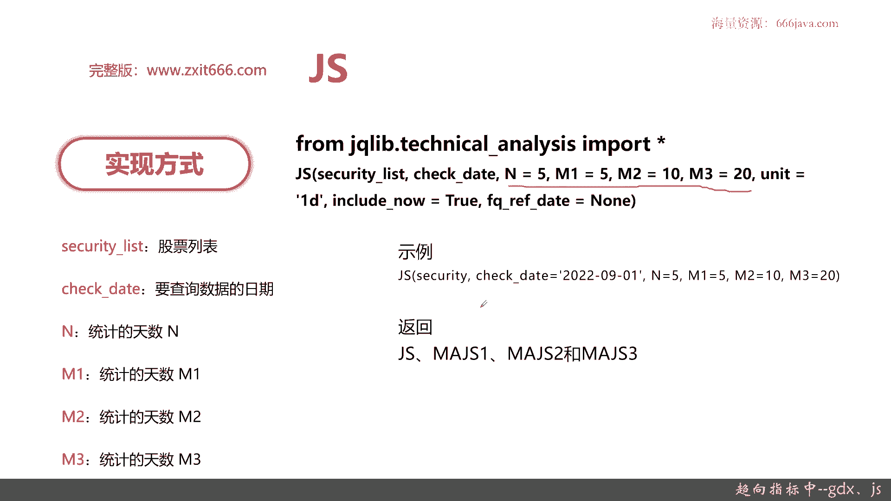
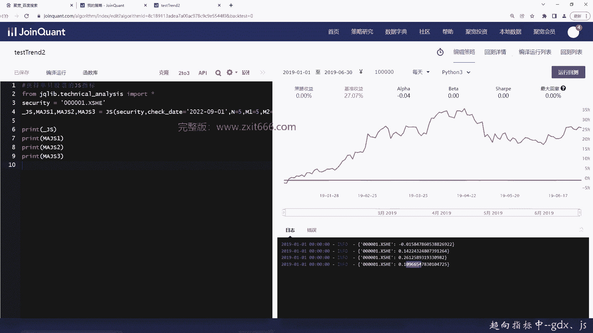

# 基于Python的股票分析与量化交易入门到实践 - P42：10.4 Python量化择时--技术指标函数_趋向指标中--GDX、JS - 纸飞机旅行家 - BV1rESFYeEuA

大家好，我是米田，在上一节呢，我向大家介绍了趋向指标的第一个部分，主要是MACDEMV和US，那么这一节呢，我先向大家介绍趋向指标的第二个部分，本节我们将从三个方面给大家介绍趋向指标。

首先是GDX轨道线，接着是JS加速线，这个不是那个开发的JS啊，最后是代码实战部分好，那么接下来呢我向大家介绍一下GDX，GDX就是轨道线，它反映的是中心线与收盘价的乖离，也就是说。

这个中心线其实是股票的股价的一些，中心线和收盘价最终的变化情况，对趋势线做了平滑和修正处理，更精确地反映了股价运行的规律，好我们给大家看到一个，看了一下轨道线什么样子啊，这个就是GDX图。

可以看到其中有三根线，上面这根线是压力线，下面这根线叫支撑线，那中间这个有的叫轨道线，也又名济安线，其实就是中心线，可以看到上面那个部分，如果股价上穿了，那就会涨，那如果会跌，那估价如果下跌。

那这根截然线它就会到支撑线的部分，当然了，一旦到了压力线或者是支撑线的附近呢，会有不同的买入和卖出的信号，这待会我们给大家分享一下，好接下来给大家说一下轨道线的算法，这一块呢大家看一看就行了。

因为GDX呢其实也不是那么非常常用的指标，自己大概看一下，了解一下基本的算法，那基安线就是中心线的算法是什么呢，它是个AA复制二乘以收盘价，加上最高价加最低价除以四，OK这就是它的中心线了。

减去收盘价的N日，简单移动平均的绝对值，再除以那个收盘价的N日，简单移动平均，这个业务以接压线的AA算法就是这样，那既安线是什么呢，以AA为权重收盘价的动态移动平均。

可以理解为这就是中心线或者就是中间这根线，而压力线是上面部分，一加M比上100乘以这个JX呢，就是基安线其实是一个百分比的位移，可以大家可以看出这具体百分之多少，这参数可调输出压力线。

就是一加M除以100乘以JX，这个呢一般来说这个M1般是九，而上面的N呢一般是30，这都是那个行业的默认的参数赋值啊，然后输出的支撑线那就很简单，一减M除以100，那个乘以JX。

OK其实也是个百分比的比率啊，好，那么我们来看一下买和卖的情况，这个是买点和卖点，当股价上升到压力线的时候就可以卖出了，当股价下跌到支撑线的时候就可以买进，这个呢它永远是其实是一个动态的波动范围。

那是我在我最终的股价某一天，已经到了这个支撑或者压力线的时候，因为在这个时间它是根据收盘价里的乖离，也就是说收盘价，那其实你只是前一天的收盘价嘛，那如果到了前一天的压力线，你涨到这里，那就是可以卖出了。

比较稳妥，然后当下跌到前一天，或者前几日的支撑线的时候，那你就可以买进了，OK这就是GDX好，那么接下来的呢是JSJS呢，它不是我们常见的JAVASCRIPT，它就是加速写，那它的原理呢。

通过当前股价与一段时间以前的股价相对比，来测量股价涨跌的速度，其实就是测量股价涨跌的速度，来确定其运行的快慢的指标，那JS的算法呢，其实它是跟其他的线也太不太一样，它有四根线，JS包含四根线。

分别是JS以及三条JS不同周期的简单移动平均，这移动平均一般是五十二十，然后计算的JS4也很简单，100乘以收盘价减去N日前的收盘价，再除以N乘N日的前的收盘价，这个记住这个N1般是五。

然后JS的第一个ma那这就是5日的简单一种，JS的第二个ma就是10日运动，JS的第三个ma就是20日一周，了解了检测它的具体算法以后，我们来看一下JS它的买入和买出的信号。

当JS线向下交叉JS的均线的时候卖出，当JS向上交叉的时候买进，那一般来说只要有两根以上的JS，它一共四根线嘛进行了交叉，那就是买入或者卖出的信号，具体是买入的信号还是卖出的信号呢，看他后续的移动势头。

它是向上交叉还是向下交叉，这个那个应用方式还是比较好记的，那么接下来给大家看一下JS的具体的实现，实现方式，JS跟那个其他几个之前介绍的，趋向指标也是一样，都是技术分析这个包，那JS有自己的函数。

它的特殊的参数NM1M二M三，OK其他的参数都一样，那具体的参数N1般是默认是5M1M2M3，分别是五十二十，好的代码的示例呢是这样，可以看到你只要把NM1M二M3security，既可以取list。

也可以输入一个单个的字符串好，然后check data呢就是日期，那JS的返回返回JS那个，还有它三根移动均线的具体的值，那么接下来呢我们进行扣定实战。

还是跟之前一样，咱们呢写了一个demo好先实现GDX，我们把注释先打开，好我们要把那个技术分析这个包呢给导入，我们这次呢测试一个，List，老样子还是0001002，然后再加一个601。

2111好测试是三只股票，GDX呢就是轨道线，它有三个结果，一个是基安线，然后呢是压力线，那你看那个其实这是汉语拼音啊，既安线JAI线，压力线Y2X这样就好记了，然后是支撑线，Ok。

好security list我们呢还是跟其他的测试一样，还是看，9月1号的，好默认N等于14，M等于九，那么这一次呢哎他这个有提示又有问题了，然后这次我们给大家换一种输出方式，用循环的方式。

然后每行输出一个值来看一下啊，好我们分别是这三个池，西安线，下面一个是压力线，然后压力线，然后这个是支撑线，好我们这次来保存一下，然后看看结果，好大家可以看到这个右边就是具体的结果了，接压线13。19。

当然这个时间其实是回测策略，实际上我们输出是2022年0901，这个我们时间可以到时候改一下就行了，然后压力线17。38，那你股价如果超过14。38，那你就是一个卖出的价，支撑线是12。0。

如果股价突然低于了12。06，那那个就是可以看到，那它就会是一个买进的时期，然后这是第二只股票的结果，好的这个呢就是轨道线，那么接下来呢我们给大家看一下啊，JS加速写，我们把这个改一改。

这次呢我们不要多吃股票了，我们就单只，好JS值，老样子，首先要导入那个technical analysis，这次呢我们就不要这么多股票，我们只要平安银行这一支，然后输出的结果是不一样的。

首先它会输出JS，然后输出，ma就5日的均线，10日的均线，然后20日的JS均线函数就是JS了，我们这里变量名改一下，因为他不是list，所以我就不传list，确定的还是一样，然后N等于五，M1等于五。

M2等于十，M1是五，M2是十，然后M3就是20，这就根据我们公式的算法来，然后呢他既然已经是这样，那就输出就不能是它既然不是一个list的输出，就不能这样输出了，那我们就直接把因为是单只股票嘛。

我们就把这那个加速线的四个值给输出出来，那我们看保存下，看下结果，好的，那这个呢就是加速线的四根线，分别是JS线和MAJS1M二JS2，然后M3你可以看到就是JS是负的。

最小的5日十日和20的结果值呢分别不一样，如果你可以看到这些JS的值，根据那个之前的应用JS线，两根以上的进行向下相交的时候，就是卖出，如果两根以上进行向上交叉的时候，就是买进好的。

以上呢就是本章的全部内容。

下面呢进入本章小结，本章呢一共给大家介绍了三个部分，首先我们给大家介绍了GDX，GDX呢就是轨道线，它有三根线，分别是基安线，然后呢是压力线和支撑线，它的算法呢大家看一看就可以了，大家这样记住啊。

压力线和支撑线就是一个积压线的等比例放大，然后积压线呢就是股价的中心线和股价中心线，然后做下一下加动态加权平均，那他怎么去应用在买入和卖出的信号呢，当股价上升到压力线的时候，咱们就可以卖出了。

当股价下跌到支撑线的时候，咱们可以买进，注意不要去太贪，其实有一定的比例，所以这就是轨道线，再一个是JS，这里的JS呢，因为我们学编程的同学们特别要跟JAVASCRIPT区分出来，JS呢它就是加速线。

它的作用呢其实是通过反映那个股价的，和前若干几天的收盘价进行对比，然后呢反映出股价的速度的变化，那它有四根线，分别呢是JS线，还有MAJS1，M a j s2，M a j s3。

MAJS1呢就是5日移动均线，MAMA的JS2呢是10日，MAGS3呢是20日，那JS他怎么应用呢，当JS写和一根或者一根以上，也就有两有两根JS就是他JS有四根线嘛，有两根线以上进行交叉。

同时它是向下交叉，它就是一个卖出的机会，如果JS有两根以上向上比较差，那他就是买进的机会，OK这就是JS好，最后呢我们给大家介绍了代码实战，这两个JS和JDX轨道线，这两个其实都在区块链方面。

都已经有实际的实现的函数了，不同的是JDX它的特殊参数是N和M，一般N取30，M取九好的，那JS呢它是有四个参数，NM1M二M三，分别代表呢你的JS的统计生成的参数，第一个均线。

JS均线和第二个和第三个，一般呢M1M2M三取五十二十好的，那以上呢就是本节的内容，谢谢大家收看。

我是meta。