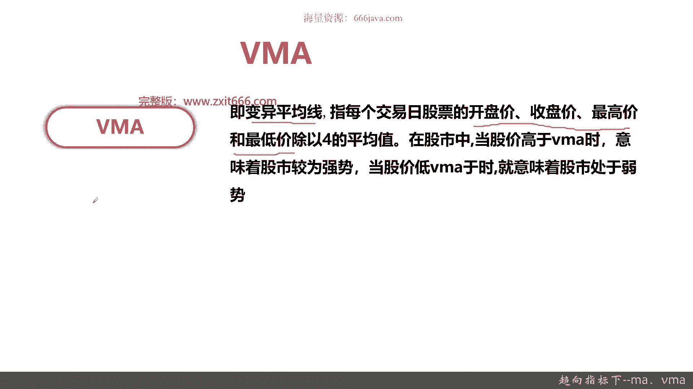
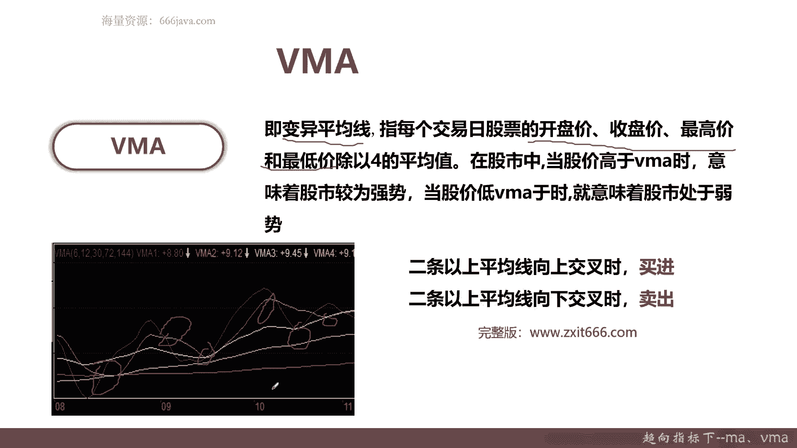
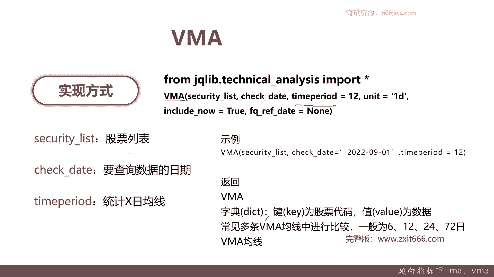
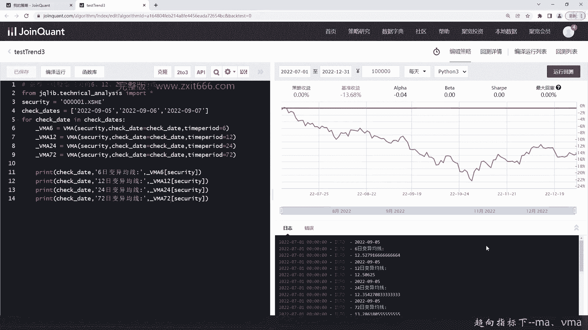

# 基于Python的股票分析与量化交易入门到实践 - P43：10.5 Python量化择时--技术指标函数_趋向指标下--MA、VMA - 纸飞机旅行家 - BV1rESFYeEuA

大家好，在上一节呢，我向大家介绍了趋向指标的第二个部分，也就是G嗯，GDX和JS分别是轨道线和加速线，那么这一节呢我将向大家介绍介绍，趋向指标的最后一部分，本节我从将从三个方面给大家介绍。

趋向指标的最后一部分，首先给大家介绍一个老朋友ma，接着给大家介绍VMA，最后还是老样子给大家进行代码实战好，那么接下来呢我将向大家介绍一下ma，ma额和之前介绍了很多次了，就是移动平均线。

它重点呢是有一个趋势特性，然后越长期的移动均线呢就越能保定稳定，它最重要的是稳定，那移动均线呢是一个趋势工具，趋势追踪工具，那它便于识别趋势已经终结或者反转，然后呢新的趋势是否形成国内常用的呢。

5日十日30亿，这是一般短中期长的，那也有60亿和20日和120日，还有250日，那一般一般来说一年大概是250个交易日，那为什么是最终是250日呢，记住250日均线有一个特别的用处。

就是在国内A股他衡量是熊市还是牛市，记住啊，就是国内A股衡量熊市和牛市，就是通过251日线来衡量的，分别是沪深两个大盘的交易情况好的，这是ma，然后呢给大家看一下常见的ma图形。

下面这几条分蓝色的分别是那个5日均线，然后黄色的是10日均线，然后紫色是20日，然后这个棕色的呢是30，可以看到越长期的均线它越稳定，那越短期呢他就那个波动越大，那么接下来呢给大家介绍一下嗯。

怎么去通过那个ma来看那个买进和卖进的时机，这个呢格兰比法则是一个在那个技术分析，或者叫金融工程领域，大家非常经典的一个，通过ma来看到买进和卖出的那个经验吧，一般来说有八点。

首先移动均线从下逐渐转轴为平，而价格从下突破平均线适合买进，OK这是第一个买进，第二个价格虽然跌破均线，但是又立刻拉升，这个立刻呃，其实最终是要量化的非常快，可能是一个点或者是三个点以内。

就是三个时间段以内，就叫那个立刻，此时平均线仍然持续上升，这个时候就也是买入，第三个买进的信号就是价格趋势走在平均线上，价格下跌并未跌破均线，且立刻反转上升，也是买进，然后最后一个呢是价格突然暴跌。

跌破均线，而且呢逐渐的远离均线，这其实就是一个类似于抄底了，但呃则有可能反弹上升，也为买进，一般来说我们正常在于用作量化交易的，是从上到下，一般考虑一二，第三和第四呢有点抄底的建议。

这些抄底的痕迹在里面，之前给大家介绍趋向指标一般是不考虑抄底的，所以呃尤其是第四点，他衡量就单单只看ma要考虑那个买进呢，有可能有抄底，也有可能抄在了半山腰，所以这块大家看一看就好好，这是买进的信号。

接下来是卖出的信号，均线从上升逐渐转为盘局或下跌，那同时价格下跌，跌破均线为卖出，虽然均线上升了，但是呢它上升的势头已经不在了，然后有点下跌的趋势，同时价格已经跌破均线，这个时候为卖出。

OK这是一个比较容易判断的信号，第二个信号呢是价格虽然向上突破均线，但是又立刻回跌至均线以下，那此时均线仍然持续的下降，人为卖出，就是说价格现在非常短的那个价格线上的时候，那他短期的突破了均线。

但是呢立刻回跌至均线，这个时候且那个均线仍然就是无论是5日，10日还是3日持续的下降，那就会卖出的信号，这两个呢在量化这里写成策略还是比较好写的，但是后面两种就不太好实现，比如说价格趋势走在平均线下。

价格上升并未突破均线，且立刻反转下跌，那这个人看看就好了，最后一个呢是价格突然暴涨，突破均线且远离均线，则有可能反弹回跌，那这个就是封顶，一般来说，如果你要把第三种和第四种设置为一个呃。

设置为一个就是量化策略的，你可能要考虑一个阈值，就比如说抄底啊或者是卖出啊，就是你退出的限制，比如说它涨到了嗯，之前的50%或者20%，那你就立刻的就是那个立刻的就是平仓卖出。

比如说它跌跌了10%或者20%，或者跟用我们的专业来讲最大回撤等等，而用这些来判断，那这个时候加上这些策略是可以的，就是如果单单只通过这个格兰币法则，它有点偏向于经验主义，不是那么好。

直接把它作为那个均线相关的量化策略，因为大多数它还是一个定性的结果，不是定量的，对于量化来说一定要定量的，比如说我参数一定要十，而不是30或者不是50等等，那这两块呢，就是给大家常见的介绍的格兰碧法则。

那大家可以看一看，然后呢试着也可以结合这些经验呢，去看一看K线图，还有那些均线图，选一些股票，看看是不是确实如他所言，好吧，先是能自己看懂，然后再去coding编写量化策略可能会更好一点好。

接下来我给大家介绍一下ma的是呃那个代码，ma的实现方式，和那个之前的几个趋向指标也是一样，他也是用那个技术分析库technical analysis，然后呢它的函数就是MA。

它无非和其他的函数有个特殊不同的那个参数，它有个time period，这个就是具体的均线的那个参数，你到底是5日还是10日还是20，这个CHAMPP2的就是统计X式的均线，然后这里是例例子。

那比如说我只传这三个参数，Security list，Check date，还有那个term period，然后呢返回就是ma就是一个值，当然一般来说会把5日十日，23日连用，那60日和120日。

还有250日呢不太常用，一般因为这些东西比较宏观，可能你要在做研究宏观经济数据的时候，可能会用到那ma的返回回也很简单，也很和就是其他的那个函数是一致的，就是一个字典diction的瑞。

介绍完那个ma以后，我们再给大家介绍另外一个可能常用的VMA好，那么接下来呢我们给大家介绍VMA，这个VM呢和那个之前给大家介绍的，我们作业有提到的那个额成交量均线呢，不太一样，它叫变异平均线。

那为什么叫变异平均线呢，因为之前的ma这些均线呢，它主要是移动平均线，它主要是以仅仅只是与收盘价而变异平均线，它是以每个交易日股票的开盘，收盘最高和最低价之和除以四，它得到的平均值。

这个值作为它的平均线计算的一个基准，在股市中，当股价高于VMA意味着股市较为常势，当股价低于1VMA，就意味着股市处于股价处于弱势，那便于平均线VM和一般的均线相比呢，它敏感度更高。

那那个因为他又综合的，不仅仅只是把收盘价作为一个参数，而且是取材中的一些均值呢，它消除了部分平均线落后的缺点，更加重要的是呃VMA的计算方法更加合理，它指标数更多吗，更能反映实际情况。

它不仅仅只看一天的收盘的结果，他一天的那个股价最高的价啊和最高价，这些震荡的幅度，波峰波谷他也考虑在内了，好。

那么这个呢就是一个常见的VMA的均线，v ma一般来说和ma也类似，它是看嗯也是看多期的，只不过呢那个ma的均线一般是以五为倍数，VAMA一般是为六的倍数，可以看到这里一般是六十二三十七十二。

144等等等等，那么VMV买进和卖出的信号的判断呢，其实也比较容易判断，两条以上平均线向上交叉的时候呢，它就是白进的信号，比如说这里对吧，比如说这里，然后比如说这里。

那两条以上平均线向下交叉的时候就是卖出，那比如说这里就是右边吗，这里那这里这个就是VA的那个就是E，当然了，它的算法就是均线开盘价，收盘价，最高价，最低价加起来除以呃，那个除以四。

后面按照六天进行移动求和，然后就可以了，好那这里算法我们就不给大家详细介绍了，后面我们给大家介绍一下代码。

这个实现方式跟之前的是类似的，无非有差异的就是一个函数名，然后它的参数和ma也类似，这就是我为什么我们这一期把ma和VM，拿在一起讲的原因，他们两个非常相似。

然后呢time pared这个参数就是统计X日的均线，然后这是由示例示例和那个也类似，只不过呢一般来说ma和VMA还不太一样，就是VMA要做多条均线进行比较，一般为六十二二十四，72，也有把144作为。

因为VMA只有多条均线进行交叉的时候，它才是一个买入和卖出信号的判断好，那么以上呢就是本节的课程资料的内容，下面呢进入coding实战环节。

首先我们给大家介绍一下ma，我们ma就看到就看一只股票的ma吧，我们先把数那个library加载一下，好我们还是选平安银行这一支啊，那我们这次时间就选的不一样，连续三天吧，我们便利一下。

当然也有其他写法，但我们现在就这么写，先把5日均线给求出来，那后面十二十我就直接不打了，我就省事，好这就便利完了，然后同时我们把每一个时间段的结果打印出来，好把5日十日均线的结果。

在每个日期下也打印出来，好5日十日的均线大，正好最后一个20日好了，那代码写好了，我们简单检查一下，看有什么问题，好我们来运行一下，可以看到5日十日，20日这些均线结果每天其实是不一样的，看到吗。

其实会有一些些微的差异，当然了，那个越是日期均线X日越大的，它的变动幅度越小，比如说你看5日12。504，12。588 12。584，但是你看20日的12。4414 12。4，279十二十二。409。

所以，这就是那个ma的结果了，后面给大家看一下VMA，那为了我们时间效率，我们给大家做一个基于上面类似的，这个代码的框架写一下，因为VM一般都是六十二二十四七十二嘛对吧，其他的我们基本不变。

我们把那个具体的结果给大家变一下，那因为VMA和这个ma很相似，我们就直接时间关系，我们把它快速的生成一下，好还有个72，好后面是24，最后一个是72，好我们看一下那个VMA的结果。

检查一下结果对不对嗯，变量大概都没有错，好我们看一下VMA的结果，OK这是v ma的变异结果，这是VMA变异均线的结果，可以看到确实是把按照六十二二十四，72给生成出来了，然后呢这个具体相交。

这个其实通过量化代码其实是可以实现的，那么接下来我们进入本章小结。

首先呢我们给大家介绍了ma，ma之前说过很多次了，他就是一个移动平均线，它的特点呢是趋势性的，它越长的ma呢它越能表示稳定，ma呢一般是作为一个趋势追踪的工具，基本上常用的是5日十日，30日，60日。

120和250，短线呢一般是5日，中长线一般是10日，20日或者是20日，20日或者10日30日，一般因为一个月的交易日是20天嘛，二这250日呢，是在国内是一个特殊的使用法。

它主要是用来判断牛市和熊市的一个差异情况，然后ma呢有个格兰比法则，它有八个经验结果，分别是买进信号和卖出信号的机子，一般来说那个就是买进是四个，卖出也是四个呃，在这里我们就不一一给大家全部重新回落。

大家要记住就是它是基于经验法则的，然后一般来说每个经验的那个前两条，其实通过量化策略实现起来还是比较容易的，因为它它本身都是定性的吧，那前两条还是比较容易的，然后一般三四条呢。

要结合你自己的一些经验参数进行调整，ma的实现呢也是用之前的那个技术分析类，然后呢他ma的函数里面有特殊的time period，接下来是VMA，VMA呢和我们之前介绍的另外一个。

关于成交量均线的有个区别，那一般来说都是把VMA和ma进行对比，VM呢是变异平均线，它和ma的差异呢就是它不仅仅指向v ma，以收盘价作为一个计算的核心指标，它要考虑开盘价，收盘价，最高价和最低价。

然后呢是把它们这四者相加，每日的四者相加，然后除以四，那就得到单日的值了，一般来说呢v ma和ma呢ma一般是5日十日，20日，30日，60日呃，呃120日，250日，然而VM呢一般是六的倍数，62。

24，72，144等等，VMA的设计上的指标比ma更加的那个敏感，然后呢它设计上指标也更加丰富，因为毕竟他还考虑到了每日价格的震荡幅度，因为有最高价和最低价嘛，然后VM的那个特点呢。

只要两条以上的额VMA平均线向上交叉，那他就是买进的信号，如果两条v ma向下交叉，那就是卖出的信号，后后面其实就是我们代码实战了，那VM代码呢它跟ma的区别处就是函数不一样，一个是ma一个是VMA。

连特殊的参数time period都是一样的，因为它其实虽然它属于大类，叫均线指标啊，趋向指标这个大类，其实一般都可以把他们归为，虚项指标下的均线类，因为所有的均线其实都是趋向指标嘛。

那v ma呢和MV还有一个区别，就是ma一般看一条你就可以判断，那短线看5日的中线，长线看10日20，甚至有那个三十六十的VM不一样，VM一般要用那个一般算都是用四条来一起算额，只要多条有相交。

这才是VM的卖出和额买进和卖出的信号，以上呢就是本小节的回顾，关于气象指标这一块呢，我们就可以大家全部介绍完了。

那我是meta，咱们下期再见。