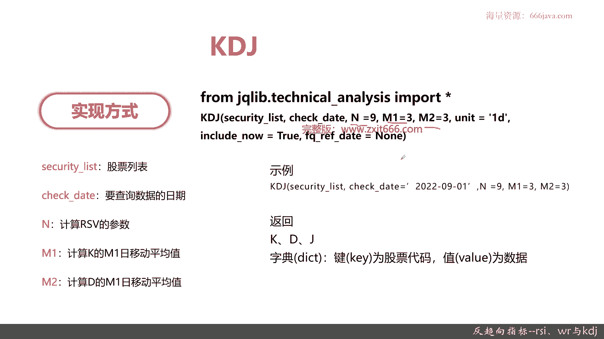
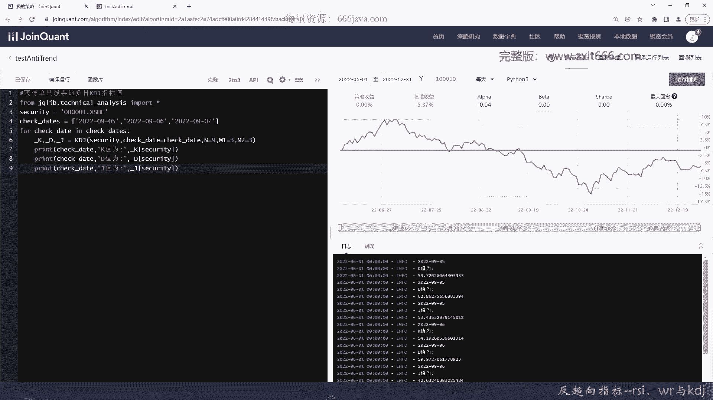
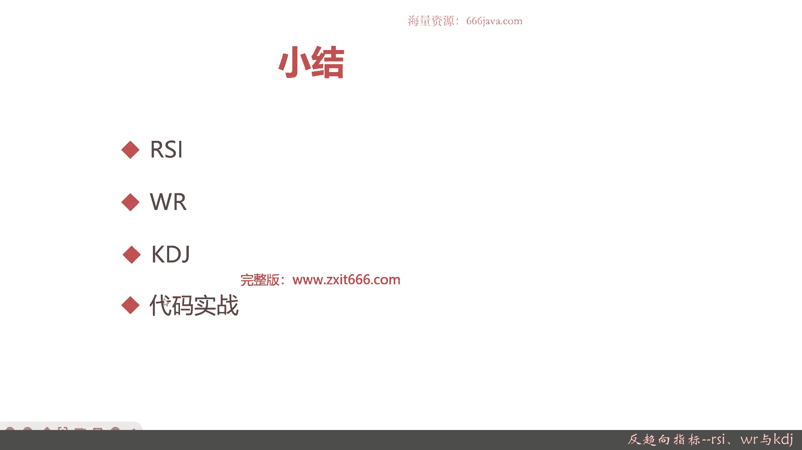

# 基于Python的股票分析与量化交易入门到实践 - P44：10.6 Python量化择时--技术指标函数_反趋向指标--RSI、WR与KDJ - 纸飞机旅行家 - BV1rESFYeEuA

大家好，我是米TIA，在上一节呢，我向大家介绍了趋向指标的最后一节ma和VMA，那么这一节呢我今天向大家介绍反趋向指标，这一节我将从以下四个方面给大家介绍，反趋向指标，首先是三个经典的趋向指标。

第一个是RSI，也就是强弱指标，第二个是WR威廉指标，第三个呃，之前已经给大家介绍好多次了，大名鼎鼎的KTJ，最后是coding代码的实战环节好，那么接下来呢我首先向大家介绍ISI。

RSI呢它就是相对强弱指标，它是期货和股票市场中，非常或者说最为著名的摆动震荡的指标，它表征的是股价向上波动的幅度，占总的波动幅度的百分比，注意他是股价向上的，它只计算股价向上波动的幅度。

占总的浮动的百分比，因为后面还有向下嘛对吧，如果这个其数值大，就表示市场处于强势，如果数值小就表示市场处于弱势，那么ISI的公式是什么呢，N日的ISI就等于A除以A加B再乘以100。

那什么是A什么是B呢，A就是N日的收盘的涨幅之和，B就是N日的收盘跌幅之和，所以呢就可以看到，其实I色的本质就是N日的收盘，涨幅和跌幅的比值向上力量大，那比值就高，那就市场处于强势。

那向下的力量大指标就下降，那市场就处于弱势，然后呢IS的图形是什么呢，就像这样，它也是一个震荡浮动的图形好，那么额给大家介绍了ISI，然后给大家介绍一下i is的应用，ISI大于80的时候为超买。

ISI小于20的时候为超卖，那分别就是卖出和买入的信号了，ISI为以50为中介线，那就是赌石的时候，多方和空方的力量是相等的，大于50为多头行情，小于50为空头行情。

RSI在80以上形成M头或头肩顶的形态，时候为向下翻转，这种策略代码也是可以实现的，当然了呃大于80和小于20，这是对于量化策略最容易的，ISI在20以下形成W底的时，或者头肩底形态时候视为向上翻转。

这个第三点和第四点正好是对称的，当然了，三四点对于coding的实现来说，肯定比第一点更加的额复杂，最后一点SI向上突破其高点连线时买进，ISA向下跌破其低点连线时卖出，那最后一点呢。

对于量化那个策略的编写可能是更加复杂，因为定性的还是比较多，没有完全定量好，以上就是ISI常见的应用，那么接下来呢我们给大家介绍一下ISI的代码，ISN的实现方式，跟之前的技术分析的指标相似呃。

也是要加载技术分析这个包，然后呢有一个专门的函数ISI，那它唯一的一个特殊点呢，他有个合数的参数N1，那N1呢就是ISI统计的天数值，一般N1就等于六，右边呢是ISI的那个实际实现。

ISI返回ISI的值，它的返回呢也是一个字典和key好，那么这就是ISI，接下来呢给大家介绍一下W2，W2就是威廉指标，它简称W2，然后呢它是由拉瑞威廉发表的，所以它就叫威廉指标。

威廉指标呢又叫威廉指数，它主要用于研究股价的波动，是通过分析股价波动中的风和股，决定买还是卖，威廉指标，主要是用来分析市场短线的走势的技术指标，它中长线基本上不会用，威廉指标，用了也不准。

好下片段来给大家介绍一下威廉指标的算法，威廉指标的算法较SRI来说呢更加简单，N日内的最高价减去当日的收盘价，比上N日内的最高价减去N日内的最低价，这就是威廉指数，然后右边呢是威廉指数的图。

分别是10日和28日的威廉指数，那威廉指数的应用呢，它比那个SI应用起来简单多了，当威廉指数高于80的时候，市场处于超卖，那行情将见底买进，注意啊，威廉指数呃，和ISA还有HK其其实相当于都是反过来。

它的指数威廉指数越高，那市场行情越见底，正好是反过来，那所以它需要买进VN指数低于20，市场处于超买行情就将见顶了就卖出，所以威廉指数就记下来，高于80买进，低于20卖出。

这个对于量化策略的应用实现起来，买和卖的信号非常方便，好，那么接下来呢给大家介绍一下威廉指数的代码，威廉指数也类似于其他的那个技术分析的库，要需要加载tea technical analysis这个库。

然后呢威廉指数专门的函数，然后威廉指数有两个值，一个是N和N1，那其实N和N1呢，就是刚才N威廉指数算法内的统计值，一般取十和六，当然了，也有许十和28的这个具体呃也有取14，28，十和28。

这个具体看好吧，那我们举的这个例子呢，威廉指数N等于14，N1等于28，那威廉指数呢返回两个值呃，威廉和威廉指数的均线，那威廉指数的均线MA为联，就是N1的值，N就是威廉的值。

这个具体看同学们个人的习惯吧，十二十八十四二十八十六都可以，那么接下来呢给大家再介绍一下，大名鼎鼎的KDJ，KDJ之前给大家在前面的那个技术分析的例子，给大家讲过一遍，也给大家实现具体实现方式。

专门讲过，包括用pandas matt protolab怎么去画图，都给大家说了，这一次呢我们给大家再做一下复习，KDJ就是随机指标，它充分考虑了价格波动的随机振幅，与中短期波动的测算。

那KT界不仅仅可以比ma移动均线，更加准确地预测市场，尤其对于市场短期的超买超卖呢，它又比相对强弱，也就是ISI更加敏感，所以呢KDJ现在其实用的是非常非常多，一般现在用的最多的是几种，一个是K线图。

G4就是MACD后面就是KDJ了，这个指标设计的确认模型确实是比较优秀的，那像这类图已经给你举个例子了，KDJ均超过80，那属于超买，KDJ均小于30，属于超卖好，那KDJ的算法呢。

我们之前给大家介绍过，他首先要计算ISV，中文名叫未成熟随机指标尺，N日的收盘价减去N日的最尖价，比上N日的最高价减去N日的最低价，再乘以100，然后K呢就是当前的K值，那23乘以前一天K值。

加上13乘以当天的ISV值，D呢就是当天的地址，2/3乘以前一天的地址，加上13乘以当前的K值，KJ就是完全跟K和D有关，它是三倍的K值减去两倍的地址，那如果前一日没有K和D，就可以用50来代替了。

好这就是KDDD的算法，那KDJ的应用呢在下面，首先当KD值大于80时，回档几率较大，KD值小于20时反弹几率较大，那分别是回档，其实就是需要那个卖出的信号，反弹就是买入的信号。

K在20左右时向上交叉到D视为买进信号，K在80左右时向下交叉较低，视为卖出信号，这几个其实这三点，都是非常容易实现的，JA大于100时股价易反转下跌，JA小于零时，股价亦反转上涨。

第五点其实只是告诉大家，KTJ波动在50左右嗯就没什么了，就证明他的震荡幅度不大，那他可能判断呃风和底就不是什么那个有作用，那就考虑如果KDJ作为量化指标的策略的话，那作为舞狮是没有什么太大意义。

从这点可以看出啊，KDJ的呃，这五点来说，其中前面四点对于量化策略的编程，其实相当于比较友好，而那个ISI这个强弱指标呢，呃在编程方面，因为有一些还需要凭人的经验再去实现，比如说M底呀。

K底呀这些那还有突破ISA向上突破高线啊，高点连线或者向下跌破低点连线的时候，这些对于代码的实现来说，比较的相对来说比较困难，所以呢一般来说在量化交易策略里面，再反选用反趋向指标。

KDJ还是非常常用和经典的好，接下来呢给大家介绍一下KDJ的代码，那个实现，实现嗯类似于其他的技术分析的指标，也是要加载那个技术分析指标库，然后呢，KT界有三个重要的参数，N。

M1和M2那分别是什么意思呢，N是专门用来计算ISV的参数，M1就是K的那个M1日的移动平均值，M2其实就是算用算算D的M1日平均值，因为JM完全是基于K和D，所以它不需要有参数，K和D确定了。

那J也就确定了，好后面是K1J的代码的样例，可以看到，一般来说N取1M1和M2分别都取三，那KDJ这个函数返回，返回的KDJ也是返回一个字典，好以上就是本期的课程的资料部分。

后面呢我们进入代码实战，首先我们给大家实现一下RSI的样例，老样子还得先加载区宽，这那个类库就是技术分析的类库，因为是多只股票，首先我们要给他一个list，这次又是老样子的，00010002。

和6012111，好我们把ISI给算出来，我们只算一天的ISI的值，ISI的参数呢是六，好我们便利把这结果给打印出来，好我们保存，然后编译运行，看结果，OK以上呢，就是这三只股票在2022年9月1日。

RSI的指，实际情况需要你要把它做成一个时间序列，那这样呢你就可以有趋势的判断，有趋势的判断，你就可以获取你的那个买入和卖出的信号，好ISI好了，后面我们给大家介绍一下W2的，额节约时间。

我们就不把所有的结果代码都重新打了，这是96000，031吧，三一重工，就是把切割，我们看10月31号，这个就不一样了，要便利时间，因为每个时间都得单独打出来，因为它有两个池，一个MAWARWR和WR。

他返回，N和，N1，当然了，这个N1默认是六嘛，我们可以稍微改一改对吧，这个我就不全部重复打了，走我们检查一下，看看有什么问题没有，这SECUR好，这里命名没有改过来，我们修改一下好，运行一下。

看看结果，OK这个就是三一重工这支股票，在这四个交易日的具体的结果，分别WR和MAW2，可以看到有的时候WR是大于80的，有的时候W2是低于20的，那这证明它的股价的震荡幅度还是比较大的。

那对于我们来说，其实很容易把它写成量化交易，买进和卖出的信号，好那么接下来呢最后我们再给大家看一下KDJ，好老样子，我们还是用单只股票吧，然后获取多日的KDJ的值，这次呢我们就不看三一重工了。

我们看还是零老朋友平安银行，我们换，9月5号吧，便利方式还是一样的，只不过呢呃一些值不太一样，他返回K，D，和JA返回KD和JA然后呢这个都一样，参数不一样，或者说是统计参数不一样，它是有NM1和M2。

好我们取默认的值，那这个注释呢其实很好，我们再检查一下代码，这个呢应该还是没说，我们给大家看一下，KDJ在这三个交易日的结果，可以看到那个整体呢这支的KDJ在平安银行，5号六号和7号的结果分别是这样的。

相对来说54啊，69它因为都在50左右波动，其实它意义不太大，反而是这里30，当然了，他如果是差距非常大呢，呃还是好一点呃，J的值其实也还好，OK以上就是本节的全部内容了，那么呢接下来我们进入本章小结。

首先我们这节给大家介绍的呢是反趋向指标，三个经典的反倾向指标分别是SI，然后WR和KTJ，首先是ISI，它呢是相对强弱指标，它的实现呢，其实就是N日内的收盘的涨幅之和，比上N日内的那个收盘的跌幅之和。

所以呢其实它表征的呢，就是股价向上波动的幅度，占总的波动幅度的百分比，ISI大于80为超卖，ISI小于20为超卖，ISA50为为中介线，大于50为多头，小于50为空头，然后ISA在80以上呢。

它形成M头或者是头肩顶的形态的，那是是向下向呃反转，这也是一个呃那个卖出的信号，RSA在20以下形成W底或头肩底形态时候呢，它是向上反转的，那最后一点呢，这可能就是代码实现不太容易了。

ISA向上突破起高点连线的时候，也是个买进信号，RSI向下跌破其低点连线时候是个卖出的信号，接着呢给大家介绍了W2，W2呢就是威廉指数也是非常有名的啊，非常著名的威廉指数。

它是通过分析股价波动变化中的风和股，就说威廉指数主要就分析股价变化，波动的波和股，他的那个时间策略呢，就是N日的N日内的最高价减去当日的收盘价，比上N日内的最高价减去N日内的最低价，呃。

其实它的算法也相对比较容易，那它的买入和卖出信号分别是什么呢，威廉指数高于80，那行情就见底了，那可以买进，威廉指数低于20，那他就是超买的情况，行情将见顶，可以卖出，所以威廉指数只要记住它是高于80。

小于20就可以了，最后呢是KDJ，KDJ的指标呢相对来说比较复杂一点，但是呢他正因为它设计比较复杂，他充分考虑了价格波动的随机振幅，与中短期的波动，测算KDJ不仅可以测算短期的超买超算。

还可以预期那个短期的测试，一般来说反趋向的这些指标呢，主要都是预测市场短期的中长期呢，一般他不会去考虑短期嘛，就是一天到一周之内，然后那个KDJ的算法呢先是算ISV，就是未成熟随机值标尺。

然后呢这算K值，然后再算地址，然后再算算JH同学们可以回去复习一下，然后kt7的指标记住，大于80的时候回荡几率较大，小于20的时候反弹几率较大，那KTG它波动在50时候呢，它其实作用不大。

K在20左右向上交叉D视为买进，K在80左右向上交叉D视为卖出，然后皆大于100，那个股价易反转下跌，减小于零，股价易反转上涨，接下来的呢，最后呢我们给大家介绍了这个IS，IWR和KDJ的代码的实战。

那它们三者呢其实实践起来都比较容易，因为呃也都是有巨宽的那个技术分析包，里面有唯一的差异呢，就是ISA它是两个参数，它是N1，它只有N1，然后W2呢它支持N和N1这两个特殊的参数，然后KDJ嘛。

它参数特殊参数最多有三个NM1和M2，好以上呢就是本期的全部内容，我是米tea，大家下期再见。

