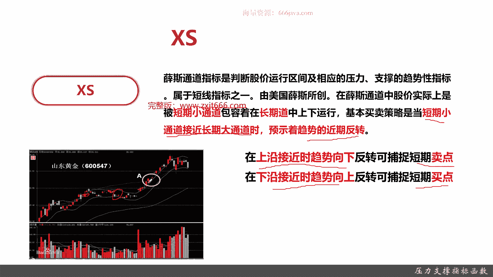
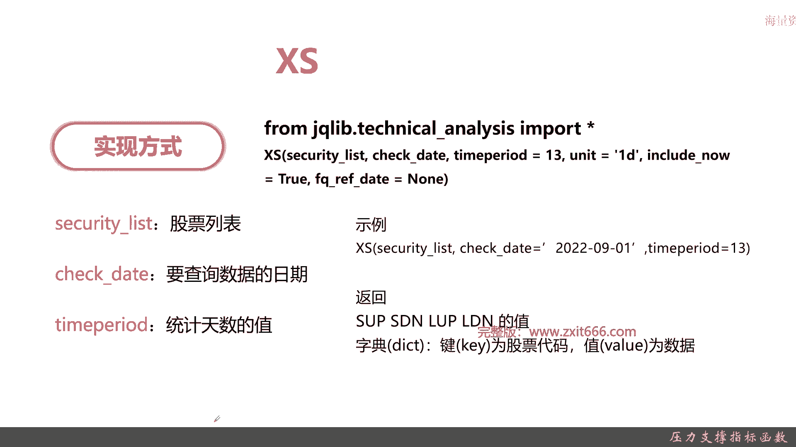
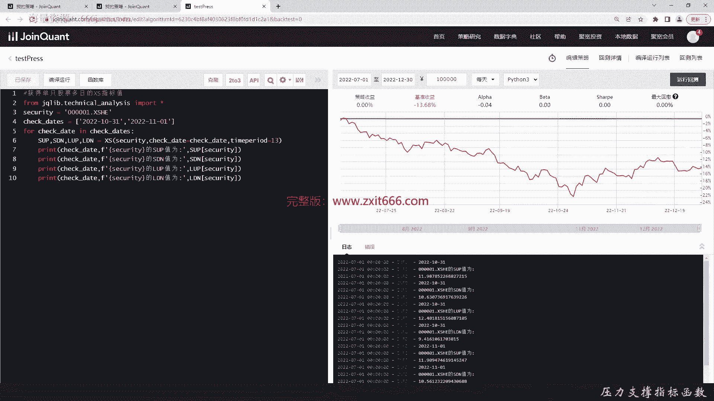
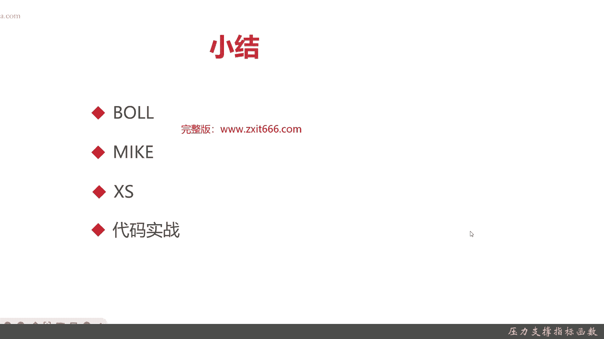

# 基于Python的股票分析与量化交易入门到实践 - P45：10.7 Python量化择时--技术指标函数_压力支撑指标函数 - 纸飞机旅行家 - BV1rESFYeEuA

大家好，我是米铁，在上一节呢我向大家介绍了反趋向指标，那么这一节呢我给大家介绍一下压力支撑指标，本节呢我将从以下四个方面给大家介绍一下，压力支撑指标，首先给大家介绍一下，之前介绍很多次的布林带指标。

接着呢给大家介绍一下Mac指标，最后是老样子，代码实战好，首先呢我们给大家介绍一下布林带指标，布林带其实也有人叫布林线，他是约翰布林先生创造的，它主要是呢求出股价的标准差，注意是股价标要差及其信赖区间。

基本上都是统计学的原理，然后从而确定股价的波动范围及未来走势，注意他是利用一个波带，它是个带状的，显示股价的安全高低价位，所以它会被别人称为布林带，那布林带的上下限范围其实是不是固定的。

因为它是根据股价的标准差来确定，所以这个范围是不确定的，它会随着股价的滚动而变化，好我们给大家介简单介绍一下不应单的算法，它不应带有三根线，一个是中，一个是中间线，一个是up线，一个是down线。

up线就是上下那个呃，上面那根线，down线就是下面那根线，然后那个中间线就是中间那根线，那中间线呢一般都是取20日均线，那上面那根线呢，就是20日均线加20日的收盘价，那下面那根线呢。

就是20日均线减去20日的收盘价，这也就是说呃，这也就是布林带，为什么它会随着那股价波动范围，进行一个上下范围的变化，而且上下限是不固定的好，这是常见布林带的样子，可以看到这里就是上面那根线。

这里呢就是中间那根线，这里是可以看到步云带，一般来说它其实是有一个范围的变化，你看像这里，像这个区域明显就比这个区域布林带更加的宽，那布林带收窄其实是有一些业务意义的好，接下来呢我们给大家介绍一下。

布林带的具体的应用方式，股价上升穿越布林带时额上限时回档几率大，接着是股价下跌穿越布林带下线时，什么时候什么时候可以，就是一个卖出几率，就是上升穿越不应带上线，那下跌穿越不应带下线，那就反弹，然后呢。

当布林带震动，整个布林带变窄的时候，就表示布林带变盘再起，OK我们可以再简单的回到上面，上面这幅图可以看到，其实这里这里，这里这里都是一些买入和卖出的机会，比方说销售这里不应该收窄，那其实就是一些变盘。

那么我们给大家简单介绍了一下，布林带的算法定义，还有它的应用，那么接下来呢给大家介绍一下布林带的代码，实现，不一样的实现方式呢，和那个之前的一些技术指标，实现方式也是一样的。

它就是第二需要调用技术分析这个函数库，那他呢只要那个调用这个green bds这个函数，就可以了，那它有一个有几个特定的参数，一个是period x是均线，一般呢就是取20，然后呢是那个NBD。

Nb devil up，然后呢nb df down这两个参数，这两个参数呢就是他的中轨线的X倍差，一般取二，好，那么接下来给大家看一下布林带的代码示例呃，这个一目了然啊，一般period的就是取20。

NBA取二，然后down等于取二，那他返回上轨线，中轨线和下轨线，那具体的返回形式呢，和参考其他的那个技术指标的参数，就是一个字典key和value好，这是布林带，接下来呢给大家介绍一下Mac指标。

Mac指标全称就是Mac base，它是一种股价波动幅度大小而变动的压力，支撑指标，它设有初级，中级和强力三种不同的支撑和压力，每一个支撑和压力的这个它有一共有三级指标，那其实呢它一般是六个压力线。

那具体的Mac指标算法，我们先给大家介绍一下，他呢有三步计算，第一步呢要是要求计算出真实实出TBY，然嗯TPY求出来的呢，然后就要求出那个Mac的三条指标线，那它分别有WR嗯。

M2和SRW呢就是wk的缩写，M呢是mi呃，middle中间的缩写，那个S呢是strong就是上面的缩写呃，具体的算法可以看到它下面，然后这个呢是那个，上面的压力线，然后呢这是下面的支撑线。

这个呢上面的是那个压力线的算法，下面的是支撑线的算法，可以看出，基本上压力线和支撑线的算法其实差不多，一个是W2，然后对应的就是WSM2就是MS，然后S2就是SS，它的图像呢一般是这个样子。

上面只是给大家一个参考和作图，稍微有些模糊，这个不是重点，重点是现在的很多的那个选股支撑软件呢，它返回的是这样，就是一个表格，因为呢Mac指标它其实是有六根线，如果这六根线全部展现在一起。

其实可能会比较乱，那一般呢它就分压力和支撑，压力啊，分初级中级和强力，对应的是那个WRM2和S2，支撑呢也分初呃，初级中级和强力，那对应的是WSMS和SSS好，接下来呢给大家看一下。

那个麦克指标的具体应用，首先呢Mac指标和其他指标都不太一样，他的指标返回的数量比较多，一般有六条曲线，分别是上方的三条压力线和三条，下方的三条支撑线，分别对应的是之前的week mid和strong。

当，股价脱离盘整，朝下跌的趋势前进的时候，股价下方三条下线为其支撑，参考下，那首先给大家解释一下什么是盘整，盘整其实是一个那个量化的，或者是一个股票炒股的术语，一般来说股价有三种方式，一种是上升。

一种是下压，还有一种是盘整，盘整呢你可以理解为是一种震荡呃，或者是平盘的一种趋势，它的一般呢参呃，一般是指波峰和波谷呢，差异价差不超过15%，当然了，也有的那个也有的业内同行认为。

20%是一个盘整的区间，但是呢这个都不要紧，它主要是在股价呢在一个震荡区间内，而且震荡区段额区间不高，波峰和波谷呢一般是在15%左右，在股价脱离盘整，开始往桥下的下跌的趋势的时候。

这个时候股价的亚方三桥的支撑线，Mac的支撑线就有意义了，就分别是它的不同的强中弱的支撑参考价，当股价脱离盘整的时候，那个朝上涨的时候，上方的三天下下线就是压力的参考价，然后，就是麦克琴呢还有个特点。

就是股价在往压力线方向上涨的时候呢，他的下方支撑线是不具有参考意义，相同的股价往支撑线方向下跌时候，上方的压力线不具有参考意义，也就是同学们记住Mac这个指标呢，就是一般来说三条线啊，一般用的六条线。

只有三条线是有用的，然后呢盘整区间呢，也就是股票在股价在震荡的时候呢，其实麦克的那个压力其实也不是特别大，能而且他也不是那么很明显的，他有买进啊和卖出的信号，OK这个就是Mac指标。

接下来给大家介绍一下Mac指标代码实现方式，同样的Mac指标也是用那个技术分析库，然后呢它的函数名就是麦克，然后他的特殊参数呢只有一个period，就是统计的天数值，然后呢右边是Mac的具体的样例。

然后它有它有六个线，它会仿真strong，然后mid2wake r，Wake s，mid s和strong s，然后他也返回一个词典好，最后呢给大家介绍一下呃，寻思通道，XS就是学习工程的缩写。

薛斯通道是判断股价运行区间及相应的压力，支撑的趋势性指标，注意薛斯通道也是短线指标之一，他是呢由美国的一个薛斯先生，他创造的迅速通道有两个，有它既有短期小通道，还有一个长期通道。

具体买卖策略呢是当短期的小通道，注意是要短期小通道接近大二，长期大通胀时，就可能预示着趋势的近期反转，可以看到吗，那它它上面有个短期的小通道，然后这里是长期的大通道，其实就是不同日的均线，当然了。

额血色通道的算法额相对来说呢，嗯业内有多种版本，那而且呢相对来说比较复杂，在这里我们就不详细给大家介绍了，我们给大家介绍一下学术通道的一个应用方式，那学速通呢在上沿接近的时候，趋势向下反转就是短期卖点。

而上沿接近的时候，趋势向上反转是为短期买点，就看股价了，它是在上演决定趋向，趋势是向下突然反转，那就是个短期的卖点，而在下沿曲线接向趋近的时候呢，比如说像这里向上翻转可以补充为短期的买点。

我们可以把这个图给大家给标出来，那比如说这里和这里还有这里，好吧。

这个其实就是血色通道的一个应用，那么接下来给大家介绍一下，学速通分的的实现方式，一样的，学速通呢也是技术分析库的一个重要的指标，它的函数名就是xx学S，那它有呃一个特殊的函数呃。

特殊的参数叫time period，那其实就是学生通道的一个基本的统计日期，那学术通道呢具体样例是这样，他返回四个值，S up s down，就是短期的上眼和下眼，然后呢是长期的上沿和下沿。

然后它的返回呢也是那个字典dictionary好，那么接下来呢我们进入代码实战环节。

首先呢我们给大家介绍一下布林带的实现，还有老样子，我们先把一些那个函数给声明一下，引入技术分析库，这次呢我们看600031支持，还是三一重工啊，因为我们要多期额日期嘛，所以我们就是个list。

连续三天吧嗯，好便利时间，那他分别是up布林代码，三根线，然后他是参数，首先是time period，Nb devil up，然后是当，好那么接下来把结果打印一下，嗯我们都把一些参数给多打印点吧。

format一下，好上轨道的好了，这下面是个中轨道，最后是下轨道，我们检查一下，然后哦这拼错了，最后运行一下测试一下结果，可以看到布林带这一支三一重工，在二零2022年10月31号，10月10。

1月1号和11月2号上中下三个轨道值，好，那么接下来呢我们再看Mac写，也一样吧，就不是三天了，斯科里还是这个三一，那我们这次就两天，他的线比较多啊，我先把上限给求出来，因为他们这个呢是Mac呢。

是先两个week先输出，那我们也是跟那个里面一样，他只有个time period，其他参数就删掉，好我们基本呢把code给敲完了，然后呢我们来验证一下，N period，一般是十吧。

好这个呢就是Mac指标运行的结果，那么接下来呢我们给大家实现一下削丝通道，老样子啊，那我们这次不用三一重工了，我们请出我们的老朋友，平安银行，时间呢也一样，那值呢应该是四个，S s up s down。

好这个呢我们就是13，然后，把短线通道设计完了，我们该，取出长线通道的值，好这些都打印出来了，我们保存一下，然后编译一下，看看结果，OK这就是薛斯通道在嗯，那个平安银行，在2022年10月31号。

和2022年11月1号，那个这两天的学速通通老值可以看到，短线的是这样的，长线长长线通道是这样的，短线的震荡幅度比长线的幅度大得多，好以上呢就是本节的全部内容。

那么接下来呢我们进入本章小结，本章我们给大家介绍了布林带，首先呢给大家介绍的是布林带，那布林带呢之前已经给大家介绍了，具体算法呢也都给你们给大家介绍了，那步音带有几个特点。

第一点呢它是一个根据股价的标准差，及其信赖区间，做一个浮动的一个带状波动的情况，波轮带的那个上限和下限范围不是固定的，它会随股价的波动而变化，当然他分上线中线和下线三根线。

然后呢当股价上升穿越布林带上线时候，回弹几率大，当股价下跌穿越布林带下线的时候，反弹几率大，布林带的震动，那个如果变窄的时候表示变盘，接下来呢我们给大家介绍了Mac指标，Mac指标的全称呢是麦克贝斯。

它是一种呢呃根据股价波动幅度大小而变动的，压力支撑指标，它呢有压力性指标和支撑指标两种，然后各呢分短初级，中级和强烈三种不同级别，一般来说，现在的那个很多股价软件呢，都不会把这六根线都直接放出来。

可能会比较乱，所以呢Mac指标呢，一般是用表格的形式给大家呈现的，然后呢他的算法相对其他的呢比较嗯，相对其他指标稍微复杂一点，液压原理，其实嗯他就是把压力和支撑又分了三级，然后呢Mac指标的比较特点呢。

就是首先记住同学们记住它有六条曲线，然后上方三条压力线，下方三条支撑线，然后它指当前纸张在股价脱离盘整盘整的，就是股价波动，振幅波峰和波谷在15%以内，就是说既不是向上非常明显，这既不是上涨非常明显。

也不是下下跌非常明显，那当股价脱离盘整朝下跌的趋势时候呢，股价下方的三条下线，就是整个股价的支撑线的参考，当股价脱离盘整朝上涨的趋势前进的时候呢，股价上方的三条线就是上限，就是它的压力参考的指标。

然后当股价就是无论是单边上涨，或者是无论是往压力线方向上涨，或者是往支撑线方向下跌时呢，他的那个另外的三条线都不具有参考价值，比方说股价往压力线方向上涨的时候，下方的支撑线不具有参考价值。

当股价往支撑线方向下跌的时候呢，上方压力线不具有参考价值，OK给大家介绍，麦克呢给大家介绍了，后来又给大家介绍了一个学速通道，这是很常见的那个判断股价运行期间的压力，支撑指标。

它也是一个经典的用来做短线的指标，他就是呢美国一个薛思嗯所创，然后呢它有它的特点呢，是有一个短通道和长通道，短通道和长通通道都分别是有上限和下限，它的基本的策略是呢，呃当短通道接近长通道的时候呢。

预示着趋势进行，就是股价的变化，趋势啊会进行反转，当股嗯它的应用呢是当股价在上沿呃，股价的上沿接近那个趋势向下的时候，反转可能是捕捉到卖点，注意啊，在那个上股价上演接近趋势时候，向下反转就是一个卖点。

但股价在那个学速通道的下沿，接近趋势向上反转就可以摆出呃，可以捕捉到短期的买点，呃后面呢我们给大家进行了代码实战，然后那个布尔迈克和薛斯通道呢，这三个函都是分别的函数，然后呢其中布尔嗯它有特殊的参数。

有三个，一个是time period，就是X日均线，然后呢还有n b a devil up，它是计算布林带上轨线的指标，主要是呢表示人呢中轨线的几倍的标准差，一般取二。

然后nbd deo down呢是下轨线作用的指标，主要是呢算中轨线对于X倍的标准差，一般也取二，这是布林带特殊的情况，然后Mac指标呢它的函数就是Mac指标呃，函数名就是Mac。

它有个特殊的呃特殊的参数就是time period，最后是薛斯指标，那削丝指标呢它的特殊的函数也是time pre的，一般呢是13，然后呢具体的那个返回呢根据那个布林带呃，它是返回三个参数。

然后Mac返回六个，JS返回四个，具体呃，具体的可以感兴趣同学再去看一下，之前的后面的代码实战来进行一下复习，好以上呢就是本节的全部内容。

我是米tea。