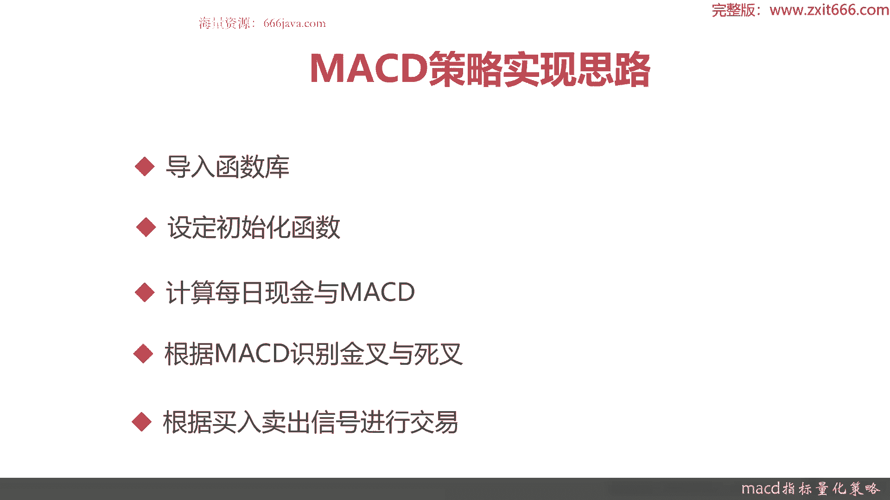
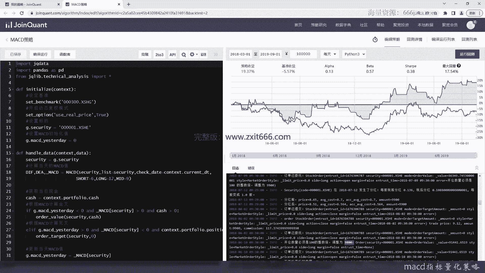
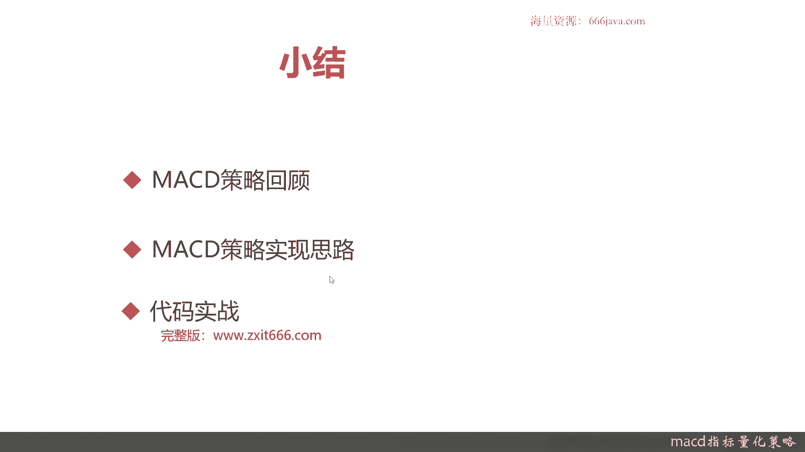

# 基于Python的股票分析与量化交易入门到实践 - P48：11.2 Python量化交易--策略回测实现_MACD指标量化策略 - 纸飞机旅行家 - BV1rESFYeEuA

大家好，我是米铁，在上一节呢，我向大家介绍了量化交易策略的，整体的回测流程和每一步骤，也给大家演示了，如何去通过使用区块量化交易平台，对我们已经写好了一个量化策略呢进行回测。

那么这一节呢给大家首先简单介绍，并且实现一下MACD的量化策略，然后呢在本章的后续内容呢，我们都会拿这个量化策略来做一些回测的，知识点的讲解和实验，本节我们将从三个方面给大家介绍一下。

MACD量化交易策略，首先我们给大家回顾一下MDACD的策略，它的来源，它的作用，还有它的基本如何去识别它的，那个买入和卖出的信号，接着呢，我们给大家讲解一下MACD策略实现的思路。

最后呢就是coding实战环节了，好，那我们先简单先快速给大家回顾一下，MACD策略，MACD就是平滑异同移动平均线，它其实是一种呃移动均线，那是美国投资家杰拉尔德阿佩尔，在上世纪70年代末提出的。

它主要表示呢经过平滑处理后，均线的差异程度，一般用来研判股价的变化方向，强度和趋势，那MACD呢主要就是金叉和死叉的判断，那像这样在连续下跌以后，第一根红柱，那它就代表金叉，这是一个标准的买入的信号。

那在连续上涨以后，第一根绿柱，那就是死叉，就是卖出的信号，那MACD如何去判断金叉和死叉呢，当快线differ上穿到慢线D1A的时候，加强上红柱出现的第一天就成为金叉，他就是买进的时机。

当快线DIF下穿到慢线DEI的时候，绿柱出现的第一天称为死叉，是卖出空仓的时期，在这里呢我们就不给大家压，再重新去回顾快线和慢线的计算方法，以及MACD的方法，因为这一块呢，那个区块链化平台。

都会帮我们把底层的这些函数封装好，我们直接调用就行了，那么接下来呢我们给大家介绍一下，MACD量化策略，根据这些识别信号怎么去实现它，它具体的实现思路是什么，首先第一步。

那所有的量化策略都是先导入函数库，把一些基本的用到的那个量化指标啊，还有距宽的整体的量化回测的一些啊，量化函数啊，库啊都导进来，然后第二步他是设定初始化传输，那包括设定的股票基准啊。

然后我们一般是要用开启动态复权，我们把呃股票池也就是标的给设设计出来，最后我们要首先要把MACD它给设置一个初始值，接下来步骤就是实现MACD的策略了，其实也就是实现handle data函数。

那第一步要计算每日的现金和MACD，因为只有计算出了当日现金，然后再算出昨日的MACD呢，然后才能算出今日的MACD，因为他是个均线嘛，然后是根据每日的MACD呢识别出金叉与死叉，这个是关键。

因为金叉就是买入的信号，死叉就是卖出的信号，最后一步就是把order给实现出来，其实就是根据金叉和死叉进行交易，该买入的时候买入，该卖出的时候卖出，以上呢就是本节的基本的内容。

那我们下面进入coin实战环节。

这里呢我们建立了一个空的，MACD的策略的模板，那我们现在开始进入coin实战环节，首先我们要导入各种内库区，宽data是需要的，然后pandas也是需要的，这个智能提示有点问题。

然后我们再导入技术分析，这样MAACD实现起来就很方便，好接下来开始实验代码，首先我们要把初始化函数给定义好，首先设定基准，我们就拿沪深300来吧，那同学们还记得我们之前给大家讲解的。

ENGLISH的实现吗，要用到set benchmark函数，那就默认是沪深300吧，然后第二步我们开启动态复权，这个是set option，如果不记得，同学们可以回到之前的章节去复习一下。

我们交易按照实际的股价来进行交易，好第三节设定标的，那还记得记这个全局变量吗，那我们还是0001吧，用平安银行，当然了，你用个list也行，无非呢呃实现更复杂一点，那我们在本节呢考额相对考虑的说。

第一次给大家实现一个完整的量化策略，所以我们相对简单一点，然后设置Mac的初始化值，initialize好了，就是初始化好了，那我们接下来要定义什么呢，就是handle data，它有两个核心的变量。

context和data好，我们首先拿到security，这样可以传参，那这个同学们上在上一章的呢，我们给大家介绍过了，那这一章就快速实现了，它有三个返回值，它是一个security list。

我们还能输入一下，好那我们呢用全局变量每日的时间就不，这个时间就不强制了，就用每日时间自己来代替，然后MACD还有三个变量，Short，Long，最后一个是mid，好MACD每日的计算就已经好了。

接下来我们还要应该是要把现金给计算好，因为现金每日都会变化，因为这个区块链网平台帮我们封装了，那如果实际上我们自己要去写那个回测呢，我们得自己去根据每日的账户的实际的持仓，来计算它的现金部分。

Port context，点port flao，点cash，然后，计算金差，那同学们可以回忆一下其他怎么判断，那金差其实呢很简单，就是如果昨天的MACD为负，今日MACD为正，那就可以算是净差了。

当然你开始肯定要大于零啊，否则你是没钱买入的，不然你不判断这个，你就没办法判断好，那如果在这种情况呢，我们就要买入了，接下来呢我们要计算死差，那死叉就是卖出的信号，这个大于零。

那这样同学们会说另第三种情况怎么样呢，那其实那你不做交易嘛对吧，好，这个，有点长啊，这个变量我们持仓的该股的，就是这个时候你死叉的时候还有持仓，然后可以被卖家卖出，当然了，如果你MACD是死叉。

但是你在你的那个账户里面没有这只股票，那就没办法出额平仓嘛对吧，这个就是根据识别信号，你还得判断一下是不是要，要不要是不是要把手上的那个股票给卖出，好这就判断这只股票手上的账户里面。

这只股票是不是还有手术，这个时候就要卖出了，Or der target，好卖到零，好买入和卖出都卖，那你每天都要重新更新一下MACD，保存至昨天吗，好我们再检查一下，我们再检查一下这个呢。

由于区块链网络平台，已经帮我们实现了底层的MACD的算法，所以我们可以少写很多代码，同时像一些股票的持仓下单函数，也已经帮我们封装好了，那我们只需要专注于识别MACD这个策略的，量化的交易信号就行了。

只需说白了就是要识别金叉和死叉，那识别金叉和死叉以后，做出相应的交易的动作就OK了，那我们代码呢已经敲完了，那么接下来呢我们就看一下MACD，具体的回测情况，好检查一下，好可以看到。

这个是实际的运行情况，假设我们回测是2018年3月1号，到2019年9月1号，在这里基准这段时间其实是亏的，亏50%，但是我们可以看到，我们这策略到了2019年的这个时间点是。

2019年的那个1月29号开始，我们就整个就开始挣钱了，那最终我们将近收益20%，这大概一年半的时间，我们大概收益2万块钱，当然这是历史的回撤情况，然后可以看到这里是我们每次每一个交易日。

我们下单的一些结果，看到了2018年3月1号到3月29号，实际上都没有满足那个MACD金叉和死叉的情况，那到了2018年3月20号开始，那就开始有开仓了，就可以先正式下单了，然后，后面就开始有平仓。

有那个继续有买入，也有开仓，那其实你们看中间还是到，2018年7月12号，涉及到这只股票分红，那分红也会由于你的复权，你用的是复权真实的价格，那你复权后股价就发生了变化，你看我们的那个从这里看。

我们的那个账户的那个呃，持仓数量也会不断的在发生变化，这一节我们仅仅只是为给大家介绍一下，怎么去实现这个MACD的量化交易策略，那在接下来的章节里面，我们会给大家详细介绍如何去去排查。

去发现我们回测中的一些结果和问题，然后回测常用的哪些指标，更能说明我们这个策略到底是写的好还是不好，那么接下来呢就进入我们的本章小结。

我们本章呢主要就是给大家介绍了，如何通过区块链和平台，通过代码我们来实完完整整的实现MACD呃，量化交易策略，那首先呢我们给大家进行了MAACD，量化交易策略与回顾，M a c d。

这其实就是一个平滑移动均线，那它主要呢要识别金叉和死叉，金叉呢判断的方式就是快线上穿慢线，也就是他的红柱出现，第一天就是金叉，它是一个买进持有的时期，然后快线DIF下穿慢线，就是绿柱出现。

第一天就是一个卖出的空仓的时机，根据这个时期呢，大概率你是赚钱的，但是呢我们可以从我们刚才看到的那个结果，我们用了大概一年半的时间，也不是每一笔交易都是挣钱的，这个呢只是一个量化的概率统计好。

然后接下来呢我们给大家介绍了，MACD策略的实现的思路，第一步导入函数库，函数库呢一般在MACD这个策略里面呢，就是据宽data pandas as，还有一个技术分析，第二步呢设置初始化的函数。

其实就是实现initialize，那它包括设定基准，开启动态复权，然后设定我们的标记股票，同时我们设定MACD的初始化值，然后第三步是计算每日的现金和MACD，那这两块呢因为有区宽量化评分。

都把我们都封装好了，比如说MICD就直接调用MICD的函数，然后呢取当日现金呢，其实就是根据context里面去尝试potter flao，其实就是你的账户的现金值，他就帮你算好了。

不需要我们自己额外去实现账户余额，第四步就是根据MACD值识别金叉与死叉，金叉呢再通过MACD识别起来很简单，那你只要那个昨日的MACD值小于零，且今日MACD大于零，那就是金叉了，但是你要是交易的话。

同时你的账户里面的现金余额你必须大于零，你才能交易，甚至更严谨一点，你可能要大于定于一值，就比如说你的目标股价，你至少能要能买一手吧，一手是100股，当然了，这块呢区块量化平台会帮我们判断。

你如果剩余的账户的钱不够，他会不允许你交易，那我们在我们的这个策略里面，没有去写的这么细，那没有进行交易的呢，我们还要去取消订单，巴拉巴拉，我们暂时没有，然后呢是识别死叉，死叉呢其实识别起来通过。

因为我们MACD值已经取出来了，所以识别起来也比较容易，那死叉是什么呢，昨日的MACD值为正，且今日的MACD为负，那就是死叉，那如果出现了死叉，同时我们的那个账户里面，这只股票其实也是context。

点a portfolio，这个对象里面有个position可以取到这股票值，然后呢关重点是这支股票的金额呢，可以还是大于零，就是你还有持仓吗，那就要把它给卖出，平仓，把它卖为零，调用的呃。

order tt那个security0呃，这个函数就可以实现了，最后一步我们是要记录当天的Mac地址，因为每天都会刷新嘛，然后我们把通过代码实践，给大家进行了实际的讲解，好的。

那以上呢就是今天的全部内容，我是米tea，大家下期再见。

