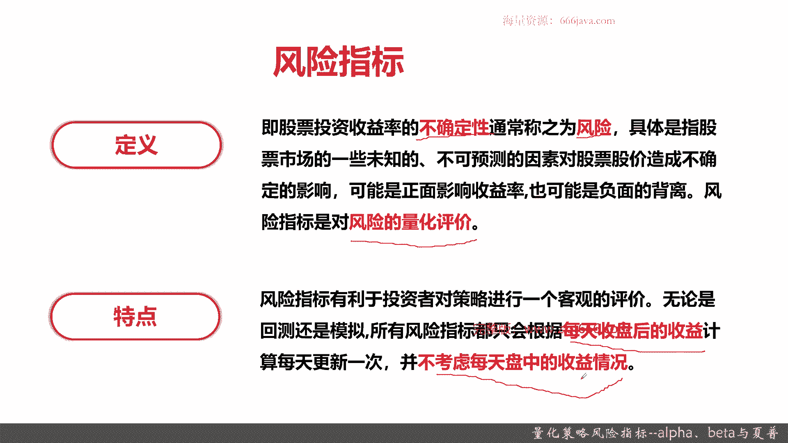
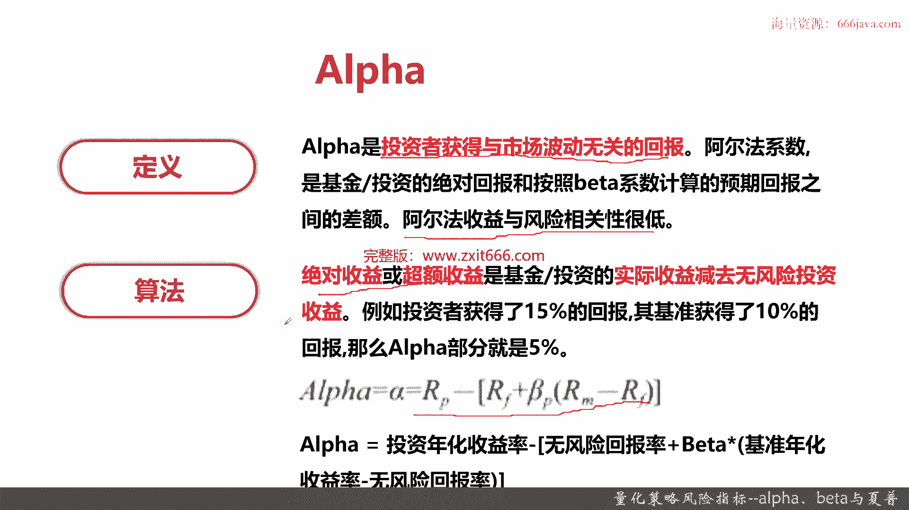
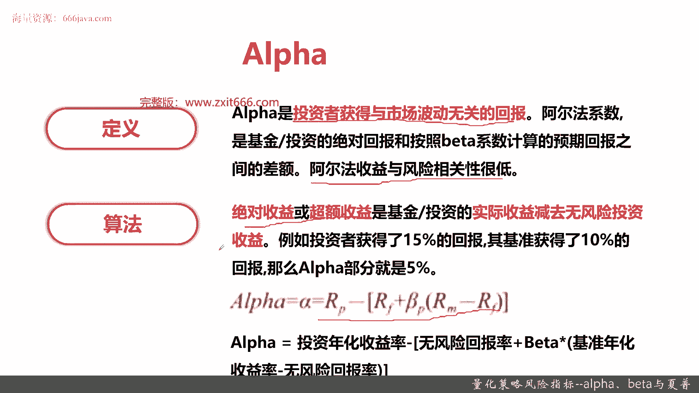
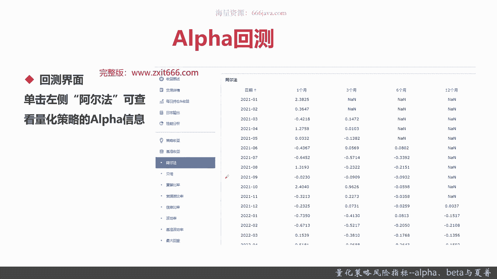
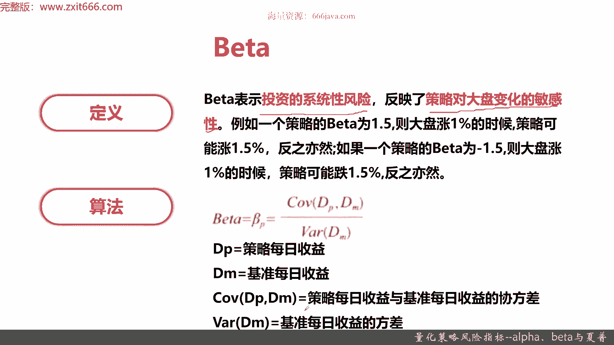
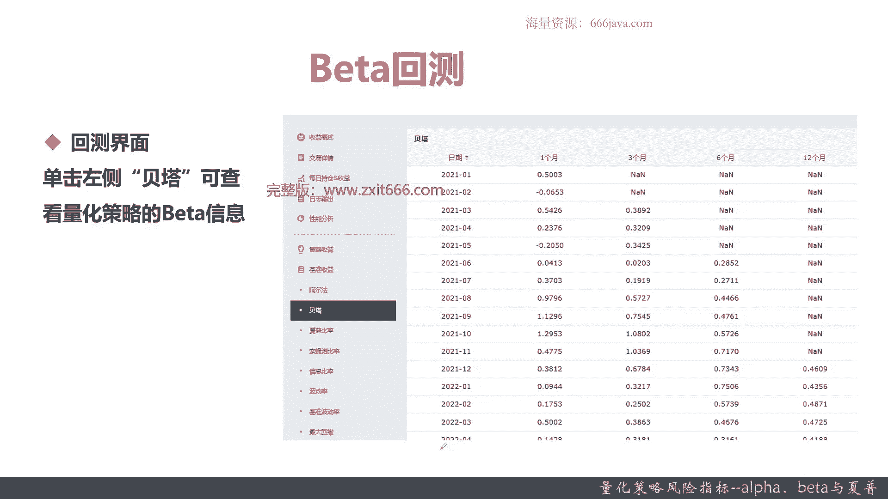
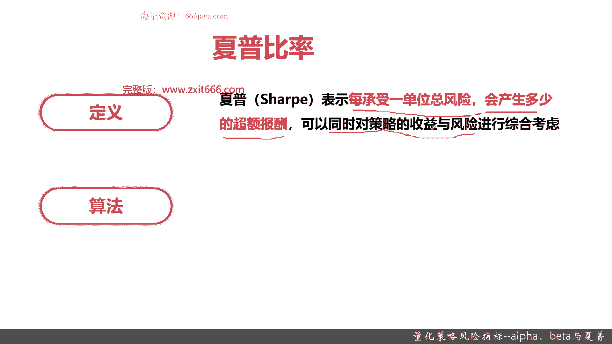
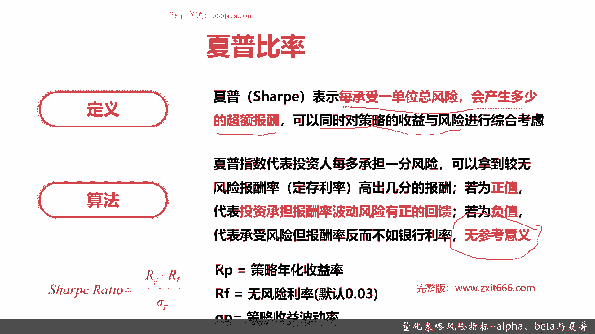
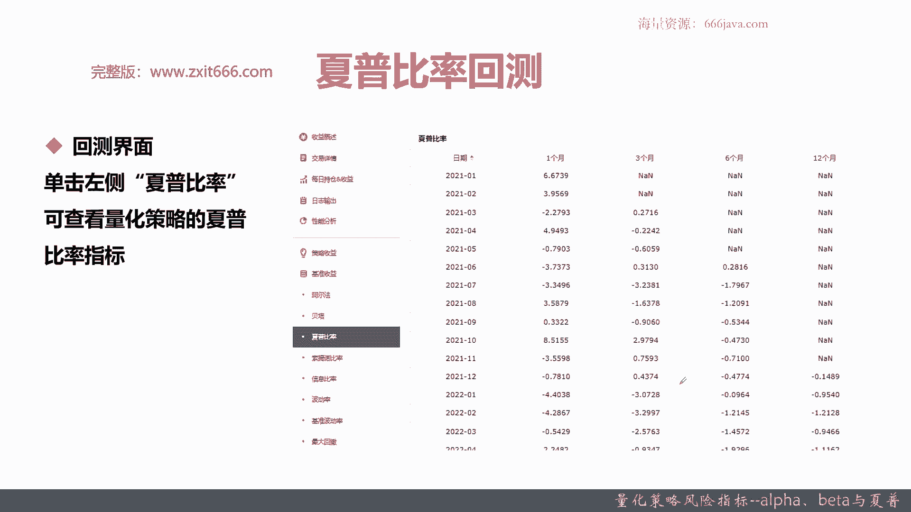
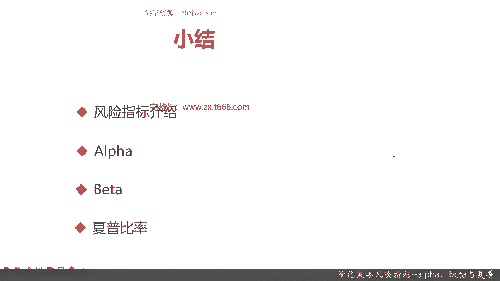

# 基于Python的股票分析与量化交易入门到实践 - P49：11.4 Python量化交易--策略回测实现_量化策略风险指标--Alpha、Beta与夏普 - 纸飞机旅行家 - BV1rESFYeEuA

大家好，我是米tea，在上一节呢我们给大家讲了，如何通过区块量化平台呢，给大家进行MACD这个量化策略的回测，那么这一节呢开始，我将向大家详细介绍一下，量化回测所用到的风险指标。

风险指标呢因为涉及的种类比较多，我们也不可能给大家讲解所有的风险指标，我们这几节呢，将给大家讲解一些常用的风险指标。

本节呢我们将从以下四个部分，给大家介绍一下量化回测的风险指标，首先是风险指标的总体介绍，接着呢我们给大家介绍一下阿尔法，然后呢是贝塔，最后呢也是一个常见的风险指标，夏普比率好。

那么接下来呢我将向大家介绍一下风险指标，首先给大家介绍一下风险指标的定义。

首先我们要给大家介绍一下什么是风险，风险其实就是股票投资收益率的不确定性，就是风险不仅仅是股票投资啊，基金债券那个期货等等，重点是不确定性，就是说你既可能去领盈利，也有可能那个亏钱，那这就是风险。

然后呢，风险具体是指股票市场的一些未知的，不可预测的因素，比如说俄乌战争等等，对股票股价造成的不确定性影响，那可能是正面影响，也有可能是负面背离，那嗯给大家介绍了风险以后呢，风险指标就好理解了。

风险指标就是对风险的量化评价，那么以后同学们理解一下，风险指标就是对风险的量化评价，好接下来呢给大家介绍一下风险指标的特点，风险指标有利于投资者对策略进行客观的评价，那无论是回测还是模拟。

所有的风险指标，只会根据每天收盘后的收益计算，然后呢每天它更新一次，并不考虑每天盘中的收益情况好，这就是风险指标特点了，它仅仅只会在你这一天结束以后，进行风险指标计算，而且每天只会更新一次。

他不会考虑每天的盘中嗯，你比如说一秒钟交运一次啊，那可能有的同学会问，他的风险指标会不会一秒钟变一次，不会的，无论你今天交易了多少次，它的风险指标它只会发生一次变化。

OK以上呢就是我给大家介绍的风险指标。

定义和特点，那么接下来呢给大家介绍一下阿尔法，首先给大家介绍一下阿尔法定义，阿尔法是投资者获得与市场波动无关的回报，就是说无论市场大盘上是涨了还是跌了，那我阿尔法都能获得一定的收益，这个就是阿尔法。

阿尔法系数是基金或者股票投资的绝对收益，其实绝对回报就是收益和按照贝塔系数计算的，预期回报之间的差额，绝对收益呢就是你赚了多少钱，那赚了多少钱减去那个呃贝塔系数的差异，贝塔是什么，待会给大家介绍啊。

贝塔其实就是和风险相关的一些收益，那之间的差额就是和风险无关的波动率，注意记住话，阿尔法收益与风险相关性很低，几乎没有关系，阿尔法收益就是和风险无关的收益，那么阿尔法收益的算法是什么呢。

绝对收益或者超额收益，是基金或者投资的实际收益，减去无风险投资的收益，什么意思呢，阿尔法其实就是追求一个超额收益，就是你每天你这一轮赚了多少钱，减去无风险的收益，就是你的阿尔法了。

那比如说我们举个例子啊，投资者一共收了呃，一共赚了15%，那其中基准或者无风险收益，是10%的正收益，那么阿尔法就是15%，减10%等于5%，这就是阿尔法，那阿尔法公式是什么呢，就下面RP减去括号。

RF加上贝塔乘以IM减RF括号，这个分别各个变量是什么意思呢，阿尔法其实就等于投资的年化收益，那RP就是年化收益率，然后RF就是无风险回报率，那无风险回报呢，一般都是默认都是以国债为那个就是投资风险。

一般现在呢是3%，那以前是4%，这个每年会变化的，然后呢还要加上贝塔乘以基准的年化收益率，减去无风险回报率，你这个IM其实就是你的你选定的基准嗯，同学们还记得，我们之前在做所有的那个初期设计的时候。

都会先选选择一个基准，因为其实阿尔法是个比较，你必须剔除基准的收益好的，那以上呢就是阿尔法。

那么给大家看一下，阿尔法在那个计划量化平台上怎么快速的获取，接下来给大家看一下阿尔法的回测，就是之前还记得那指标详情吗，点击阿尔法就可以看到阿尔法的详情了，96就是类似这样，一般来说它会有五列。

一列是日期，接下来分别一个月，三个月，六个月，12个月的阿尔法值好的，可以看到我们之前的那个MACD，在这段时间内，有的时候阿尔法是正的，有的时候阿尔法是负的，其实阿尔法负的呢。

就表示我们这个就没有超额收率，反而比这些基准的扣去，扣去风险以后还是亏钱的好，说完了阿尔法，接下来给大家介绍一下贝塔。

那首先给大家介绍贝塔的定义啊，贝塔表示系投资的系统性风险，反映了投资对大盘变化的敏感性，听上去非常学术，非常绕口，举个例子就可以了，如果一个策略的贝塔为1。5，那大盘涨1%的时候，策略可能涨1。5%。

反之亦然，如果大盘跌了1%，那经过这个贝塔处理放大系数以后，我们最后的收益可能就是负1。5%，如果一个策略的贝塔为-1。5，那就跟大盘是一个大盘是个负向相关，那大盘涨1%的时候，策略可能跌1。5。

那如果大盘跌1%的时候，我们策略可能是涨1。5，贝塔其实就是一个投资的系统性风险，它是一个系数表示，和大盘，或者是我们理解的那个系统的benchmark基准相比，它的风险和系数情况好。

以上呢就是贝塔的一些定义，那么好，我们给大家下面介绍，来介绍贝塔的算法，贝塔呢就是这样的，这其中呢有几个重要的参数，首先是DP，DP呢是策略的每日收益，然后呢DM就是你基准的每日收益。

然后co v m就是协方差，就是策略的每日收益，与基准的每日收益的协方差，然后YDM其实就是基准每日收益的方差，以上呢就是贝塔的算法，其实主要记住它，其实就是策略与每日收益，与基准每日收益的协方差。

比上基准每一日收益的方差，那具体协方差和方差的算法呢，我们就不在这里展开了，对感兴趣同学自己去查一下好，这个是贝塔的算法，那么接下来呢我们给大家看一下贝塔的回测。

点击那个汉字的贝塔，就可以查到策略贝塔的信息，那在我们的这个右边，这幅图就是我们之前MACD的贝塔的结果，这呢是贝塔，那么最后呢再给大家介绍一个非常常用的指标。

夏普之前呢同学们那个就是介绍的，阿尔法和贝塔，肯定经常听说，但是呢如果你不了解原理的话，根本不知道他们表达什么意思，而且呢一般阿尔法和贝塔呢它是一个表示，阿尔法其实表示的就是超额收益。

那贝塔其实表示系统风险，一般来说两边都是要一起用的，那么有没有一个指标可以记表征风险，又表征超额收益的好，那么这就是非常著名的夏普了，首先给大家介绍一下下部比例的定义啊，夏普英文就是SHARPE。

OK同学们记住非常非常常用的指标，包括很多量化机构，投资机构其实追求的都是夏普，夏普表示每承受一单位的总风险，会产生多少的超额报酬，超也或者叫超额收益，记住夏普是把风险单位化了。

你就是单位风险下获得的超额收益，这就是夏普，那这个指标强就强，在，它可以同时对对策略的收益和风险，进行综合考虑，那么接下来呢给大家介绍一下夏普的算法。

夏普指数或者叫夏普比例，代表投资人每多承担一份风险，然后呢就可以拿到他无风险报酬率，高出几分的报酬交口，其实就是呃就代表这个投资人承担了多少风险，然后呢它能产生多少的超额收益。

那夏普呢越高说明这个投资人水平越高，那其实就是像我们下面写的投资承担报酬率，波动风险有正的回馈，这个是非常学术，其实就是夏普越高越好，但是呢如果下普的值为负值，记住这里无参考意义。

因为这样会给大家看一下夏普的公式，就知道了，夏普这个比例如果是负值，没有参考意义，不要去考虑负值的算法，但是如果是正的，它是有意义的，夏普越高，证明这个投资人在单位风险的控制下，他的超额回报数取的越多。

或者你们可以理解为夏普这个比例，就是如果他是为正的，就证明这个策略性价比很高对吧，一般来说收益和风险成正比嘛，你的风险越大，你的收益越高，但是如果你的夏普越高，假如说都是一的收益，那你获得的风险就很少。

所以很很多情况下，投资人都是追求夏普这个指标好的，那夏普的公式呢也很简单，就是RP减去RF比上西格玛P，RP呢就是策略的年化收益率，IF呢就是无风险利率，一般来说是0。03，前几年的还是0。04。

现在因为每年国债的收益率都在变化，那就是0。03，也有的公式呢喜欢把这个常数变为零，这都OK，关键是西格玛是那个策略收益的波动率，后面几节我们会给大家详细介绍一下，什么是波动率和它的算法。

这个呢就是夏普比例。

接下来呢给大家介绍一下夏普的应用，夏普比例的回测，单击左侧的下铺比例，就可以看到下部的变化，可以看到我们的这个策略在一个月来说，一个月的夏普挺高的，但是死在2021年的3月嗯，基本上夏普就为负了。

没什么没什么用呃，2020年6月七月也没什么用，这个后面就没什么用，然后看三个月的夏普大多数其实都是负值，12个月也都是复制，总体来说我们这个我们这个策略呢，夏普其实不是特别表现不是特别好。

以上呢就是本节的全部内容，下面呢进入本章小结。

本章呢主要给大家介绍的，那是量化策略的风险指标的第一部分，首先呢我们给大家介绍了风险指标，风险指标的定义呢，其实首先同学们记住两个点，第一个就是风险，风险就是股票投资收益率的不确定性。

股票投资呢它会有一些未知的不可预测的因素，那他们这些未知的不可预测有可能是正收益，有可能是负收益，我们之前给大家举个例子，比如说俄乌战争，那对于进攻股呢，天上掉下来了，它就是让你涨涨涨。

但是其他股票消费股呢，那你就只能是莫名其妙跌跌跌了，所以这个就叫你不可控，就是风险，那风险指标是干什么的，风险指标就是对风险的量化评价，然后风险指标呢有个特点，它仅仅只会在每天收盘以后进行更新。

而且每天只会更新一次，他不会考虑每天盘中的情况，接下来呢，我们给大家介绍了常用的三个风险指标，阿尔法贝塔，还有一个夏普，首先呢我们给大家回顾一下阿尔法，阿尔法呢重点是关注投资者获得。

与市场波动无关的回报，那其实阿尔法就是人们常说的超额收益，就不管市场怎么变化，你都能获得收益，这就是阿尔法，阿尔法算法呢也很简单，其实就是实际收益减去无风险的投资收益，比如说一个投资者获得15%的回报。

那阿尔法呢其实就是这15%减去，整个你比比较业绩基准，比如说以沪深300为例，那沪深300，在这段时间获得了十十%的收益，那阿尔法就是5%，阿尔法公式呢也很简单，投资的年化收益率减去无风险回报率。

加上贝塔乘以基准年化的呃收益率，再减去无风险回报率，然后呢呃巨宽的量化平台呢，阿尔法回测就点一下阿尔法这个页面，它就会看到详情了，这里呢我们就不给大家再演示了，然后是贝塔。

贝塔呢其实就是表征的投资的系统性风险，举个例子，比如说贝塔为正1。5，那就证明我们的收益和大盘，或者和基准是正相关的，那大盘涨1%，那我们可能就会在1。5情况下，我们可能就涨了1。5%。

那如果大盘跌了1%，那我们就是一个放大系数，那我们就跌了1。5%，那如果我们和这个大盘，或者和我们的基准呢是负相关的，比如说-1。5，那大盘涨1%，那我们策略可能收益就是跌了1。5%。

那如果大盘跌了1%，那我们可能就涨了15%，贝塔就是一个放大系数，贝塔算法呢嗯跟相关性有关系，就是其实呢它是两个就是分子分母，一个是策略，每日的收益与基准每日收益的协方差。

这是分子分母呢就是基准每日收益的方差，OK这是贝塔，然后贝塔查看回测呢，就是在区块账号平台上点一下贝塔这个按钮，就OK了，那么最后呢我们给大家介绍了夏普比例，夏普比例是对我们无论是基金还是股票研究。

里面衡量策略一个非常重要的指标，很多投资人都用，它就是衡量自己的策略到底是不是有效合理的，那他的作用或者是定义是什么呢，它表征了每承受一单位的总风险，会产生多少的超额收益。

那其实呢它是综合了阿尔法和贝塔，所以这个指标非常有用，但是呢夏普如果为正直，夏普值是有益的，越高越好，那证明下普高的策略比夏普低的策略好，但是如果夏普为负值，它是没有比较价值的，同学们不用参考。

不用去考虑它为负值的情况，复值不用比就行了，公式呢，夏普的公式呢其实相较于贝塔来说，相对简单一点，就是策略的年化收益率减去无风险是利率，无风险利率呢一般是国债的收益情况，那一般呢现在默认是30。03%。

可能以后会越来越低，这个每年都不一样，然后呢再比上西格玛P，也就是策略的收益的波动率，一般是用西格玛这个符号，在金融量化领域呢，它表示波动率好，刚才给大家介绍了夏普比例的定义和算法。

那么最后呢就是下部比例回测，它和阿尔法和贝塔一样，都属于常用的指标，那所以呢也是点击一下左侧的相互比例，就可以了，以上就是本节的全部内容，我是米tea。

大家下期再见。