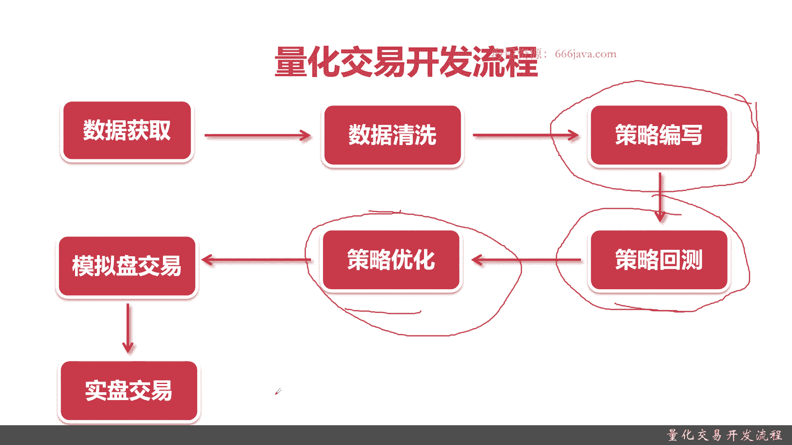
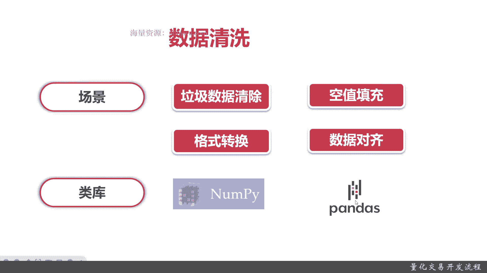
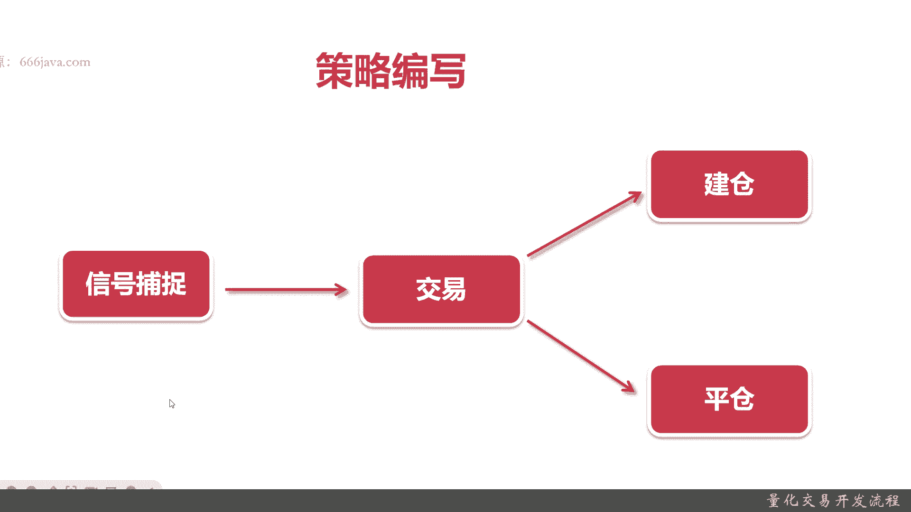
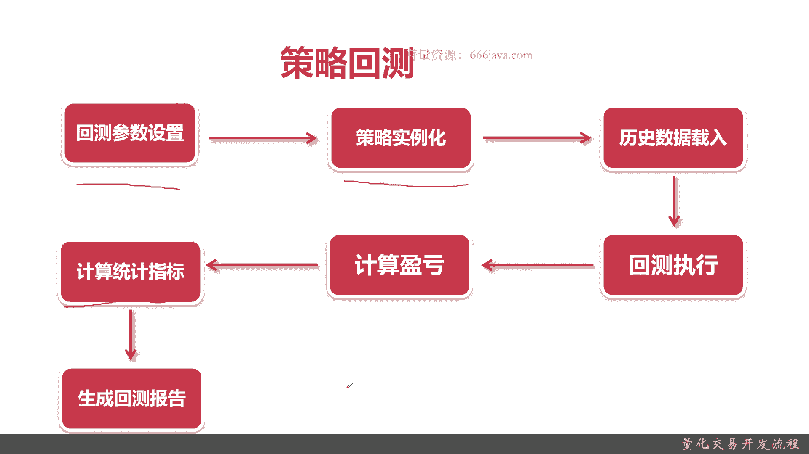
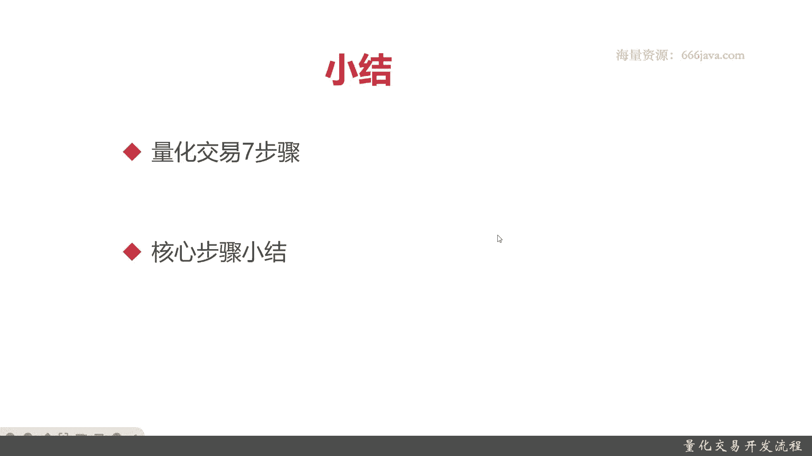

# 基于Python的股票分析与量化交易入门到实践 - P4：2.3 初识量化交易-必知的量化交易基础_量化交易开发流程 - 纸飞机旅行家 - BV1rESFYeEuA

大家好，我是METEA，在上一节呢我向大家介绍了什么是量化交易，那么这一节呢，我将向大家介绍量化交易的开发流程。

本节我们将从两个方面给大家介绍，量化交易的开发流程，首先我们给大家介绍量化交易总体的开发流程，分别是七个步骤，接着呢我们会给每个步骤进行详细的讲解好，那么接下来呢，我将向大家介绍量化交易的总体开发流程。

首先量化交易的开发流程，第一步就是数据获取，那量化交易，量化交易它的最核心就是量化，那量就是数据，你只有获取了数据，你才能进行量化，接着呢是数据清洗，你从各个数据源获取的数据，基本上都不是立即可用的。

你需要进行一些数据清洗，才能把它用作一些数据，然后才能进行下一步策略的编写，策略编写，其实就是量化交易里面最核心的步骤了，那么策略编写完了以后呢，我们将进行策略回测，什么是回测呢，就是对我这些策略。

根据历史的数据进行计算机模拟的统计分析，计算出它的盈亏情况，那策略回撤的效果稳定了，好了以后，我们要计算它的盈亏情况，那策略回测做完以后，通常第一次你的策略效果都不是那么好。

所以呢我们就要进行优化策略回测，策略回测，然后优化，还有策略编写，这三步其实呢是一个迭代的过程，只有当你的效果完全达到自己满意了以后，你才会进行下一步模拟盘，模拟盘是什么意思呢，呃从策略编写。

策略回测以及策略优化，包括前面的数据获取和数据清洗，那它都是一些基于历史已经发生的数据进行的，那模拟盘呢才是真正的未来的数据，才能真正的体现你的量化策略的好与坏，那在模拟盘之后呢。

你觉得嗯你的策略已经非常好了，非常OK了，那你就会进行实盘交易，实盘交易就是真正的真金白银投进去，然后通过你的策略给你进行赚钱，当然了，一开始肯定大多数同学都是亏钱的好。

以上呢就是整体的量化交易开发的流程，任何量化交易开发流程基本上都离不开这起步，那么接下来我们进入各步骤的详细描述好。

首先呢进行数据获取，数据获取的内容有以下几种，第一种是行情数据，第二种是宏观数据，第三种呢是财务数据，第四组呢是舆情数据，那我们一一给大家解释啊，什么是行情数据，行情数据其实就是股票的实时的交易数据。

你在那个债券呢有债券的行业数呃，行情数据，基金呢有基金的行业数据，在我们这里主要指的是股票的交易数据，就是比如每时每分每秒，那呃每只股票它的价格是多少，宏观数据呢主要指的是一些政策。

比如说国家对哪个呃行业比较重视，然后呢大力发展什么，这个是宏观数据，财务数据指的是各个上市公司它的财务报表，财务指标等等一些财务数据，余行数据呢跟前面几块的数据，对于股票的价格影响的不是那么明显。

主要是指一些上市公司或者板块的一些，正负面的舆情数据，还有对大家的各个股民，甚至市场对他的关注情况，以上呢就是数据获取的内容，接下来呢是方式方法，它的方式呢一般有以下几种，第一种呢通过了网站下载。

那网站下载，第二种呢就是客户端，第三种呢是三方API，最后呢就是爬虫，一般网站下载呢就是在我们的，比如说常见的那个呃用来做量化交易的平台，它都会有一些相应的，比如说行情数据啊，宏观数据啊。

财务数据运行数据的一些下载这块呢，它的数据一般适合批量的一次性下载，你如果天天要去下载股票的价格数据，你呃效率不是那么高对吧，第二种呢是客户端，客户端的方式呢，比如说你购买万德。

比如说你你用了同花顺或者是大智慧，在客户端里面也会有一些数据提供，第三种呢是那个三方API，这块呢适合于懂一些编程，同时呢一般来说三方AAPI都不是一些免费的，当然免费的ti也有，但质量可能不是特别好。

比如说出现的免费IPI或者是距宽的，免费的数据IAPI，最后一种呢是爬虫，爬虫呢对于技术要求相对来说较高，但是呢它不需要对第三方进行付费，不过呢他可能会如果你的数据要用作商业用途。

可能会出现一些那个授权的问题，那以上呢就是数据获取的内容和方式，接下来呢我们给大家介绍一下数据清洗，那数据清洗常见的清洗呢有以下几种场景，第一种呢是垃圾数据的清除，第二种呢是空值填充，第三种是格式转换。

第四种是数据对齐，那我们再给大家一一来解答，什么是垃圾数据的填清除呢，就是我们从三方数据源或者是网上，无论是爬虫，无论是你自己下载，那你肯定是有一些错误数据，那不要说那个就是各种公开的一些数据啊。

就比如说呃我们假设我们一些基金网站，那基金网站它在一些净值它会有每天公布的，但是呢像官网有的数据它都会公布错误，那这些垃圾数据是要被剔除的，还有一些呢是空值数据，什么意思呢，呃你的数据可能某一天。

比如说就拿那个股票的交易来说，你的数据呢在每一个非交易日它是没有价格的，那这个收盘价呢需要你自己去进行空值填充，然后格式转换呢，呃有的数据你拿一堆数据呢，比如说就拿最经典的一个时呃，时间类型。

它是一个字符串string类型，那你需要如果你在运行中运算当中，很有可能会要把它转成date或者date time类型，数据对齐，主要是各种数据源里面呃数据进行比对，比如说你既有万德的数据。

又有同花顺据呃，同花顺的数据，那这个数据呢都有某一只股票的数据，当然了，它可能时间段不一样，那你需要把这些数据进行对齐，同时选择最有效的数据，OK这是以上的数据清洗的常见的四个场景。

好接着呢我们给大家介绍一下数据清洗，常见的类库主要是南派和pandas这两个类库，相信同学们应该不会特别陌生呃，NPD主要是用来做Python的科学计算，各种数学运算很常见。

然后pandas斯呢主要是用来做时间序列的处理，金融这一块，尤其是量化这块对时间序列的数据要求非常高，那所以我们一般选用南派和pandas，来进行数据清洗好。

接下来呢是进行策略编写，无论是哪种策略，其实都是以下的这个流程，首先是信号捕捉，接着是交易，然后要么建仓，要么平仓好，那么我们给大家来再介绍一下什么是信号捕捉，就是说信号其实就是交易的信号。

无非你是买还是卖，那无论在什么条件或者场景下，你总会发现你需要买卖的时机，那这个就是信号，它可能是你的呃，你的目标的股票它到了一定的价格，也有可能他的那个某种那个指标。

比如说他的那个呃交易数量达到了多少，或者是夏普比到了多少等等等等等，这个具体是看你跟着策略不同，它的信号不同，但是一旦捕捉到了信号，你的策略的程序就应该自动，把你的相关的账号里面的股票进行交易。

那建仓就是买，平仓就是卖，那交易无非是两种吗，要么建仓，要么平仓，当然了，一般来说股票建仓和平仓也不是一次性的，全部清空的，也是根据量化，还有根据你的策略实际来进行的，OK以上就是策略编写最通用的框架。

那么接下来呢将给大家介绍一下策略回测，首先呢策略回测的第一步，它的流程是回测参数设置，接着呢是策略的实例化，再然后呢是历史数据载入，后面是回测执行，然后是计算盈亏，再接着呢是计算统计指标。

最后是生成回测报告，那分别每个步骤是干什么的，我给大家简单介绍一下，无论你是用通用的量化交易平台，还是你自己写的，甚至或者是用第三方的开源的框架，那第一步都是回撤参数，那回测参数呢。

包括不限于我回测了数据的时间的长度，然后涉及多少个股票，然后呢他可能你要选择哪些指标，那你这些指标的默认参数是什么等等等等，都可以算作回测参数设置，然后呢是回测呃策略的实例化。

那其实就是把你的写的这个策略，以参数的形式放到你整体的这个回这一次的，回车的运行的那个框架，其实大家都是那个会写，都是懂一些编程的那些，就相当于一个类的实例化一样，然后呢是历史数据的载入。

那你根据你的这些配置，那你就是应该loading你的历史数据了，那你这三部都是你其实主要你人能设置的，主要就是这两个，然后剩下的都应该是自动运行的，包括数据，历史数据载入。

其实就是为了看你的回测的那些数据，在你设置的回测参数下，那些历史数据载入以后就应该是回测执行了，主要是运行你的策略，那计算机或者是讲量化交易这个平台，这个系统它就应该自动的去计算你整个策略的。

赚了还是赔了，就是盈亏情况，那除了一些盈亏以后呢，要统计算一些统计指标，那统计指标呢可能在实际情况常见的，就不仅仅是一些盈亏了，包括波动率啊，包括你的胜率啊，包括下毒比啊，呃是阿尔法贝塔等等等等。

这个会我们会在策略回测那章详细给大家介绍，最后呢会生成一个自动的回测报告，让大家查看，那看看他你为什么赚了，为什么亏，就用我们的那个金融的那个这块领域的，常见的一些术语，就是比如说你的持仓是怎么样的。

你的归因分析是怎么样，你赚在哪亏亏在哪等等，这就是一个常见的回测的策略，回测的步骤好，那么策略回测完了呢。

接下来呢就给大家介绍一下量化策略的优化，首先常见的量化策略优化呢，你就必须重视交易费，因为量化交易量化交易很多都是中高频的，那可能是每秒甚至一秒几次交易，这块就会产生大量的交易费，首先你的策略优化。

你要考虑到交易费好，重视交易复位，下一步呢就是重视风险，重视退出，什么意思呢，就是你的策略总会有这一些黑天鹅事件，因为它是持续的，每天都会发生的，就比如说实际不发生，谁也不知道那个俄乌会打仗对吧。

然后呢一旦满足了你的收益情况，你要立刻的获利了结，进行退出，只要比如说你设置一个你股票涨，你设置一个止盈线，比如说涨20%，我就抛全部抛掉，或者你股票跌了，比如说我就设置一个20%。

或者30%的那个那个止损线，OK这就是中式退出，然后呢给大家提一下，优化无止境，就是量化交易策略呢你肯定需要优化，但是呢你不是一直优化下去，因为现实情况下谁也不知道是什么样子。

不要把过多的时间浪费在优化上好，这就是策量化策略优化这块，给大家下提的一些建议，接下来呢你当你不停地进行优化，然后更新了你的策略，同时不停的进行回测以后，你终于发现嗯我的那个量化交易策略比较好。

那我们要进行模拟盘交易，首先给大家提示过去表现并不表示未来结果，因为你之前无论是做策略回测，还是做你的策略优化，你都是只能基于策略的，整个较二市场的历史的情况来进行回测，发现你的表现的。

所以呢你一旦发生了未来情况，谁都不能保证会发生，未来会发生什么情况，所以过去的表现并不表示未来结果，用我们这个领域的话说呢，嗯过去的结果你分析总是对的，你未来结果谁都不知道。

或者叫事后诸葛亮其实都是一个意思，然后呢你要保持你的模拟盘交易，至少要在半年以上，它要持续稳定的，你才能继续实盘交易，不要同学们看个一两天或者两三个月，你都赚钱了，那你其实到时候亏的还是你自己。

然后呢模拟盘稳定收益要100%以上，才考虑实盘交易，就是如果你某一盘收益你都不能做到百分之百，那你说明你这个策略还有非常大的优化空间，好当你以上几点都满足以后，你就可以进行实盘交易了，那实盘交易呢。

首先，你要做好第一年会输的准备，因为呃量化交易虽然是计算机，在那个在进行执行，但是写策略的人是你的，你各种情况，你你会遇到各种你想不到的情况，那你大部分虽然你模拟盘，可能前面交易稳定半年以上。

都是盈利在百分之百以上，但是你还要做好第一年会输的准备，然后呢不要急于扩大投资，尤其不要一开始去增加杠杆这块呢，嗯对一些初学者也新入量化交易的同学们，非常有重要，你要把风险控制控制再控制。

然后呢是你的心态，其实量化交易重点就是你的心态，他要把人的无论是盈利的喜悦还是失意的，烦躁或者是恐慌，这些情绪都要抛弃掉，你完全就要把自己像一个量化系统来操作，所以你的心态最重要。

O那么以上呢就是本节的全部内容了，那么接下来呢进入本章小结，首先呢是量化交易的七步骤，它包括数据获取，数据，清洗策略，编写策略回测，策略优化以及模拟盘交易和实盘交易。

然后呢我们给大家每一块都介绍了核心步骤，那比如说数据获取，它有四种内容，然后四种方式，四种内容呢包括它最常用的行情数据，宏观数据，财务数据，还有鱼群数据，他的获取方式呢，你可以网页上下载。

可以客户端下载，可以通过三方API，也可以通过爬虫数据清洗呢，那比如说你可以去进行错误数据的过滤，空值的填充，然后那个数据格式的转换，还有你常见的那种数据对齐，那数据清洗呢。

主要是用到IPAD和pandas这两个类库，然后再接入步呢是策略编写，策略编写主要是你进行，首先你要进行交易信号的捕获，其实就是你的策略要能判断出交易信号，然后这个信号呢不仅仅是它的时间。

还有呢甚至还要包括你买多少，卖多少的一个数量，然后呢信号捕获完以后呢，就是交易，交易无非是买和卖，那用那个更加金融量化运选，其实就是建仓和平仓，后面呢是策略回测，策略回测，首先你要设置回测的参数。

接着呢你要把你的策略实例呃，实例化，后面呢其实基本上就是不是你的操作了，就比方说再接着呢就是历史数据的载入，然后策略的执行计算盈亏，计算各种统计指标，最后呢由系统会生成回测的报告，策略回测完。

下一步呢就是策略优化，策略优化呢其实和策略编写，还有策略的回测，它是一个呃不断迭代过程，直到你满意为止，但是呢策略回测一般常见的其实有以下三个点，一个是要重视交易费，第一第二个呢要控制风险。

尤其你要注意退出，最后呢不要无休止的进行策略优化好，那么等你的策略优化到差不多时候，你要进行模拟盘交易，那模拟盘交易呢也给大家有几点建议，或者是经验分享，首先呢你历史的表现是OK的。

但你不代表未来表现是OK的，所以你模拟盘交易是必须的，其次呢你要么有以下两种情况，你可以退出版模拟盘，其次呢你要同时满足以下两种情况，你才能进行模拟器，才能算你模拟盘毕业可以进入实盘交易了。

第一点你要稳定运行在半年以上，当然了，有的好的模拟盘甚至要稳定一年以上，第二点，你至少模拟盘收益要在百分之百以上吧对吧，最后呢是实盘交易，首先呢模拟盘成绩好的不代表你实盘交易好。

或者说绝大多数肯下实盘的，都是因为模拟盘的成绩好而进行的，但实际上呢未来是谁也预测不到，所以实盘交易呢第一年基本上要是要亏的，然后呢第一年实盘交易会亏的，然后呢不要盲目的扩大投资，稍微觉得自己赚了。

你就不知道不知道姓什么了，右尾巴就飘上天上去了，然后追加杠杆，那样亏的还是你，你要稳步的提升自己的资金池，最后呢是心态最重要，这个是实盘，其实最重要的，因为策略能保证你的程序系统的稳定性。

剩下就是你个人的心态了，好以上呢就是本节的全部内容。

我是米提亚。