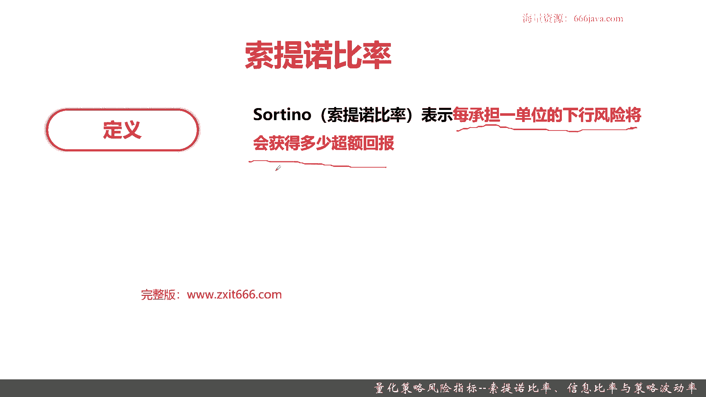
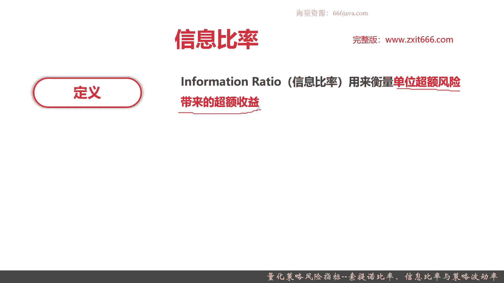
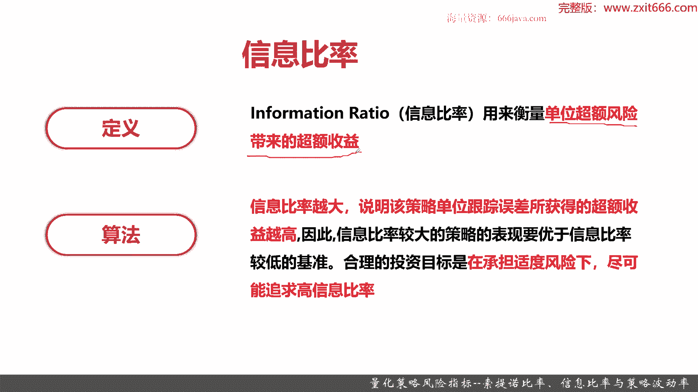
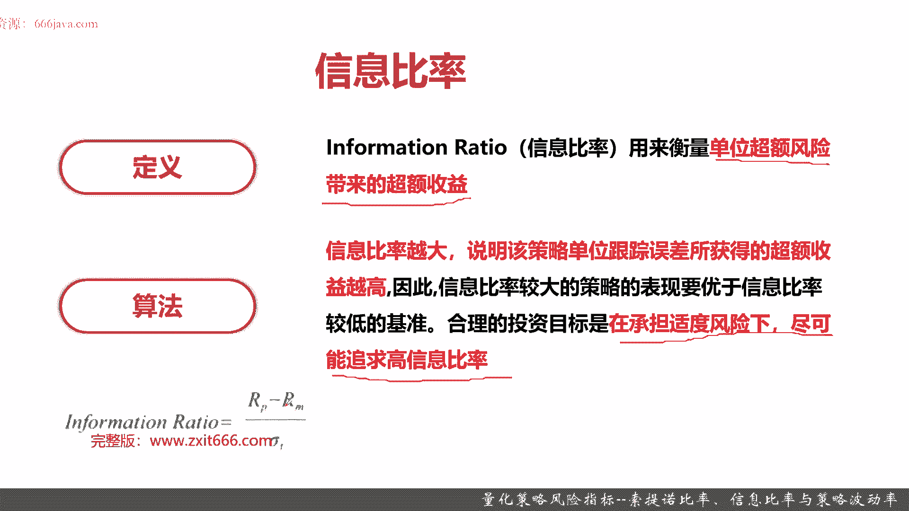
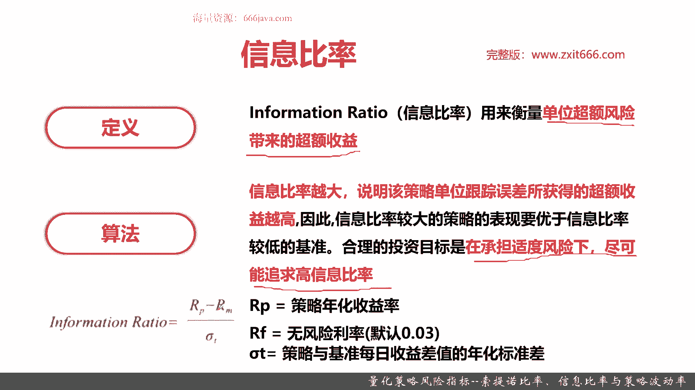
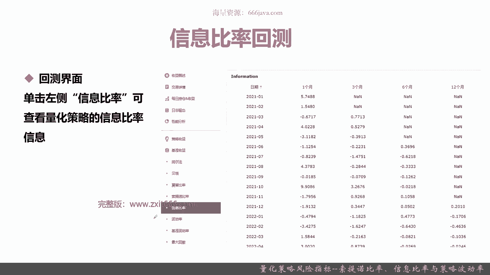
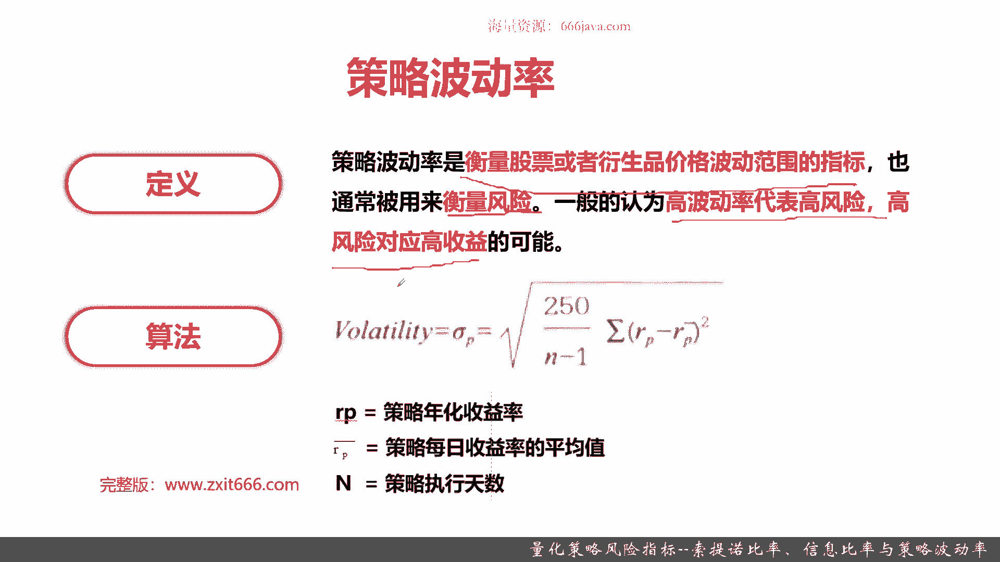
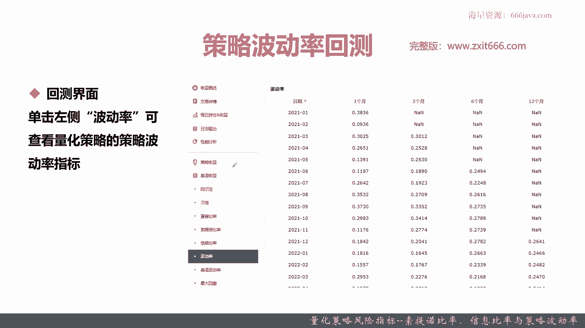
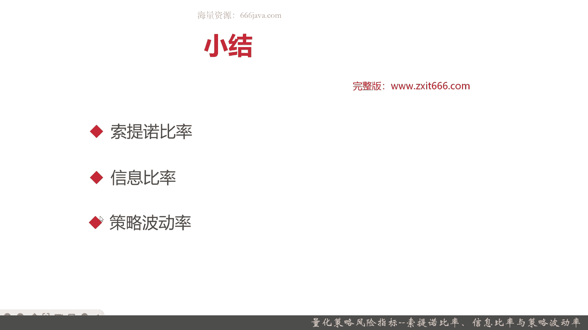

# 基于Python的股票分析与量化交易入门到实践 - P50：11.5 Python量化交易--策略回测实现_量化策略风险指标--索提诺比率、信息比率与策略波动率 - 纸飞机旅行家 - BV1rESFYeEuA

大家好，我是米提亚，在上一节呢，我给大家介绍了量化回测风险指标的第一部分，主要呢有常见的三个指标，阿尔法贝塔，还有一个夏普，那么这一节呢我们将继续向大家介绍，常用的量化回测的风险指标。

本节呢我们也是给大家介绍，三个常用的量化回测指标，首先我们给大家介绍索提诺比例，接着呢给大家介绍信息比率，最后呢给大家介绍一下策略波动率，那么接下来呢我们就进入风险指标的具体讲解。

首先给大家介绍一下索提诺比例，首先给大家介绍一下索提诺比例的定义啊，索性的比率表示每承担一单位的下行风险，记住下行风险将获得多少超额回报，那这个锁停顿比论很有意思啊，它其实一般来说和夏普是非常像的。

接下来给大家介绍的呢信息包括信息比例，其实和夏普也都很像，它的差异是什么呢。

它和夏普不一样的地方，就是夏普用的是总的策略的波动率，而索尼诺用的是下行的波动率，策略的波动率是一种常用的算法，那其实还有上行波动率和下行波动率，那么下行波动率呢表示什么呢。

表示这个收益它在向下进行波动的时候，会是什么样波动，其实它有波峰和波谷嘛，波峰这个波动那就是象形的波动率，而向波股进行波动，就是下行波动率，索提诺比率呢他就是考虑的是一个最差情况，就是下行的波动率。

一般来说下行波动率总是越小越好，上行波动率总是越大越好对吧，索提诺比例呢它的比例越高，说明承担相同单位下行风险时，能获得更高的超额回报率，所听的比例呢，它一般来说它是可以看作呢是夏普比例。

在衡量股票风险的一种修正方式，记住它是夏普比例，在衡量股票风险的一种修正方式，所以呢夏普比例其实应用场景非常广泛，所平均用的比例呢稍微少一点，因为他是一个修正方式，然后他的算法呢跟那个夏普比基本一致。

只不过呢他的西格玛不一样了，他西格玛PD那和夏普不一样的，就是它是C马pd pd是什么呢，其实就是策略的下行收益，那西格玛pd就是其实就是策略的下行波动率好，那么呢接下来给大家介绍一下。

索提诺比例的回测，索提诺比率的回测呢，和之前介绍三个参数是一样的，也是呢点击左边就OK了，那可以看到同学们看到没，这就是我们这个MACD这个呃，策略的所提诺比率，那么接下来呢给大家介绍一下信息比率。

首先给大家介绍一下信息比例的定义啊，信息比率它是一个单位的超额风险，带来的超额收益，同学们记住了，他们和夏普呢是有差异的，夏普呢是就是单位单位的总的风险，而所提诺它是一个下行的风险。

其实就是往往波谷方的波动嘛，而信息比它是指单位的超额风险，带来的超额收益，那什么是超额风险呢，风险之前给大家介绍了，就是你的不一些不可控的因素，那什么是超额风险呢，超额风险指的是除了大家都有的市场风险。

比如说一个黑天鹅事件，或者是政策风险或者经营风险，对于你的这个策略，或者你的这些选择，这些股票它特有的一些风险，比方说我们选的一些非常嗯就追的一些板块股，那它可能会有泡沫。

比如说在前几年一些那个中概股啊，还有团购股，甚至更早之前的一些人工智能股啊，还有03年的一些互联网股，这些它就有一些超额风险，那它主要超额风险指的是，主要是在特定板块或者特定行业的一种风险。

OK信息比例主要就是指衡量这个的，那它算法呢就是信息比例越大。

说明该策略单位跟踪误差所获得超额收益越高，这句话也比较绕口啊，同学们只要记住下面这个就是我们的投资目标，是指在承担适当的风险下，尽可能追求的高信息比例，就是说比如说我们换成普通同学们能听懂的。

就是我们泡沫比较少，那我们的信息比例肯定相对来说就越高，那我们就要追求这种情况，不然泡沫一爆好了，我们就没有了对吧，那么信息比例的算法呢，我们给大家介绍一下，它类似于夏普，也类似于呃。

也是以类似于之前的索提诺比例。

它无非不一样，就是分母，分母呢是西格玛T，西格玛T指的是策略与基准，每日收益差值的年化标准差，这个每日收益差值其实就是一个超额风险，OK这就是一个简单的超额风险计算，比如说它例子超额风险，同学们要理解。

其实就像刚才给大家举的可能就是一种泡沫，只有在特定板块才会出现那种情况。

接下来呢给大家介绍一下信息比例的回测，信息的比例的回测呢，也是单击左侧的信息比例就可以看到，结果就类似于这幅图，那么我们具体的指标呢，我和结果我就不给大家再展开了。

最后一个呢是策略的波动率，那无论是夏普还是索提诺还是信息，它其实分母呢都是跟波动率有关系，只不过波动率的具体算法也不一样，那具体什么是波动率呢，那么给大家现在给大家介绍一下。

首先给大家介绍一下波动率的定义，波动率其实就是衡量股票或者衍生品价格，波动范围，那其实就是你的涨和跌啊，它有个震荡幅度就是波动率，那波动率经常被用来衡量风险，一般认为高波动率代表着高风险。

高风险对于高回报，因为你可能有高回报嘛，但是你如果亏了，你就亏的更惨，那这个就是波动率的情况，接下来给大家介绍一下波动率的算法，那个英文volatility就是波动率，或者用常用的代表就是西格玛。

西格玛P就是波动率，那是二百五，为什么是二百五呢，二百五是一年有250个交易日，那你如果按天来说就是二百五，然后分母呢是N减1N，就是这个策略在这250个交集因内呢，他一共执行了多少天。

还有一个呢西格玛RP减去RP8，就是平均值的平方，那这个同学们应该是比较好理解啊，那IP呢就是就是策略的年化收益率RP版啊，其实就是策略每日的收益率的平均值，他注意是个均值，因为我是拿每日的年化收益率。

对于每天收益率的平均值进行一个比较，那中间就会知道它的均值，然后再除以呢天数的预期，最后一个开平方加权一下，好的，这个就是波动率的算法，我们这个呢这系列课主要是一些应用，同学们知道这个算法就好了。

那么后面呢给大家去介绍一下波动率的回测，也是点击左侧的波动率，就可以看到这个策略的波动率指标了，就比如像我们这里啊，那波动率越大，就说明我们这个指标呢它的风险系数越高，你看呀有的时候0。30。3。

明显的风险系数肯定就比0。1或者0。09，高嘛对吧，总体来说我们这波动率还是比较高的好，那么最后呢我们就进入本章小结了。

本章是量化回测的风险指标的第二节内容了，那么我们跟上节一样，给大家介绍了常见的三个指标，其中前面两个指标索提诺比率，还有信息比率呢，它其实都类似于夏普比率，都是去表征单位风险获得的超额收益情况。

但是呢具体的算法又不一样，比如说所提出的比例，所提升的比例和夏普比例最大的差异，就是他的衡量的风险，也就是分母，他取的是下行的波动率，那什么是下行波动率呢，下行波动率就是嗯一个策略。

它在波股就是你亏的时候，它可能有多大的波动率，当然了，下行波动率一般来说越小越好，那你就亏的越少嘛，上行波动率越大越好，那就说明可能赚的有个惊喜，surprise嘛，下行波动你可以理解为就是惊吓。

然后呢呃接下来给大家介绍的是信息比例，信息比例和索提诺比例，还有下部比例不一样的，也只是它的分母，那分母是什么呢，是个超额风险，那什么是超额风险呢，超额风险指的就是你的这个策略。

除了全市场统一的那个风险以外，那它还有什么特殊的一些风险，比方说我们这个策略它是衡量某一个板块的，那这个板块它有泡沫，那泡沫越大，它可能涨的会越高，但是呢它跌了也会更狠，那这个就是超额风险。

那超额风险的算法呢，其实跟那个普通的风险呢不一样，普通的风险其实就是基准的波动率，超额风险的算法呢，和普通的策略的波动率不一样，策略波动率嘛，其实在后面给大家介绍了波动率算法。

而超额风险呢其实就是策略与基准，每日的收益的差值的一个年化的标准差，波动率其实就是很多的就是年化标准差，接下来我们就给大家介绍策略波动率，策略波动率呢就是衡量风险，注意啊，同学们，波动率就是衡量风险。

那一般来说高波动率就代表高风险，高风险对应高收益，那它的算法呢其实就是N减2501，为什么是二百五呢，因为一年一般来说是250个交易日，当然了，有的机构或者是公司喜欢用252，这都没有问题。

然后他乘一下RPRP的那个均值，也就是策略年化收益率，减去策略每日收益率的均值，然后呢加权加总，然后取平方，然后再开一个方，就是西格马屁了，这就是策略波动率，下行波动率和超额波动率呢。

属于一个没有那么常用的指标，我们在这里呢就不给大家介绍好，以上就是本期的全部内容，我是meta。

