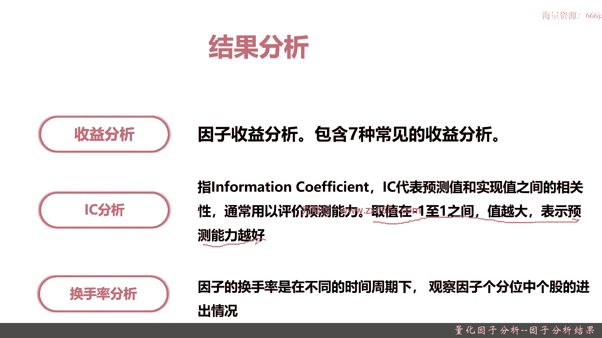
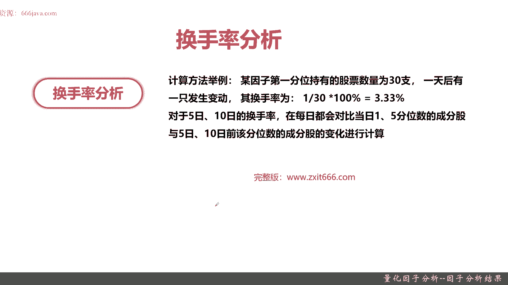
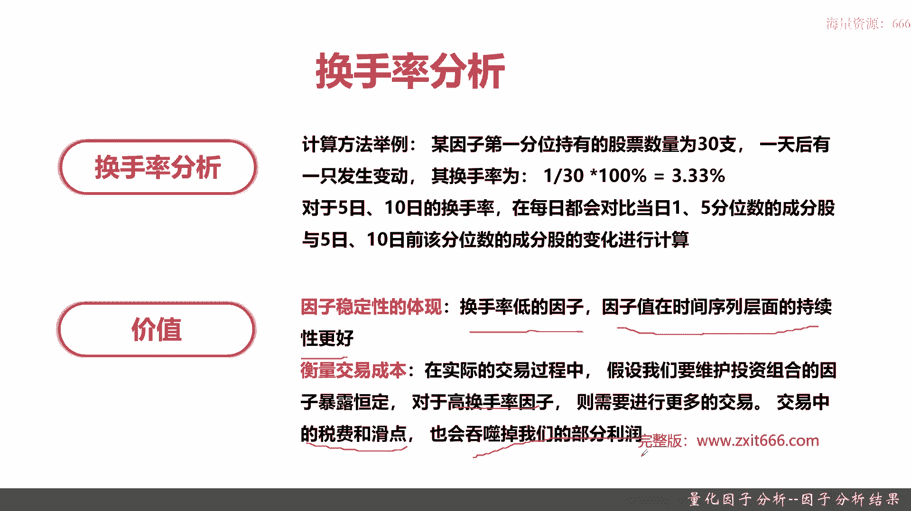
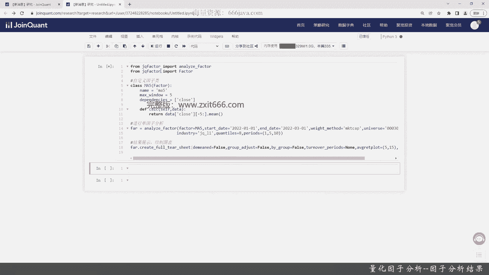
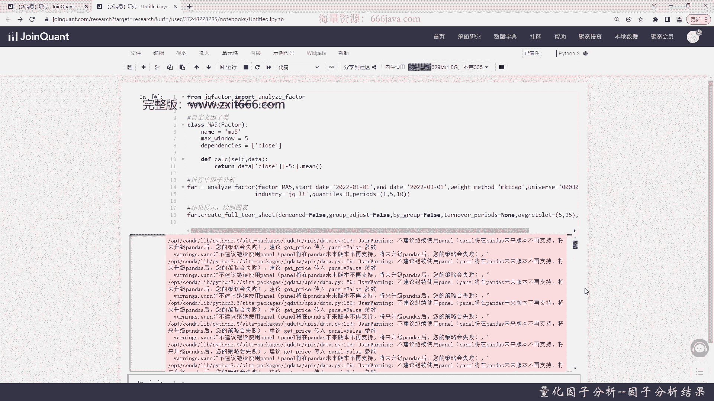
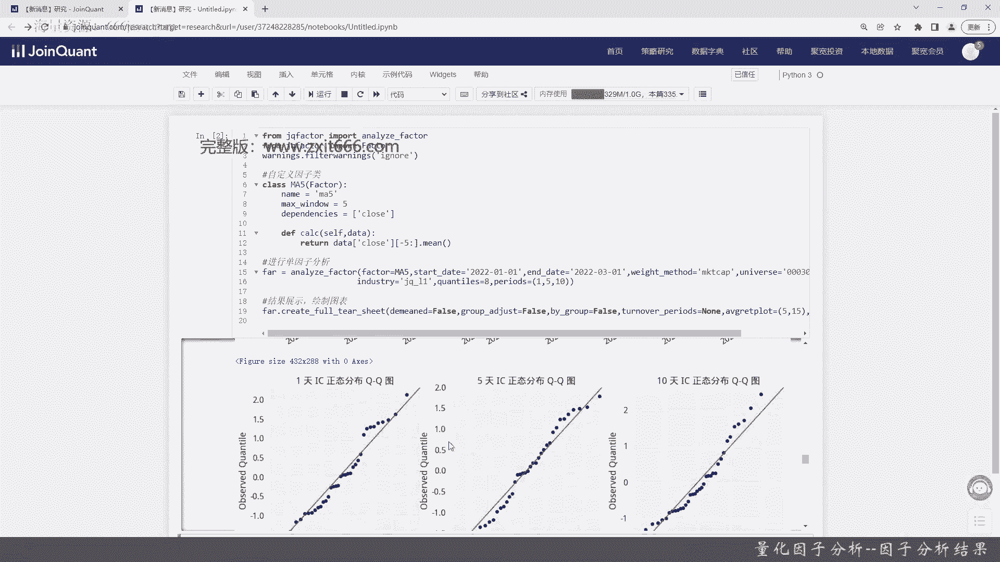
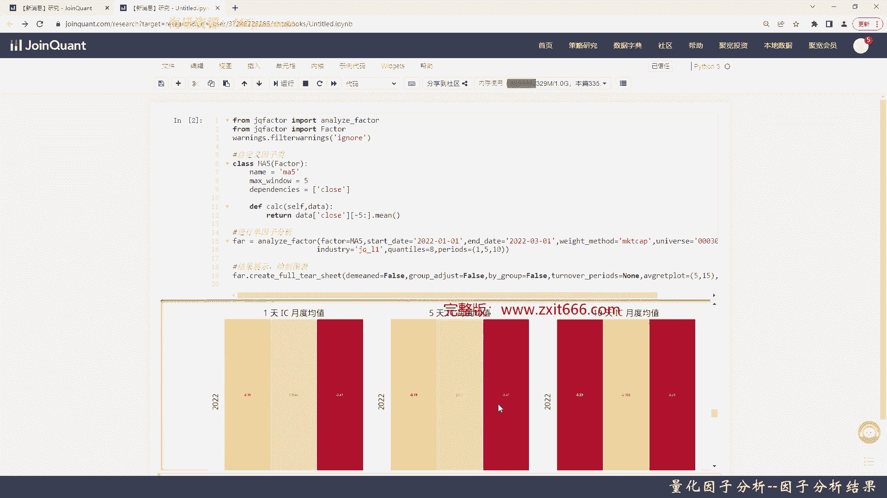
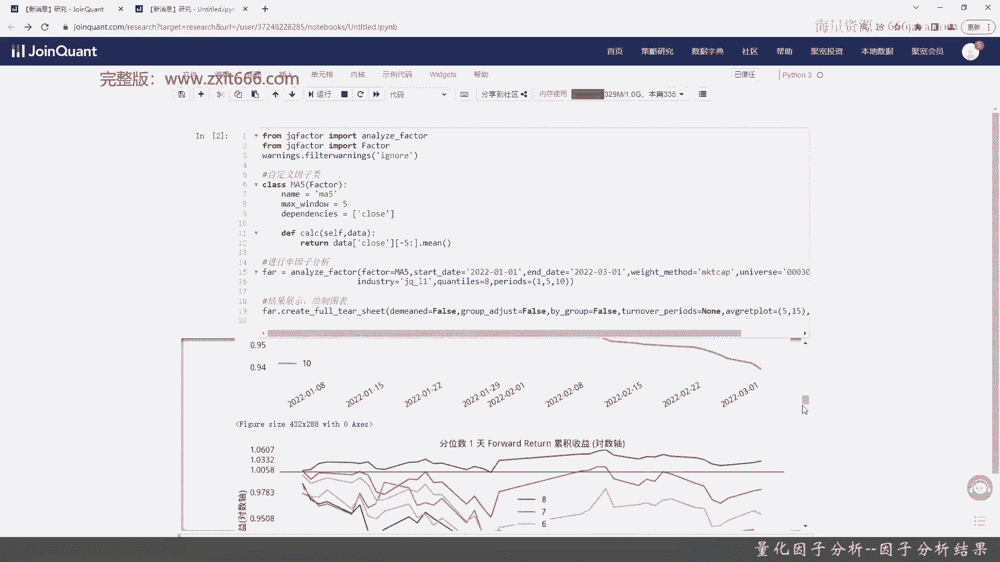
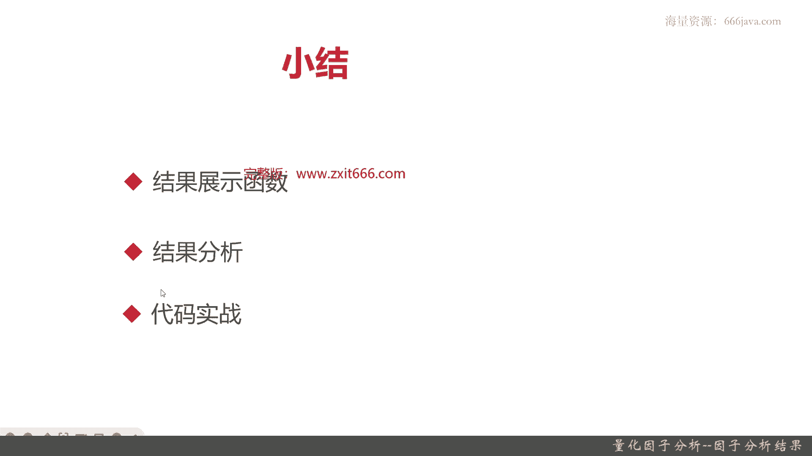

# 基于Python的股票分析与量化交易入门到实践 - P54：12.3 Python量化交易--因子分析_量化因子分析--因子分析结果 - 纸飞机旅行家 - BV1rESFYeEuA

大家好，我是米切尔，在上一节呢，我向大家介绍了如何去把一个因子给实现，那么这一节呢我将将将向大家介绍，如何去分析这个我们自己实现的因子的结果，也就是因子分析的结果。

本节呢我先从以下三个部分，给大家介绍一下因子分析的结果，首先是如何去编写结果展示函数，接着给大家介绍一下区块链化平台的，都有哪些因子分析的结果可以跟大家展示，然后呢并作出分析，最后就是代码实战部分了。

好，那么接下来的呢，我先先向大家介绍一下结果展示函数，那结果展示函数呢，在区块链网平台里面也只有一个，就是create for ti，还有几个重要的参数，一个是demand，Demand。

还有group adjust，然后by group turn over a periods，Average plot，然后STT8，那么接下来呢我将详细给大家讲解一下，这些参数。

首先是非常重要的三个参数啊，一个是demand，demand指的是额是否使用超额收益，那如果它它有两个值域，一个是true，一个是false，那true的话就使用超额收益计算，false的话。

那就不使用超额收益计算，然后再一个呢是group adjust，一在这个就是因子里面的group一般是叫行业好额，那就是说这里面指的是指行业，是否要使用行业的中心化收益，那如果为true就使用不使用啊。

就是force，再一个呢是by group，那by group指的是是否按行业展示，那按行列展示呢就是true，不按行列展示的就是false，那这个啊函数呢后面还有三个重要的。

一个是turn over paris，turn over就是调仓等，over peers就是调仓周期一般是一天五天十天，那这个是什么意思呢，就比如说假设是turn over，这个carry等于五。

那就说买入股票以后，持仓五天把它抛出，这就叫跳仓周期，然后呢最后一个是avg r呃，Rate plot，他是一个TUA，然后呢它指的是因子预测的天数，也就是指的是过去计算过去的天数。

以及计算未来的天天数呃，最后呢是STT8，就是标准差，是否使用标准差，如果是呢就显示标准差，不是呢就显示false，可能同学们只看这些参数比较拗口难懂啊，那么这个函数是结合下面的结果分析，来进行展示的。

那么接下来呢我们继续给大家介绍一下，在区块链化平台里面，结果分析它都是有啥，结果分析在这个量化平台里面一共有三个部分，一个是收益分析，它主要是指因子本身的收益分析，在距宽的量化平衡的因子的收益的计算。

和普通的那个和常见的股价的收益计算不一样，他是拿前一天的收益额，收盘价比上额，当天的收盘价只是一个涨跌幅的计算，那并不像普通的计算呢，它还有一个幅度啊，它还有一个具体的值，就比如说在一般的情况下。

那收益都是拿昨天的收盘价减去今天的收盘价，再比上额昨天的收盘价，好那接下来呢是IC分析，IC分析呢就是information confishent，那一般呢指的就是那个翻译，直译叫，因此信息系数。

其实呢，IC表示的就是一个那个，预测值和实现值的一些相关性，重点它就是一个就是相关性，一般的取值在-1~1之间值越大，表示预测能力越好，那如果他是一，那就表明他是负相关，如果零完全不相关。

最后一个是换手率啊，换手率指的是在不同的时间周期下观察因子，各分位中个股的进出情况，就是买和卖的情况，一般的那个呃，不同周期呢是一天五天十天。

那么接下来呢给大家详细介绍一下收益分析，那收益在收益分析中那个分位数的平均收益啊，指的是各分位数的累计收益，以及分位数的多空组合收益，三方面观察的因子表现，那这句话怎么理解呢，收益分析它有三种。

因此方式呃，那个一种是所有分位数的平均收益，各分位数的累计收益，以及分位数中多空收益的组合，那一般来说在这个多空收益组合，第一分位的分位数的因子值是最小的，D5分位数的因子值最大。

那收益分析这三个方面到底是什么意思呢，我们再给大家详细解释一下，分位数的收益表示持仓一五天，一天五天十天后各分位数可以获得的平均收益，也就是说呃我假设这个因子对于股票，我选择了在持仓一天的情景下。

和持仓五天时间和持仓十天下，分别获得的平均收益，这就是分位数收益，那分位数的累计收益，就是乙还分别还是以上面数的，一天五天十跌，只不过呢他计算是各个各种情况的，持仓的累计收益。

那多空组合收益可能有点有点绕，它指的是做多五分位因子数最大，做空一分位因子值最小的投资组合的收益，分位数，那同学们可能就是这其实是一个统计的方式啊，两分位就是中位数，四分位就是四等分。

100分位就是百分数，这样就可以相当于可以去理解了，好那么再一个呢是IIC分析，IC分析呢一般有两种方法，一个是normal ic，还有一个是rank i c，那在这里呢距宽选择的是rank i c。

那什么是normal i ic呢，Normal i ic，其实就是因子载荷与因子收益之间的相关系数，那因子载荷呢其实就是呃，某个那个股票或者某个实际情况的收益，和这个这个因子的相关性，或者叫权重。

那OK那在权重之上呢就变成因子载荷，因子收益值的线上了，就再一次进行分析，rank i s n i c呢跟这个NOVIS的区别是，它指的是因子载荷的排序值，与rank的排序值之间的相关系数。

这也是一个排序值的，那考虑到的单日的IC波动很大，那所以呢，距宽一般会提供阅读的移动均线作为参考，因为这样比较稳定，好再一个呢是换手率，换手率的计算方法，就举个例子，比如说某因子第一分位里面。

他持有的股票有30只，一天后呢就是有一只股票发生了变动，可能本来他就是被卖掉了，那其换手率就是1/30，那就是3。3%，对于5日十日的换手率，在每日都会对比当日的一分一分位，五分位的成份股。

于5日十日前，该分位数的成分股的变化，OK这句话也比较绕口啊，这怎么去理解呢，其实就是距宽的后台，他会对比5日十日的那个，在进行5日十日的换手率的时候，他都会对比一日日和5日。

还有5日和10日的成分股相关的一些变化，做一个比对，那换手率的算法就给大家简单介绍到这里，实际呢他因为这个去宽带换回这块，他是不怎么公开的，那我们只要了解了解一下大致的算法就行了。

那换手率的分析究竟有什么价值呢。

主要有两点，第一个是因子的稳定性，换手率低的因子，因子值在时间序列层面的持续性更好，就说明这因子很稳定，那它的价格，整个我的一整个我这个因子的收益情况，就不是靠频繁的换手来的。

那就证明我这是因此选股本来选的就好，这就是因此稳定性的体现，还有交易成本，那什么是什么情况呢，因为在实际的加工与过程中，我们要维护投资组合的因子，那暴露很暴露恒定暴露痕迹呢，这比较专业。

其实就是对于高换手率的，因此那它要进行更多的交易，也就是说换手率越高的，因此那在交易过程中的它的税费和额税费，也就是交易费用他会更高，那就会比换手率更低的，因此他在所产生的交易费用高得多。

那也就是说同一假设是同样的因子啊，他的收益假设是收益基本一致，那那个换高换手率的，因此呢他的交易费用远高于低换手率的，因此那假设他们只的因此收益比是差不多的话，那如果把交易费率考进去呢。

那我们肯定优选那个换手率低的因子好，以上呢就是本节的呃全部内容，下面呢我们给大家进行coding实战。

首先给大家声明一下相关的变量，并且把一些具体的那个需要用到的函数库，我们都加载进去，这个他好像不认识啊，要不认识我们自己敲吧，哦刚才拼错了，好我们已经把这个给导入，然后自定义还是做自定义音色。

昨上次呢给大家介绍了ma10，那我们这次的ma5就行了，还是要继承factor，然后因此name呢就等于ma5了，max window呢我们也等于五，我们要有空格，然后dependency。

还是close吧，还是收盘价，然后呢内部实现CILC这个函数，cf好像他不认识，好取最近五天，均值，好再一个呢进行单因子分析，这个乘呢是ma5，我们其他的就设计简单一点，我们不像。

不像之前要演示那个analyze的各种参数，我们就试着简单一点，我们还是按照市值来算吧，然后成份股还是沪深300，作为我们的持那个股票池，用区块的一起，然后分位数我们选八，嗯QUANTILIZE等于八。

好八分位，那基本上这个就声明好了，我们接下来要打出的绘制结果展示，绘制图表，Create，有提示啊，Fort set，cookia just也是for，也是forth，我们假设换首为now。

我们不要用标准差来算，代码就写就简单的这个代码我就写完了，然后我们来看一下这个结果，展示绘制出的图标是什么样子的。

哦这里的它会有一个warning。

我们加一行，把warning给in ignor掉，我们把1warning给ignore，然后我们重新再运行一下，好可以看到这我们八分位的统计结果，就在这里的min max，然后均值标准差计数都在这里了。

好然后呢这个是period的值收益的分析，阿尔法那个阿尔法贝塔，然后军事return等等等等等等，好，然后呢这是各分位平均收益，在持仓一天五天十天上的结果，一共是八分位，可以看到好像只有一分位。

他是真的吗，其他都是负的好，然后呢一天平均因子值加权多空组的收益，主要是那个多空组合收益，然后是5000平均的时间，平均多空组合收益，再接着呢做多最大分位，做空最小分位组合累计的平均收益好。

然后这个这八个方位的，一天的所谓的人推又累计收益好，也只有一分为持OK的，好分为15天，十天，然后这个是八分位收益减一分位好，然后下面这个是IIC分析，那可以看到基本上额嗯没有非常接近一的吧，好吧。

标准差还挺大的，最多的是最高的，这个是0。4，然后一个月的IC呢是负的0。7，我们的这个策略呢呃可能跟负相关吧，从我们现在看好，这是五天的IIC，这是十天的一个IC，然后这是各个IIC的正态分布图。

一天五天十天，然后阅读均值，五天的和时间看着还好，是0。04，50天是0。41。

比较高了，好再看一下换手率啊，额我们是从零到0。025，这个进行浮动调整的，那分别是一分为八分位的情况，好这是五天的换手率，这是十天的换手率，其实我们的换手率并不高啊，好这是因此次相关系。

这道题基本的均值都是一，那因此预测能力前十额前五天是这样，后15天是这样，OK以上呢就是这个结果的分析，可以看看出我们这MA5的这个那个因子，表现其实并不是特别好好，以上呢就是本节的全部内容。

下面呢进入本章小结，好下面呢进入本章小结，本章呢给大家介绍了呃三个部分，首先呢我们给大家介绍的是结果展示函数，也就是create for tir，Create for tier。

这个函数呢主主要是和后面的结果分析，包括收益分析，IIC分析，还有一个换手率分析，它的具体的算法，还有图的呈现形式有关的，那它重点的有几个参数呢，demanded是否使用超额收益。

group project是否按行业中心化进程，这两个呢是计算我们的那个结果的，像by group呢，它是最后图表是不是按行业分组，然后呢turn over paris是调仓周期。

然后STT8呢是是否使用标准差，average rate port呃，它是因子预测的天数，再一个呢我们给大家进行了结果分析，结果分析分成收益分析，IC分析和换手率分析，其中收益分析呢就是因子的收益分析。

它的计算方式呢，和那个普通的股票的收益不太一样，股票的收益呢它是一个值，那具体的值涨多少，跌多少，它是具体的值，几块几啊，几毛几，而那个在因此的收益呢，它是个百分数，它是一个比例，其实就是一个涨跌幅。

IC分析呢就是可以直接直译的，就是信息系数，它代表了预测值和实现值之间的相关性，值呢一般在-1~1值越大，表示预测能力越好，换手率指的是因子在换手率不同的时间周期下，观察因子各那个分位中个股的进出情况。

然后呢其中收益分析呢它有三种情况，一种是分位数的收益，一种是分位数的累计收益，还有一个多空组合收益，其中呢多空组合收益那个做多的是五分位，那个因子是最大，做空是一分位因子值最小。

然后这两种组合的投资组合的收益情况，再一个IC分析，IC分析呢它是有两种，一种是normal ic，一种是rank ic，那在距宽的平台里面，一般是取的是rank i ic。

那那个normal i ic和安rank i s的区别呢，就是ROMIC，它本身指的是因子载荷和因子收益之间的，相关系数，而rank i ic呢指的是那个因子载荷的排序值，和收益的排序值之间相关数。

然后从刚才最后的结果的图上就可以看到，巨宽呢为了把那个额单日IIC的波动较大，这个情况他给平滑掉，还给我们提供了那个月度的IIC的移动均线，最后一个呢是换手率，换手率呢计算方法就举个例子啊。

比如说某个额，因此同学们记下来，比如说某个因子第一分位持有股票有30只，一天后呢，那就一直发生了变动，就被卖掉了，那其换手率呢为1/30 3。3%，换手率的价值呢一个就是因此稳定性体现。

换手率低的因子因子越稳定，然后呢它的持续性更好，还有一个呢就是换手率越低的，因此它的交易成本更低，那可能收益最终收益反而会更好，最后一个呢是给大家进行了coin实战，在这些因子的分析结果里面。

最好还是用区块的研究模块，用策略模块的这些图是呈现不了的，好以上就是本期的全部内容。

我是米切，大家下期再见。