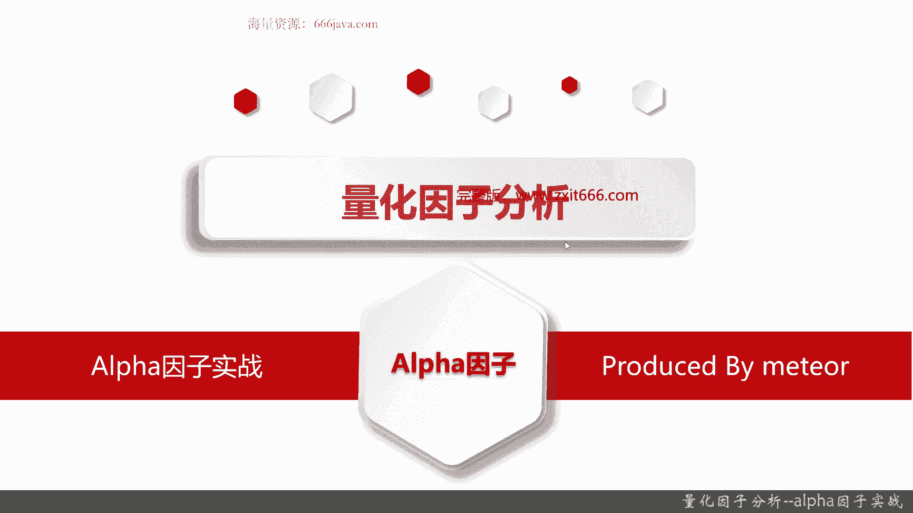
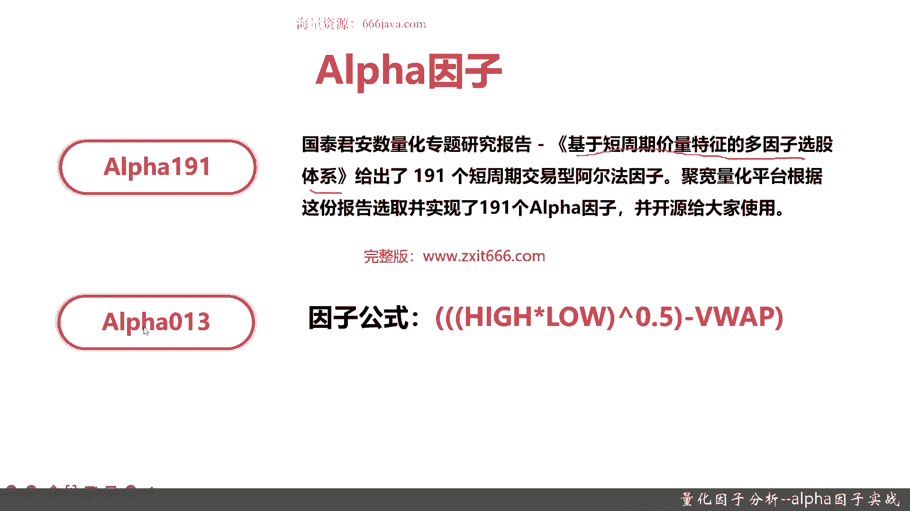
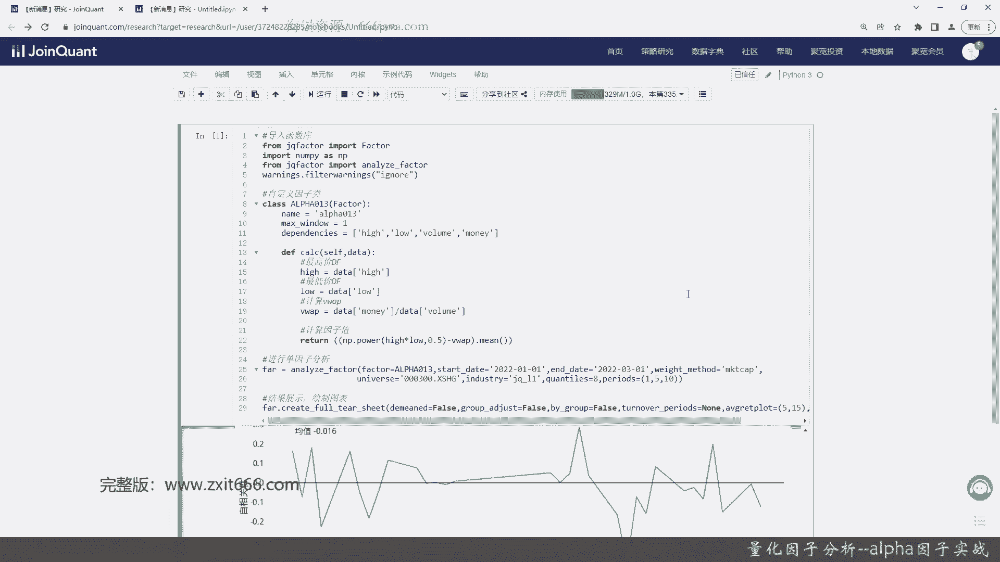
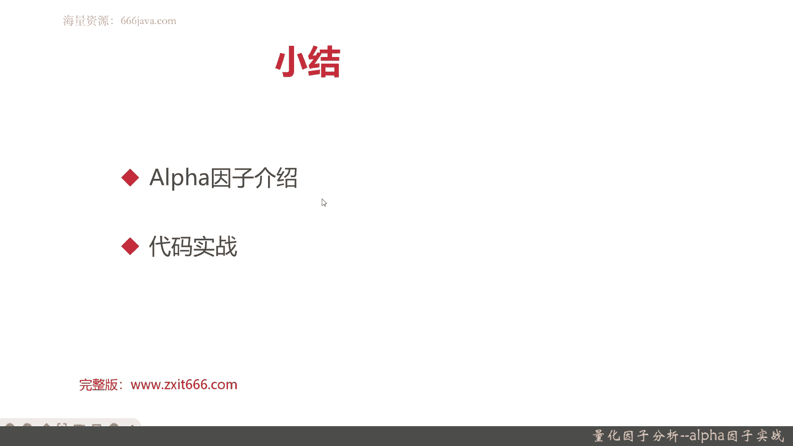

# 基于Python的股票分析与量化交易入门到实践 - P55：12.4 Python量化交易--因子分析_量化因子分析--alpha因子实战 - 纸飞机旅行家 - BV1rESFYeEuA

大家好，我是米田，在上一节呢我给大家介绍了因此分析的结果，以及如何通过图像的方式去分析，这个因子的收益情况，还有IC情况等等，那么本节呢我们给大家介绍一下阿尔法因子。

并且呢拿一个非常常见的经典的阿尔法因子呢，进行实战。

本节将从以下两个部分给大家介绍阿尔法因子，首先呢给大家进行阿尔法因子的基本的介绍，然后呢我们就直入正题，因为因子分析的那个基本的coding的框架，还有编程的结果的分析，我们都已经给介绍完了。

那我们下一步呢就是代码的实战好，那么接下来呢我们给大家介绍阿尔法因子，阿尔法有个阿尔法191，不知道同学们有没有听过阿尔法幺，191，是在阿尔法因子分析里面非常经典的一个呃，非常精准的一个因子。

它指的是一共190一个阿尔法，跟阿尔法相关的因子，那它的来源呢是我国的国泰君安，它有一个专题的那个量化研究报告，是指基于短周期价量特征的多因子选股体系，记住啊，这是这100，因为它是190一个因子。

它所以已经不是一个简单的阿尔法因子，它是一个体系，然后呢给出了190一个短周期，交易型的阿尔法因子，然后在此之上，距宽根据这份报告，选取并实现了190一个阿尔法预测，当然了，随着时间的迁移和迭代。

这些因此有的代码呢可能还需要去看去维护，有的呢他可能有问题，感兴趣同学可以去参考一下局宽的IPI文档，这些因此的实现呢据宽都已经开源给大家了，然后我们可以直接去调用。

然后我们本期给大家实现的是编号013，其实就第13个阿尔法，因此那它的函数呢，公式其实相对来说还比较简单，就是这样最高价乘以最低价，然后呢再去开方，再减去VWIP好，那么接下来呢我们就进入代码实战环节。

首先呢还是老样子导入函数库，还是要先把factor给导入，这位呢要导入南派了，还要把warning的给设一下，然后我们就开始coding了，首先是自定义函数自定义，因此，我们就叫阿尔法13了，013。

它是实现factor，接着呢我们设定因子名称，然后是max window，阿尔法13的max window呢，我们就选取一数据的时间最长的路就是一天，然后dependence就不止一个。

就不止一个参数了，首先是最高价，接着是最低价，然后是因为是V的VWA系嘛，所以是首先volume是肯定有的，然后还有一个重要的参数是money，好那基本的这三个重要参数就已经好了，接下来我们要计算。

因此，首先要声明high，要把head的这个DF给取出来，然后，最低价的DF也取出来了，然后要计算，V w a p，还记得VWH的公式吗，就是就挺简单的，然后呢，计算因式支持，因为我们要取开方。

所以用南派的power，hi乘以low，外侧还要套一层，好我们检查一下公式啊，这最外层的这是ti，他对的啊，他ti它也是对的，它的它也是好，那我们那个，阿尔法零三就已经实现了，后面进行单因素分析。

好像就不认识了，那我们还是为了快捷方便，还是为了import一下吧，这样他就能认识了，然后是weight method，我们还用试吃吧，还是用成还是用沪深300的成分股作为股票持，然后是分位数。

好分析就写好了，下一个呢是结果展示，绘制图表，Demin the forth，group a chest也是fourth，by group还是forth，turn over paris是N。

Avg r e t plot55，标准差star，S t t8，好我们简单检查一下有没有问题，OK目前看来没什么问题，然后我们来运行一下，好这结果就出来了，我们来观察一下我们的那个阿尔法零三。

这个因此他的结果情况，看看我们的收益情况好吧，在这段时间我们基本上都是负相关的，一天五天十天，在十天的收益其实还已经还可以啊，累计收益，然后整体来看我们这个因子的收益情况，好像是好于我们的ma5的。

嗯然后再看RC，RC还是负相关比较多，好最后一个是换手率，我们的这个换手率明显是高于之前的ma的，ma都是0。05，而这一天的换手率高达0。9了，那因此呢其次相关性呢我们不是移了，我们是滞后的。

大概均值也就0。06，0。6或者最高峰值是000。4左右，好以上就是阿尔法因子的那个结果。

下面呢我们进入本章小结，本章呢主要是给大家介绍了阿尔法因子的实战，那阿尔法因子呢，它是国泰君安的一个量化研究报告，就是基于短周期价量特征的多因子选股体系，给大家介绍了190一个。

短周期交易型的阿尔法因子，根据这份报告据宽量化交易平等呢，就实现了这190一个阿尔法因子，并且呢开源给大家使用，那我们在本节呢，我们我们当然不可能把这190音，一个因子都给大家选。

我们选取了其中一个比较有代表性的阿尔法，013，那这个因子的公式呢就是最高价再乘以最低价，然后对它进行开发，减去VWAP，那这就是阿尔法零三的结果，我们后来呢对这个阿尔法因子呢进行了实战，把它编写出来。

并且进行了回测，然后呢看到他的的因子的分析结果，可以看到，至少对比，我们在上一节给大家介绍的M5因子呢，它的收益情况相对相对来来说好一点，但是它的相关性额可能比较呃，可相关性它可能负相关可能更多一点。

然后在换手率方面明显的比那个M5高得多好，以上就是本期的全部内容。

我是米田。