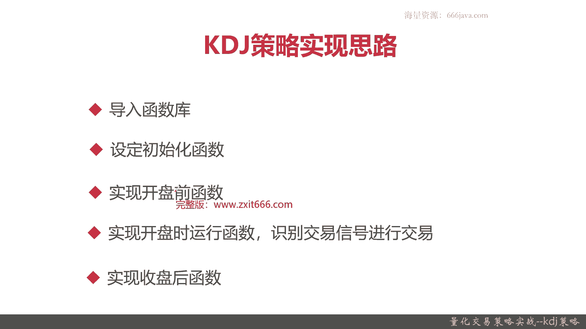
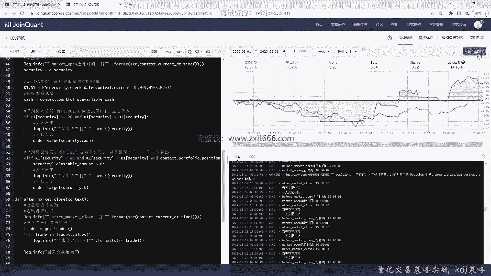
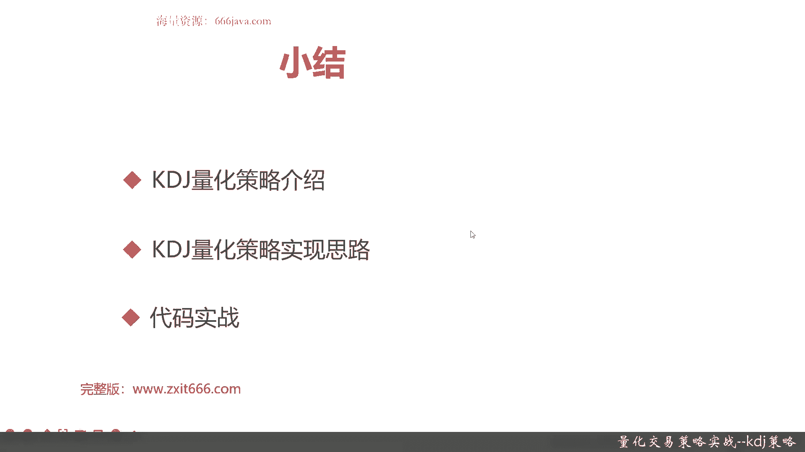

# 基于Python的股票分析与量化交易入门到实践 - P57：13.2 Python量化交易策略实战案例_量化交易策略实战--KDJ策略 - 纸飞机旅行家 - BV1rESFYeEuA

大家好，我是米田，在上一节呢我向大家介绍了双均线策略的实战，那么这一节呢，我们将向大家介绍一下KDJ策略的实战，本节呢我们将从以下三个部分，给大家介绍一下KDJ量化交易策略，首先还是老样子。

我们给大家简单介绍一下，K77街的量化交易策略，接着呢，我们给大家介绍一下KT界，量化交易策略的实现思路，那最后就是coding实战环节好，那么接下来呢我先向大家介绍一下，KDJ量化交易策略。

首先是给大家回顾一下，什么是KDJ的指标和KDJ策略，KT键其实就是随机指标，那它呢在设计中充分考虑了价格波动的，随机振幅与中短期的波动测算，使其短期测试功能比移动均线更加准确有效。

注意KDJ策略主要是在短期测试功能，在市场短期超买超卖的预测方面，又比相对强弱指标敏感，OK这个是KDJ指标和KDJ策略的回顾，那么呃感兴趣的同学们可以回到之前的章节，查看相关的内容。

接下来呢这是一个常见的KDJ的图，可以看到类似于均线策略ma策略，那它也有各个交叉的部分，但是呢并不是KDJ，所有的交叉部分都需要考虑的，那KDJ的交叉部分，比较稳妥的买卖信号是什么呢。

就是这个K在20左右向上交易，K在20左右向上交叉D时买入股票，这就是个买入股票，然后K在80左右向下交叉地势全仓卖出，O，这个就是KDJ策略的一个，简单的买卖的信号的识别，当然了。

还有一些不是特别容易量化的部分，那需要人工看的，我们在此进行KT界量化交易策略的时候，就不进行展开了，我们只选择比较容易量化实现的部分好，那么接下来呢我们给大家介绍一下，KDJ策略的实现思路。

首先还是导入函数库，接着设定初始化函数，再接着我们要把开盘前的一些函数实现，然后我们要实现开盘时的运行函数，重点是识别交易信号，然后并且进行交易，那最后是实现收盘后的函数，之前。

由于那个给大家介绍的双均线策略呢，还是比较容易的，所以呢我们就没有分别去实现开盘前，开盘时和收盘后函数，那么在KDJ看书这块开始呢，因为它相对来说叫双经验策略还稍微复杂一点，我们会需要实现这些。

以后同学们如果在自己要进行策略的研发时候，也可以考虑这样的框架好。

那么接下来呢我们进入代码实战部分好，那么接下来呢我们进入代码实战部分，首先我们把这些注释给写，啊这个，因为KDJ这里还是稍微比那个双经验策略，复杂一点，那么我们先把注释给写了，好首先K在20左右向上。

交叉，这时候全仓买入，好，那基本就把的KDJ的买卖交易信号，的那个识别方式给写出来了，好我们接下来进入实际的口语实战，首先导入函数库，这里还少一个引号，我补一下好的，再把技术分析给写出来。

因为KDJ如果在实线的话，还是要挺花不少时间的，这里呢我们就不考虑了，好我们这样呢，就把巨宽的技术分析包给打出来了，好我们现在先实现初始化的函数，先设定基准，那我们默认就以沪深300来作为基准。

好我们持续要动态复权，再接着我们要把，交易的手续费，买入时一般买入时佣金为万分之三，以前可能更多一点，现在新的户头都是降出来了，所以是Y3，卖出时候要多一个1‰的印花税。

然后每笔交易最低的交易费用要扣五块钱，这就是目前实际的cost，我们要把这个给写上，那这是一个区块的内置函数，Order cost，这块就不展开了，同学们感兴趣自己也可以看到，回过去看之前的章节。

好设定，type等于stock，这里有个放上去吧，这就基本上把那个initialize，数据初始化给写完了，那么接下来我们来写开盘前运行调用函数，首先是run daily，那我们同时一边写一边声明变量。

先声明一个，before market open时间，这个比较好弄，因为G宽它是可以自己有函数的，before open吧，然后呢这个是一个设定运行时间的基准，Reference，Security。

这个呢一般就选用沪深300吧，这是开盘前运行的就写好了，然后开盘时运行的，这个就叫marketing open吧，还是要声明time这个变量，这个time变量就比较容易，就是只要写成open就可以了。

最后还是个reference security，还是选沪深300，这主要是只是影响的运行时间，还要声明一个run daily，那这里就叫after market clothes。

那他应该就是after clothes，replace security还是沪深300，这个区块平台做的不好，它不会自动回滚，好到此为止，我们就把initialize给写好，然后我们来实现声明。

并且实现开班权的函数，它也是传contest变量，那我们这里呢做的比较简单一点，一个是输出运行时间，我们这次用login for的方式，好这个是context，这是一个系统变量。

好这个就是每次开始运行的时间，好运行时间输出完了，我们交警股票标记呢就随便选一只，当然了，同学们如果把那个选股之前做的基本面选股，再结合起来，那可能效果会更好，因为他也是一个乘法关系嘛，我们就选一支吧。

就选平安银行好，然后下面是开市的环节，也是先输出运行函数，运行时间，这我就不直接敲了啊，有点类似，我就改一下，好或首先获得交易股票，然后开始进行识别器交易信号了，首先要获取KD。

其实就是在用KDJ函数嗯，用KD也行，因为我们在我们这个信号里面，其实不需要用到J，用KD就可以了，KD返回两个值，K和D，这是系统自动的函数，那这要有防传check data，七个team就选当天。

然后是KD函数的默认的参数，感兴趣的同学自己可以回去复习一下，它是一个NM1和M2，那N99M293，具体感兴趣学，可以回去翻翻之前的那个历史课件，看一看这些分别代表啥，然后是怎么算的，然后计算现金。

这个时候我们要参考账户里面的现金，这时候如果K在20左右向上交叉D的时候，我写明写清楚了，当然阈值呢同学们也可以调，不过这些呢20和80，这些是经验所得，好把这打印出来，这时候是全仓买入。

那就要用到order value了，好下面一个呢识别卖出信号了，那应该是持仓了，就是说首先你要符合信号，接着呢，什么叫投诉呢，是我们还持仓了这些股票，我们才能卖出，好这个判断条件写好了，卖出也类似。

好这回就要用到order target了，直接到零为止，OK那这个时候就已经结束了，最后来实现一下收盘函数，还是输出运行时间，这个我们也就，我们要获取所有的交易记录，然后我们把它打印出来，当然了。

如果我们自己用区块链化平台，这个不缺了，不过我们自己开发的这个策略，既然是我们自己开发的，我们再回速的时候方便进行获取，所以还是要把一些交易记录给打印出来，这里再加一下，这里既然有结尾。

我们就再多加下一个，注下开头，好那我们基本上就已经把KDJ给实现了，剩下的我们来用回测看一看结果吧，稍微检查一下，看代码有没有问题，好终于把这段代码给回测完了，这聚宽量化平台。

在这个时间回测时间还是有点长的，那可以看到我们的策略整体还是不错的，在这段时间内，从就是2022年8月1号，到2023年的2月1号将近半年的时间，那我们的收益大概是在10%左右，最高12%。

然后这段时间基准一直是不好的，2022年嘛，其实一个大环境问题，还有个俄乌冲突等等，这其实都是大环境的问题，包括疫情啊，叠加一下沪深300，这段时间只收益0。62%，那我们可以看到。

我们这里明显比那个基准收益好，那贝塔呢有点高，我们风险有点高，确实夏普呢，但是正的最大回撤呢也有点高，14%这块呢可能还可以再改进改进，当然了，感兴趣的同学们自己可以去网上去搜一搜，改进的KDJ的策略。

比如说信号不是用八十二十或者是65，30等等，那具体看同学们自己，那我们可以看到进行交易，每天都有这个日志呢，打印了比较多的，每天都有交易的行情，什么时候下单成功了，那下了多少单，交易费是多少。

我们都可以实际看到好，每天都有，那么接下来呢我们看看看，看看下具体的回测情况。

现在呢这个回测就已经出来了，可以看到我们整体的策略收益是10。7%，那我们策略年化收益其实是非常好的，22%，这个策略年化收益，基本上各位同学可能已经满意了，那相信这么说，这个策略大家调整一下信号。

就是K和D的参数，当然了，不是说一定二十八十不好，这其实是个统计的规律，同学们需要通过，那这种呢调参可以用机器学习的方式来调参，也可以自己通过经验去调，那还有一个我们可以改进的方向呢。

我们的股票现在只选了平安银行这一支，那根据我们之前介绍的那个基本面选股，来进行挑选的，那可能效果会更好，超额收益，我们挣少了9。69%，很高了，那基准收益呢这段时间其实确实不好，只有0。2几阿尔法呃。

0。203不错，贝塔0。6，贝塔风险系数有点高，因为我们最大回撤确实有点高，下浮0。7还行，胜率0。286，也就是说我们大概那个28%的情况，我们是获胜的，那其他的时间我们都是亏的，那也确实是可以看到。

在这段时间里，大多数时间我们是亏的，甚至有一段时间我们亏的，按照这个KDJ的时候，比我们的整体的那个基准还差，但是后面从去年的11月份开始，那就慢慢慢慢反超了，那盈亏比1。268，最大回撤有点高。

14%所提的比率和一点一这个还行，日均超额收益0。09还不错，超额回撤收益最大回撤6。9%，也就将近7%，超额收益下普比例0。7%，日胜率其实还可以，0。47就是每天获胜情况，也就是说稍微亏一点。

都是像之前的那个总体胜率那样，那盈利了四次，亏损了十次，然后信息比0。8策略波动率，你要这个28还是高的，但是呢这个比甚至比基准的做波动率还高，最大回撤时的区间，是在那个8月1号到11月30。

这跟大盘也有关系好那么交易详情啊，还有每日的收益情况，我们大概看一看就可以了，前面确实都是在亏的，但后面是好的，然后这是策略的收益情况，基准收益的情况，阿尔法贝塔夏普比率好，以上呢就是本节的全部内容。

下面呢进入本章小结，首先呢我们给大家介绍了KDD的策略，那KDD的策略呢，其实最重要的地方就是它的买入和卖出的信号，我们呢选择的是，当K在20左右向上交叉D的时候，买入股票全，而且是全仓买入。

当K在80左右相差较差D的时候，全仓卖出，那同学们自己也可以去调整，但是这个呢感兴趣同学可以自己去做实验，接下来呢我们给大家介绍了，KDJ量化策略的实现思路，那在本次的给大家介绍。

因为KDJ的策略呢比双均线策略还是复杂一些，那除了之前的导入函数库和设定初始化函数呢，我们还增加了开盘前的函数，然后收盘后的函数，然后呢，我们是把一些降化交易策略和KD1的实现，放在了开盘时的运行函数。

这样呢完整的框架就行了，还有一些策略其实比KTT策略还复杂，那分别要在开盘前和收盘后，都要去做一些基础的操作或者信号的识别的，然后呢最后呢我们进行了代码实战，可以看到我们本节的KDJ的策略呢。

复杂度是比之前的双均线策略，和之前给大家介绍一策略相对复杂度高一点，他的回测时间相对也较长，那我们最后回测出来的，KDJ的策略还是不错的，那从那个就是年化收益22%，然后半年的这个时候。

我们选择的沪深300基准只有0。6几，但是呢我们汇基业策略波动还是比较高的，波动率0。6几，然后最大回撤14%，那这个跟这段时间总体蛋白是有关系的，毕竟KTZ策略它是个短线的交易策略。

受波动有波动影响是在所难免的，我们在那个整个KDJ策略这块，有两个可以优化的点，一个是我们现在在我们实现里面，只给大家取了平安银行这一支，当然了，这个只是一个随机选择。

那如果同学们可以拿沪深300或者是上证五零，这些成分股作为基本面选股来进行交易，或者再加上一些比较好的基本面选股的策略，那相信效果会更好，还有改进点呢，那我们KTJ的信号是可以调整的，现在是八十二十。

那你也可以变成六十五三十，那具体结果呢可以看同学们自己去看一看，好以上就是本期的全部内容，我是明天大家下期再见。

