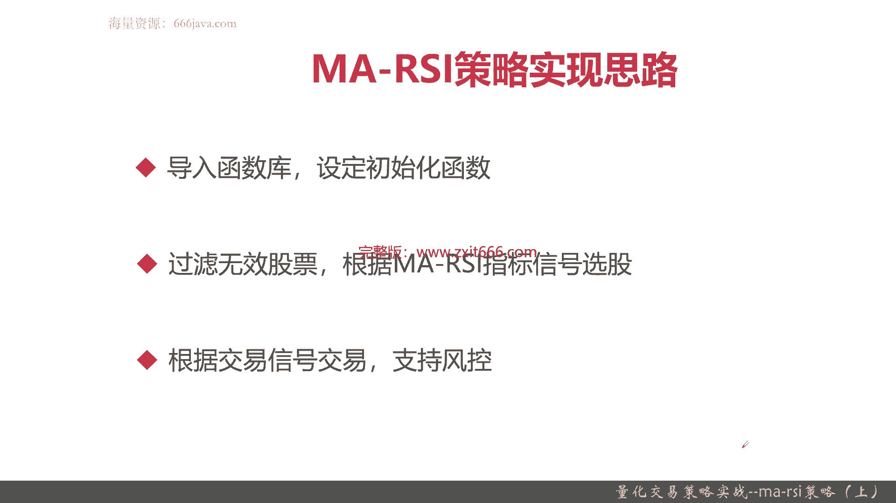
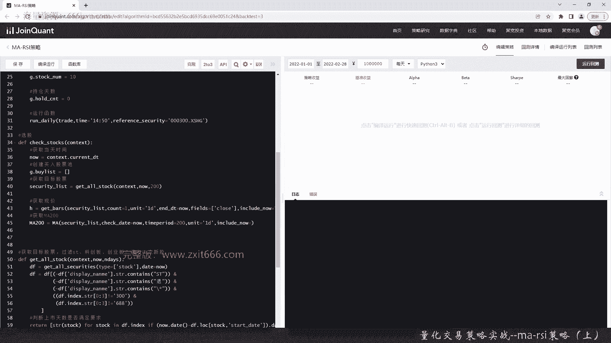

# 基于Python的股票分析与量化交易入门到实践 - P58：13.3 Python量化交易策略实战案例_量化交易策略实战--MA-RSI策略（上） - 纸飞机旅行家 - BV1rESFYeEuA

大家好，我是米田，在上一节呢，我给大家介绍了KDJ量化交易策略，那么这一节呢我将向大家介绍，如何综合运用两个不同的技术指标，来进行量化交易，那本节呢我们就给大家介绍一个这样，一个经典代表例子。

ma杠SI这个量化交易策略，本节呢我们将从以下三个方面给大家介绍，MAISI量化交易策略，首先给大家简单介绍一下，ma rsi的这个量化交易略的思路，那它包括选股范围，然后包括他一些买卖信号等等。

接着呢给大家介绍一下这个策略的实现思路，最后呢就是重点的代码实战了，好，那么接下来呢我们给大家简单介绍一下，MAISI这个量化交易策略好，首先给大家介绍一下MAR，SA这个策略的来源和它的原理。

它运用的呢是MA和rs这两个常见的指标，这两个指标同学们如果还有印象，可以知道ma主要是一些均线，均线呢它可以反映长期的，但是它也呢也可以反映短期的，在我们这里呢主要是用ma均线这个长期的特征。

然后rs i呢主要是进行强弱指标，那它呢主要是用来短线综合这两个指标，那就可以知道，我们就可以选出上升趋势的超卖个股，那同时又可以缩小去选股范围，从而用一些简单的卖出和止损策略，就能达到稳定的收益。

注意啊，重点首先是综合这两个指标，选出上升趋势的超卖个股，然后还可以缩小选股范围，然后再用一些卖出和止损策略，重点是稳定的收益，这个策略呢你不说他是有多挣钱，但是呢他重在稳定，就是如果不是。

那么就是胜率不是那么高的，就是出手挣钱的那个概率不是那么高的情况下，那他是不会慢慢的进行买入和卖出这样交易的，MARS的选股策略是什么呢，首先他要选取市值大于500亿的股票，那其实就是大市值了。

然后呢他要排除s st科创板，创业板，退市四新股股票，再按照净利润环比增长序列降序排列，那这个什么意思呢，也就是说他会选取大市值，同时那些特殊的ST啊，然后这些新来的科创创业，或者是退市或者次新股呢。

他都不考虑，就是要一个稳定的范围，最终他要按照净利润环比增长率降序排列，这是一个选股的范围，接下来给大家介绍一下买卖信号，那首先是买入股票的型号，它必须是K线在ma200的均线上方，那ma200均线。

同学们应该是了解到是非常一个长期的范围，ISAISI10要小于25，那这个时候他就是买入股票了，ISA10小于25，就说明它是超卖，那这个时候他就可以买入，K线在ma200均线上方。

那其实它就是一个上升趋势，当然了，具体的你为什么要选ma那个200，为什么不学ma的那个120或者60呢，包括为什么是ISI10，不是20或者不是五，那这些具体的这些阈值啊，还有参数啊。

这是经过那个文章里面，经过前辈们经常这是经过长期的一个经验所得，当然同学们如果实验做的多了，有自己的参数可调，这个都没什么，然后RSA10大于40，或者那个持有股票到了第N天。

我们这里呢一般可能是第十天或者第11天，或者个股下跌超过5%卖出，那这两个呢其实有一些条件，有一些风控的逻辑在里面，首先下跌超过50%的止损值，当然根据各个同学们自己的判断或者喜好，或者风险容忍度。

那你们可以把F5%调成1%，或者3%等等等等等，那持有股票是DNA，也就是说一只股票，我要经过一定的时间就去换个仓，可能就要进行抛出，那这两个逻辑主要是为了一个风控，ISA10大于40。

主要是一个择时信号的判断，好以上就是MARSI策略的简单介绍，那么下面呢我们给大家介绍一下实现思路，这个实验思路呢主要分三步，第一步呢导入函数库，同时设定初始化函数，第二步其实就是选股。

那选股包括过滤无效股票，比如说把s st啊，比如说退市啊，科创股，或者是那个呃非次呃四星啊等等，这些都过滤掉，同时要根据MARSI的那个指标信号，进行选股，那最后一步呢进行买入和卖出的信号交易交易。

同时要根据刚才的那个卖出的时候要兼顾风控，OK以上呢就是MAIS策略的简单的实验思路，那么下面呢我们进入那个代码实战环节好。

那么下面呢进入代码实战环节，我已经提前把这个那个策略的空策略，给大家写好了，首先我们导入函数库，因为都要用到ma和RSI，而且呢我们尽量简单一点，所以我们要导入技术分析库，好那导入了就行了。

那么初始化了，首先我们要设定基准嗯，我们就用沪深300来设定股票基础，接着我们这个呢呃是为了我们回测更加准确，首先要避免未来数据，因为未来数据呢可能会导致我们的，会莫名其妙的。

会觉得自己那个回测的结果非常好，所以我们要设置开启避免未来模式，这个是在set option里面设置的，接着呢我们要用真实价格，所以要开启动态复权，然后设定成交比例，然后设定股票属穴位交易费。

这还是跟之前一样，买入税佣金为万三，卖出时佣金是万三加1‰，印花税，这样吧，然后每笔交易最低五块五块，好type等于stock，这个也设定完了，然后设定中间变量，首先设定持仓数量。

也就是说我我同时最多购买多少只股票，后续同学们感兴趣可以调，就是十吧，时长天数，先从他是个计数器零开始，这次就叫trade吧，然后我们设定每天快收盘的时候进行交易，当然同学们有兴趣的可以自己去调整一下。

然后时间戳呢还是跟沪深三别一样，好这样初始化就写完了，那我们先实现一下选股逻辑，好我们先把当天时间都获取，因为每次都要用当天时间计数嘛，好首先要创建买入的股票池，这是一个代买的，这叫BLIST吧。

这个函数我们待会我们先我们这样吧，先把这个函数实现一下，待会我们再来写这个check stock，我们要把s st科创板，托板好像有点难打，创业板，因为这里面可能有些不太好的股票。

或者我们不是特别了解次新股，嗯然后呢这个是要用器宽自己的函数了，然后用这种方式过滤，这种方式过滤呢，就是其实就是DF写一个筛选逻辑，当然了，这个代码其实是可以进行优化的。

感兴趣的同学们可以自己去想想如何去优化，其实就是把它一个display name，当成一个字符串进行过滤，这有好几种，这是s st的，这是退市的，然后，四星股，后面就不是判断他是不是那个。

后面就要判断创业板和科创板了，这样写在一起，一个表达式，其实就是看他的股票正确编码，当然同学们用其他的方式也实现也行啊，好因为这个比较复杂，然后用个循环遍历它，当然了，我们还要加强下一程吧。

就是非次新股，其实也就是说它的上市时间是否大于目标函数，我们这里假设是200嘛，那其实就是要还要判断一个时间，然后用个for循环来遍历，好这样就把次新股也过滤掉了，那这个就是我们的一个筛选逻辑。

当然有兴趣的同学们可以去想想，怎么去优化这个过滤条件啊，让它显得更加的性能高一点，好，我们继续写我们的选股逻辑，这也是区块自己的函数，那好我现在就用ma200来，因为要获取每一只股票的ma200。

