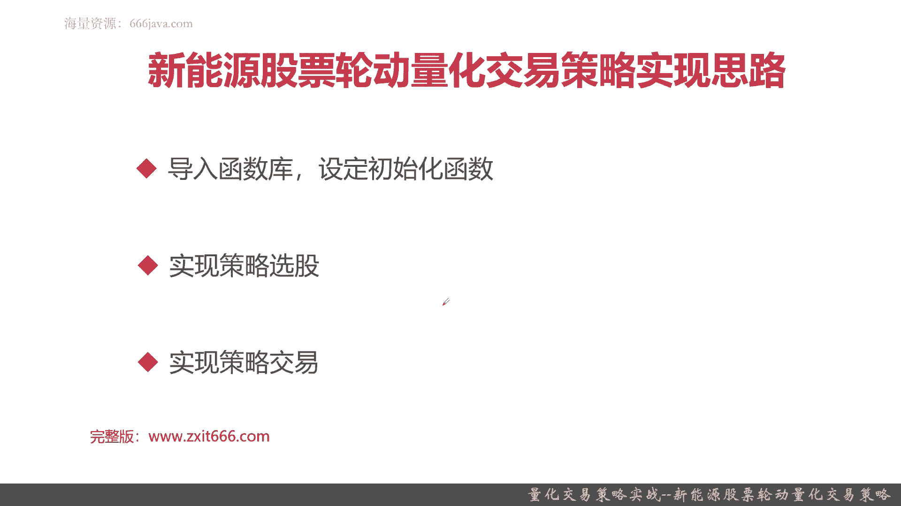
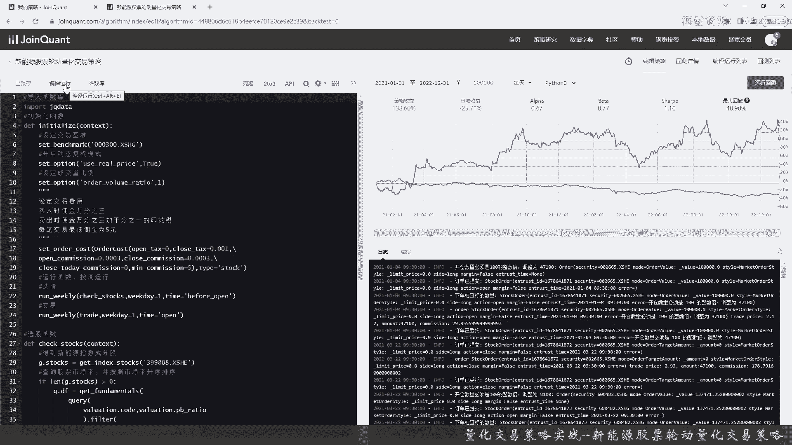
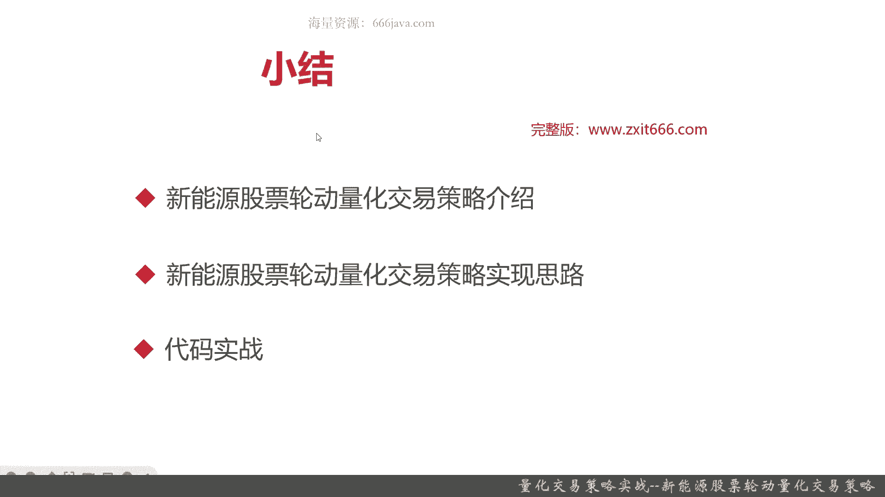

# 基于Python的股票分析与量化交易入门到实践 - P62：13.7 Python量化交易策略实战案例_量化交易策略实战--新能源股票轮动量化交易策略 - 纸飞机旅行家 - BV1rESFYeEuA

大家好，我是米铁，在本章的前面几节呢，我主要给大家介绍了，如何通过技术分析的指标来设计，并且实现量化交易策略，那本节呢我们换一个思路，通过经验和一些宏观信息来设计，并实现量化教育策略。

本节我们给大家带来的就是，新能源股票轮动量化交易策略，本节我们将从以下三个部分给大家介绍，新能源股票轮动量化交易策略，首先还是整体给大家介绍一下这个策略，它的一些基本原理，还有它的背景。

接着我们给大家介绍一下，新能源股票轮动这个策略的实现思路，那么最后呢又进入了代码实战环节好，那么我们快速进入正题，首先给大家介绍一下这个策略，一些基本的背景啊，基础和基本的原理。

那就是新能源股票轮动策略的基础呢，其实很简单，重点就是热点板块，那之前应该给大家介绍过，在股市中呢有热点板块这个现象，它指的是当前市场上交投比较活跃，成交量也较大，板块内的个股呢明显高于市场平均水平。

他的收益也明显高于市场内其他的股票，那这就叫热点板块，新能源板块属于热点板块，这个板块里面呢股票更迭非常的频繁快速，而且呢他们的普遍收益，比其他的板块收益更高好，这个是一些策略的基础，那为什么会这样呢。

首先是这样，股票它是受宏观行业去影响的，那量化交易策略呢，本质上是把人的成功的投资思想和投资经验，量化并且实现，可能同学们听过一个段子啊，有一个大爷他呢炒股非常的牛逼，那赚了很多，但是呢他没上过几年学。

甚至呢根本也不懂什么量化，不懂策略这种行业术语啊，K线图他也看不懂，有记者就去采访他大爷，你为什么能收益这么高呢，大爷说我这几十年就坚持干一件事情，就是看新闻联播，那么同学们可能会觉得这是个笑话。

但实际当中呢这个段子里面有他自己的道理，为什么这位大爷看新闻联播，他就能得到这么高收益呢，因为他看了新闻联播，他有实事，他知道在宏观场景下，哪一些信息会对股票市场造成影响，比方说黑天鹅事件的俄乌战争。

那他们呢就会对军工行业造成非常大的影响，那为什么我们给大家，举新能源这个板块的例子呢，因为同学们如果对国家大事比较了解的话，国家现在在扶持一些非常新兴的领域，主要是跟2025智能制造相关的。

比方说新能源，比方说人工智能，比方说芯片，当然了，这里面写的新能源股票轮动的板块呢，同样投资理念，它也同样适用于芯片板块和人工智能板块，甚至一些其他的，比如说大飞机啊，这种智能制造板块都是的。

首先政策有倾斜，接着呢也有一些热点，尤其是股票市场就会有所倾斜，OK这是一个整个策略的背景和基础，同学们理解就好了，接着呢我们给大家介绍一下策略的原理，这个策略原理呢其实更多的是一些经验法则。

是由一些成功的投资经验进行复写出来的，其实就是把人的投资经验给量化了，概括起来其实就两句话，首先始终持有新能源指数成份股中，市净率最低的股票，每周检查一次，接着若发现有新的新能源股票的市净率。

低于原有的股票，则予以换仓，那这句话是什么意思呢，首先第一句第一句是说我们选股的策略，首先它要是新能源指数的成份股，OK记住是这个板块的成分股，那为什么是指数的板块的成分股呢。

首先成份股是由行业里面专家选择出来的，最能代表这个行业的一些股票，我们已知的有新能源指数啊，房地产指数啊，巴拉巴拉等等等等等，这些指数都是经过专业机构研究而得出来的。

一般是证监会或者是个深外等等等等等等等，那他们由专家得出来以后，这些成分股对于这些板块最具有代表性，那为什么要选市净率最低呢，市净率最低，其实就代表说，他们是有一个非常大的投资的上升空间。

所以第一句话其实翻译成那个量化的原理，就是说，首先你要是新能源里面，最能代表新能源板块的股票，其次他的收益前景相对较好，所以选的是市净率最低股票，每周检查一次，可能就是每周有一些股票是会进行调整。

再一个是换仓的逻辑，注意这个策略跟那个之前的择时策略和，技术分析策略不太一样，他们的这个策略它不拘泥于简单的交易信号，重点只看它的股票池要不要去调仓，若发现有新的新能源股票的市净率，低于原有的股票。

则欲换仓，整个这个新能源股票隆重的这个策略呢，它不是一个短期的策略，是以周频率进行的，也就是说最起码是中线甚至是长线的策略，所以它是要长期持有的，当然了，新能源板块将来可能也会慢慢变弱。

但那个时候可能是一般是三到5年为单位，或者有更加新兴的行业或者板块出现，那个时候我们在选择以一样的交易逻辑，去替换相关的板块就可以了，那么新能源股票轮动策略呢就给大家介绍完了。

那么下面呢给大家介绍一下实现的思路，这个实践思路还是比较简单，首先还是第一步导入函数库和设定初始化函数，接着实现策略的选股，策略选股其实就是刚才把刚才的那句话，始终持有新能源成份股中的市净率最低的股票。

作为一个股票池，可以选择的用代码实现出来，这就是策略选股，接着呢进行策略的交易，那其实就是一个换仓的交易，那我们要每周切割一次，如果发现有新的新能源股票的市净率，低于原有的，就是我们仓位里面的这些股票。

OK那我们就可以进行交易了，当然了，也有同学会说，那你一直持有这些股票，那你最终什么时候全部获利了结呢，你可以再做一个退出机制，那什么时候，当我们新能源股票或者供应链板块，表现逐渐的低迷。

或者说有更新的版块时，你可以去选择它，这块呢也涉及到一些宏观的研究，那么在我们本期的这个策略里面就不展开了，好的，那么以上呢就是这个策略的，简单的给大家介绍了一下。

那么下面呢进入我们的coding实战环节，好老样子，我还是把这个建立好了，那么首先我们要导入函数库，他这个提示还是确实是有的时候比较二，然后初始化，那我们的基准还是沪深300。

有同学说你可以选用新能源指数来作为基准，但是呢这样去跟宏观的比呢，市场有些差异，所以我们现在还是选用沪深300，好我们还是要以开启真实价格进行交易，这里呢我们设定一个成交量比例，然后我们设定交易费用。

还是买入时佣金万分，卖出时佣金万三加1‰的印花税，最低佣金为五元，好交易费用就写好了，那么接下来呢给大家看一下不一样的地方，那之前都是按天进行，那这次呢是按周，首先是选股的运行策略。

因为长线交易嘛更多的其实是选股了，这个是指开始前，然后是交易，因为这个策略呢他对择时的要求并没有那么高，好我们有两个函数，一个是check box，就是选股，还有一个呢是trade，就是交易。

看每周呢我们只交易一天，好那么我们就把初始化二函数给写好了，下面呢我们实现一下选股幻术，首先我们要得到新能源的成份股，这个函数比较好获取啊，这个应该是399808，是中证新能源指数。

这是中证集团证监会开发的，那我们把那个按照市净率排序来获取，要获取他们这些股票的市净率，其实也是调用一个get fundamentals就行了，这股票DF应该炒出来了，然后我们要找出最低市净率的。

当然了，同学们如果觉得可以选五只股票，持仓也行，这个其实没啥，我们这里呢就取最低的一指市盈率的股票，作为我们持仓的股票，然后随时准备调仓，这DF好像多写了一个F，好我判断一下，实现一下卖出的逻辑。

这种呢其实有更好的实现方案，我们现在先给大家这么写，同学们可以自己去想一想，如何把这个便利的性能可以优化一下，好那我们这个策略就写完了，我给大家看一下效果，我们选取近两年吧，2021年1月1号到。

2022年12月31号，看看呢，我们这个新能源股票轮动的策略呢，比我们的沪深300，总体来说看看怎么样，好那么我们来看一下啊，假设我们从2021年1月1号就开始进行，这个量化交易策略，可以看到。

实际上我们最终我们这个策略呢将近收益两年，128%，那每年呢可能收益70%。

在这段时间呢，这两年基准的收益沪深300跌了25%，K同学们可以看看，这是具体的交易的明细，当然了，同学们有兴趣可以去试一试，其他的时间进行回测的，但是呢最好不要去试那些新能源，政策还没有出来。

没有倾斜的时候，那样呢，我们这个策略肯定明显就不是特别好的好吧，那我们再看看这个策略的基本情况，阿尔法0。67其实蛮高了，贝塔770。77也非常高，因为它风险还是挺高的。

尤其你看2021年一开始初期唉还是亏的，还有一个就是在整个2022年的4月下旬，应该是3月份到4月也是一个非常大的亏的，然后再到2022年的8月，23号到9月30号，又是一个非常大的回撤，那夏普1。

10嗯，这个策略挺不错的，但最大回撤达到了40%，这也是非常高的，我们来看看这个策略整体的测情况，我们的超额收益221%非常高，这两年这策略年化收益有56也是非常高的，那夏普1。0很高了，胜率0。

7也很高，因为他是个长线的收益，盈亏比5。6很不错，但是呢最大回撤40%，那也非常高，同学们不知道能不能按得住七七母对吧，你这持像这个策略，没有持仓个年为单位或者好几年，那是不OK的。

比如说如果你在这个时候进行了清仓，这个时点或者这个时点或者这个时点进行清仓，你可以看到其实你的收益是非常低的，然后日均超额0。2%，挺高了，超额收益的最大回撤32%，这也很高，那超额收益下不比1。7。

很不错了，盈利次数14，亏损次数六，那总体胜率是很高的，信息比例，然后挺不错的，策略波动率0。48，这个也是非常非常高的，就证明风险很高，这段时间基准只有0。194，那我们的这个策略。

明显远高于沪深300的这些基准，那我们看一下其他的一些数据，比如说交易的详情，再比如说盈亏情况，可以看到，我们一开始这个策略主要就是持仓收仓高科，然后呢从首航高科换成中国动力。

然后中国天银又混成中国同源，甚至还有上海电气，那同学们肯定说了，这个上海电气跟新能源有什么关系，对吧好，这就不看看了，同学有兴趣可以自己去做一下实验，然后策略的整体的收益其实还是很不错的。

基准收益阿尔法贝塔，OK其他的那个指标呢，我们就不在这里详细给大家看了，感兴趣同学可以自己做做实验，然后呢选择不同的时间区间段来进行回测，然后看看一些情况，注意这是一个长线的策略。

如果你只持仓天甚至周甚至月级别，那最好不要用这样的策略，那没有什么效果，以上是本节的全部内容，那么下面呢进入本章小结，那本章我们给大家介绍的呢，是新能源股票轮动的量化交易策略。

那这个策略呢其实说白了它的原理或者基础，就是说要去找到板块中的热点板块，然后呢我们跟踪这些热点板块长期持有，做一个长线的跟踪，随着这些热点板块整体的板块的市值上升，我们从中获益，其实用巴菲特的话。

其实这就属于一种价值投资，那热点板块怎么找呢，其实说白了你可以从客观的宏观新闻，比如复新闻联播，比如说一些政策解读去找到一些板块，A股市场嘛，很大情况受益于我们国家对于某些政策的偏向。

那政府公布的报位表都会有，那新能源股票轮动这个量化交易策略，它的原理呢其实就两句话，首先你要始终持有新能源指数的成份股，注意当中市净率最低的那只股票，我们是一只，当然有的同学们你也可以选五只。

这样呢风险没那么高，但是呢收益可能也没那么高了，每周检查一次，就是我们的股票池选股策略，每周更新一次，若发现有新的新能源的股票的成分股里面，市净率低于我们原有的这支股票，我们就调仓。

那这个就是新能源股票轮动，量化交易策略的基本的逻辑，你说它是有一些完全的技术理论指导呢，他也不是它主要是一些成功的交易理念，Ok，那么接下来呢，我们又给大家介绍了这个策略的实现思路，这个实现思路呢。

跟整体的量化交易策略的实现思路，框架是类似的，首先导入函数库，设定初始化函数，那接着呢我们单独实现策略的选股，接着呢实现策略交易，这个策略呢属于长线交易策略，那他的交易的逻辑呢不是那么复杂。

主要还是一些在策略选股上，最后呢是代码实战环节，这个策略呢的代码呢，其实跟其他策略有个特殊的类似的，不太一样的地方，就是我们是用run weekly了，不再用run daily。

因为它是中长线的量化交易策略，专门我们为了它实现了选股，然后这个策略呢可以看到在最近两年，假设你从2021年的1月1号，到2022年的12月31号，用这个策略，你一直持有，那你有将近一140%的收益。

这是非常非常高的，当然了，他的最大回撤也很美丽啊，40%，那同学们能不能拿得住，这是个问题，它的下铺比非常高一点起，大盘在这两年其实是亏的，亏了19%，所以这么一看呢，超额收益这个策略是非常高的好。

那么感兴趣的同学们，可以把我们的代码实验一下这个策略，同时多跑跑这个策略的回测，看看这个策略在什么时间段内开始持有，并且保持多长时间，效果很很好好的，以上呢就是本节的全部内容，我是米田。

