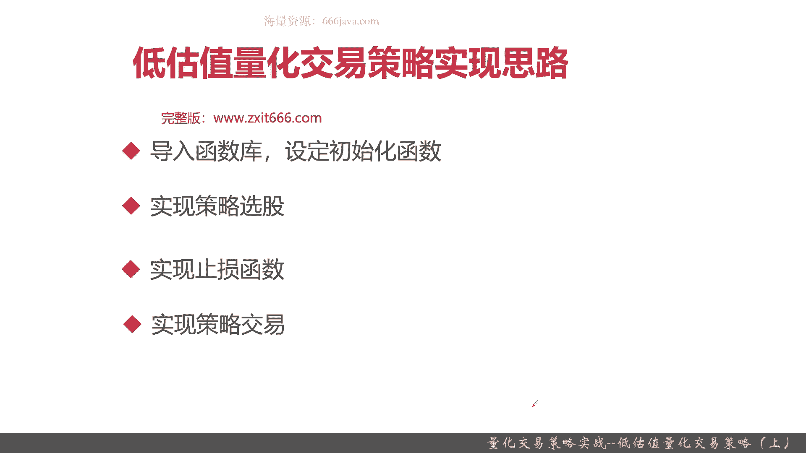

# 基于Python的股票分析与量化交易入门到实践 - P63：13.8 Python量化交易策略实战案例_量化交易策略实战--低估值量化交易策略（上） - 纸飞机旅行家 - BV1rESFYeEuA

大家好，我是米铁，在上一节呢，我向大家介绍了新能源股票轮动量化交易策略，那么在这一节呢，我给大家继续介绍另一种量化交易策略，低估值的量化交易策略，本节呢我们将从以下三个方面给大家介绍。

低估值量化交易策略，首先给大家简单介绍一下，低估值量化交易的策略的背景和基本的算法，接着呢，我给大家介绍一下，低估值量化交易策略的实现思路，最后呢老样子代码实战环节好，那么呢，接下来我们给大家介绍一下。

低估值量化交易策略的背景和算法，好首先给大家介绍一下策略背景啊，之前在给大家介绍一些选股策略的时候，给大家介绍了股票净值这个指标，那股票净值呢是决定股票市场走向的主要依据，记住啊。

市净率越低的股票其投资价值越高，相反其投资价值就越小，那其实就是说白了就是越被低估的股票，那就越有可能它有一个大幅的涨幅，凡事呢都有例外，在A股这是个市场呢，除了要考虑它的低估值，也就是它股票净值。

还要考虑当时的市场环境，公司经营上款和盈利能力，那比如说一只股票一直跌一直跌一直跌，甚至都要破发了，就是这个公司本身就有问题，那本身有问题的股票，咱们呢是不能进行投资的，否则就是只能是买着买着变股东了。

对吧好，那么根据我标红的这个极端呢，其实重点是市净率是要尽量低，然后呢要综合市场环境，还有公司本身的经营状况和盈利能力，那么接下来呢我们就给大家分享一下，这个低估值量化交易策略的算法。

这算法的呢一共有五点，首先市净率一定要小于一，接着我们要考虑他的财务状况，也就是说负债比例低于市场平均值，接着呢是它的流动性管理，就是现金流动性，企业的流动资产是流动负债的1。2倍。

也就是说他是有能力还款的，最后是风控，一个是每月一次的调仓，然后呢是止损，我们止损呢呃这个是个经验系数啊，就是如果十天内沪深300跌幅超过10%，那可能是整个行业都不景气，那整个行业都不景气以后呢。

那你可能股票估值会越来越低，所以呢在这种情况情况就不考虑买入了，那么总结一下我们的这个整个策略算法，首先市净率越低，那我们就通过市净率小于一这个指标来反映，那负债公司的经营情况和盈利能力。

我们是通过负债比例低于市场平均值，还有企业业的流动资产，至少是流动负债的1。2倍来考虑，那市场的环境，整个市场的大盘环境，也就是一个作为一个风控止损，我们又通过十天的沪深300跌幅，我们控制在10%。

当然了，也有同学你可以继续去调，有5%啊，15%啊，或者20%，这是个经验系数，感兴趣的同学可以自己去调，甚至呢你可以引入机器学习来设定一个目标，奖励函数，然后找到最合适的参数，还有一个每月要调一次仓。

保证我们的系统呢整体的那个仓位的健康好，以上呢就是这个策略的整体介绍，那么接下来呢我们给大家介绍一下实现思路，这个实验思路呢跟之前的类似，首先呢要导入函数库，设定初始化函数，接着呢实现策略选股。

再一步和我们之前有几个策略有不同，我们要加上止损函数，就是考虑那个大盘的10%跌幅，最后实行策略交易好，以上呢就是这个策略的实现思路。

那么接下来呢我们进入coding实战环节好，那么接下来呢我们进入扣键实战环节，首先我们把低估值的这个策略给大家写出来，我们就不可不是写的可加入止损，我们就直接加入止损，那止损呢，十天之内沪深300。

好十天以内呢，沪深300，如果跌幅超过10%，那我们就清仓好，那么下面呢我们开始coding，首先导入函数库，接着在设定初始化函数，首先要设定基准，pch Mark就是00030还是沪深300。

然后呢设定指数，这个指数呢待会有什么用，大家可以待会再看，好接着我们开启真实价格交易，好我们设定成交量比例，好set option，Order，volume that和ratio是一。

好接着设定股票手续费，还是买入时万三，然后，加1‰的印花税，然后每笔交易最低手续费五元，最大时长是五，超过我们就不买了，然后我们每页调一次唱，当然这个可以可以自己去改啊，然后我们设定止损。

每天判断一下是否要止损，然后每月调次仓，所以要run monthly，我们这也是一个长线的，策略，好那我们现在为止呢，我们就把初始化函数给写好，下面呢我们实现选股换数，我们首先要获取成份股。

主要是沪深300的成分股，然后根据这个成分股呢，然后筛选相应的股票，balance相关的呢就是负债了，Valuation，相关的呢都是那个估值相关的一些指标和字段，感兴趣的同学可以自己回去翻翻。

之前的那个数据获取的章节，现金资产，然后是现金的负债，或者叫一个是流动性资产，一个是流动性的负债，好我们进行一下过滤，为了减少计算量呢，有一些不在的我们就不算，首先他要在我们的成份股的指数里面，然后呢。

市净率，是零小于一吧，然后是这个，企业的流动资产至少是流动负债的1。2倍，那这个就可以算出来了，因为我们有了balance点total，大于palace点，Total library，1。2。

这里写错了，不是大，于是除，好那么的，看一下括号有没有对齐啊，OK然后要计算负债了，因为这个stocks呢是个DF，所以可以直接这样算出来，好这就是负债比例了，然后我们要算出负债比例，市场均值。

