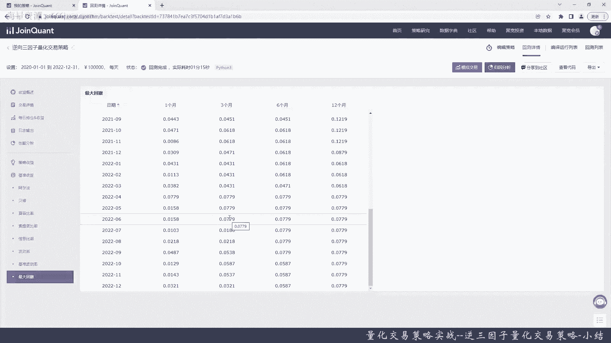
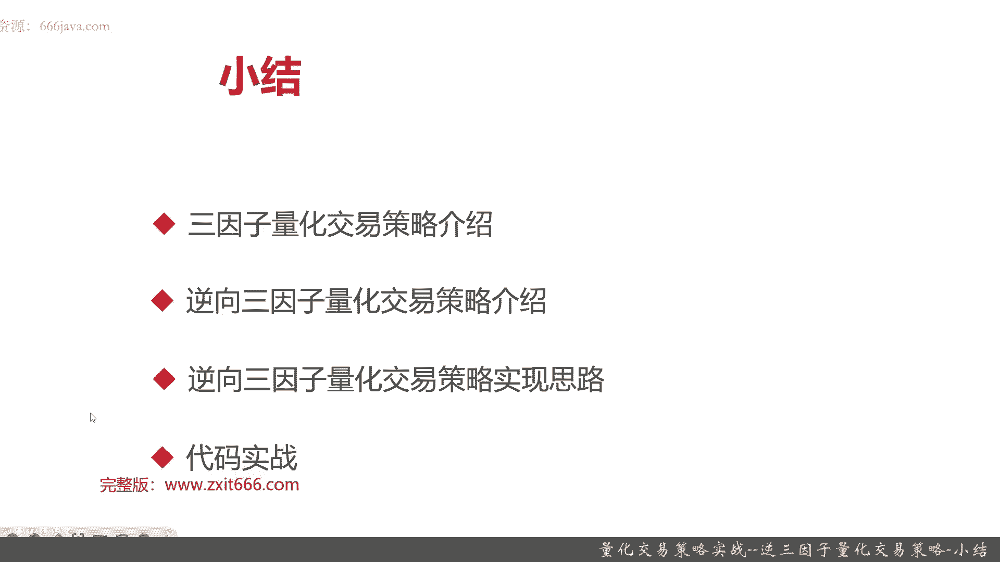

# 基于Python的股票分析与量化交易入门到实践 - P69：13.15 Python量化交易策略实战案例_量化交易策略实战--逆三因子量化交易策略-小结 - 纸飞机旅行家 - BV1rESFYeEuA

下面呢进入本章小结，本节是那个量化交易策略实战这一章，最后一节内容，我们这一节呢主要给大家介绍了，逆三因子量化交易策略，那么逆三因子量化交易策略呢，是脱胎于三因子策略。

那三因子凑应该是pharma french的，三因子模型，是金融工程领域呢非常著名的一个，入门级的量化模型，那他们呢是在1992年进行对美国股票市场，决定不同股票回报率差异的因素的时候。

偶然间发现了这个模型，这个模型呢很好的解释了CIPM这个模型的，一个无法回避的问题，就是说呢嗯股票市场的就是宏观，股票市场的风险就是贝塔值，它不能解释不同股票之间回报率的差异。

那主要是表现在呃小市值的股票，它的回报率更高，还有市盈率低的股票，它的回报率更高，那么他们两个farmer和french就提出了，那我们可以通过另外两个因素呃，一个是市值风险，因此还有一个呢是BM风险。

这两个也因此呢来解释我们这个回报率的意思，三因子模型的作用呢在于，发现了股票的期望收益，不仅仅与市场的宏观的系统风险有关，还和这个股票自身的市值，风险和账面市值比风险有关系。

然后呢我们给大家介绍了三因子量化模型的，正是哪三个因子，常见的三个因子呢是第一个市场风险因子，那他的算法比相对比较简单，就是市场回报减去无风险收益率，其中呢市场回报。

我们在A股呢用沪深300的日度收益率来表征，而那个无风险收益率呢，就用我们的国债的日度收益率来表征，那么接下来呢是市值因子，市值因子呢就用公司的总市值的自然对数，来进行提供，账面市值比。

因子是通过最新一季财报的账面价值，与当前市值的比值，也就是pb ratio的导数来提供的，那么给大家介绍了那个三因子，量化策略和交易策略，那么为什么会有逆向三因子这个量化交易策略。

首先是给大家回顾了传统三因子策略的价值，那这个价值呢就是发现了CIPM，没有办法去解释的两个现象，一个是小市值的公司的股票平均收益率更高，第二个市盈率低的公司的平均收益率更高。

这两个现象呢对A股一样是有效的，而且同学们如果是希望做一些风险更高的那个，但是收益更高的情况，请记住，从量化角度来说，还是选这两种有规律，然后呢传统三因子不足一个，他没有一个很好的理论基础。

那他没有办法去解释出市值应溢价和价值溢价，它因为它只是通过统计学的发现，就比如说账面市值比啊，然后还有那个就是市值因子啊，来发现这两个规律的存在，但是他并没有解释为什么，然后还有一个呢是呃。

传统三因子不足的典型表现呢，是在A股市场2010年后呢，普遍这个三因子表现不好，那么在此呢我们的那个就是网友们，他就自己在此之上进行了总结归纳，然后把传统的三因子呢，用三个反向因子来替代了。

分别是VROC12，real volatility和size这三个，因此通过构建这三个因子的this score，然后每月取this score最低的也就是反向嘛，50只股票进行持仓。

就是整个逆向三因子量化策略，交易策略的整体概括，那我们接下来给大家介绍，这逆向三音和是哪三个因子，第一个是特质因子，又叫残差波动率，因此它呢是bar模型中，衡量市场中不能解释的信息数据的波动情况。

具体的算法呢我们就不在这里展开，比较复杂，为什么选它呢，因为很简单，在A股中的效果，股票非常的明显，然后呢第二个因子呢，这个跟也是跟市值因子类似，我们使用size，因此也就是市值规模因子，那有一点呢。

无论是根据我们的A股的研报，还是根据我们自己的经验，都可以发现A股中的小市值股票收益率更高，最后一个呢是情绪因子，那情绪因子呢是替换掉，我们的宏观市场的风险因子，这个具体因子是VROC12。

那它的算法呢，就是通过近期交易量和N日前平均的交易量，的差值来进行计算，接下来我们给大家再回顾一下逆向三因子，这个量化策略的本身，首先选股策略，那既然已经对对全市场的那股票，进行了逆向三印度的计算。

那我们其实只要剔除呃s st股票，把所有的A股股票都进行计算就可以了，选股不用那么复杂，接着呢是策略信号，每月的第一个交易日，挑选出市值因子，特质因子，情绪因子最低的前50只股票。

那计算方式就是三个指票等权重平均计算，This sc，那当然要做些标准化，比如说呃把一些极值，或者是把一些那个NH给过滤掉，还有呢就是掐头去尾嘛，然后根据我们的策略信号，选出了50只股票以后。

那我们的就剩一个交易方式，交易方式呢就是等权持仓就可以了，后面呢我们给大家介绍了逆向三因子，量化交易策略的实现思路，这一块呢和其他的那个量化交易策略，有一个不同的地方，就是在每日收盘后。

我们需要打日每日的成交记录，那方便进行分析，那同学们呢其实在这一块也可以进行一些交易，策略的更加的一个丰富，比如说我们把没有订单呃，下单成功的得到第二个交易就去下单。

或者呢把一些订单给取消等等等等都可以，那后面呢呃我们给大家进行了coding实战，那从coding实战的结果来看呢，我们这个策略还是非常不错的，在2020年到2022年，这3年疫情这3年呢。

我们其实是逆大盘，基本上可以看到和反大盘反向表现，那大盘涨我们就我们就是有点跌，大盘跌呢我们就涨，这3年呢大盘亏了5%，而我们整体呢赚了28%，年化收益8%，这个逆向三因子策略有一个非常好的地方。

就是整体的波动率非常低，在这3年里，我们我们年化的波动率只有0。11，而大盘有0。20，也就是说我们是大盘波动的一半以内，同时我们还有8%到9%的年化收益，其实相当适合长期使用。

好以上呢就是本节的全部内容，在此呢我们也把整个量化交易策略实战，这九个策略都给大家介绍完毕了，我是米tea，大家下期再见。

