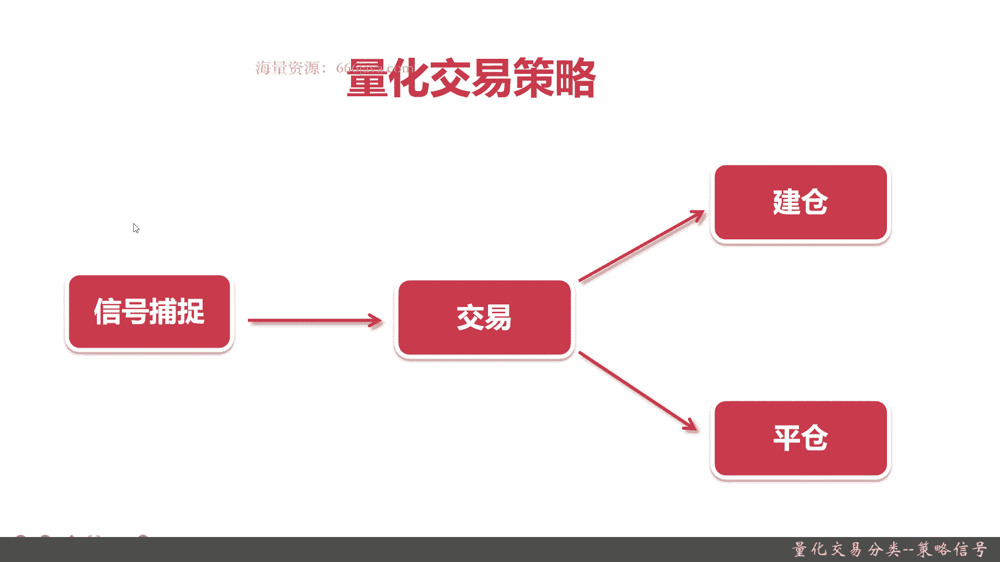
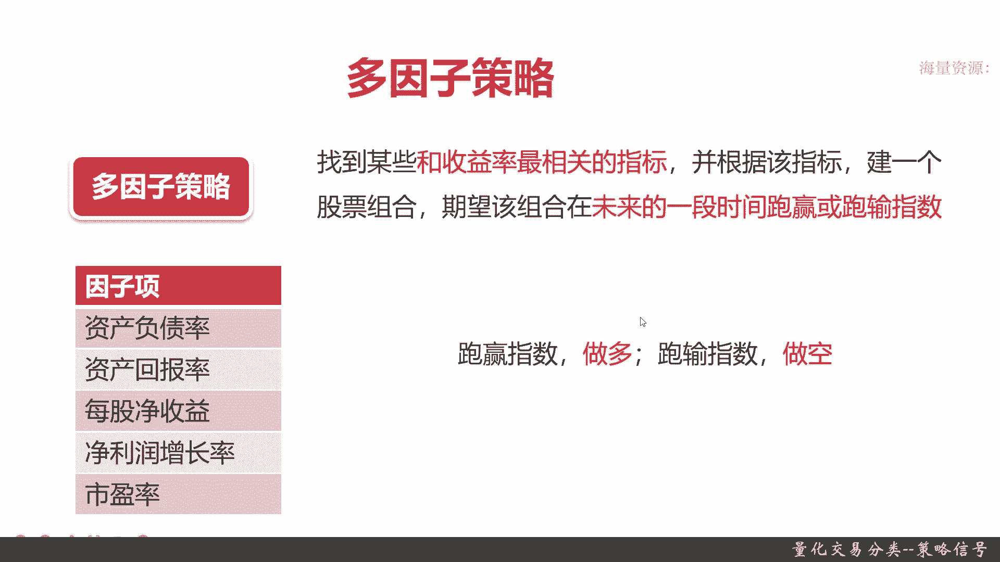
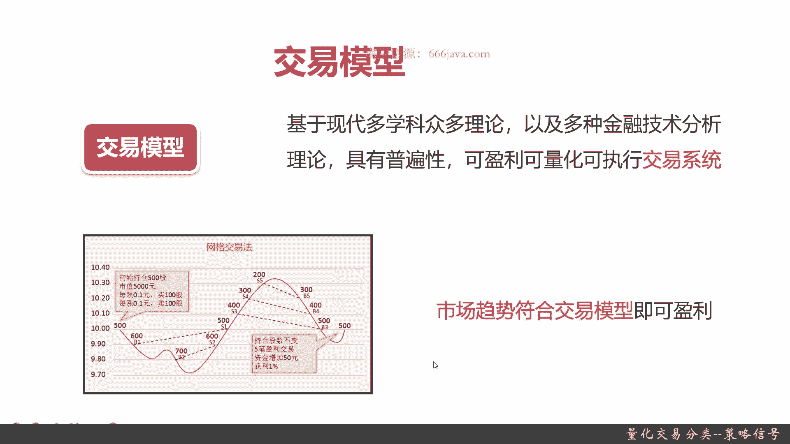
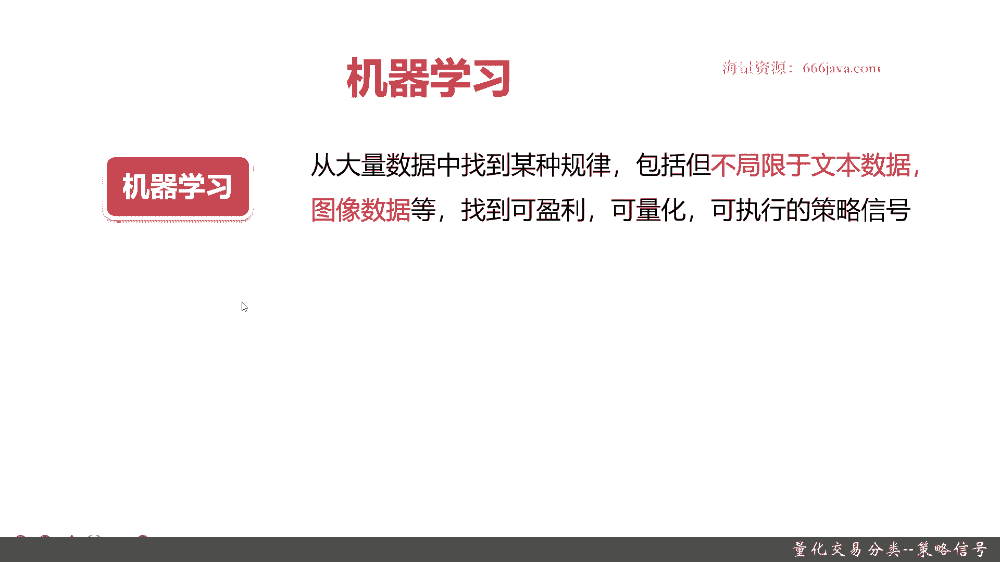
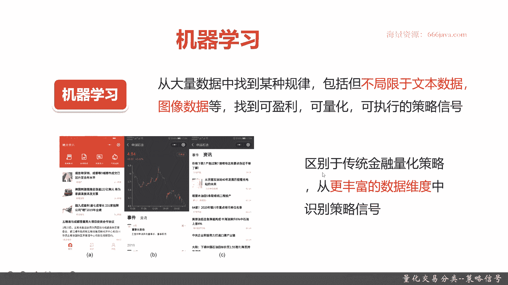
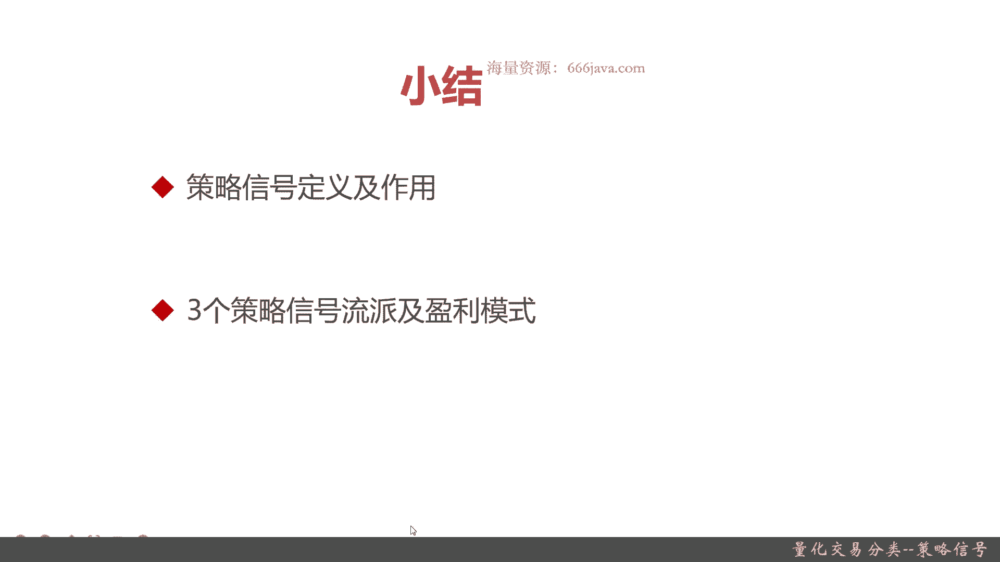

# 基于Python的股票分析与量化交易入门到实践 - P7：2.6 初识量化交易-必知的量化交易基础_量化交易分类--策略信号 - 纸飞机旅行家 - BV1rESFYeEuA

大家好，我是米田，在前两届呢，我向大家介绍了量化交易前面两个分类，一交易品种分类，二盈利模式分类，那么在这一节呢，我将向大家介绍量化交易的最后一个分类。

策略信号分类，在本节当中，首先我会先跟大家介绍策略信号的一个分类，的基本的情况，接着我会详细为大家介绍策略信号分类，下面的三个量化策略流派，它们的定义以及相关的盈利模式好。

那么接下来让我们来简单的介绍一下，策略信号分类，策略信号分类下面有三个流派一多，因此流派二交易模型三，机器学习多，因子常见或者是常被称作为多因子策略，它是一个非常常见的关于策略信号的量化。

交易的模式或者是流派交易模型，这个流派它有各种比较多的量化策略，它们统称为交易模型，机器学习这个流派嗯，现在是一个就是非常热的，也是最近几年由阿尔法go热起来，逐渐被大家所熟知和认可的流派好。

那么接下来呢回顾一下什么是策略型号，给大家回顾什么是策略清和之前呢，我先介绍一下量化交易策略的基本流程，这个呢也是一个复习，首先第一步是信号捕捉，第二步交易，第三步建仓或者平仓，什么意思呢。

无论你的量化的策略或者模型，它们是怎么实现的，第一步都是识别一些特征信号，这个信号捕捉的其实就是策略信号，这个策略后的作用是干什么的，决定你是不是应该进行交易了，还有它是哪种交易。

它是买也就是建仓还是卖是平仓，这就是量化交易策略的一个基本流程，最重要的其实就是这个策略信号的捕捉好。

我们接下来给大家看一看策略信号，它到底是个啥，简单来说，策影票定义就是交易型号，就是在量化策略里面买入或买出的一些特征，这个比较好一点，大家理解策略信号就是交易的信号，下面呢我给大家详细举个例子。

这幅图上面是上证指数的走势，可以看到有各种各样的波浪涨跌，然后这里又是跌，这里又是涨，在震荡，那我们假设零是买一是卖，把，我们的操作可以用下面这个类似于脉冲信号的，交易信号的图可以给大家看到。

OK1开始是买，后面稍微涨一点卖，然后继续买，直到高点我们就卖出在这里，因为它是持续的要去跌，那我们还会继续买进，然后他又开始爬坡了，那我们就涨，就是整个是这个样子，那我们把这两张图进行模拟拟合一下。

进行一下信号拟合，可以到这幅图，那大家其实看这其实是不是有点像脉冲信号，然后下面是一个波浪趋势，这个就是策略型号的基本的一个示例吧，OK让大家有一个比较通俗易懂的例子，理解一下什么是策略型号好。

接下来呢我给大家介绍一下多因子策略，多因子策略其实理解起来很容易，手段就是找到和收益率最相关的指标，其实因此就是指标，然后呢根据这些指标，我们能建立一个相关的股票组合。

确保能在未来的一实验时间跑赢或者跑输指数，这是目的，OK我们下来举一个实际的例子啊，这些是因此下，比如说资产负债率，那低于5%，资产回报率大于20%，每股净收益大于百分之多少。

净利润净净利润增长率可能是大于20%，市盈率要在30倍以下，这个是我随便举的一个因子项，这一个是一个因子组合，当然了，各种指标都可以随便你想要，比如说你觉得是要互联网板块或者新能源板块。

这也是一些因子项，这些因子项建立了以后，他会有一些股票的组合，这些股票组合，那怎么去赚钱呢，其实很简单，如果是我们确定，我们这些股票所做是跑赢的指数，那只要做多就可以了。

我们如果能确定这些股票组合一定是跑输指数，比如说比特币在一定时间内，你确定它一定会跌，那OK你就做空就行了，或者期货石油它一定是涨的时候，那你就做多。

这个就是多因子策略，OK多因子策略比较好理解，我们接下来给大家介绍一下交易模型，从交易模型开始呢，这块就有一些比较的金融的理论工程，可能有些绕口，我们先简单给大家看一下定义啊，什么是交易模型。

交易模型就是基于现代多学科众多理论，以及结合了各种金融技术分析系统，具有普遍性，可盈利，可量化，可执行的交易系统，这个定义念起来非常拗口啊，它就是一个交易系统，就像程序，那你程序软件它就是一个系统。

一个平台，这个交易模型你每次根据你的经验，或者结合各种理论创建，并且实现的可以盈利的，可以被复制的就是你的交易系统，我们这个定义还是有点难理解，没关系，我们给大家一个举个例子。

交易模型里面有各种各样的流派，我们可以去大家简单一个介绍一个网格交易法，广告交易法其实实现起来很容易，它主要是为了方便量化交易而实现的，它是怎么样呢，它是根据股价无论涨无论跌，是划分一个相关的网格。

可以看到我们在我们这个例子里面，网格就是一毛钱，我们以十块钱为起始，也每跌每涨一毛钱会做动作，每跌一毛钱也会会做动作，就比如说我们根据我们的规则，初始的建仓，在十块钱的时候，我们买500股，每涨0。

1元，我们就卖100股，每跌0。1元，我们就买100股，在这种股票的走势情况下，会是出现什么情况呢，首先在十块钱的时候，我们有500股，然后它会先跌，跌到那个就是九块九了，那其实就是跌了一毛。

触发了这个跌的网格，那我们应该再买，OK买了100股，现在变成600股，然后股价继续波动到了九块八，OK这个时候其实这个线有点画错了，应该是在这里啊，跌了九块八，他应该继续买。

那买了就是变成了那个700股，OK然后它还会跌，但是呢因为这个时候没跌到九块七，也就是没有触发我们的阈值，当然这个你的网格是0。1还是0。01，当然最小是一分钱，这根据你自己的程序去实现。

这个其实都没什么，这个是调参数，不停的去调的，只要你没触发这个阈值，它是不会进行交易，这就是涨或者跌，零零就是策略信号，就是交易信号，然后它开始涨了，反弹了，涨涨涨涨涨，现在还是九块八，九块八的时候。

它会涨到九块九，涨到九块九了，这个时候我们就开始卖了，OK赚了赚了就是一毛钱的那个100股，赚了十块钱，然后到500我们又会去买，然后一直到到到到到到到到到了，那个就是十块三毛时候。

我们应该是卖了将近五次了，然后高点以后，由于它没有触发到再高点就十块四毛的时候，应该不会再卖了，那它又会跌又会跌的时候，这个时候我们又会去买，然后到了最后它又震荡到十块钱左右的时候。

这个时候我们应该还是有500股，那五笔交易是盈利的，其实最终是跑量，那我们其实资金整个增加了50元，就获利了1%，当然了，整个这个图里面，其实它是一个高频的常见的场景，它呢比较的理想化。

我们还没有把交易费率啊这些给算进去，不过总体网格交易其实就是这样的，大家别看这幅图，这幅图很常见，而且时间会非常迅速，一般来说有可能在那个交易频繁的情况下，这些整个发生的事件可能都是在几十秒。

最多也不会超过12分钟，这就是高频量化交易，那从这个例子呢也可以，大家看出交易模型的情况呢是怎么赚钱的，其实只要市场的震荡趋势，符合我这交易模型的范围，我就能盈利，为什么交易模型会有这么多呢。

因为也很简单，如果我这个起始的持仓位，它不是在中间十块钱网格交易，特别适合这种有震荡的，有高有低的情况，他如果只是单边的上涨或者单边下跌，那我就很尴尬，比如说那个我是在最高点买的，那他一他一直是会跌。

按照我们的设计，每跌另外我就买100股，最后我就没有钱再买了，然后也不知道什么叫误判，那就是一直这捂着，最终就是亏吗，一直是亏，这是网格降下来不适应的场景，OK交易模型，那它怎么赚钱呢，大家记住。

就是根据市场的趋势，只要能符合你的交易模型或者你的逻辑。

就能赚钱好再下一个流派呢，是最近就是最近几年比较新奇的机器学习模块，机器大家都听过，但是在量化交易的机器学习是怎么用的呢，它主要也是找到一种规律，也是最终的目的是到可盈利，可量化，可执行的策略信号。

可以用各种各样的数据嗯，具体我就给大家举个案例。

讲个案例给大家解释一下这个例子呃，是这样的，就是我们现在有很多的那个就是机构，或者说研究院，他们呢在做一个尝试是怎么样通过机器学习，这里面主要是通过文本挖掘，自然语言处理。

还有知识图谱技术去找到各种新闻媒体，新闻事件和对于某一只或者某一几只，股价的趋势的影响，比如说中国石油它是有个震荡趋势的，那他比如说发了一个新闻稿，就是能源价格下跌啊，或者说是深圳呃。

成成都的楼市回暖啊，或者说是整个这个中国石油董事长变多啊，是不是和这个股价走势趋势有关，最好呢是能带来一定的前置作用，比如说呃我今天股市场变动了，那由于市场看好新增的这个股市场。

可能今天或者是今天下午或者是第二天，股价开始上扬，当然也有可能市场不看好这个换帅的举动，那可能会去下跌，这个呢就是通过机器学习去研究，当然了，这是一个想法，现实中呢也没有那么美好。

这个机器学习就能立刻来找到这个趋势，因为数据量实在是太多太杂了，而且中国的舆论有的时候还有一些假消息，它还会更加影响到你的那个机器学习的研判的，那机器学习这个流派呢，它的目的是什么呢，或者在引入模式呢。

其实就是我这里所说的，它是区别于传统金融量化策略的，然后呢想通过一些尝试，像挖矿一样，从更加丰富之前没有尝试过的角度，来识别可能的交易信号，也就是策略型号，OK那我们现在向大家简单的介绍了一下。

这三大流派的基本的定义以及相关的盈利方式。

那我们现在做一个小结，策略信号它是什么呢，其实它就是交易信号，它主要表征了你这次交易是该买还是卖，这个策略信号在整个量化策略里非常非常重要，是我们的核心，然后三个策略型号的流派和盈利模式呢。

是多因子模型，多因子模型它是怎么去盈利的，能找到和指数相关的，未来是能跑赢指数还是跑输指数，确定的一个股票组合，如果跑赢指数，那OK我就做多就行了，如果跑输OK我就做空，这个就是多因子策略。

它的定义和盈利模式，而交易模型它其实就是一个交易系统，那我如果我们的股票市场趋势，符合我的交易模型，这个逻辑我就能盈利，当然了，反人皆知，我不符合我就是只能是亏钱，然后机器学习这个流派非常新。

其实就是我们大家已知的机器学习技术，只不过呢应用在量化领域里面，希望可以通过其他的一些数据或者是这些算法，发现传统的金融流派或者技术，无法去发现的策略型号，OK这就是整个策略信号这个分类的。

这一节的内容，我是米提亚好。