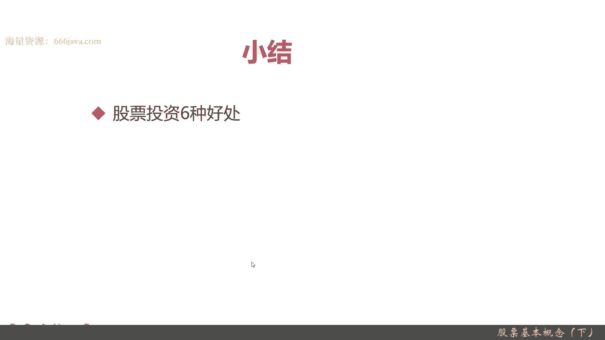
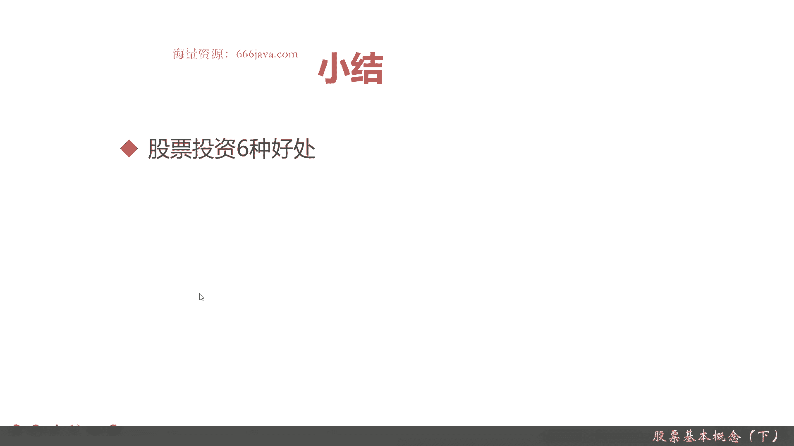
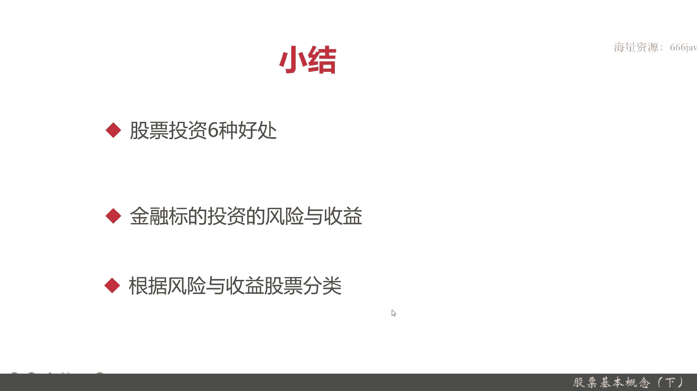

# 基于Python的股票分析与量化交易入门到实践 - P9：3.2 进军量化交易开发第一课-基本的股票交易维度和概念_股票基本概念（下） - 纸飞机旅行家 - BV1rESFYeEuA

首先呢投资利源好处，那投资可以获得股票的红利，就是分红，可以做到配股和送股，股票进行交易，你可以直接获利了结，股票所需的投资本金少，股票的交易周期短，它易变现好，还有非常重要的好处。

就是它不会随着通货膨胀变成货币贬值。

它是有比较重的投资属性，然后呢，是常见的八种金融投资标的的风险与收益，其中定存他的风险低，收益也低，他所需本金也很少，变现性呢它是中基金呢变现性高，但是他的的投资风险它是中或者高，它的收益算是高了。

然后投资本金也不高，也是小，再举几个例子，比如房地产，房产它的本金是最大的，投资的风险和收益都是中变现时间是最长的，而股票他投资本金不定，主要是看你投资的股票的种类，因为股价有从一块钱两块钱的。

一直到2000播的都有不得，国外的那个每股它也有有700美元的，也有一两美元，甚至都有00。1美元，股票的投资的风险收益和可变性都是高好，这就是常见的几种金融投资，接下来还有期货啊，债券啊。

我就不详细了，有些同学你可以回去自己回顾一下，复习一下，最后呢是风险，根据风险与收益进行的股票分类分蓝筹股，白马股，成长股，还有周期股和题材股，蓝筹和白马很好理解，就是业绩优的，然后龙头企业。

只不过呢蓝筹股，它的市值一般的都在5000亿以上了，以前可能只要1000亿，现在都5000亿了，而白马股它的市值稍微低一点，3000亿就是1000亿到3000亿左右。

然后呢他的那个就是一般都属于在消费行业，成长股呢，它是一个明显的有在某一段时期，不可能所有股都是成长股，某些股票回到那个例子啊，那个就是蓝筹股，大家就想到茅台，现在的茅台。

而那个白马股就像在那个海尔之家，成长股呢，他就可以，大家可以想到东方财富在疫情那段时间，到2021年，这一年它涨了三四倍，这就是成长股，成长股呢一般是在高科技技术行业，东方财富嘛就是天天基金网。

它是一个金融科技行业的典型企业，现在它也不是成长股，因为它的市值已经达到了那个两三千亿，它也可以算白马股，而周期股可以典型的万科，周期股的行业是房地产，制造业，然后运输业，还有传统汽车。

最后一个呢是题材概念，比如说元宇宙，你想到题材概念，你可以想到元宇宙，一个叫宋城演义的，它基本上随着元宇宙的概念兴起，它就股价就上扬了，最近元宇宙不怎么火了，他也就股价也就降低了。

题材股呢其实题材概念股，概念股其实就是题，一般都叫题材概念股或者叫概念板块股，它一般和业绩没有关系，主要是操作概念好了，那以上就是本节的内容，谢谢大家收看。

我是米田。