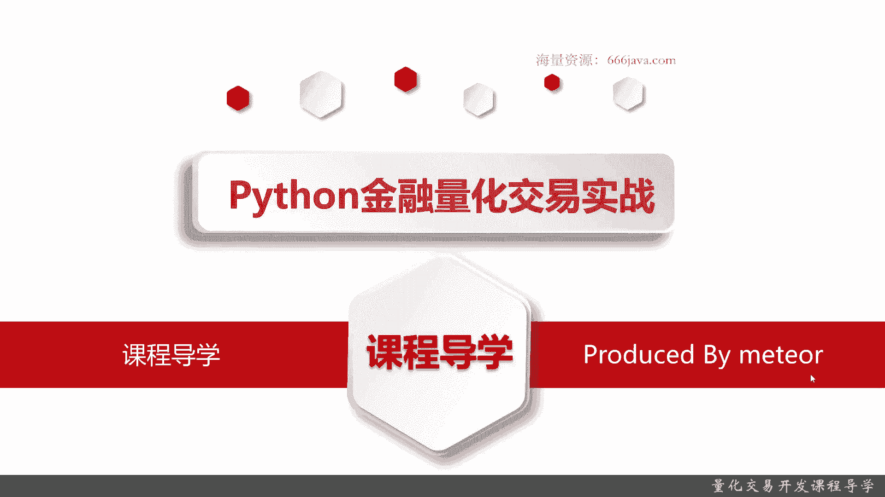
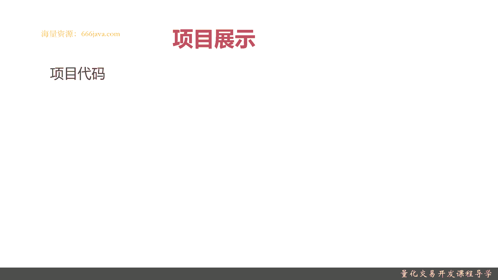
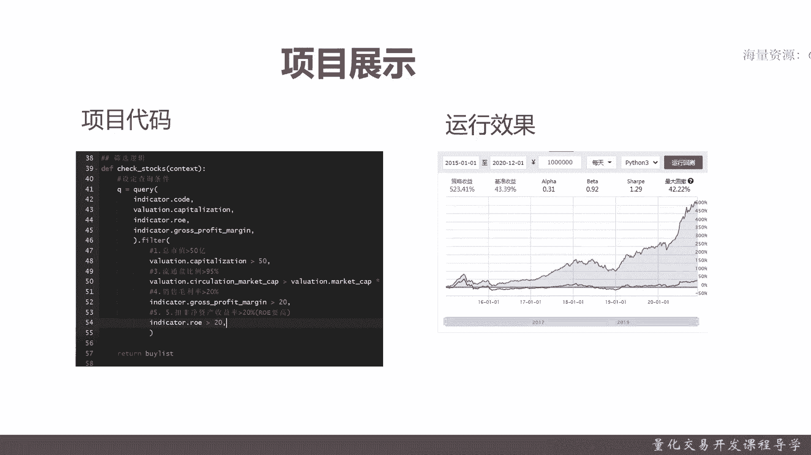
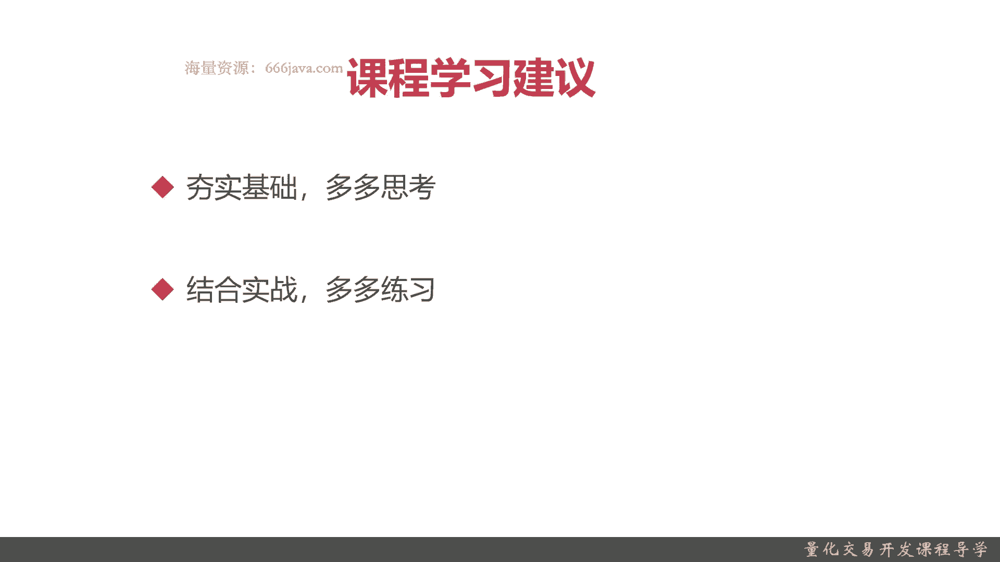

# 基于Python的股票分析与量化交易入门到实践 - P1：1.1 课程介绍与学习指南_量化交易开发课程导学 - 纸飞机旅行家 - BV1rESFYeEuA

大家好，欢迎大家收看Python金融量化交易实战的课程导学，我是米切尔，我拥有十多年的大数据行业的开发经验，5年以上的金融量化相关的开发经验，目前我是在金融科技行业的一家金融量化公司，任职技术总监。

我主导过好几个金融量化投研平台项目的开发，还有管理，目前我负责开发和管理的基金量化投研平台，直接管理着1000亿以上的级别的资金，接下来就由我来带领大家进军金融量化开发。

很多同学们肯定认为，那个量化交易其实就是量化投资，也就是跟金融有关系，你没有良好的资金，或者你不做股市操盘手，你就没有办法进行量化交易，这个概念呢其实是错误的，一般来说狭义的量化也就是量化投资。

那主要是一些股票的交易行为，那其实我们这里所说的量化交易呢，是广义的量化，他的工作的实质呢是金融科技，它主要呢结合了金融，数学以及计算机编程，这三个现在非常有前景的行业领域的综合知识。

现在有很多著名的公司，其实它都已经是把量化交易，作为他们主要的招聘和业务拓展了，首先我们可以给大家举例，比如说这个公司高盛，它是美国最大的华尔街的金融投资公司，那在20年前，高盛还是以人工的交易员。

人工投资为主，现在呢大概有一半左右的交易人员，基本上都不见了，都是由数学家，然后金融分析师，还有量化交易程序的开发人员组成的，现在在美国，大概50%左右的金融交易，都是完全通过计算机的量化交易实现的。

再接着呢我们给大家举个例子，这家呢是中国的中信集团，它是全中国最大的证券公司，那这家证券公司呢，现在也有40%以上的人员，是采用量化交易进行交易的，然后这家可能大家都比较熟悉了，就是蚂蚁集团。

就是蚂蚁金服，蚂蚁金服呢他现在应该说他是在转型，他之前一直是在做花呗，借呗，一些金融的借贷，那现在的业务呢，逐步的是进行一些量化相关的工作，就是蚂蚁其实现在非常火的一个，就是基金的购买。

基金购买呢他的那些基金的评价分析，他也是在做量化交易，所以呢整个量化交易，它是有一个非常好的行业的前景，然后呢因为量化交易其实它是综合了金融，数学和计算机三个学科，而且这三个学科呢都需要学到一定的知识。

才能获取量化交易开发的人才，其实是空缺非常大的，传统的金融工程或者金融的院校，他们专业的出来的，他懂的是金融和数学，但是他不懂计算机开发，很多计算机一些工程，比如说就是Python搭一个内裤。

搭一个框架，其实都不是那么容易可以做好的，当然了，像我们这些大多数同学，可能都是那个计算机专业的，对于Python对于编程，对于工程化可能会做得相对好一点，但是呢金融和数学这两块领域呢，可能不是那么多。

不过这个没关系啊，你只要综合掌握了这三门那个学科的综合知识，在量化交易开发里面你肯定可以手到擒来，量化交易呢，其实可以是我们程序员转型的重要方向，有这样一句话，同学们可能可能听过，人人都是产品经理。

很多程序员呢他可能发展发展的，他就会转产品或者去转项目经理，或者去转运维测试，那其实现在呢你如果从事的是量化交易开发，你还有一个重要的选择呢，就是金融方式收尾，比如说你自己已经的原始积累了。

那你可以从事一些量化交易，你用自己的钱可以赚一点，整个的行业呢，其实互联网大厂都在不停的裁人，无论是阿里啊，腾讯啊，京东啊，还是那个小米啊，都是不停的裁人，互联网大厂呢。

其实程序员已经过载了已经非常多了，大厂都是这样慢点新建小厂的，反而其实现在金融科技它是一个比较新的行业，最近两年才开始火起来，那金融机构的其实非常缺程序的开发人员，那你可以先从量化交易做个敲门砖。

然后在金融领域站稳了脚跟，那你将来在金融领域发展，其实也是一个不错的行业选择，接着呢我们给大家介绍一下课程的亮点，首先呢咱们的课程是系统化，现实当中呢同学们听到量化交易，那也只是局限于量化交易。

市面上课程呢虽然很多啊，但是成体系能通俗易懂的给大家讲解的课程，就不是那么多了，要么呢就是完全的都是金融和数学推导公式，Python的编程较弱，要么呢就是一个太简单了，那对一些金融和那个数学知识呢。

介绍的又不够多，那我们这门课呢，其实是在整个我们慕课网首次进行体系化讲解，量化交易的课程，我呢是有非常丰富的金融，量化领域的研发的经验的，在这门课程的时候呢，给大家成体系的分享一下，在实战中。

尤其是一线开发的时候会遇到哪些问题，然后呢就是实战教学了，在咱们这个课程呢，每一章每一节都会有实战教学，就是不仅仅是一些金融，涉及到金融知识的原理，还有数学公式的推导。

我们在每一节后面都会有一些实际的coding，那把整个课程从金融到数学，再到计算机编程都已经串行起来，然后呢，我们会给大家提供，非常真实有效的量化交易策略，在我们这课程里面提供的所有的量化交易策略。

都是一个实际工作中，或者是如果同学们真正对量化交易感兴趣，自己想做点策略的话，都是可以直接用到的，然后我们这些交易策略的一些回测的成绩，这个策略到底好不好，同学们都可以在实际看到，最后呢。

咱们的最后一章会给大家进行一些就业指导，分析，里面呢会有很多市面上罕见的，主要专注在量化交易的一些面试真题的解析，这样的同学们就可以知道，现在如果要从事量化交易这个开发岗的话，面试时候会遇到哪些题目。

那他们的侧重点在哪里，如何有针对性地进行学习和补强，接着呢我们给大家看一下，我们一些实际的项目的一些展示啊。

我们的所有的项目实战呢，都会分项目代码和代码的结果，首先呢看我们的项目代码，这里我们会把每一个字母都，我们手手把手的给敲给下，然后同时每一个步骤针对一些特殊的一些策略，还有一些代码实现。

我们都会有相应的注释，然后在每一步呢，那等到这些代码敲完了以后，那其实就要进行运行效果的展示了，我们之前采用的是一个巨宽的量化交易平台，我们这里无论是我们用的是巨宽量化交易平台。

还是我们自己通过一些Python，实现了量化交易的一些案例，我们都会有一些实际的运行效果给大家解释，尽量是采用了可视化的结果，比如像像右边这幅图，那其实就是左边的这个策略，在2015年1月1号到。

2022年12月1号这5年的一个回测结果，可以看到，综合呢其实看了没这个策略的收益还是可以的，5年大概涨了500%多，当然了，现实当中同学们不要仅仅通过回测就进行购买，这样的话那亏的可能是你们自己啊。

但是这可以说明就是，我们这些策略都是真实有效的，所以才会放出来给大家压，这些策略都是完全都是有用的好。

那在接下来呢我们会给大家分享一下，学了系列课程呢会有哪些收获，首先我们这个课程呢会有丰富实用的，量化交易的实战知识，那具体呢我们会给大家提供20家的实战案例，基本上每一节都会有相应的一个实战案例。

然后呢我们还会给大家提供20家，也是非常有用的，量化交易的策略，从金融知识再到数学的公式和推导，最后到他coding落地，都会详细的给大家进行讲解，除了丰富的量化交易实战的知识以外呢。

如果同学们有好好的学习，我们这门课呢，可以进行独立的量化交易策略的开发，那这样其实呢就对你进行这个岗位的面试啊，入职啊都会有一个非常好的一个优势吧，因为其实量化消息开发。

其实相对于和一个普通的开发稿其实也很先进，它重要的是一个动手能力，它是一个推实践的，如果你能在面试之前，你就独立的能完成一些量化交易的开发，那自然在面试中其实或者在岗位入职呢，会给你有不少的加分项。

最后呢量化交易，量化交易重点的培养的是量化思维，那同学们以后对于一些金融相关的，或者经济学相关的，在我们这门课如果学下来，你就会有一个量化的思维的培养，整体思路和眼界就不太一样了。

如果同学们真正掌握了这个炼化思维，那你以后无论你将来是不是从事联网交易开发，你都会有一个合理的数学量化的思维，对于你进行分析问题，分解问题，然后做出更加有意义的一些选择。

或者是更加有利的一些方向的发展吧，对你们都会有非常大的帮助的，然后呢，我们给大家介绍一下我们的课程有哪些内容，我们的课程首先会介绍一些呃，量化交易的前置知识，包括金融相关的，比如说股票到底是个啥。

影响股票它的交易它有哪些因素，影响股价它有哪些因素，然后相关的一些数学知识，比如说如何才能量化量化嘛，其实就是一个数量，这些数学知识呢，比如说如何才能确保这样去购买股票，或者你的策略是稳赚不赔。

就是用数学的话就是胜率很高，然后呢还会给大家介绍一些常用的量化，编程的相关的知识，比如说如何去进行时间序列的分析，如何用Python来实现K线图啊，MACD啊等等，然后给大家整个前置知识大概有四章左右。

等到这个前置日介绍完呢，我们就大概就是我们整个课程的一个，核心的内容，就是量化交易的策略，首先呢是分章节的讲述，最后是综合实战这一块，大概有个六七章左右的过程，最后呢我们会有一张。

专门为希望涉足Python量化交易的这个同学们，进行一些就业指导，包括一些这些职业的整体规划，还有一些面试心得等等，那最后呢我们给大家介绍一下，我们整体的技术站，首先这块要需要用到Python。

主要都是Python为主，当然了也有的是C加加，但是那一块呢是偏交易的，并不是进行量化交易，接着呢是南派，这是一个常见的数学的计算二方库，接着呢是pandas as。

pandas as其实是Python非常常用的，用来做时间序列，其实它说白了，很多时候都是为了做金融而设计的，还有一个呢matt blab，这个呢主要是用来做画图的，最后我们给大家在我们这里呢。

我们这次考虑到同学们都是刚接触，Python的量化交易，可能对一些量化交易的框架呢不是特别熟悉，所以呢选用了一个比较常见的，在国内非常知名的巨宽量化交易平台，给大家进行入手，那刚才介绍了那么多。

要学习我们这门课程需要有哪些前置的内容呢，首先同学们一定要有一些Python基础，Python量化交易开发肯定要有一些Python的基础，一些基本的项目的开发，那些框架的运行啊都要有，然后呢。

更重要的一点就是，要对金融的量化开发非常感兴趣，只有感兴趣了，你这才是你最好的老师，你才能好好学到更多的知识，因为有一些知识呢同学们自己去查，自己去练这块，只有从兴趣出发才能获得更好的效果。

然后呢同学们必须掌握大学本科应该是理工科，都应该会去学一些统计学相关的一些知识，这块呢同学们应该是要最基本的，大学本科统计学的一些知识，比如说知道一些概率啊，知道一些怎么计算连续的概率啊这些。

OK这是学习本门课程的一些前置内容，最后呢我们给大家分享一下学习的建议，首先呢就是一定要夯实基础，我们前面学的这几章都是一些基础，要一定要从这几章开始，前面的三四章在前世之时呢就把基础给夯实。

否则到后面的其实我深入讲下去，同学们可能听都听不懂，然后呢多多去思考，如果有不懂的问题呢，欢迎大家在问答区向我进行提问互动，我会在问答区解决大家在课程学习过程，遇到的相关问题。

努力将大家培养成为优秀的量化交易工程师，然后呢，我们每一章，每一节都会有一些那个项目实战内容，然后呢同学们不要仅仅只是看我的视频，或者看我的一些分享的后面的一些教材，自己呢也试着把我的这些代码和。

涉及到一些公式进行一些练习，最好能把它们变成综合的容纳吸收，成为同学们自己的技能水平，这样是最好的好，以上就是本节的课程导学。

