# 基于Python的股票分析与量化交易入门到实践 - P10：3.3 进军量化交易开发第一课-基本的股票交易维度和概念_股票行业分类 - 纸飞机旅行家 - BV1rESFYeEuA

大家好，我是米田，在上一节呢，我们给大家介绍了股票基本知识，的一些核心概念，比如说股票投资的好处啊，股票常见的一些金融投资标的，那它的风险和收益是什么情况呢，还有根据风险和收益进行分类，股票有哪些分类。

蓝筹股啊，白马股啊，成长股啊，周期股啊，还有一个概念股好，那么本节就向大家介绍一个。

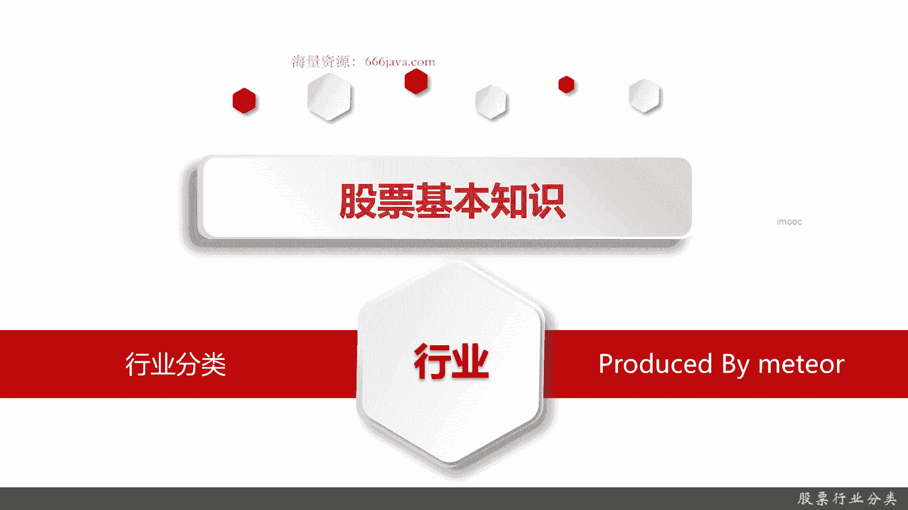

股票治理非常重要的核心概念，行业股票的行业分类，这一节从两个方面给大家介绍，第一个呢就是股票行业分类，一个是申万分类，一个是中证分类，接着呢给大家介绍一下行业分类的一些作用好，那我们现在切入正题。

股票分类呢主要有下面两种，一种是中证行业分类，中证行业分类其实它就是中国中证指数公司，中证指数公司是什么公司，它是证监会直属的一家金融信息科技公司，它呢中证的行业分类。

它其实主要是权威发布一些中国证监会相关，主要是为了监管而相关的，官方的一些行业分类和指数，中证行业分类它是从07年就开始发布的，然后到现在的版本是21年的2月份，那也也有一年多了，它也会持续迭代。

中证行业分类呢你可以理解为官方分类，那主要是为证监会监管而服务的，再下一个是申万行业分类，可能大家不是这个领域的人，没听过，但是不要紧，我今天给大家介绍一下深入方向，就是深红外源研究所。

深红万源市是个什么背景呢，它是我们现在国内top three之一的票的行业研究所，然后呢，这个版本现在最先进的是，2021年8月进行修理的，他呢发配我们这些就是搞金融，量化或者金融分析的人。

主要是偏向于我们这些人适用同源分析，它相对呢比较务实，更加接近中国的行业国情好，我们下面来详细给大家介绍一下。

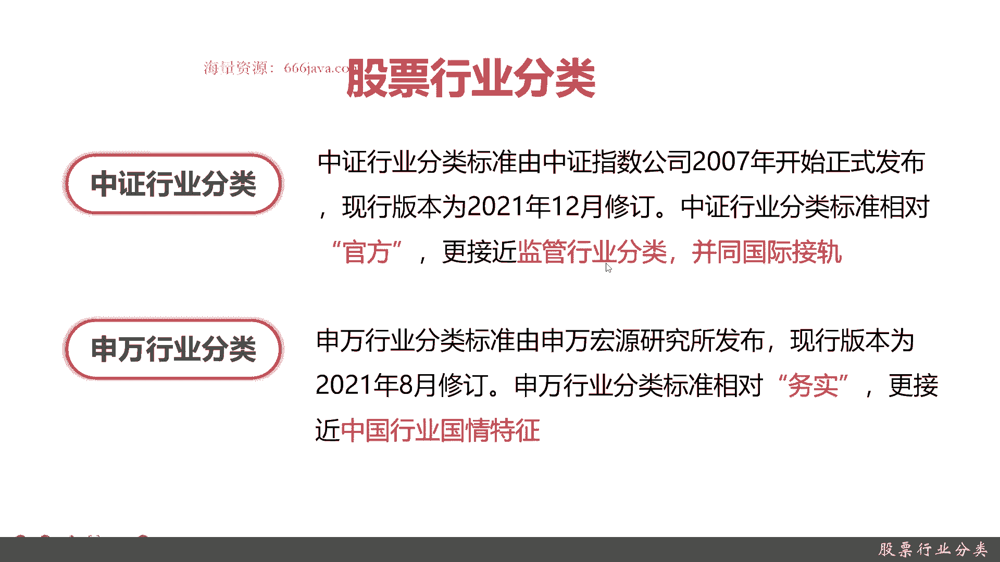

中证行业分类它一共有四级，也分1234级，然后级与级之间有关联关系，一级的下面有一共有11个一级行业，35个二级行业，90个三级行业和200个四强，在这个页面大家可以去查询查。

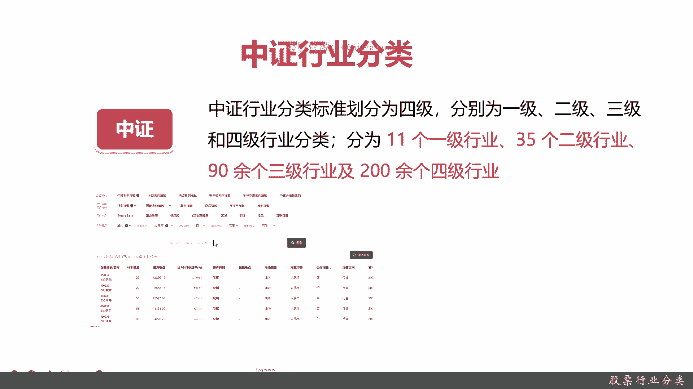

这中证行业，待会我可以把安全先放下来，这个页面呢就是中证行业的指数。

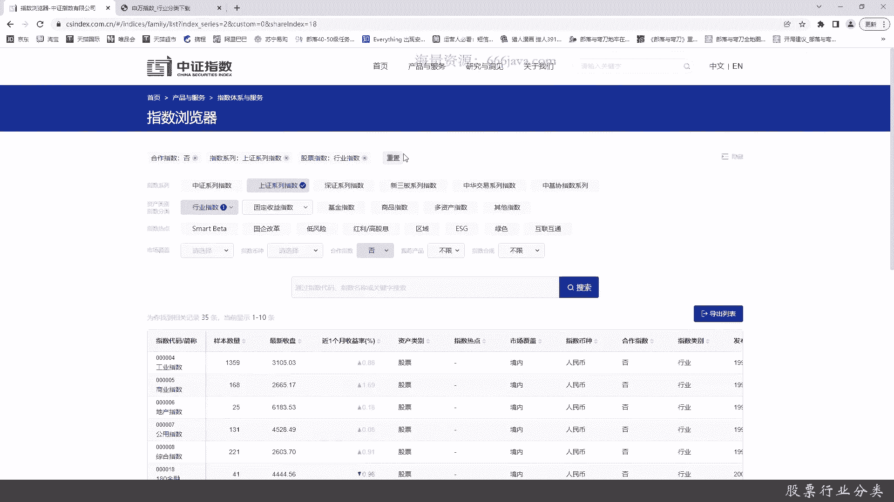

那其实虽然是指数呢，其实它都是根据分类的，因为新闻有分类才有指数嘛，你可以看到它一共有大的一级分类，一共35条，然后呢有工业的，商业的地产，巴拉巴拉巴拉，各种各样的，这个我就不具体展开。

大家可以导出个列表，那这个指数列表呢打开一下。

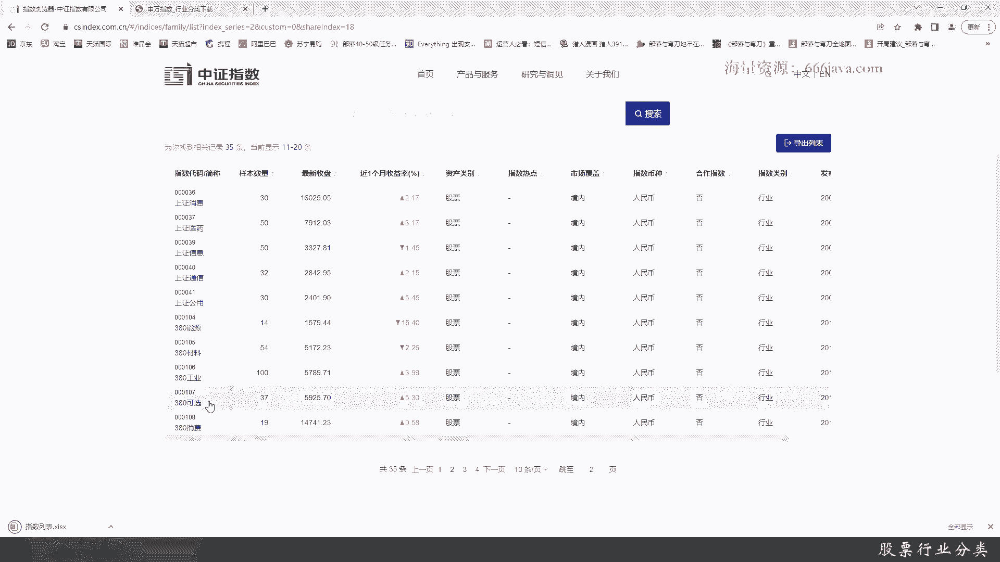

这个列表呢其实就可以看到基本的一些指数，OK好的，那么接下来呢我们来看看申万行业指数。

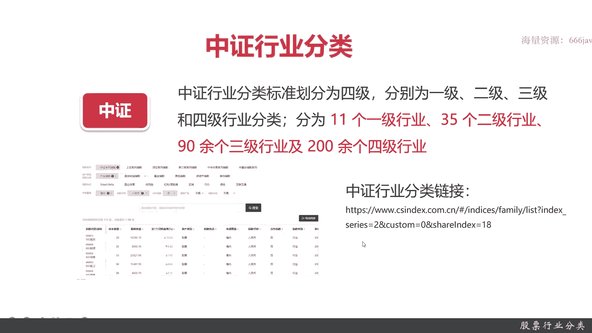

申万行业指数有三级，它只有三级，简化了不少，别看这只简化一些，但是是简化了非常多的，然后一级行业30一个，二级行业134个，三级行业346个，其实可以看到，其实申万行业制度。

其实相当于是从中证的二级行业开始，那其实方便不少，然后呢这是它的页面，也大家也可以去下下载，这个是行业分类的链接。

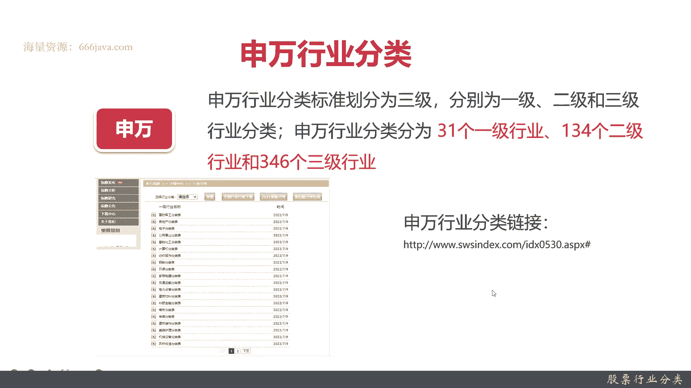

那一级行业名称，传统媒体啊，电子设备啊，巴拉巴拉巴拉巴拉，大概有30几，然后石油化工啊比较有特色的中心行业人了，他有一个那个就是美容护理，农林护理都有啊，农林牧渔都有，但美容护理才是中证行业比较特殊的。

可我们可以随便下一个例子啊，比如说我们下一个通信分类吧，可以看看通信的。

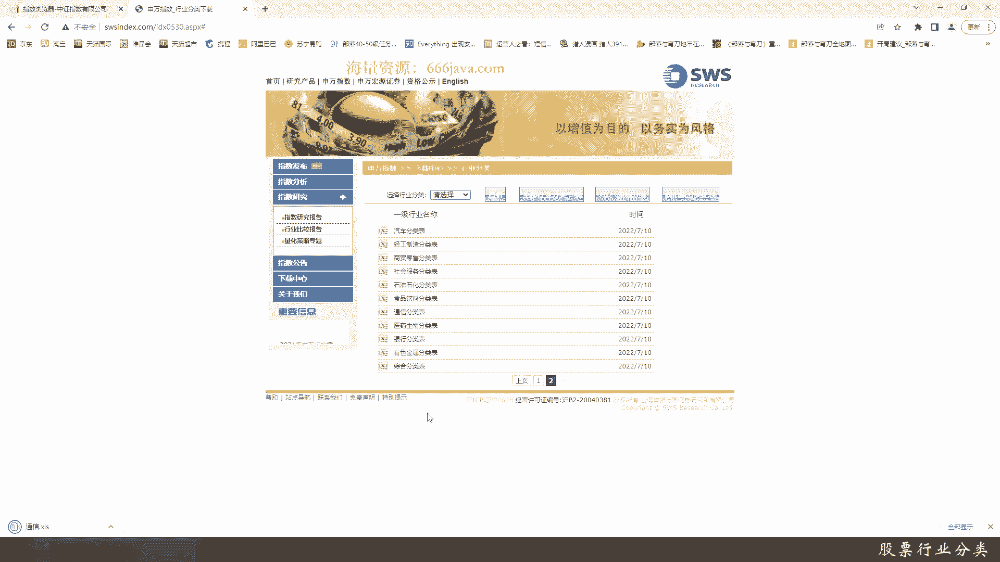

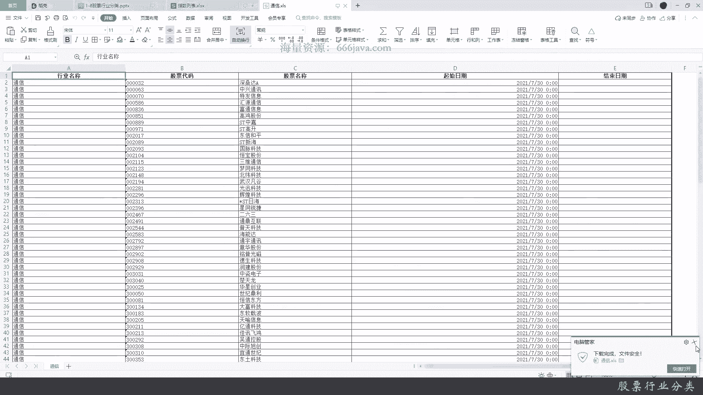

通信的啊，他有这些股票时间也都有的，这就是通信行业的分类。

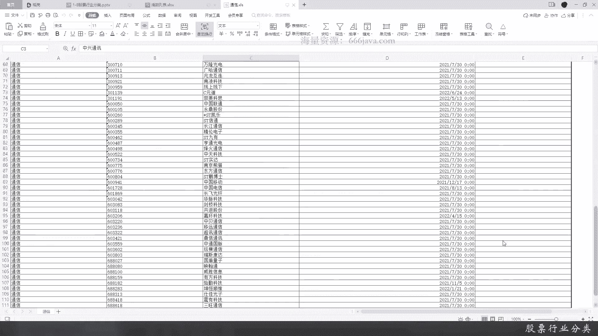

那我们现在下一步来看看有啥用，否则只是看到这些分类，其实那同学们也说，这跟我的量化投资有什么关系呢，好研究行业，其实是股票里面研究一个非常有用的东西。

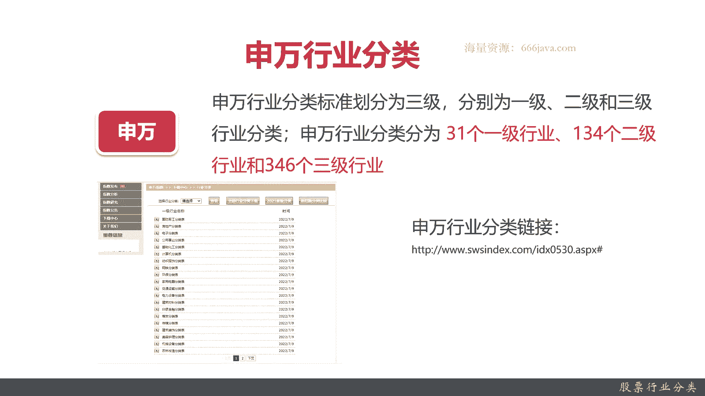

那研究行业作用有哪些呢，我们暂且把这些行业分成四类，第一类持续盈利，就是说一般来说行业它都是以10年为一个周期，进行波动的，持续盈利的这个比较特殊，这主要是集中在食品饮料，医药生物行业。

无论是中国还是美国，这两个行业一直在盈利，这20年来没有什么变化，就是很稳定，下一个是传统行业，为什么说传统行业啊，它是有经济波动周期的，前10年出色，后10年表现不佳，也就是说最近10年在走下坡路。

包括电子设备采掘，就是挖矿，比如说煤老板，21世纪初的前十几很风光，现在不行了，有色金属，传统汽车，机械设备和钢铁，这是传统而言，然后呢是新兴行业，新兴行业，那就是前10年基本上没什么。

甚至连这个行业都没有，最近10年非常火，那包括计算机，电子，新能源和家电，那还有呢就是一个无论怎样都表现不佳的，这种呢，我们基本上就不要去碰它了，那是哪些行业呢，公用事业和纺织服装。

纺织服装呢这个行业其实说句实话，在金融领域里面，他们都被普遍的不看好，然后公用事业呢就比如说一些环卫啊，华为也许以后可以好，但现在可能确实不怎么样做一些公共服务啊，这些研究行业其实是从宏观的角度。

那研究行业后面是什么呢，其实行业下面就是股票啊，你行业研究清楚了。

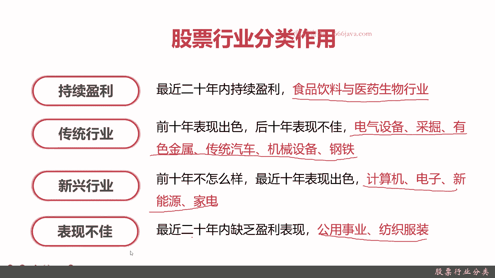

你股票的特色就研究清楚了，以上就是本节内容，下面呢进行小结，首先是中证和身外这两个常用的分类，你给大家理解一下，中证他其实就是官方的，是证监会的，而深外是我们这个投资分析领域，他比他更加的务实接地气吧。

然后呢，股票行业的重点是要了解行业之间的特性，它有持续盈利的，持续盈利就两集中在一个就是消费品，消费食品饮料，还有个医疗生物，它是最近20年都会有，还有一个传统行业。

传统行业前10年也就是我们就讲二最近20年，2000年，2000~2011年很赚，但是2010年以后就不赚了，有色金属啊，挖掘啊，挖矿啊，就是采掘啊，然后传统汽车啊，机械制造，钢铁等等，这都属于这种。

然后呢还有一种呢新兴行业，之前那个应该可以算是夕阳行业，现在的那个是朝阳行业，就是计算机啊，然后新能源呀等等这些新兴行业，前10年连影都没有，现在尤其是最近5年非常的强势。

然后最后一个呢就是大家最好不要去研究它们，公用事业和纺织类，纺织服装在金融投资里，尤其是量化园，大家千万不要去碰他们，他们一直不行，OK以上就是本节内容，欢迎大家收看。

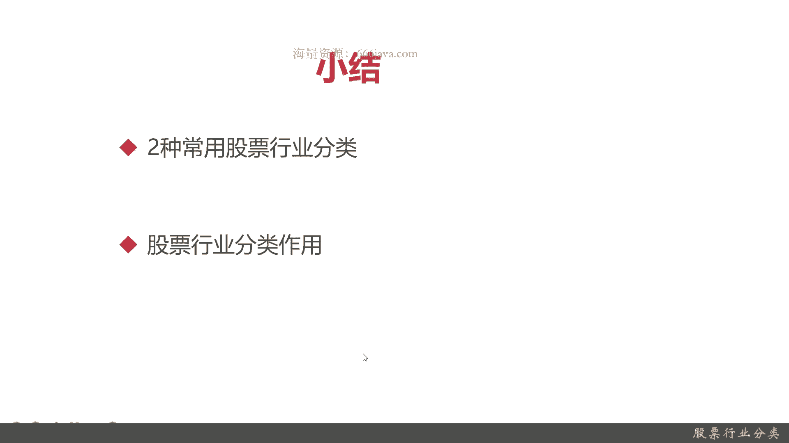