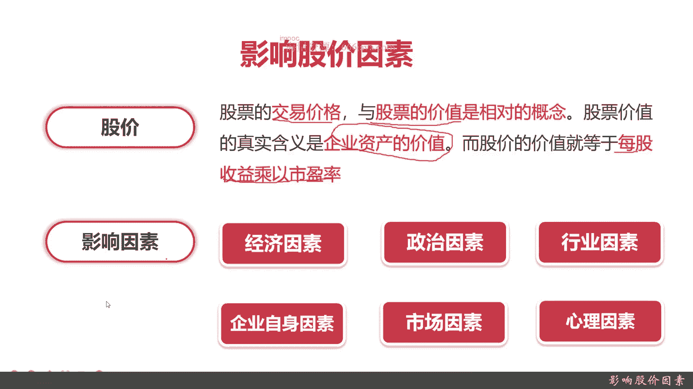
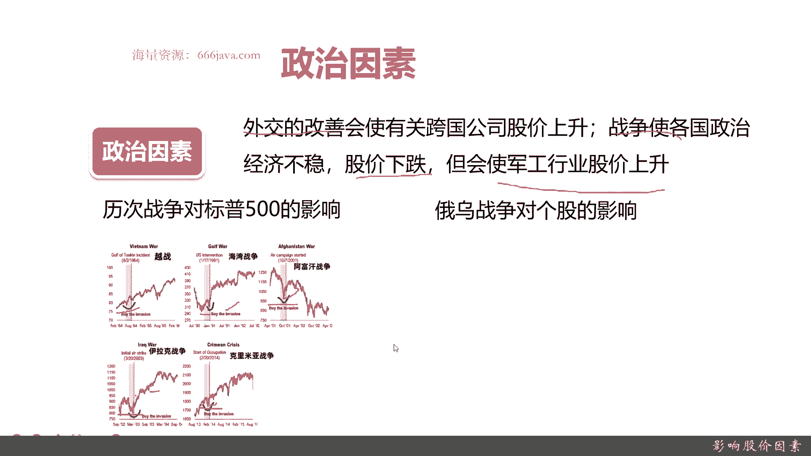
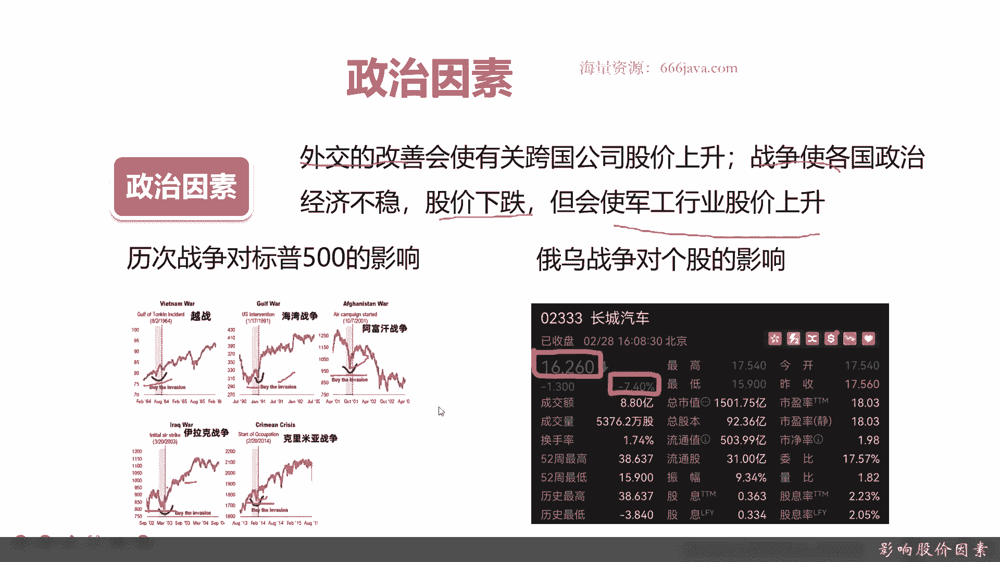
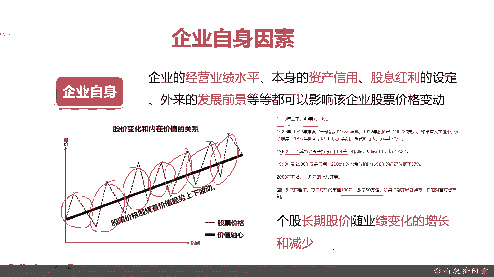
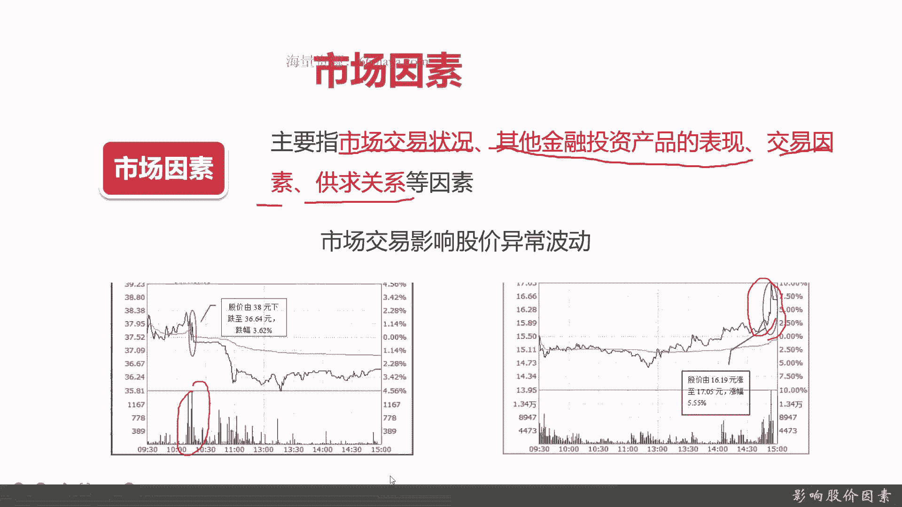
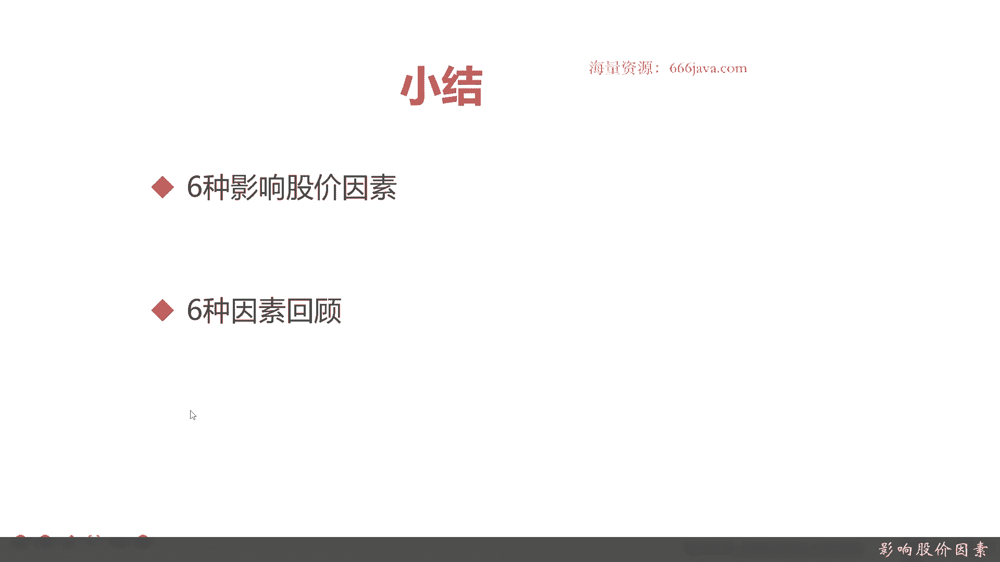

# 基于Python的股票分析与量化交易入门到实践 - P11：3.4 进军量化交易开发第一课-基本的股票交易维度和概念_影响股价因素 - 纸飞机旅行家 - BV1rESFYeEuA

大家好，我是米tea，在上一节呢我给大家介绍了股票的行业分类，以及股票行业分类的作用，那么这一节呢我们将向大家介绍，股票的核心的概念之一，股价以及影响股价的因素。

我们这一节准备给两个部分，从两个部分给大家进行介绍，首先呢我会向大家介绍，影响股价的六个基本因素，接着呢我会给大家每一个因素进行详细的阐述，那么好，那么接下来我们先给大家介绍一下，影响股价的基本因素。

在向大家介绍这六个因素之前呢，我们先给大家介绍一下股价的基本概念，股价其实就是股票的交易价格，记住是交易价格，而与之相对的呢，它是股票的价值，股票的价值不等于股价。

股票价值的真实含义其实是企业资产的价值，其实是这个发行股票的这个企业本身的价值，而股价其实就等于每股的收益乘以市盈率，它是一个动态变化的，OK知道这个情况大家就好理解了，什么是股价。

那影响股价的因素有六个因素，首先第一点是经济因素，这个经济因素指的是宏观的经济因素，是这个整个国家整体运行的一些情况，经济运行的情况，接着是政治因素，那经济其实本身就会受政治影响，股票作为经济的晴雨表。

其实他也会受政治影响，再一个呢是行业，每一个公司，每一个企业都有自己所属的行业，上一节我给大家介绍了行业的分类，那每一个行业有自己的兴衰和更替，也有自己的周期，那股票也就是这个行业里面的公司本身。

它也会受这个行业的影影响，那么接下来呢是企业自身的因素，就是股价，与之相对的是股票的价值，股票的价值其实就是企业内部的资产的价值，企业自身的因素它也会影响股价，再一个是市场因素。

这里的市场不仅仅是说它的供求关系，还指它的影响股票的二级的交易市场啊，等等等等等，这代表再一个是心理因素，所有参与股票交易的投资人，他整体的心理他会有波动，他有变化，那这个心理因素也会影响到股价，那好。

那我们接下来给大家详细介绍一下这些因素，首先呢给大家介绍经济因素，经济因素，先给大家了解一下经济因素的概念和定义啊，经济因素主要指的是经济周期，经济之星，它有繁荣，它有衰退，它有上行有下跌。

股价随之下跌，然后经济繁荣，股价就会上升，这个很好理解啊，那我们接下来给大家举个例子，这幅图是美国整个从1952年3月份，一直到2018年六七十年的时间，的一个整个经济收益。

上面一部分是美国整体的经济周期运行的情况，下面一部分是各种资产，比如说股票啊，就是美国的股票有道琼斯工业指数啊，标普500纳斯达克啊，还有一些房价指数映射到我们的，比如说是上证啊，深圳啊。

创业板等等等等等，再下一个是它的各部分的杠杆率，然后呢每一个阴影部分这里大家可以看，比如08年一零年，然后90年更早的是那个57年和53年，这个是什么呢，这是每一次美国经济低谷。

其实也就是金融危机的时候，美国的整体的情况可以看到，其中GDP大家去国民生产总值啊，可以理解CPI是一个非常美国核心的重要数据，其实它可以反映了通货膨胀，然后那个联邦储备就是联邦领域。

这是整个宏观经济的运行情况，然后可以看到整体的那个价格，整体的股价和整体的，其实就是看他的道琼斯工业平均指数，标普500，纳斯达克等等等等，它是一个随着经济的运行情况，它有一个整体的波动率，经济上行。

这些也上行，然后经济不好的时候，他相对来说也会有各种各样的缺口，看到了吗，基本上就是符合各个我标出来圈的地方，就是阴影部分，它都是下行的，然后非阴影部分，美国整体是上行的，但是呢有的同学会问了，他。

为什么在最近这三五十年呢，这个股价是不是说美国的股票总体是走好的呢，经济从80年代其实一直在走下坡路，美国的GDP增长一直在下降，一直到现在，有的时候不超过5%，甚至接近0%，这是为什么呢。

因为你可以看到美国政府的杠杆率就是美债，它其实一直在上升，现在它已经超过了100%，这是什么概念，他其实就是在借债，其实就是美国国债，那这个钱是哪个，是其他世界的人们就是除了美国以外。

这是美国的经济的情况吧，有日本啊，有那个就是欧洲啊，之前也有中国，比如中国08年的时候，其实有很多是买了美元的国债，也由其他国家来帮他承担，OK然后建设那个，大家可以看看那个整体的经济因素。

是影响股票的价格，虽然你看最近美国的整体的股价指数，一直在上升，但是呢随着现在的整体的经济周期，其实整体是在下跌情况，那这个代价就是美国美债它一直在上涨，而且最近几年，尤其是最近几个月。

美国的通货膨胀一直下不来，这个是不可逆的，就等于是一个癌症，它会逐渐的病入膏肓，那我们接下来再看下一个政治因素，政治因素我其实主要有可以包含几部分，外交可以使跨国公司股价上涨。

然后战争使各国的经济不稳定，股价都会下跌，然后呢军工行业就此股价会上升，我们来也继续去看几个例子啊，然后我们看看最近三五十年，历次战争对美国就是标普五五百的影响，可以看到越战，海湾战争，阿富汗战争。

克里米亚战争，然后伊拉克战争，他经济无非都是有一个，就是打仗以后政治就不稳了，不稳的话，经济就会有个下行，然后股市作为经济的晴雨表，它也会有个下限，每一次战争都会有个短暂的波谷。

但是呢随着一个战争结束以后，政治又会稳定了，人民的信心又会投，包括投资人的信心又会起来，股价又会进行一个爬升，都是这样的好，这是一个宏观的政治因素，其实就是大的战值。

现在还不知道世界级的大战是一个局部战争，战争对于股价的影响，那我们再接着看一下它对个股的影响，我们举个例子。

俄乌战争对个股的影响，这个是那个香港的一家就是上市公司，叫长城汽车，他在俄乌战争刚开打的那天呢，就是股价莫名跌了7。14%，将近10%，那是为什么呢，因为长城汽车是整个中国的汽车企业里面。

在俄罗斯销售量最高的，所以呢俄乌战争这是突发的情况，那投资人呢既对长城的汽车，因为他肯定会觉得会受俄罗斯的影响，它的股票就会大量的抛售，造成了当日的股价的下跌，当然现在慢慢慢慢慢慢它又涨回来了。

好这是政治因素。

接下来给大家介绍一下行业因素，行业因素其实大家很好理解啊，它其实就是这个企业，在这个行业当中会有变更啊，也会有发展，这种情况都会冲击股价，那我们给大家看一个具体的例子啊。

是白酒行业与茅台的收益率进行对比，这个是从04年一直到21年，整个白酒行业的累计收益率，和茅台来的进行对比，蓝色的是整个白酒行业，茅台是那个红色的线，然后可以看到。

其实整体来说这个行业其实由于最近的消费，从国内其实经济发展很好，消费行业其实发展得很好，从最近20年来看，你看整体都是在上涨，但是可以看到有个背离，比如说从2004年2月到2006年2月，这两年。

其实茅台的涨幅度明显是比白酒行业整体高的，但是从2006年2月一直到2009年，这段时间，整个白酒行业其实略微的比茅台更高一点，茅台低于白酒含量的平均水平，然后呢一直到那个就是2009年的2月。

一直到2018年的时候，这个时候整个白酒行业的收益率，其实是比茅台好，而且中间大概有一到两个点的差异，这个其实不小了，但是呢在最近3年，其实茅台又已经和这个曲线基本拟合了，然后甚至还有些反超可以看得到。

所以整个行业里面，其实也是影响股价变化的一个非常重要的因素，个股的股价会随行业整体的波动而波动，OK再看下一个，下一个就是企业自身的因素啊，这个其实很好理解，它包括企业的业绩水平，企业的资产信用。

它的分红股息，以及这个企业它是不是有发展潜力，等等等等等等等，这些都会影响股价，我们给大家看几个例子，首先可以给大家看一个这个例子啊，这是一个股价变化和内在价值，其实内在价值就是企业它自身的业绩水平。

所表现出来的，它的那个就是股票价格其实是虚线，然后价值轴心它其实是一个实现，它其实开源的股票价格它是一个螺旋型的，随着价值进行的波动，它整体的趋势它其实是和企业的价值是一致的，你这企业是一个很强的企业。

总规定股价最后不会差的，但是呢在某一个时点，就短期内可能会有一些背离，这个其实就是企业的自身价值，决定了这个股价长期的走势，然后再给大家看一个例子啊，这个自一个1919年上市以来。

那个时候有一只股票它是40亿美元一股，然后呢到20119年就2020年的时候，它已经涨了50万倍，这个是可口可乐的市值，那可口可乐其实1910年刚上市的可口可乐，这家公司还不是很强。

中间也经过各种金融危机，而且呢在1988年，巴菲特那个老爷子刚买GOOA的时候，那个时候其实GOOA的就是一，和现在这种全世界最牛逼的饮料公司相比，还是有些差距的，但是呢在最近这几十年来来。

科沃乐的整体的那个业绩他一直很稳定，而且他的年营收都是很棒的，好像去年2021年，整个营收光中国区就有400多亿美元吧，好像他将近2000亿人民币啊，所以可口可乐这个整体的股价一直在。

从那个就是19年开始到现在涨了50万倍，50万倍啊，什么概念，你那个时候就是有一股就是40美元，一股你就买一股，那现在就是40×500000美就是2000万美元，那你想想你已经发了对吗。

当然谁也不可能是这个样子，确实是有的，但是呢这说明了一个问题，长期股价，那从19年到现在将近100年，这是很长期了，随着企业自身的业绩变化增长或者减少，你这企业自身过硬，股价就会长期上涨。

当然你的企业自身价值不能给投资人提供。

这个股价迟早会跌下去，再给大家看一个因素，是市场因素，这个因素不是宏观的市场，是主要指一些交易市场，和这个企业所在的市场的，一些供求关系等等等等，具体有哪些点呢，第一个交易状况就是在股票这种二级市场。

交易状况，还有相关的一些其他金融投资产品的表现，除了有股票，你还有债券，还有期货等等等等等，这个交易因素，就是在这个二级市场里买和卖的情况，还有这个企业自身产品啊，它的那个市场的供求关系等等等等等等。

那给大家再举个例子啊，来给大家看一个市场交易，影响股价异常波动的例子，第一个是在这里，这个是某一只股票某一天的情况，可以看到上面是交易量，给大家换一下，这里是交易量，这里是股价的情况。

本来他都是稳定在37块九毛五之上的，然后突然从38下跌至36块六毛四，跌幅了将近3。6%，然后有个大额的抛出，那这就是一个市场的交易，这可能是某一个庄家，就是大的机构，他突然进行叉腰护了结。

破裂或者跟踪运行权或者拉升股价等等等，造成这是一个选择，然后就导致了这个股价慢慢慢慢慢慢，最终你看收盘到了37块钱，然后再给大家看一些例子，这是一个整体拉升的例子，这个应该是到尾盘，什么是尾盘。

就是快收盘了，是某一天的某一只股票，下午三点的时候，前面都比较平稳，应该都是一些基本正常的操作，有买有卖，然后到尾盘的时候，突然一下子买进了很多，一下子从16块一毛九一下涨到17块零五。

这个涨幅就5%了，很高了对吧，这个例子就这两个意思呢，其实就是市场交易影响股价异常波动，主要是异常，而且是非常短期的异常，可能就只有影响到一天或者两天，好吧，刚才前面跟大家说了，那个企业的自身价值。

其实提供了股价的长期因素，那这里市场交易是一个短期的主要的因素，当然了，后面还有一个，接下来是给大家再介绍一下，短期更会影响股价的一个因素。

那是什么呢，心理因素，这心理因素是什么意思呢，投资人因为是投资是人嘛，主要是指投资人在产生各方面影响，会产生心理状况改变，会引起情绪波动，判断失误，这是股价狂跌暴涨的重要因素，刚才那个就是市场因素呢。

它主要是一些交易，它会带来股价的一定的300%分之五，这个了不起，但是股价20%，100%，200%甚至300，那这主要是跟投资人的心理有所关，给大家举个例子啊，这个是最近一个很经典的一个露娜病。

这个是韩国的一个类似于比特币的这种空，气部的车，在最近2022年的5月份，一下子突然产发现了一个暴跌，很多人一下子就血本无归啊，而且这是一个用我们行业的话，这叫黑天烟鹅的事。

具体什么给大家看一下这个情况，他一开始在最高点的时候，他这里的股价是按DOTA来算的，最高点将近100，其实这个露娜币在那个今年的，就是2022年1月份以来最高点，曾摸到一百十二美元。

那在4月底5月初的时候，他也是维持在高点100美元左右，但是可以看到从5月7号，北京时间可能就是5月8号左右，一下子一天之内从90美元左右，其实如果你要算下跌时点的，从这里开始一下子就到了这个情况。

这是多少最低，它已经跌到0。0几美元，那你就是这是跌了多少倍啊，24小时之内吧，它跌了上千倍了，有的那这是什么原因呢，这其实就是这个点开始的，在5月7号，5月8号那个时候呢，就是有一个做空机构。

他呢抛售了8400万美元的卢娜币，然后呢引起了系统的连锁反应，然后系统由于系统自身成算法的影响，它同时把1。5亿的美元内，你的币也被抛售了，这两其实如果只是这两笔交易还好。

那最多会让诺诺比跌个百分之几十20%，30%，可能到这里，最多到这里对吧，从90美元到60美元跌跌了1/3，但是你们可以看到从这个时间开始，60美元，5月10号这个坡度是什么情况呢，投资人恐慌了。

他觉得这个露娜币不可用了，赶紧两线退出，一下子从60到了零一美元都不值，就是这个情况，这才一两天把诺曼币跌成分文不值，这个呢就是一个非常典型的心理因素，主要是影响股价狂跌或者是暴涨，人嘛就是容易非理性。

这种情况就是非理性造成的，所以投资人心理因素，是造成股价短期巨大波动的主要因素，注意是巨大，刚才一个市场因素呢，是造成股价短期的波动的情况，那是巨大波动，就是狂涨和暴跌，主要是由人自身造成的那行。

以上呢就是我们给大家介绍的，影响股价的波动的第六个因素，那我们现在开始进行本章小结，影响股价波动的，首先呢要给大家再回顾一下什么是股价，股价就是股票的交易价格，也就是和股票价值相对的一个概念。

它和股票价值内在关系有关，但是呢不仅仅有关系，然后影响股价的六个因素呢，经济因素，政治因素，然后是行业因素，企业自身因素，市场因素和刚才所介绍的心理因素，那我们再回顾一下六种因素，第一个经济因素。

还记得那张图吗，一个国家的国内生产总值GDP，其实是反映这个国家的宏观经济的好与坏的，它是有一定的波动和周期的，美国最近几十年有好有坏，从1980年以后开始，美国的经济整体走下坡路。

而且在每一次金融呃那个危机的时候，股价都会有波动，第二个是政治因素，政治因素主要有战争，外交等等，大家可以想起我刚才举的例子，每一次战争股价都会短暂波下跌，等到战争结束以后，投资人恢复信心也会上扬。

而某些个股，比如说和战争双方有关系的个股，举个例子，长城汽车突然它就会下跌，为什么呢，因为它是在在中国的企业，在俄罗斯最大的汽车销售商，所以它就会下跌，然后呢是行业因素。

行业因素可以想成白酒的和茅台的例子，整个股价长期来看，它其实会随行业的趋势波动而波动的，还有一个长期的因素呢，就是企业自身主要是企业的业绩，然后其次呢跟企业的股息啊，还要跟企业的前景等等有关系。

可以举详细的一个例子啊，可口可乐，可口可乐最近100年它涨了50万倍，股价一开始是40美元一股，那现在市值呢，这相当于当初你买了一股，现在就有2000万，那个这是企业自身的因素。

这些都是决定股价长期波动的因素，然后后面两个呢是短期的因素，一个是市场因素，就是机构啊，就是交易因素，还有一个是心理因素，投资人的情绪波动会造成股价短期内巨大波动。

