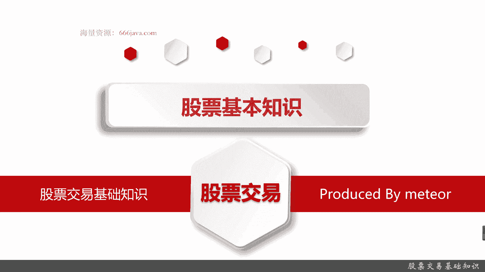
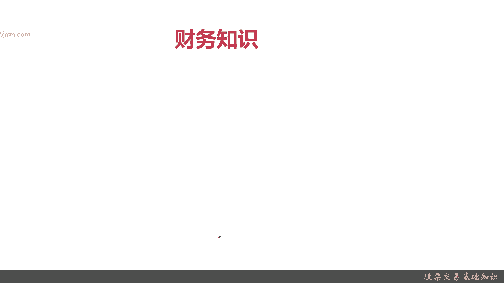
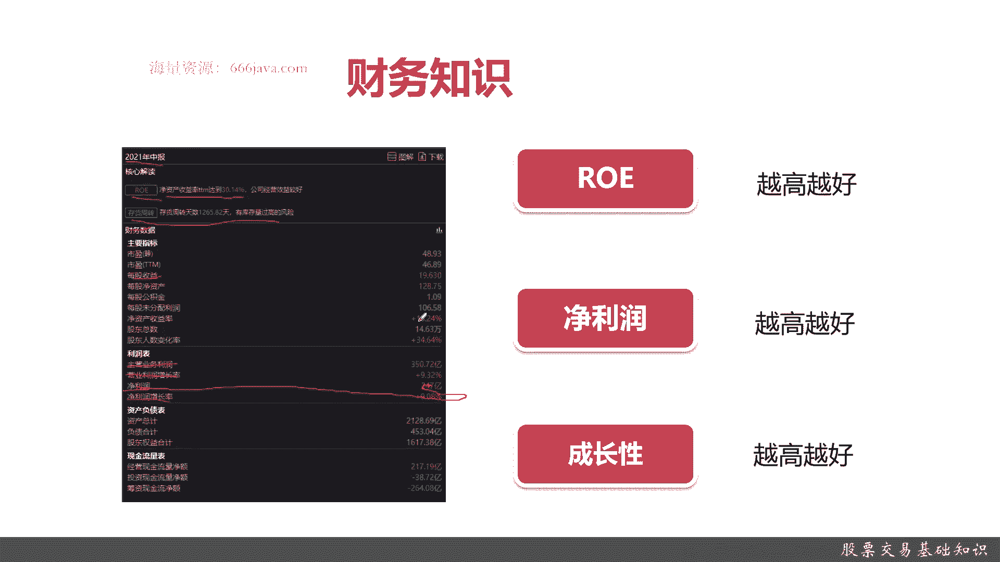
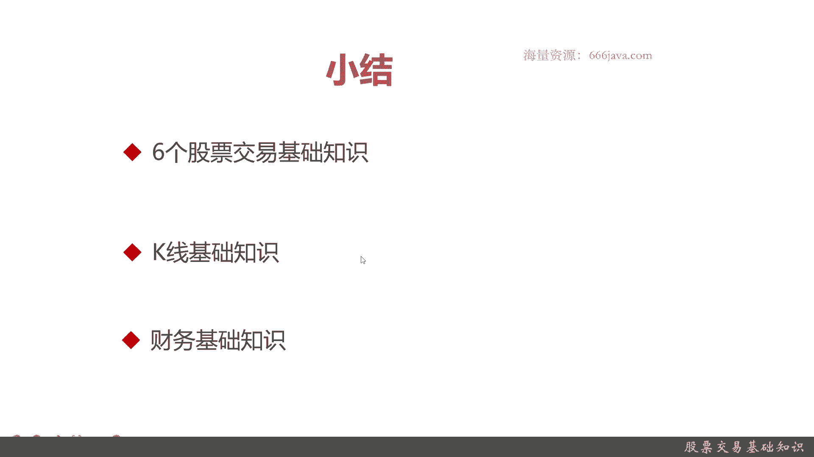

# 基于Python的股票分析与量化交易入门到实践 - P12：3.5 进军量化交易开发第一课-基本的股票交易维度和概念_股票交易基础知识 - 纸飞机旅行家 - BV1rESFYeEuA

大家好，我是米铁，在上一节呢，我给大家介绍了股价，以及影响股价的六个基本的因素，那么这一节呢，我们主要给大家介绍一下股票交易，就是股票的买和卖，还有围绕股票交易的一些基础知识。

这节呢我们先向三个部分，给大家介绍股票交易的基础知识，首先呢是一些股票交易的一些核心的基本知识，比如说交易时间啊，交易单位啊等等等等等，接着给大家介绍一下K线，大家应该都听说过K线。

那K线基本上怎么看呢，还有K线有什么作用，给大家简单介绍一下，接着呢要给大家很基础的介绍一些，跟公司有关的，尤其是上市公司有关的一些财务知识，好下面呢我给大家介绍一下股票一些基础知识。

或者说是股票专业的一些常识吧，有些同学可能有接触，有些人也可能因为都是计算机相关的嘛，有可能没有接触，不过没没必要紧，我们可以从这里开始开始介绍，首先是交易时间，股票交易我们主要指的是我们A股。

它的交易时间一般都是周一至周五，法定节假日除外，上午09：30到11：30，下午一点钟到三点，只有四个小时，每个交易日一年大概有250个交易日，每个交易日只有这四个小时，我们可以做交易好。

接下来给大家介绍一下，中国A股的竞价成交规则，就是怎么样算成交的，竞价成交的原则，价格优先，时间优先，怎么理解，是这个意思，如果同样的要对一只股票进行买和卖价，高者就是成交特出的越高，他越容易成交。

然后如果是卖的话，他是卖的越低越容易成交，相同的价格按照时间顺序，比如说这个股票都出价五块一毛四，那谁先出价谁就成交，然后刚才不是说，我们的那个起始时间是09：30到11：30，那前面是干什么的，9。

15到9。25是叫开盘集合竞价，集合竞价是什么意思，成交量最大的价格就会成交，这种情况一般都是机构或者专家进行，我们这种散户，就是普通人基本上是买不到的，然后从上午09：30开始到11：30。

就是我们和下午一点钟到14：57，是连续竞价，这是我们这些散户聚集普通人进行交易的时间，然后下午的14：57分到15页，这3分钟其实是收盘期的集合竞价，也是成交量最大的价格。

连续竞价就是能确保每一笔交易能正常成功，OK这是整个一个A股的交易的原则，进价成交，下一个是交易单位啊，报价单位是股，就是一股多少钱，一股多少钱，但交易单位其实是首，大概100股等于一手。

然后股价变动的最小单位是0。01元，就是一分钱，你不可能比一分钱更低，只是最小单位，另外三个常见的股票交易的基础知识，第一点是庄家与散户，什么是庄家，能够影响到金融证券市场行情的大股投资者。

一般都是机构或者是就包括证券机构，包括一些私募公司，一些公募公司，甚至还有一些国家的大的证券公司，然后散户就是你我这样的普通人，他其实是股东中投入股市，资金量较小的个人投资者，大户投资者就是庄家。

一般都是几亿数亿，数10亿甚至数百亿起的投资额度，而散户一般都是几千几万，几10万，大的也有几百万，但是呢对于专家来说，这个量级它都是散户，OK再下一个换手率，什么是换手率，换手率这个指标是很重要的。

是某段时期内的成交量除以发行总股数，这个指标表征了该股票的是否活跃，其中这个指标10%到50%，是属于非常非常活跃，这个股票一定被很多人交易，可能是看好，也有可能他是极端的抛售，但是它非常活跃。

低于1%的换手率，它是非常非常的不活跃，一般来说非常非常不活跃的价格，挂单都不会有人去买，所以建议同学们，如果对低于1%的换手率的股票，暂时可以不用去看好，再说一个是PEP1是市盈率。

就是说每股的市场价格除以每股的税后利润，PE1越高，该企业越被高估，反之该企业也被勾股，我们做了定量的一些分析，一般来说正常的股价的P1就普通上市公司啊，一般都是16~20。

然后像一些非常看好的投资公司，茅台最高的时候有40~50，但是也就40~50，还有一些股价是虚高的，有100到200，或者说是一些投资人更加非常非常看好，比如说高科技公司。

有的时候芯片公司它可能到了100或者200，当然不是越高越好，因为越高说明泡沫越高，那有可能就会高位接盘就崩下来，当然越低的你如果只有三五甚至一的，他可能本身就不被所有人看好。

OK这是股票交易的六个基础知识好，那么接下来给大家介绍一下K线，什么是K线呢，其实K线就是将每只股票的每日每周，每月开盘价，收盘价，最高价，最低价等等涨跌情况，通过一张图，一张他K线又叫日本的蜡烛图。

那长什么样呢，具体给大家看一下，就是这个样子，一些柱状的有上影线，其实是下影线，然后有实心有空间，有红的，红的表示涨，黑的表示跌，然后上一些是最高价，这里是最低价，然后还有一些十字星。

十星星其实是那个中心石头不是特别多的情况，那具体呢有一本书叫日本蜡烛图，感兴趣同学怎么可以把这本书给看下，这市场上很常见，这是一个股票用来技术分析很常见的东西，那我给大家在这个时间问题。

我们在这一期就不给大家详细展开了，大家记住两两个点，K线需要一般来说结合交易量来分析，否则只有单纯的高点和低点其实是没用的，主要是看他这还要看这只股票活不活跃，然后就算你能看懂K线。

但是你不能代表能赚钱，记住大家在股票里面，股票其实是个零和游戏，真正能赚钱的人1%都不到，再下一点财务知识，这里的财务知识主要是指，能影响你的投资收益率，就是说白了也不分析很多很多。

因为其实财务知识有很多了，每一个上市公司它都会有年报。

半年保期保等等，你可以分析出很多东西，我们举个例子，比如说这里是某一家企业的2001年的中报，年终报，他每半年发现一个上市公告，它里面会把一些核心解读，感兴趣的同学，每一家上市公司都可以去看。

全全国6000多家，每一家都有不同的公告，但这是核心指标，IOE啊，然后那个什么收益，市盈率啊，每股收益啊，利润啊，净利润啊，然后那个资产负债表啊等等等等等等，那我们其实如果对。

我们现在对财务分析还不是特别了解的同学，记住有三个核心的指标就可以，第一个是IOE，其实就是收益率，其实它就是这个家公司的净利润，比上平均所有股民股东的一个收益情况，这个股份当然是越高越好了。

像我们取的这个这家公司，它在2001年主创时达到了30%，它经济效益是非常好的，属于一个优质的企业，那投资人肯定也会看好，再一个是净利润，净利润越高，说明这家公司越好好吧，这家公司净利润200多亿。

也是越高越好，第三个是成长性，什么是成长性啊，就是这家公司的长期它是还是要增长，还是说他就已经到了一个瓶颈了，如果是发展的瓶颈的话，股票是一个投资人预期的表现，那他这支股票未来的收益可能就不会很好。

一般跟那个成长性有关系的，一个是净利润的营业利润的增长率，还有一个是净利润增长率，可以看到营业利润增长率高了，但是其实净利润增长率其实相对也会高，但是不一定是完全一样，这个也是越高越好。

这三类的指标都是会影响到这家公司，将来的投资收益，当然了，像这个里面这家公司，因为他是一个制造业，它还会有一些存货周转，这个存货周转表明它库存了很高，库存很高，可能在未来某一天，也可能是一年。

可能是半年，可能是两年，这家公司就会出现经营的问题，因为存积压存货太多，它的利润率就会下降，那当然这个属于一些高级知识，我们就不在这里继续分析了，好以上就是股票交易的一些基本的知识，这章节的内容。

那我下面一个进行小结。

首先给大家回顾一下，股票交易基础里面的六个基本基础知识，也就是六个常识吧，第一点是交易时间，交易时间就是交易日，交易日，也就是法定节假日除外的周一到周五，当然这是A股啊，每天上午09：30到11：30。

下午一点钟到三点，接着是竞价成交，就是A股成交的一个体系，它的原则是价格优先，时间优先，然后每天09：15分到9。25是集合竞价，也就是交易量最大的成交，一般都是机构，我们这些散户就不要想了。

接着是09：30到11：30，下午是一点到三点，其实是一般来说是一点到14。57分，因为还有最后3分钟是收盘价的集合竞价，我们散户能交易的叫连续竞价，它是确保我们每一笔能成功的好，再一个呢是交易单位。

交易单位股票的报价单位是股，就是一股多少钱，一股多少钱，交易单位是手，一手等于100股，你比如说茅台，假设2000块钱，那我们一手的话至少买来一次要20万，所以这支股票一般来说。

散户像我们这普通人就买不起，再一个交易单位最低是按照分来一分钱，不能比分更低了，O再接着我们还有三个常用的基本知识，庄家和散户，什么是庄家，就是能操纵股价的大户，一般来说都是几亿，几10亿。

一般都是机构，然后散户就是你我这样的普通人，一般都是投资额都是几千几万，几10万，最多也有有几百万的，但他跟机构跟庄家比，他也是散户，再一个常见的一个指标，是表征这个股票是不是活跃。

换手率就是多长时间之内他被交易多少次，他的总股本流通市值了多少次，一般来说10%到50%，是非常非常活跃，1%以下的，它是非常非常不活跃，建议不要去碰，再一个反应投资回报率的。

PE市盈率是它的这一个总市值，它的回报和它的原始股价的回报次数，这个指标决定了我们的也是一个投机投放率，这个指标当然了，P1越高证明投资会有LP1越低，越投越远越低，但这个指标还真不是一定是余越高越好。

因为P1太高了，超过了100，超过了80，很容易就泡沫，到时候会崩盘，然后一般来说茅台大家记住茅台，最近几年他最高也就四五十二十，是一个非常基础，经济学里认为比较基础的汇报的数字。

然后给大家介绍一下K线，那K线的基础，什么是K线，K线就是那些蜡烛图，大家感兴趣的可以去关注一下日本蜡烛图，这本书市面上有各种各样的这种书很好买，大家可以去看K线，就是股标的。

每日每天每周每时最高价最低价收盘价，开盘价的一个集合，然后呢有两点记，大家记住了，K线线，一般来说你要和成交量结合成交来看，然后K线知识也非常多啊，什么十字星啊，暗暗影和棒二纺锤啊等等等等等等。

再记住一点，你能看懂K线，你把那本书就是日本交易额，日本蜡烛图，这本书都啃完了，但是你不代表你一定能赚钱，市面上的股市要大吃很多，但是真正能盈利的人1%都没有好，再下一个是股价交易相关的。

财务的一些基本知识，每一只股票它的背后都有一家上市公司，中国A股大概有6000多只股票，也就有6000多只上市公司，他们每个季度都要发季保，每个年度中年终要发年终报，也是半年报，每个每年结尾。

每年就是第2年的开头，都会把上一年的发个年报，就是披露，包括当季度这个半年，去年它的整体的财务营收情况，让大家进行分析，这样才向加强，才能决定是否购买，然后其中比较重要的有三个，一个是IOE。

然后是净利润，还有一个是成长性这些指标，这些指标都是越高越好好，以上就是本节的全部内容。

我是米浅。