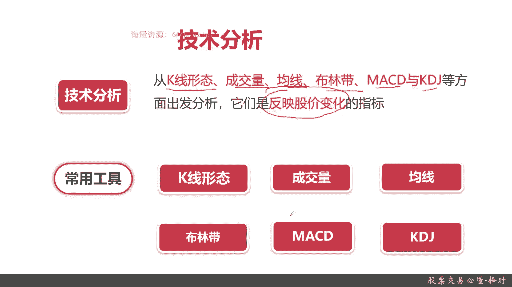
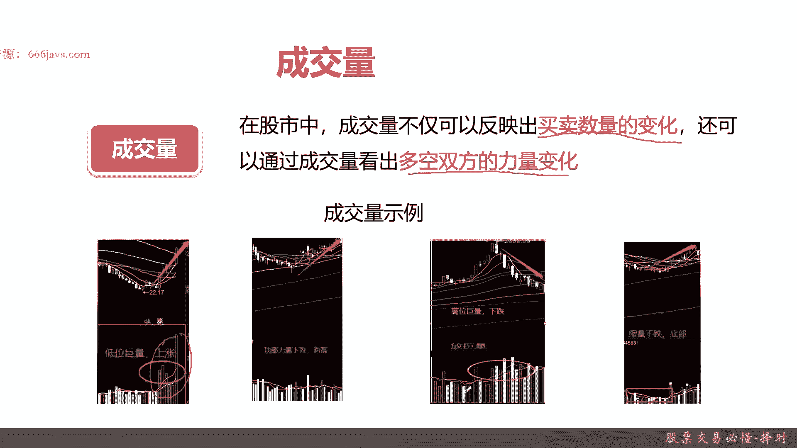
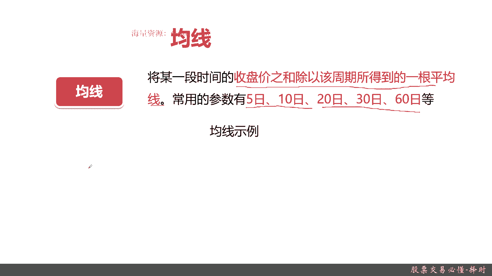
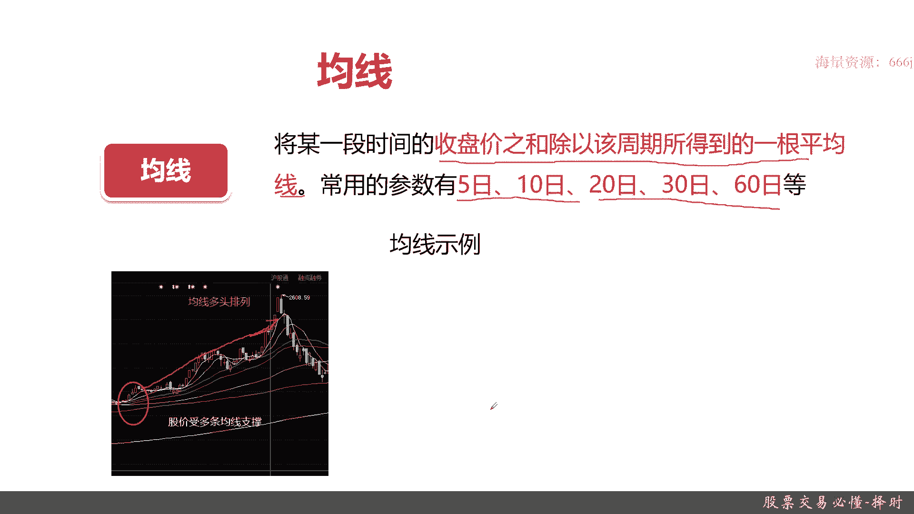
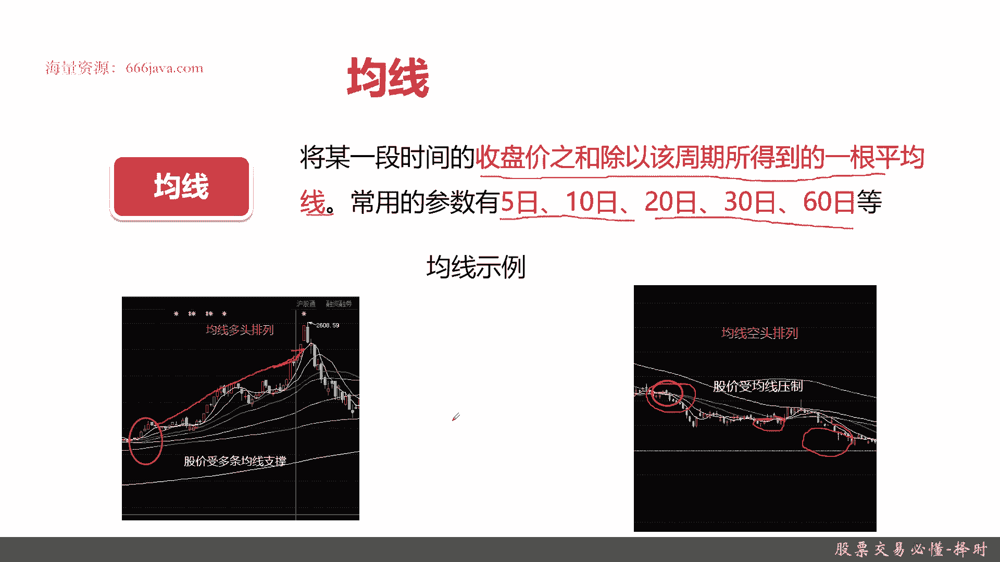
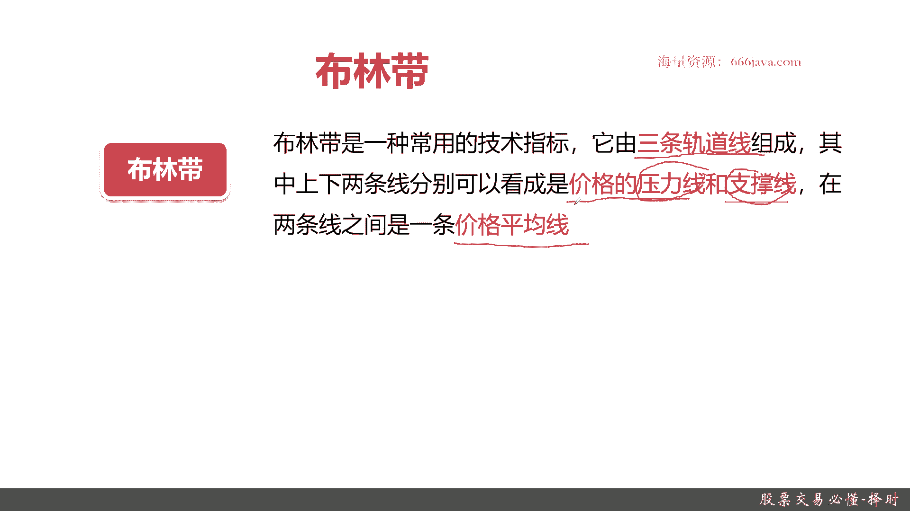
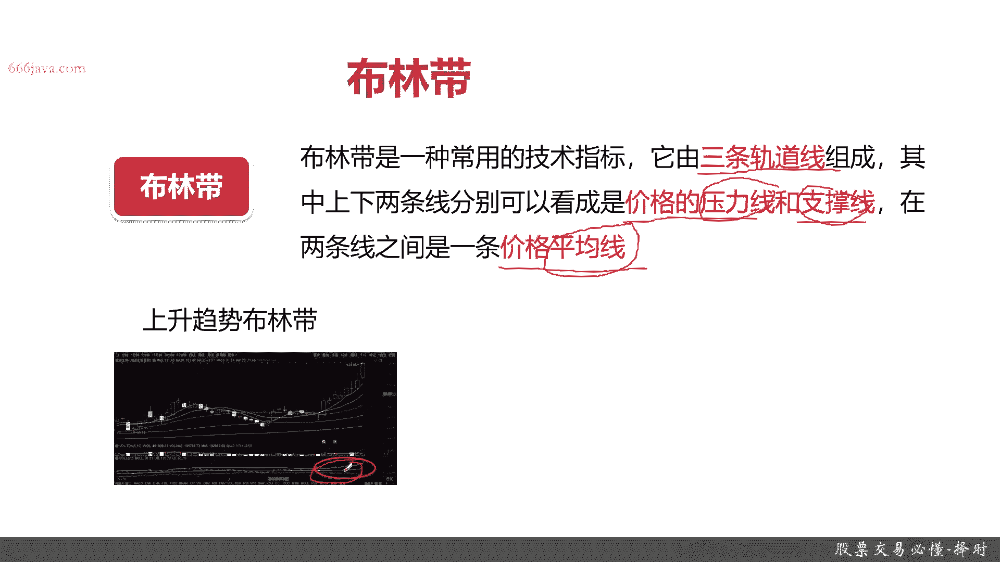
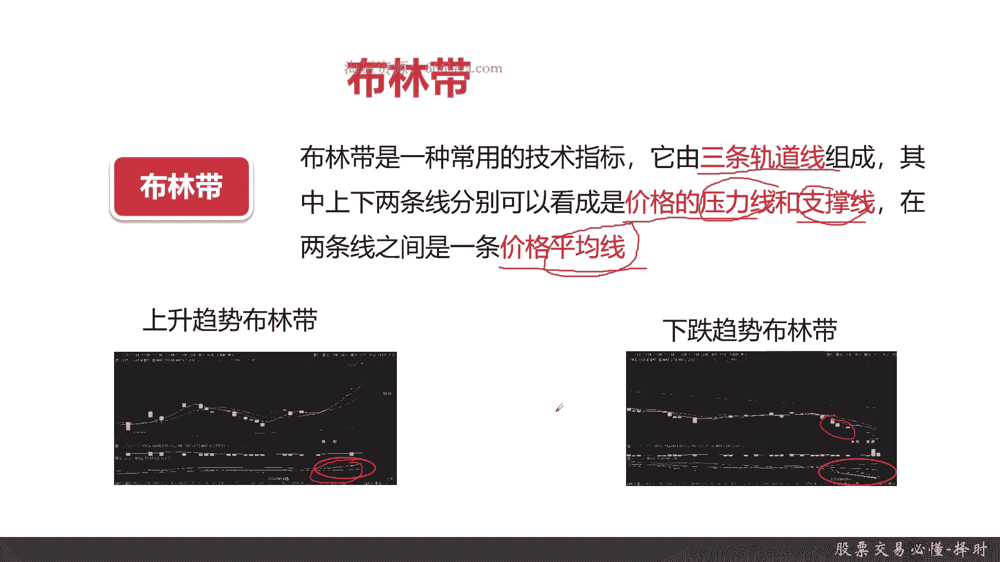

# 基于Python的股票分析与量化交易入门到实践 - P14：3.7 进军量化交易开发第一课-基本的股票交易维度和概念_股票交易必懂-择时 - 纸飞机旅行家 - BV1rESFYeEuA

大家好，我是米TIA，在上一节呢，我给大家介绍了股票交易的第一步选股，那选股是非常重要，那么接下来这些呢也是非常重要的一步择时。

本节呢我们将从下面三个方面给大家介绍择时，首先呢给大家介绍一下择时的定义，它的基本概念，还有它的一些作用，接着呢给大家介绍一下择时，非常好用的一个工具叫技术分析，然后呢给大家详细介绍技术分析。

常用的六种工具好，那么接下来首先呢我们看一下测试的定义啊，择时很容易理解，就是股票买入和卖出的时机，注意时机，这是买卖的时机好，那择时有什么作用呢，之前给大家说了，选股选股能决定你能不能赚到钱。

那择失的好坏直接决定你们能够赚到多少钱，你有可能一分钱也赚不到，有可能赚的盆满钵满，这就是择时作用，然后呢择时一般是常用什么的方法呢，主要就是那接下来会给大家说到的技术分析好。

那么接下来呢我们给大家看一下，什么是技术分析，先看下技术分析的定义啊，技术分析主要有K线形态，成交量，均线，布林带MAACD和KDJ6个方面，当然了，不仅仅局限于这六个方面，这是最常用的六个方面。

他们呢有个共同的特点，就是反映股价变化，重点是股价变化，他们是反映股价变化的指标和工具，OK好，我们看一下技术分析有哪些常用的工具啊，刚才已经被提到了，K线形态，成交量，均线下一个是布林带。

接下来是MACD，再提一个是KDJ，那K线形态成交量和均线大家可能会常用一点，但是像布林在MACD和KDJ也是一个常用的，用来做技术分析，分析股价趋势走向的工具，尤其是它可以分析到时点。

那那么接下来我给大家详细介绍这六种工具。

首先给大家介绍一下K线形态，K线呢其实之前也给大家介绍过，其实就是日本蜡烛图，那K线形态它之间富含了蕴含了大量的信息，主要是股价的强弱，多空也就是买卖看多，看涨和看跌双方的力量对比。

那你看多的力量比较重，那就是股价就会上涨，看空的比较重，那那就是下跌，K线是技术分析最常见的工具，那么接下来给大家看几种常见的K线，当然K线有几十种形态，你们有兴趣可以去看日本蜡烛图。

但是我们现在可以给大家简单的做一下示例，比方说这种红三兵连续三根小阳线，那你到这个时点的时候，你就可以考虑，接下来应该是总体来说是看涨，那后续我们就可以选择吸收买进，然后等到它涨到一定成熟，我们再抛掉。

OK这是一个持续看涨的情况，当然了，看涨的不仅仅是这种K线形态，有很多很多很多种，这个只是给大家举个例子啊，接下来再给大家看一个黑三笔，这也是这是持续看跌的，连续三根短的阴线。

那就证明看空的力量开始变强了，那这一支股那股价可能会慢慢的减弱，可以看到，其实人看的是这个K线，其实在程序里面，其实这些都是数据，你这些都可以进行量化，比如说连续三个交易日，那上涨。

而且涨的程度幅度不超过百分之多少，你就认为这是一个交易信号，那如果你按照这个策略来实现，你的量化交易策略，那这就是你的那个量化交易的信号，买卖的信号，OK接下来呢我们给大家介绍一下成交量。

那成交量大家应该都理解，其实就是股票交易的总量，那成交量为什么能分析出股价走势呢，可以先给大家看一个定义啊，成交量不仅仅可以反映出买卖数量的变化，还可以看出多空双方的力量变化。

你只要能看出多空双方的力量没啥，就是看涨的多还是看通的多，那你可能就对于接下来的股票走势，会有一定的预测，我们接下来给大家看几个例子，大家就可能理解了，当然了，这些都只是简单的示例，不一定是实际的情况。

大家不要完全的按照我这里给大家讲个例子，完全去套用股市的水很深，多实践，然后多测试好吧，这里不构成投资建议，只是给大家举个例子，比如说第一章可以看到了股价均线呃，那个季平线在这里。

然后呢突然的再从这个底部开始，突然的价格一下子超越均线之上了，看好同时开始不停的有人买入，那这就是什么呢，代表股价已经触底反弹，后面肯定会有一个大量的上涨，这是看多的情况，再接着呢，然后可以看到这里。

在这个时间点，甚至到这个时间点，可以看到在这个时刻股价已经创了新高了，但是呢整体的这段交易量呢，还是呈现得非常高的情况，那可以看到股价还会有继续的上升，因为市场情绪普遍都看好，认为它还会涨。

那就是情绪就继续往上涨，OK再接一个，我们看看跌了几个情况，第一个从这个点开始，这个绿色的表示卖，红色表示买啊，可以看到从这个点开始，这个高位开始2600额多了，一下子开始有很多就是卖的情况了。

而且每天随着卖也会下跌，那就说明了这时候的股价已经到了顶部了，后面大概率会持续的巨量下跌，当然这巨量只是一个就是还是一个定性的说法，量化的嘛，肯定是和前一天的成交量相比，是多了10%还是30%。

还是50%，甚至百分之百等等等等，但可以看到持续的下跌，而且是非常大量的，非常巨量的成交量都是在卖，那就证明市场对它的股价有点恐慌，在不停的抛售，好再看一个最后一个例子，这个呢按到这里的时候可以看到。

其实之前一直在跌跌跌跌跌跌，但是呢他的成交量下去的，跌的时候，成交量一直在下去，那就说明什么，就是看跌的人越来越少了，他们就已经把股票都攥在手里面，他们认为已经快到底部了，他们在等待着触底反弹的时机。

那到这个这个时点为止，开始有人大量的购买，这个时候就是触底反弹了，OK这个就是成交量的简单的四个例子，大家看明白了吗。

然后再下面一个给大家说下均线，均线呢其实大家嗯可能就是有的同学比较熟，有的同学不熟悉啊，均线其实就是它关键是收盘价之和，除以该周期内得到了一根平均线，它其实就是股价的一个平均线，那有常见的5日均线。

10日均线，20日，30日六时等等等等等等，均线其实也是反映多空力量的对比，可以给大家举两个例子啊。

好比如说这个情况，你看这是K线，K线是实际的股价走势每天的，但是你看均线，每一根均线由5日的，10日的15日，20日，30日，60日均线全部都在这个价格之下，那就证明股价是普遍预期。

是在这个支撑点位之上，那整个这一支股票从这个时点开始，一直到这里，这根线其实都是一个上升趋势，你看在股价下跌的时候，他们慢慢慢会跌破均线，其实就是大家常说的支撑位，这就是支撑位的概念。

那只要你的嗯股价一直在呃5日啊，10日啊，30日这些均线之上，那你也是看涨的，OK好5日嘛就是一周，10日是两周，20日交易日嘛就是一个月，30日是一个半月，然后呃60日大概三个月是这样的好。

接下来可以看到看点，这个呢是看跌的情况，你可以看到这股价，基本上画出来的地方都是比这里还有这里，然后还有这里都是比均线上面的，那就是说这支股票在这一段时期内，它是持续被所有市场人都看跌的。

那这种时候最好不要选择买入，否则肯定会很亏的好，接下来再看下一个布林带。

布林带可能同学们就没有听过了，来我给大家简单介绍一下什么是布林带，布林带其实是一种常用的技术指标，它重点是由三根轨道线分上中下三根，其中上下两条线是价格的压力线和支撑线，它这样可以更容易放片出。

股价的压力位和支撑位，什么叫压力线，如果这个股价上涨突破了这个压力，那就证明它可能会涨的更多，否则它可能就到一个趋势天花板，然后呃它就会触顶，它就开始下降了，什么是支撑线。

那支撑线就是说股价如果下跌的话，它会接到一个附近的值呃，也是一个池鱼，如果跌到这值域以后，它后面会继续反弹，还会涨一些，因为可能股价是一个波动的吧，如果跌破了这个支撑线，那这股价还会持续下下下下跌。

然后在这两条线之间是一个价格的平均线，这个布林带其实是一个这种股价的，重点是看压力，支撑线，还有平均线的。

先给大家看一下上升趋势的布应带，这样的这种布林带其实在各国考古网，就比如东方财富啊，大智慧啊，还有那个同花顺等等，也都是可以很常用的基础工具，可也可以很好，首先大家看懂，比如说像这里股价在这里。

那上面是一个压力线，下面是一个支撑线，然后那个中间是平均线，可以看到这个趋势一直在上涨，单边上升的趋势，那这股价就是上升的，看到吗，就是在这个位置。

然后再给大家看一下下降趋势，这里是支撑线，这里是压力线，这里是平均线，可以弄到平均线和支撑线一直在往下走，同时他还这里就是有一个就是缩量，当然后面他有个起量的时候，但是再结合前面那个压力支撑线。

你看价格这些股价全部是低于均线的，那这里还是个下降趋势，这个时候考虑不要说，当然了，股价还有些震荡，比如说走一些各种各样的的曲线啊这种，那这个呢留给同学们自己去查一下资料，可以自己去看一看。

这里我们就不给大家详细介绍了。

好那么接下来呢我们给大家介绍一下MACD，大家可能听过MACAD金叉对吧，这个呢在各种投资股票投资软件，比如说土花生啊，比如说大智慧都会有，那其实他没那么神秘啊，其实把它翻译过来。

其实就是异同移动平均线，那其实是什么呢，它是表征股价变化速率，记住它是一个速率，它是什么时候涨的快，什么时候涨的慢，或者是平稳或者是平稳，其实就是表征股价变化速度，给大家举个例子，大家就很明白了。

比如说这是2003年9月到12月，美国美元的走势，可以看到在这个时候里面，它的MACD其实就是加速度，其实就是一个常数，速度是匀速象征，OK这很好理解啊，然后这种情况呢，就是表示你既然是那个是个常数嘛。

那就是一直保持上升状态，当然了，如果是负的，那就是以稳定的负数常数，那就是一直下降成本，这个很好理解，通过这个MACD看一下就可以了，然后再给大家看一会，这个是它的下降，这是这张图是在美元。

2014年2月9号到2月份到3月份的时候，可以看到在这个时候MACD大于零，而且它是基本上接近一个常数的，所以它是个上升趋势，而在这一段可以看到它是一个下降趋势，这个速度它也是负的，这个也很好理解。

再给大家看一张震荡的图，美元走势可以了，有的时候上升远离零线，然后曲线零线保持不多，然后又下降，又开始远离零线，然后同时他又开始趋近零线，继续下架区间，它是一个总体的一个震荡。

OK通过MACD就是股价的变化速率，大家就可以分析出这种股价的整体的走势，好吧，这是MAACD，其实呢到后面，我们其实可以通过程序量化程序来实现，M a c d，通过自己去判断MACD。

比如说从常数变为零或者是下降那个时点开始，就是你可以捕捉的交易信号，这个也是MACD，也是一个非常常见的分析股价走势的工具好，那么接下来给大家看一下KDJ，KDJ其实也很好，同学们也有同学听过。

也有可能同学们没没没听过，没有关系，那KTJ它是什么呢，呃其实就是一个随机指标，你记住这个就行了，在后面我们实践的时候，会告诉KTZ的具体算法，然后通过程序是什么，那么现在只要知道大概的原理。

它其实表征的是价格波动的真实波幅，它是把股价的波动看作一个波幅震荡，然后呢，它来反映股价的走势强弱和超买超卖的现象，尤其是它适合于短期行情，什么是短期哈，天天小时分这种中长期，比如说月啊，周啊。

甚至年啊，这个可以理解不太适合好给大家举几个例子，可能就会理解这种这张图上面的是一个K线图，但是在下面就是KD线了，三根线黑色的是K，蓝色的是DJJ是最下面那个红色的。

可以看到KDJ有的时候它会有个交集，在这交集里面，每一个进行金叉的时候，这用常用的就是金叉，它会有一个就是适合买，属于超买还是超卖的区域，比如说像这样，在这个点里，他就已经是超买很多了。

那你就觉得可能嗯股价后面，尤其是它在进行交叉的时候，后面就会有变化，从涨变成跌，什么是超买，就是已经被别人买了很多了，买到嗯最后股价无法支撑了，就是这样，其实KDD最后其实也是一些移动均线。

这些概念的算法在里面，在我们现在这一节课呢不给大家介绍那么深入，在后面的课程里面会给大家详细的介绍，KDJ的它的算法，还有它的实现coding好，这个呢是一个超卖现象，就说明这个KDJ均小于30。

那就说明这个股价呢已经快到底了，那你可以考虑后面吸入，然后继续给他购买，这是超买和超卖的分析，再接下来可以给大家看到，中国化学某一天什么时候可以形成金叉，在这里KDJ有有交集，同时可以下回心反映。

OK这个时候就是一个最佳卖点，然后进入这个最佳买点以后，大概从这个时候开始可以看到股价持续的走强，然后慢慢慢慢股价又会有些差呃，警察你可以考虑到有的时候可以卖了对吧，当然了，有的时候你又很难去预测。

比如说你在这个点卖了，在这个点股价为什么又开始涨起来，这个其实是很难预测的，因为现在这些分析啊，它其实都是基于历史的分析，那实际情况在这些交叉里面，后面其实它都会有些分歧，比如说这个时候可能它会下跌。

但是你卖了以后，你只是少赚点，但是你绝对不亏对吧，这个最终量化交易怎么是一个胜率好，那么接下来呢我们到目前为止，我们已经把技术分析常用的，六种工具给大家介绍了，后面就是本章的小节内容。

文章给大家介绍了一下择时，择时是什么意思呢，其实就是一个股票买卖的时机，择时做得好，其实他就能决定你能赚到多少钱，上一节给大家介绍选股，如果选股做得不好，你连钱都赚不了，选股是决定你能否赚到钱。

择时决定你能赚多少钱，然后择时常用的工具就是技术分析，技术分析其实就是通过各种技术指标，主要是反映股价走势的技术指标，常用的技术分析工具有K线啊，有成交量啊，有均线啊，还有布林带啊，MACD啊。

还有KDJ，接下来呢是六种常用技术分析工具的回顾，K线就是蜡烛图，它可以有效地反映出股价的，他是看多的好还是看空的好，注意啊，只有你能很清晰的分析出，将来股价是看多的力量占优，还是看空的力量占优。

你才有可能能选择出合适的时机，然后从而可以赚到钱，再下一个是成交量，成交量不仅仅是买卖数量对比，它还可以反映多空力量对比，大家可以想象的那四张图，再接下来呢是均线，均线就是股价按照交易周期有5日均线。

10日均线，20日均线，30日均线，60日均线均线可以看出，就比如说均线它的那个都是在K线图之下，那就说明市场里普遍看多情绪，那如果均线一直在股价之上，那就说明市场普遍看空，那你最好是抛了好。

再一个是布林带，布林带是三根线，最上面是压力线，最下面是支撑线，然后中间那根是价格均线，布林带可以给大家看出股价，它的是上升趋势还是下降趋势，还是一个震荡趋势，再下一章是MAAACD。

其实可以理解为它是一个反映股价速率的指标，它如果进行交叉变化的时候，MACD大于零，股价就是上升的，MACD是一个常数，它指股价匀速上升或者下降，MCAD等于零，股价不多，MACD小于零，是股价下跌。

然后在MACD变化的时候，其实就是你买卖的一个时机，最后一个是KDJ，KDJ大家就是可能用的多，可能也没怎么用过，不过没关系，KDJ它其实是一个重点，你记住KDJ就是反映短期走形势的工具。

然后呢它主要是看见股价的震荡幅度，就是波峰和波谷，然后KD键它可以反映超买和超卖，KDJ一般大于80，那就是超买，小于30就是超买，然后KT界在进行交叉的时候，是一个合适的买卖点，OK以上就是本节内容。

欢迎大家收看，我是李铁。

