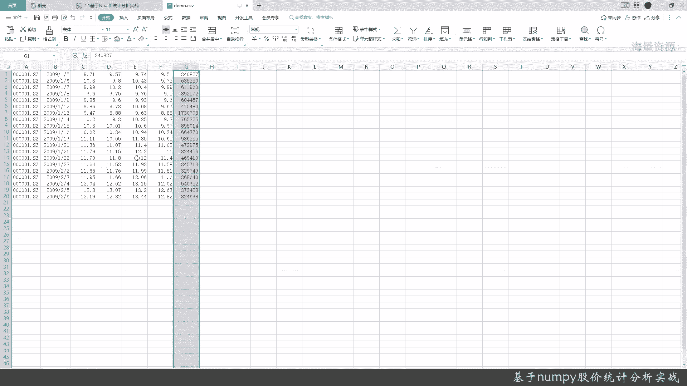
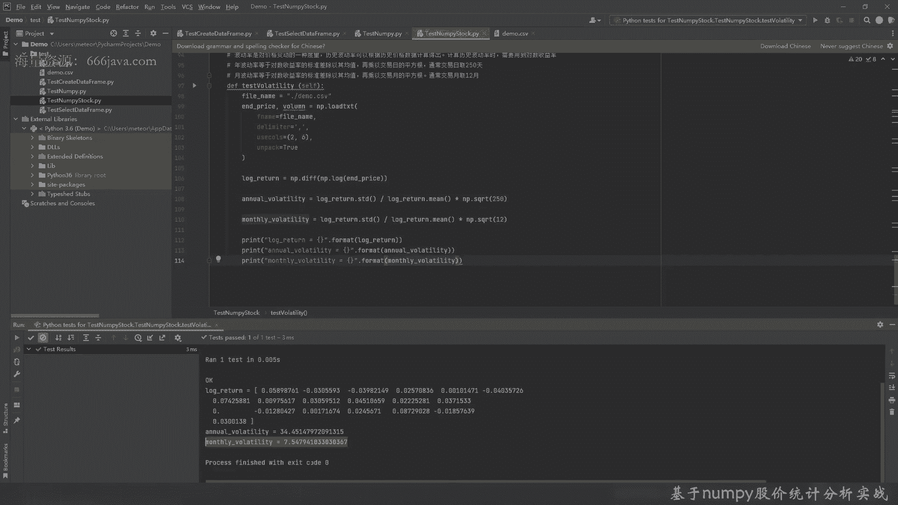
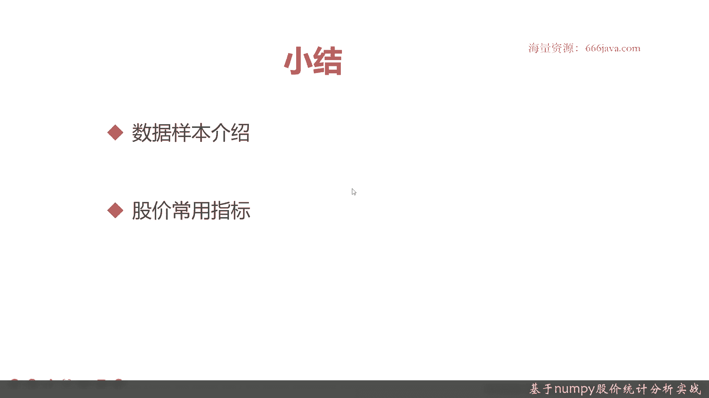

# 基于Python的股票分析与量化交易入门到实践 - P16：4.1 量化交易开发Numpy应用-股价分析实战_基于Numpy股价统计分析实战 - 纸飞机旅行家 - BV1rESFYeEuA

大家好，我是米tea，在上一章呢，我们给大家介绍了一下，量化交易的一些基本基础知识，以及股票交易相关的基础知识，那么从这章开始呢，我们开始深入coding，我们先给大家介绍一下南派的实战。

北节呢我们将给大家通过南派来进行一些，股价的统计分析，股价统计分析这一节呢，我们从两个方面给大家先介绍一下，首先给大家进行一下数据样本的说明，来看看股价的一些数据，他的数据基本数据结构是什么样的。

然后呢，我们再给大家介绍一下常用的股价的一些指标，当然了也有他们一些基本的算法，后面呢我们就进入coding环节，好我们先给大家看一下数据样本，首先呢数据样本是这个样子，从左到右分别是股票代码。

交易日期，收盘价，开盘价，最高价，最低价和成交量一共是七列，然后根据南派来说呢，其实它的下标是从零开始，这和java的一样很相似啊，然后那到最后应该就是六，这个很容易啊，然后从这呢给大家看一下这个样例。

数据是我截取的那个0001，这个是哪只股票呢，是平安银行，然后在2019年呃，2019年年初的那个，大概七个交易日的demo数据，那实际上我们在那个最终的程序里面，可能会比这多一点。

股票比较重要的就是交易日期，因为它是时间序列，这个是code是每只股票的代码，然后他的收盘价，开盘价，最高价，最低价和成交量，然后据此呢可以分分析出很多很多的一些情况，接下来给大家详细介绍一下。

我们这次给大家分析哪些指标，首先是极差，什么是奇差呢，其实它就是一个表征，股价的最高价的最大值和最低价的最小值，的一个差值，级差的越高，它说明波动它就越明显，就是证明这支股票在这一段时间内。

一般来说就我们选的周期啊，可能是20天，也就是20个交易日左右，大概是一个月左右时间，或者呢也有也有五天，如果你更细腻，可能是到小十几好，再下一个是成交量加权平均价格，这个听起来很拗口啊。

其实它是一个那个volume wait average price，什么意思呢，就是呃它是一个金融学里面非常重要的，经济参考的指标，代表着金融资产的平均价格，它其实呢就是把成交那收盘价。

但是呢它要通过成交量进行加权，然后南派其实实现起来这些东西都很好实现，待会可以给大家看一下，接着呢是收益率，收益率很好理解啊，那个但是实际上在引用的收益率有两种，一种是两个价格之间的变化率。

还有一个呢是对数收益率，在我们这里呢主要是用的对数收益率，因为后面我们要算波动率呃，简单收益率其实也很好，就是涨跌幅啊，其实大家看到的涨跌幅其实就是简单收益率，简单收益率实现起来也非常方便。

但是我们今天呢，这一次不给大家进行那个详细的介绍，但是对数收益率主要是可以用来算波动率的，这个给大家待会可以看一下怎么算，其实就是所有价格取对数后两点之间的差值，这个也很好，也很好理解啊。

接下来是我们今天后面要介绍的波动率，波动额这个指标越高，说明波动越明显，波动率其实就是价格变动的一种衡量嘛，波动率主要是年波动率和那个月波动率，年波动率其实就是对数的，波动率其实就是标准差除以其均值。

再除以交易日导数的平方根呃，通常呢一年我们取250个交易日啊，有的网上是取252，但是我们在我们这里的就是这里，一般是取250个交易日，接下来是个月波动率，月波动率其实和年波动率算法一样。

但是呢他的最终的结果，其实他的取样取样样本空间是12个月，OK简单的给大家介绍了一下各种的指标，那么呢我们接下来直接开始上代码，在之前呢先给大家看一下数据的实际情况。

好这个呢就是给大家的实际的用来计算的，实际的数据情况呃，我可以看到我们一共取了20条数据，然后呢，字段也是像刚才给大家介绍的股票的那个代码，然后交易日期，然后收盘价，开盘价，最高价，最低价和成交量好。

后面话不多说，我们下面开始进入通过南派的史记的coding。

好在给大家进行南派的实际扣定之前呢，可以给大家看一下，我已经预先把一些基本的代码的，test case的demo给大家搭好，那后面我们就跟大家一起来进行实现它，首先第一个是读取指定链。

那我们将用到什么呢，用到南派的load text，这里面有四个关键的参数，一个是file name，其实就是我这里的f name，就是那个file path，就是你要读取的文件的路径。

第二个是DILIMIT，其实是分隔符，是用什么分隔的，CSV嘛，大家都知道是逗号，再一个是use columns，就是说呃你要读取这一个CSV里面如果分隔了，读取哪几列，然后给它进行命名，最后一个是呃。

是否解包，一般来说是true的好，现在给大家来实际coding，给大家看一下，我们取那个收盘价，然后再给大家嗯再取一个成交量，这两个变量就是这个意思，然后呢我们来给大家，调用这个函数。

好然后我们先输入file name，就SM等于三再下来，等于分隔符，就是逗号好吗，后面我们还记得刚才给大家看的那些数据吗，它是哪两列呢，好应该是第三列和最后一列好，最后一个是NPC，不好意思，敲错了。

好这样的话呢，我们就把收盘价and price和volume给读出来了，我们给大家调试一下，看看打印一下是什么结果，好运行一下结果，OK这个就是收盘价的结果，然后呢这个就是成交量，成交量的单位是首。

收盘价的结果，单位是元，OK就是这么简单，当然你想去取其他的那个字段，比如说你想去取交易的日期，你想去取开盘价，其实都是类似，你只要把这个下标，每一列的下标取出来，它就是一个数组。

我们接下来再来做算一下最大值与最小值，这个其实也很好算，我们参考之前写的，首先最大值，最小值肯定都是在那个最高价和最低价里面，所以我们要声明两个变量，high price和low price。

那我们为了快速的话，我们就简单快一点，把结果可以给大家呈现一下，应该根据刚才的那个结果，应该是四第四列和第五列，OK那high pass和low pass就取出来了，那么接下来我们要实际计算最高价。

那最高价呢我们这次要用到一个，这个format函数给大家看一下，这个相信很多同学如果写Python的话都都比较熟啊，在南派里面这个其实取最大值就什么点max，非常方便啊，然后这是最低价，然后感兴趣的是。

如果对flat不熟的同学，其实可以去自己去读一下那个南派，还有今天那个format at的这个函数的说明，这个网上教程都很多啊，好这样呢，我们就把那个最大值和最小值的给求出来，我们看一下结果。

好可以看到，当然了，我们想要不想做的好一点，保持格式一下，把空格，好这样就可以看到这是那个最大值和最小值，好其实就是很简单，就是用南派的max和may，因为他们两个是数组嘛。

南派也会自动对数组加上这两个函数，接下来我们看极差，极差，我这里也给大家去写了，为了那个效率，我就直接的把这两个读数的方法，已经实现出来了，然后那个极差其实就是计算股价最近期最高。

下的最大值和最小值的差值，然后呢，同时也可以算最低价的最大值和最小值的差值，那其实比较绕口，大家可以看一下，其实极差有两种计算，分别计算各种各样的波峰和波谷，其实南派里有个非常常用的函数叫PDP。

这个PDP呢待会给大家演示一下，看看怎么用它来算极差的好，我们这里已经取数取出来了，hypos和tbs取出取出来，我们就直接额直接算出极差，我们先算出最高价的极差，点PTP，然后算最高价。

然后呢我们再算出最低价的起差，大家可以对比一下结果，代码已经敲好了，给大家看一下这两个结果，那其实很接近啊，最高价和最低价的奇差，其实最终算出来都非常接近嗯，因为毕竟一个是A股，还有一个这支股票。

其实平安它相对来说业绩比较稳定，它股价也相对比较稳定，好极差，算完了，刚才下一个式子呢，我们要算VWAP这个公式也在这里啊，或者这还不能叫完全的公式，这是一个基本的说明，然后呢算法其实很容易。

然后给大家看看怎么实现的，他其实用的两个重要的参数啊，一个是收盘价，一个是成交量，我们先给大家算一下平均价格，直接用南派点average，average就很就非常容易收盘价。

OK这个就连平均价格就算出来了，然后呢再下一步给大家算一下VWAP，也就是成交量加权平均价格，这个其实也很好算，因为南派也直接可以实现的average。

然后呢只要在average里面加个weight就OK了，好给大家看一下，好这个跟这样一样，但是我们还有一个参数with，好我们来给大家分别看一下这两对，比一下这两个结果，平均价格是11。01。

而VWP因为他要算上成交量的，那成交量加权以后是10。768，再一个我们给大家算一下中位数，其实就是一个media呃，南派也有直接有这样的函数，其实南派这个科学计算确实很方便，然后我们给大家看一下。

我们来算什么呢，那我们来算收盘价的MANAG，你点来，300就有直接有迷迭，好咱们来看看结果，OK他的中位数是10。864，再接下来给大家看一下方差方差，其实它的全称或者叫缩写版，就是V当然了。

很长的什么Y啊，YLIN这个太长了，我们就这个在N在N派里面，其实就是Y在方差的计算里面有两种方式，我给大家演示，一种，一种是南派自带的吧，还有一种呢enterprise，就是因为他是数组嘛。

南派自己会给他一个自有的函数，也就是Y我们给大家看一下怎么实现的，好这是第一种，这是第二种，这就没有提示了，自己敲好给大家看一下结果，可以看到结果都是一样的，它的方差都是1。335217好。

再接下来我们就要算股票收益率了，这个跟其实就是收益率啊，年年波动率和月波动率，刚才我们也给大家介介绍了，它其实主要参考的是一个，首先我们要用到是对数收益率，然后普通的收益率就是在差值。

然后除一下比一下就是收益率，这种简单收益率呢，我们这次不算，我们直接算对数收益率，接着呢再算年波动率和月波动率好，我们首先算对数收益率，这个用用到南派两个函数，一个是DF，这个DF呢就是取差。

还要取他的log，这就是对数收益率，对数收益率算好了，再接着呢，我们要分别算年度收益率和月度收益率，先算年度收益率，这个是波动率，年度波动率的英文，好首先取它的标准差，然后再除以它的平均。

还要乘以它的平方根嗯，先是求它的标准差，然后除以它的均值，然后再乘以它的，250个交易日的平方根，这个就是年度波动率好，我们现在算月度波动，我雷霆雷霆也一样，上面的函数先取标准差，哎不好意思。

再除它的均值，好这样的话就把那个阅读波动率也算好了，那我们分别把这几个数给大家打印看看，首先对数，嗯大家可能更加直观的是普通的简单收益率，那logo时也给大家看一下吧，好接着是年度波动率。

这个是月度波动率，这里少拼了一个N，好，这样就把这个给算了，可以看到这个其实就是取他的对数的收益率，然后呢上面是年波动率，你看年波动率其实年化的话还是比较大的，放大了不少嘛，然后阅读其实还可以。

只有七点几，当然了，如果它无它是零的话，其实就是没有波动，就是一根线很少，基本上很少有这样好，那今天的那个coding关节就给大家结束了。

我们现在进入小结，本章小结，首先呢我们给大家介绍了股价统计的数据样本，一般是七列，有些许可能会不一样，一般都是重要的，股票代码肯定要有交易日期，肯定要有，你可能会扩展一下，比如说交易的时点呃。

时刻几几年几月几日，几分几秒等等等等等等，接着呢收盘价，然后开盘价，最高价最低价还有成交量，这是我们这一期用到的数据样本，接着呢我们给大家介绍了基础的股价，常用的指标，比方说均值啦，比方说最大值。

最小值啦，比方说极差啦，比方说波动率啊，收益率啊，波动率又分年度波动率和收月度波，再接着呢我们给大家进行了实际的展示，有兴趣的同学可以再按照我们的这个例子，可以课后可以算一下，自己后面练习一下。

那本节内容就到此结束了，欢迎大家的收看。

我是明显。