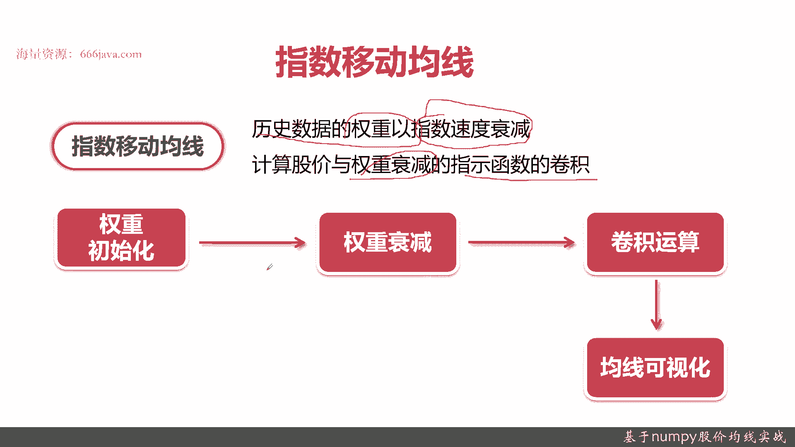
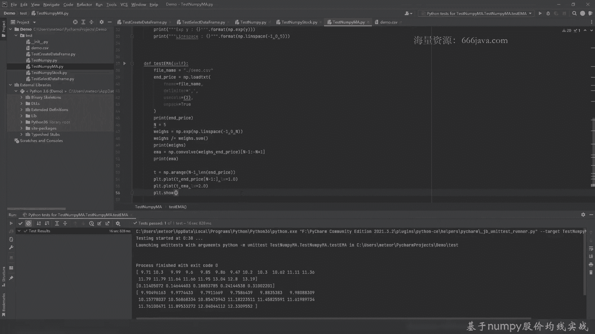

# 基于Python的股票分析与量化交易入门到实践 - P17：4.2 量化交易开发Numpy应用-股价分析实战_基于Numpy股价均线实战 - 纸飞机旅行家 - BV1rESFYeEuA

大家好，我是米tea，在上一讲呢我给大家介绍了通过南派，我们来如何去实现，对于股价的一些基本的统计分析，常见的一些指标是什么和怎么通过能派实现，那么这一讲呢我给大家介绍一下，通过南派怎么去实现股价均线。

这一讲呢，我们主要通过三个方面来给大家介绍一下，股价均线的实战，首先给大家介绍一下简单的移动均线，均线嘛在我们的第一章里面给大家介绍了，股价有5日均线，10日均线，20日均线等等等等。

这个是个简单的移动均线，接下来呢给大家介绍一下指数的移动均线，然后我们进入coding实战的环节，那么接下来呢我们给大家介绍一下，简单移动均线和指数移动均线它是个啥，首先呢再给大家介绍。

简单移动均线和指数运行均线，为了给大家方便实现，我给大家介绍一下卷积，卷积其实有同学听过卷积神经网络，那卷积其实是一种数学工具，我先给大家介绍卷积是什么，卷积其实在数学里面其实是两个函数的叠加。

生成第三个函数，卷积呢在这里面可以用于描述对于过去记住啊，过去作用对当前的影响，那其实是呢就是一个时空的响应，叠加在我们实践里面，通过卷积来实现滑动屏中平均，也就是移动平均是非常方便的。

南派里面正好有卷积库，待会给大家看一下什么是卷积啊，下面是来自于百度百科的一个卷积的基本图，可以看到图A和图B其实是A和B，这两个都是一个不同的函数，一个时间态通过卷积计算以后呢。

可以看到它们叠加状态是什么，这个来源于百度百科的剪辑的基本概念图，给大家介绍这里具体的那个微积分的公式呢，我们就在这里不进行求解了，我们给大家介绍一下，怎么通过南派来实现卷积呃。

convert卷积的就是其实英文就是convolution，那卷积的函数在单派里面直接这样用就行了，它有两个参数都是两个一维数组，A数组，那卷积默认返回是N加M减一的长度。

可以看到你看比如说这个A它是五个长度，一个是二，那最后其实他是八个N加M减一，这里也是在边缘处信号是不重叠的，所以边缘处是没有价值的，那我们可以继续在在代码里面看，这里是七个，这里返回最终是十个。

其实它已经不止NGM了，那卷积有几种模式啊，form模式，same为是模式，value模式，我们一般用的就是for模式就可以了，这个呢是sim模式，NN和M就是最后叠加菜嘛取最大值。

然后这个呢value的模式呢它是返回完全重建的点，接下来给大家介绍一下，怎么通过卷积来实现简单运动均线，简单运动均线就是分析时间序列上的股价趋势，其实就是5日均线啊，10日均线啊，20日啊。

60日几日均线其实只是一个入参，大家待会我给大家实现一个，比如说以5日均线为例，那10日均线，20日均线就就很好理解，其实简单运动计算是基数是等全，什么是等权呢，就是它的时间维度上不进行一些衰减。

然后股价与等权的指示函数的卷积有点绕口啊，其实就记住呃，简单应用权限就是一个时间序列，然后呢他等全他不做任何的时间衰减，然后求卷积就行了，主要过程首先它要生成一个时间序列的权重，根据你的目标的时间窗口。

比如说5日啊，20日，下一步减去运算，其实刚才给大家看了，就调用卷积，增派卷积库其实很容易啊，最后一步我们给大家介绍一下卷积可视化，用常见的Python的画图工具画图包，这是简单的移动均线。

那下一步呢给大家介绍一下指数移动均线，指数移动均线它其实对那个简单运动均线来说，差异就是说它的历史时间数据是以权重，他要是以指数的速度进行衰减的，他其实就是说根据时间，他把那个股价进行权重衰减的方式。

就是指数与这些，这也不是特别好理解，但是实际到时候给大家算一下，看看结果就可以知道了，步骤它比那个简单的均线，那简单运动均线多了一步，就是指数衰减，首先是权重初始化，这步是一样的，接着是权重衰减。

这个听起来很容易，其实实现起来也很容易啊，接下来就是跟上面一步卷积运算，然后最后一步是均线可视化，好呃，这就是指数的EQ精选，那么接下来我们要给大家通过code来实现一下。

如何去计算简单移动均线和指数移动均线。

像之前一样，给大家提前写好了几个类似的函数啊，第一个这个是简单运动均线的test，这个是指数衰减的test case，然后这个是指数移动均线的test case，好。

我们的demo呢其实和之前和上一讲一样，都是这个样子的，C sv，其实还是拿平安银行在2009年1月，到2月初的股价作为那个例子，他这次呢，嗯这次给大家除了用了南派的这个包呢。

还给大家用到了Python里面常用的画图，Matt blood lab，其实这个画图工具很方便，待会呢给大家看一下怎么去弄呢，暂时不需要算是算交易量和成交量了，把这个例子给去掉，这都是读数啊。

这个就不解释了，那我们现在给大家来实现一下简单运动曲线，首先呢要把移动窗口给算出来，接着呢我们生成权重，生成权重也很简单啊，这是生成南派的一维数组，好这就等全了，待会给给大家看一下。

好我们先给大家看一下这两个例子是什么，好这是股价的，这这是生权等权重，这都是0。2，没什么问题啊，接下来我们给大家简单的实现一下已知权重，然后卷积怎么去算CONVOLVE，然后呢他第一个参数是权重。

第二个参数呢是股价，然后默认呢那个mod我们就不用选了，但是呢他的结果由于它是有一个叠加效应，我们关键是要取数，我们只要取从N减一到负的N加一，其实就是从N减一到负N减一这个范围就OK了，是个叠加态啊。

然后我们可以看一下，好这就是均线值了，5日均线，就这个结果大家可以看一下，这可能不是特别直观啊，我们再给大家看一下那个通过画图是什么样的，好那我们再来看一下结果啊，呐这就是通过5日语流行线。

大家看平滑了很多啊，看到吗，那我们接下来呢给大家看一下，指数衰减是怎么弄的，两个生成了，给它生成了圆满，一个是有五个元素的数组，一个是十个元素的数组，那我们先给大家看看这两个生成的结果是什么。

这是0~4，0~9 ipad ararrange，就是生成数组是非常方便的，好我们给大家看一下指数指数化怎么去做的，还记得之前吗，我们用format at，好然后呢，我们再来把Y给求出来。

OK这就是指数衰减，X和Y就是这么取出来了，可以说是把它进行指数化，然后我们来做衰减，就是线性的衰减，这还不是那些其他比较复杂的南派的嗯，数学运算，其实就是一个line space。

然后呢他的参数从-1~0，然后呢五个元素我们可以看到结果，什么-1~0，等全序列好，那我们接下来呢给大家计算一下指数移动兵线，首先呢还是跟之前一样，我们已经把数给读出来了，收盘价，然后呢我们窗口还是五。

但是呢这个算法就不一样了，我们现在要算全戳，对先是指数化，然后呢衰减线性衰减，从-1~0，然后呢它的衰减维度是五个，其实是有移动窗口，然后呢我们把它归一化，好这回我们再给大家看一下。

这次的位次是长啥样的，那可以看到了这个权重就和刚才不一样了，刚才的等全都是0。2，你看也是-1~0，但是呢它是五，它N等于五，其实是0~4啊，然后再加上指数化，就是这样。

我们现在算指数移动平均均线还是要卷起，其他不变，调用方式呢还是N减一，到负的N减一，其实就是负N加一，好给大家看一下，指数运动均线是怎么算的，那可以看到结果和之前应该对比稍微不一样。

那这个其实不是那么明显，因为毕竟都是保留，我们看保留小额，有小数点后面八位，那我们再看一下，再画，通过画图，我们把时间窗口啊，这些时间序列都打出来，好从N减一一直到，做个对比图，画两列，画两个两个呃。

两个线，这是第一根线，这是收盘价自己的趋势图，然后呢第二个呢是指数移动均线对比一下啊，第二根图是2。0，然后呢，好我们把图也画出来了，好看到吗，这根线是原来股价自己的，我们经过指数移动均线的时候。

比刚才的等权更加的平滑，都是5日均线好了，那我们今天的coding就给大家介绍到这里，我们下面呢给大家进行总结。

首先我们给大家介绍了简单运动均线，简单运动均线之前呢，我们给大家进行了卷积，其实它是两个函数，生成第三个函数，你可以理解为相乘，但实际上它不是完全意义数学意义的相乘，它是一个时空的叠加。

所以用来做移动平均均线是最最好不过的，然后呢简单运动均线是等全，然后在时间维度上，你时间窗口一般有五有十，有20，就是就是几10日均线，在这个时间维度窗口上非常容易啊，去求个卷积。

南派点confirm就可以了，再下一个呢是指数移动均线，指数移动均线呢就是跟单运动均线唯一的差距，就是它的权重呢，它不是等权的，它是有个衰减，其实就是NP0指数EXP这个函数。

然后呢line space就是线性的衰减，当然你可以用其他的方式进行，这其实都是数学工具，然后我们还要做一个归一化，做完归一化以后，其实就是求解方式和简单易动均线是一致的。

最后呢我们给大家介绍了代码实现，代码实现主要用到了两个库啊，南派这次因为画图比较需要可视化嘛，所以我们用了matt plot lib，后面再有一张我们给大家专门的介绍。

mate会用一些更加丰富的骨架的一些图，比如说之前给大家介绍了呃，录音带啊等等等等，以上就是本节的内容。

我是米田。