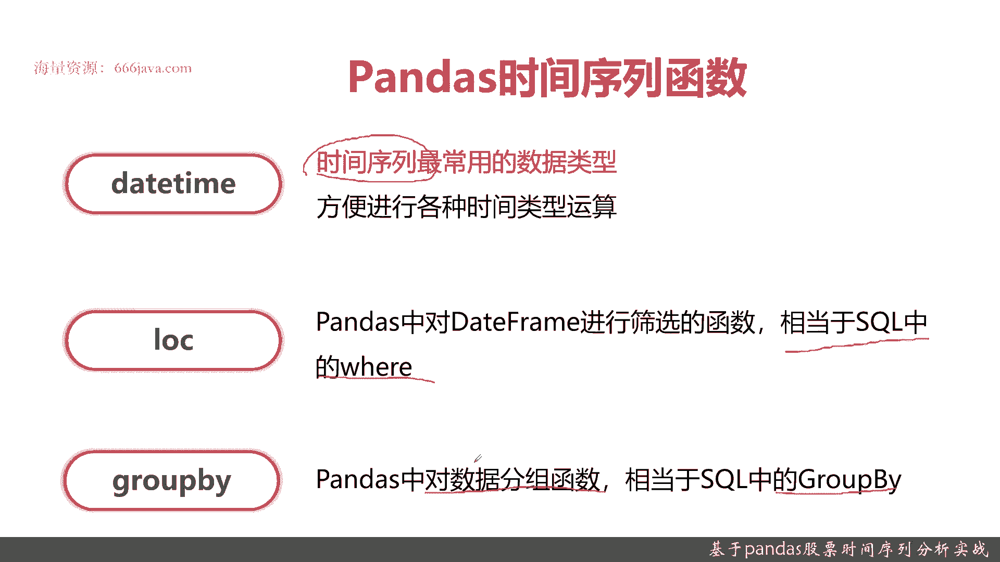
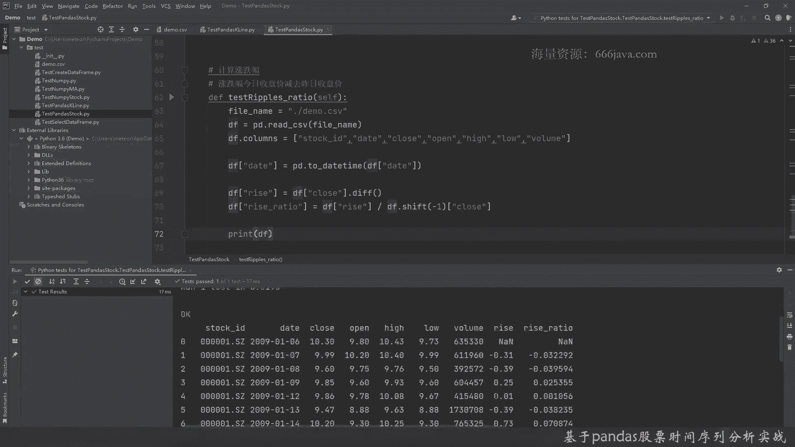
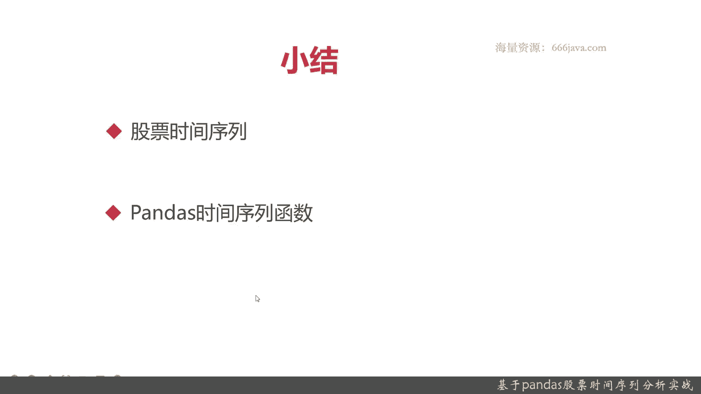

# 基于Python的股票分析与量化交易入门到实践 - P18：5.1 量化交易开发Pandas应用-股票分析实战_基于Pandas股票时间序列分析实战 - 纸飞机旅行家 - BV1rESFYeEuA

大家好，我是米铁，在上一章呢，我给大家介绍了关于南派的一些实战，这个比方说南派怎么去取股票的统计分析啊，股价的分析啊等等，那么从这一章开始，我们将向大家介绍Python。

里面一个常见的用于金融工具计算的类库，Pandas，那我们首先呢给大家介绍一下，pandas是关于股票时间序列的施展好，这一节呢，我们将要从两以下两个部分给大家介绍。

首先我们给大家介绍一下什么是股票时间序列，他能干点啥，然后它有什么作用，接着呢我们给大家介绍一下，pandas as的时间序列，常用的一些函数，并且我们给大家来进入实际的coding环节。

首先呢我们给大家介绍一下股票时间序列，首先给大家介绍一下时间序列的定义啊，时间序列是金融领域最重要的时间数据类型，股价啊，汇率啊等等，常见的这些都是时间序列的数据，时间序列不仅是包括年月季度周日。

甚至还有小时分钟，最低的是tick tick，tick tick相当于毫秒级的，那时间序列一般是分析哪些维度呢，首先是进行趋势分析，这里面这个趋势分析主要是分析，时间序列在某一方向上向上的持续运动。

那其实就是基于统计分析来，比方说分析股价的看涨还是看跌，这样的话呢我们如果预测能准确，那我们就能盈利，接着是一个相关性的分析，相关费用分析呢是那个时间序列里面，最重要的特征，比如说A和B，比如说打仗。

打仗以后，他的军工的股价就会涨，但是民生相关的一些股票它就会跌等等等等，这就是序列的相关性的分析，这些下面都是定义，感兴趣的可以自己看一下，我们接下来呢给大家介绍一下，Pandas。

在时间序列分析分析里面常见的一些函数，接下来呢我们给大家介绍一下pandas，通过时间序列函数这些常见的一些处理的函数，首先呢是date time。

date time是Python里面常见的一个数据结构，它呢是表示时间的，它为什么会被用在金融里面时间序列的分析呢，因为get time可以很方便地进行各种的时间的运算。

比如说取年取月取日取时取分取秒加解等等，接着呢给大家介绍一个pandas的log函数，当然了，这里不仅仅是logo，还有i logo啊，at啊等等等等，这些我们不介绍，不展开了，它主要是时间序列里面。

可以对时间或者对列进行一些筛选，那其实它是相当于大家记住这个，就相当于思科中的where啊，好再接着呢给大家介绍一个古柏GOOBY，可能有的同学用过，有的同学没有用过，不呃不过没有没关系。

我待会会在我们的程序里给大家看一下，那古派其实就相当于sq里面的古板，其实主要是对data frame进行分组好，那么接下来呢我们要给大家进行实战的。

coding环节，先跟之前一样，我们把一些基本的函数名给大家写好了，然后呢我们给大家一边coding来，一边讲解一些这些函数的基本用法，那首先给大家介绍一下data frame读取函数。

data frame读取函数跟单派其实也方便一样的，这个id有提示过的，其实非常方便，然后给大家看一下，这个DF里面常见的一些函数，点f info，然后来个分隔符split。

然后再给大家看一下DF的describe啊，不好意思，好这两个函数呢大家看一下是什么样的，可以看到上面是df input，他把一些列名，然后呢哪些是非空的，还有这些数据的类型给大家的进行了介绍。

有object有float，有int都是64位，下面呢是describe，那他把他的一些基本在关于data frame，在每一列里面基本的一些值给大家求出来，比如说count，比如说平均标准差最小。

然后最大前25%，前50%，75%都给大家看到了，好，这是呃pandas as，关于读取文件和一些DF，描述的一些基本的函数，好，那么接下来呢我们单给大家介绍一下pandas。

关于五加时间处理的一些基本函数，老规矩，我们还是先把数据给读出来，这个和和上面的函数一样，这是非常简单的，然后呢后面我们我们要给每一列进行赋值，DF的赋值很容易，这样就可以了，那它提示也很容易。

先是股价sport id，这是股票代码，然后呢时间日期收盘价，开盘价，最高价，最低价还有成交量，OK好，赋值都好了，然后我们对时间进行处理，要把data类型的，不是把date这一列单独进行处理。

先转换一下时间格式，这个是非常方便的，好这就转换，你看大家可以看一下这些IDE，其实还是很明显的，那鼠标放上去就可以嗯，感兴趣同学可以自己去看，然后我们给他把棉给取出来，这很容易啊。

直接转一下就行就行了，这个是date time类型，自己的时间处理，好下面呢是转月份，好这就把这个处理完了，然后我们输出一下，看看这会是啥样的结果，OK我们来输出一下时间处理的结果。

可以看到这些日期我们是取了两个月的交易日，月，其实也没有整整两个月，正好整整一个月，1月到2月年份都是2009年月份，有1月有2月给你算出来好，再下一个我们给大家计算一下最低的收盘价，还是跟之前一样。

这个我们就快速过吧，先把一些基本的数据给取出来，生成一个data frame，然后给他们每一列，进行赋值，好那我们现在开始直接计算了，我们还是用提示的方法给大家看一下，好这个其实很容易啊。

他是也是pandas自带的函数，那这就算出来了，我们看看它的index是多少，这也是有现成的函数的，这个函数大家可以看index main是最小的，这一个值所在的index，然后我们把这一这一行数据。

或者叫这个这个frame全部把它打出来，这就要用到lock了，当然了，这一列打出来以后，lock还可以把某一列给取出来，这我们就不在这里详细的解释了，大家有感兴趣的同学可以自己去看一下，嗯这里报错了。

看一下他报错是什么啊，哦拼错了，不好意思，这种拼写错误确实是容易有坑的，所以同学们以后在列名拼写的时候，一定要完全正确，OK结果看到了最小的是9。47，它是index等于五的数据。

然后这一行数据是这个值，OK好，那我们接下来给大家看一下，每月的平均收盘价与开盘价，老规矩还是一样的，我们现在先把这些基本的，数据结构，给它取出来，Stock id date，这个不能少。

close也不能少，open也不能少，最后一个是VLOG好，这是基本的数据结构类型就OK了，然后呢因为是每月嘛，所以我们要先要把月给算出来，好这样就可以把月给算出来，好这每月就算出来。

那我们要把这个每月的平均开罐价，开盘价运到两个函数，一个是功夫by，这个是刚刚给大家简单介绍的，还有一个就是平均函数是零，我们给大家演示一下，这个呢就是按月分组了，然后呢按月分组。

因为他是把所有的数据都要去算，所以你要指定列，因为他是国服白以后它不会自动提示，所以需要你自己去输，然后再给大家展示一下每月平均的开盘价，应该是open了啊，还是goodbye mouth。

好那这样每月平均的开盘价与收盘价就算了，我们给大家看看结果，看到吧，第1月1月和2月，1月和2月，OK那好我们再给大家来举个例子，涨跌幅，涨跌幅就是股票每天都有涨跌幅吗，其实涨跌幅就是今日收盘价。

在金融业务就减去昨日的收盘价给呃，之前给南派的时候，给大家介绍了一个那个算术的平A，那其实它是用个DF函数，在那个pandas as里面，它也有一个DF函数，因为它是沿用南派的嘛，然后给大家看一下。

还是要像之前一样，先把这个数据结构，这个DF给它生成，好然后还是要很重要的，我们要把那个data类型可以转一下，只有是时间类型的，他才方便进行计算，因为时间序列就是要date time。

好然后先算涨跌幅，涨跌幅很容易啊，我们命名一个列叫rise，那居然是收盘价，那就是这个函数鼠标可以移项一下，可以自己看一下，那这里都有详细的介绍了，好吧，我们具体不展开了。

然后呢给大家再看一下涨跌幅的涨跌幅比例，涨，ratio就是比喻或者叫，一般都是叫ratio，有的是percent，但是一般不是这样叫percent，那直接用一个shift，就可以了，是上一天的收盘价好。

然后给大家看一下结果，那可以看到第一天肯定是没有的，但是最后一天肯定也是没有比例的，可以看到这就是具体结果了，好吧，好以上呢就是我们今天简单的实战。

下面进行本章小结，首先呢给大家回顾一下股票实践时间序列，股票时间序列是金融数据最重要的数据结构，这里再重申一遍，它是最重要的，重要的要说三遍，股价汇率都是时间序列函数，最高的可以有年。

然后半年度季度月度周度日度，然后分钟级秒级比秒更加，一人是tick tick，Tick tick，甚至到毫秒级了，那他能有哪些分析呢，一个是趋势性分析呃，用白话说，就是基于统计分析来预测它的涨跌趋势。

因为为了盈利嘛，再下面一个是相关性分析，就是主要是看两种不同的投资标的，那比如说不同的股票啊，是正相关还是负相关，这是股票时间序列的一个定义，和他们基本的作用，然后呢pandas里面呢。

大家同学们都应该有接触过pandas as，在时间序列分析的函数里面，主要的一个是date time的这个数据类型的作用，可以很方便的求年求月进行加减等等，还有一个呢条件筛选look。

呃我们这次举的例子呢比较简单，但实际中可能比这还更加复杂，还有一个就是股500，股五白在时间序列里面按照时间分组，或者按照股票id分组，你想A股有4000只股票，那你要求每一只股票的呃，每个月的平均。

那你是不是要顾补发两次对吧，这些都是常见的时间序列分析的函数，OK以上呢就是我们本节的内容，我是明天咱们下期再见。

