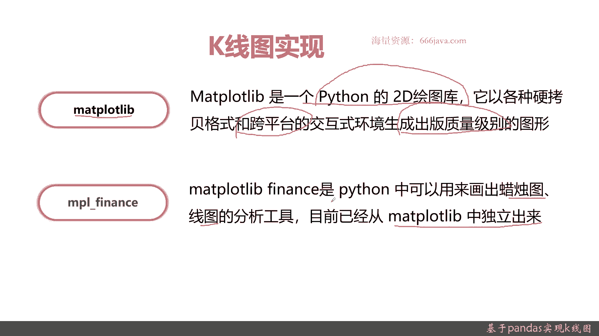
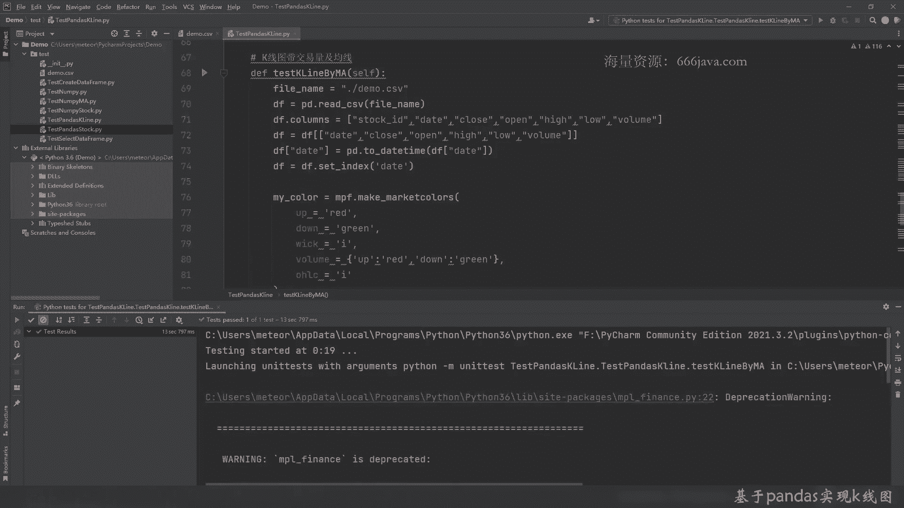

# 基于Python的股票分析与量化交易入门到实践 - P19：5.2 量化交易开发Pandas应用-股票分析实战_基于Pandas实现K线图 - 纸飞机旅行家 - BV1rESFYeEuA

大家好，我是米田，在上一节呢我们给大家介绍了pandas，关于股票时间序列的一些分析，那么这一节呢我们将给大家介绍一下，通过pandas如何画出K线图，这一节呢，我们主要从以下几个方面给大家介绍一下。

是通过pandas来实现K线图，首先呢我们给大家回顾一下K线图是个啥，然后它有什么作用，接着呢我们给大家介绍一下panda4，要实现K线图可能会用到哪些类库，当然了，这次不仅仅给介绍pandas。

因为pandas as主要是数据格式的呃，除杂还是数据为K线图，它还要用到一些画图的内裤好，那我们先给大家回顾一下K线图啊，K线图之前就为大家介绍过，K线图其实就是蜡烛图，重点是可以进行描绘股价强弱。

还有涨，看多还是看空，多空双方的力量对比，是股票进行技术分析的时候最常见的工具，那我给大家再回顾两个例子，这种示例，第一种这种情况，那就是看涨，他是个红三兵，连续的三根小阳线，后面都是一直看涨。

再接着呢看跌的黑3D连续三根小阳线，当然这不是绝对的，只是你们说在这种情况下，大概率还是会跌的，OK这种图嗯，有的同学肯定就要问了，那我们怎么通过程序来实现呢，或者说我们再说的更进一步。

我们怎么通过Python来实现，现在给大家介绍一下内裤，首先我们要用metpp lab，这个呢是Python的2D绘图库，你如果用其他的开发语言可能不是用的，但是你如果用Python进行绘图的话。

主要就是它了，它是跨平台，然后可以支持出版质量级别，那其实就是他是一个非常好用的二级类库，通过调用这个matt club back，可以直接生成K线图，仅仅只用这个库呢行不行呢可以。

但是呢效果可能没那么好，那我们还要给大家再介绍一个在这个类库下的，Matt problem，下面的比如叫MPLFINNICE，这个类库是脱胎于matt club la，他呢专门可以画各种的精工。

金融技术分析的一些图，比如说蜡烛图等等等等等等，甚至后面介绍给大家会介绍MACD啊，然后KDJI等等都可以用这了，他现在呢已经单独进行维护好。

那下面呢我们进入coding实战环节，我们现在呢进入coin实战环节，这次呢跟上次一样，我们也是把这些代码呢简单的给大家标了一下，就是定义那些基本的函数，然后实现呢还是一样的，我们自己现在一起来实现。

之前呢是因为pandas，大家和单派大家可能都比较熟，所以呢关于函数的讲解，我这里就不会花太多的参，尤其是函数参数的讲解，我这里就不会花太多的时间了，但是现在呢这些类库可能大家不是特别熟。

或稍微给大家简单的介绍一下，老规矩，还是先定义数据结构，数据结构定义好了，我们要进行画图，画图呢首先要声明这个变量MATPLOLAB的对象呢，我们之前已经把它给声明好了，然后我们定义轴。

好我们要用之前上面已经生成好import的那一种，专门化蜡烛图的这个函数，他呢有各种各样的数据要求，首先要把开盘价来定义好，那开盘价后面是什么呢，应该是收盘价，哎不好意思，拼错了，这样还不行。

他要把他list给传出来，这个提示还是做的很好的，Close open，那后面应该就是high和low了，high对吧，然后应该是NO，然后是宽度，然后是关于涨和跌的颜色定义。

好我们呢还要给大家看一下这个具体的解释吧，不然可能同学们不太好理解，这个函数可能默认大数都比较专业，代码没有做的那么好文档了，我们可以看一下嗯，是这些参数，它支持正式轴收盘价。

把开盘价收盘价最高价最低价vs宽度颜色表，二法师是默认的，这个其实大家可以不用管，但是呢它内部他有个作用，好代码里面都有基本的一些注释，感兴趣的同学可以自己去看啊，好我们现在把这画布给，生成图。

生成各种标线，然后呢生成骨之间的网格图，然后这个图的名字那很简单，K line，然后画图，运行一下看看结果呐，这个就是我们给大家第一步画成一个K线图，take one吧，看到吧，红色是涨，绿色是跌。

整体来说，平安银行这支股票，在那个2019年1月份这段时间，总体来说还是一个上涨的趋势好，但是嗯有的同学可能会说呢，这和之前曲线图不太一样，我们给大家再用其他的一些工具，用更强大的内裤给大家画一下。

接下来呢我们要给大家画一下，关于交易量的K线图，哦拼错了，这没什么，好老规矩，还是先把这个数据给他定义，这次我们就不敲了，为了时间，因为这个函数其实还是扣定量，还是有一些主要是这个API要可出去。

然后呢他这个对时间格式的要求非常的高的，对数据类型要求还是比较高的，所以我们先要检查一下，它不需要lok id，那我们就把后面的，给他裁剪，其实就用jump也行啊，但是额这样的话给大家简单一点吧。

然后把时间格式给他转一下，改成date time，这样方便分析，然后呢要把index用data类型给不值，不是01234这种形式好，那我们这样数据的初始化准备就已经做好，我们现在来coding。

首先要生成color近视，这个MPF就是MPLFINNEX的这个对象，我们之前也是已经实例化过了，首先那好我们来给大家看一下，解释一下这个函数，那涨跌边缘引线，然后阿尔法值蜡烛形式的，然后是否有成交量。

他这就可以在成交量了，好，buck还是red，然后down还是green，港股也是反过来的，A股就是这样，引线，然后成交量的颜色，因为我们这里已经生成了，我们已经声明了成交了序列了，待会他会直接认识。

否则的话就必须能吃定，好接下一个呢蜡烛图的形式，color好了，再下一个呢是style是类型，要Mac m m p m3，老规矩，我们在选之前呢，看这函数，啊这里有一个注释，然后基本的字体。

他还要把那个colors给带进去，我们给大家一个实例，看一下结果，首先他肯定是要把color，把声明这个对象复制进去，Color，然后他们的网格的引线轴是什么样的，那我们选boss，网格线的种类。

然后呢字体，希望他能支持做自己的宋体，但是说句实话，这毕竟是外国人，老外他们写的，所以呢这不是我们国内的，他对于中国的文字不是那么的友好，好style也好，接下来呢我们要把它本身设没有，我们也老规矩。

我们还是看看有没有线，那他要把一个判断别的服传进去，这就是我们一开始为什么要这样用的数据类型，它也是强制指定了，然后必须用data time index，然后这是拒绝的配置，好吧具体的我就不展开了。

同学们有兴趣的可以去读，然后这些源码写的也比较的那个好读易懂，咱们就选快乐，感兴趣还可以去读他们官网的文档，这是蜡烛图的形式，然后这个图的开头是什么呢，好，Y轴，这是style，我们得自己把它给附进去。

是要实施下，用也很简单，直接BOM等于true就行，但是呢他要指定这个BOMM等于true，它是哪一列的数据，所以这就是为什么，一开始我这里再声明这列坐标的数额，这里列名的时候要完全一致。

它只有名称一致和才能你认识，然后时间格式的时间格式化类型，再接着呢是X轴的一些配置，色呃呃线条的颜色，这里我们直接写默认了，布区，好那我们来看看结果是什么，好可以看到那个带了交成交量的。

就可以看到它都是自动认识的好吧，这边是Y轴，是价格，从0。51直到这里，价格是这样，然后呢下面的是交易量，然后时间也出来了，这个图是不是看着比上面那个好多了，好那我们在下面呢给大家把均线的也带出来。

老规矩，这些东西我们就不直接敲了啊，我们为了效率，多了删掉，然后呢额这应该是color也是一样的，我们也不敲，然后style应该也是一样的，好他唯一的不一样呢，其实就是MPF本身这个对象。

我们再给大家看一下，Type color over ride，Big scale，Cigaresh in b，extra style加一量word，Shot on train line。

count i h是count station，卧槽这是这么多参数，我们就不一一给大家演示了，感兴趣的同学可以自己去演示，那我们直接就把结果告诉大家，确实很多，这都和之前都和一样的定义，拉出图。

关键在这里，这里可以看到，好5日和10日均就是这么写，只要加这么一句就可以了，唉待会给大家看一下，那剩下的我也不敲了，直接，按照这个结果把它复制过，其他都一样啊，好我们看一下加了均线。

5日十日均线以后是什么结果，他这好像看上去有点不是那么颜色，不是那么好看，但是默认就是这样，OK这是5日的剧情，这是剧情好，以上呢就是关于通过pandas来进行K线图，实战的coding部分。

下面进行本章小结，接着呢进行本章小结，首先呢我们给大家回顾了K线图，K线图其实就是蜡烛图，主要是反映股价的走势，还有多空力量对比，还有股价额，其实就是股价涨跌幅了，K线图是技术分析里面非常重要的工具。

接着呢我们给大家介绍K线图标中的哪些类库，主要就是pandas matt plub，Matt port la，基于matt blab为为了实现蜡烛图啊，K线图啊，甚至布林带等等。

巴拉巴拉各种其他的金融工具的一些技术，分析的一些图表，他在这之上的后面专门有一个MP2，m p l finance这个类库，现在已经独立维护了，OK感谢大家的收看，以上就是本节的内容。

