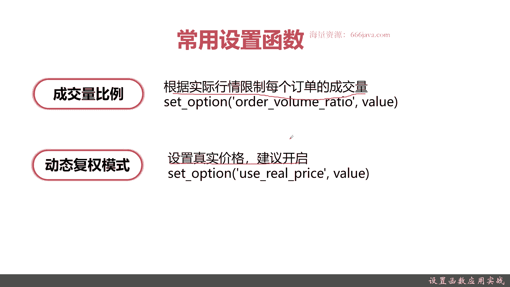
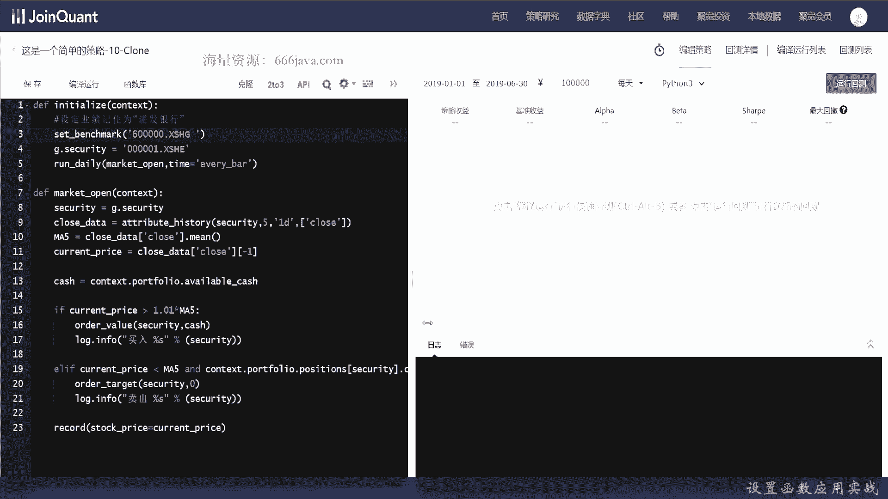
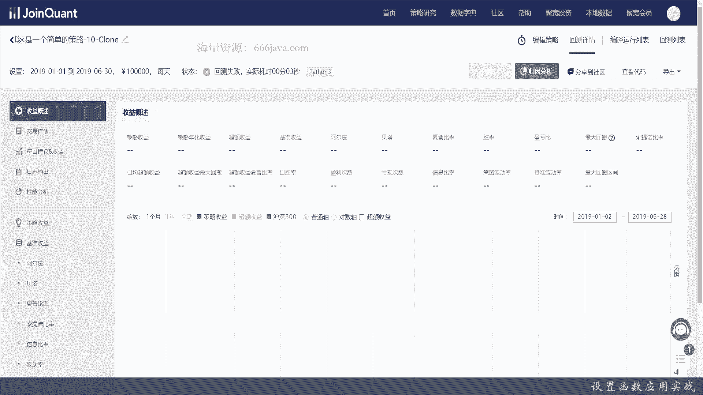
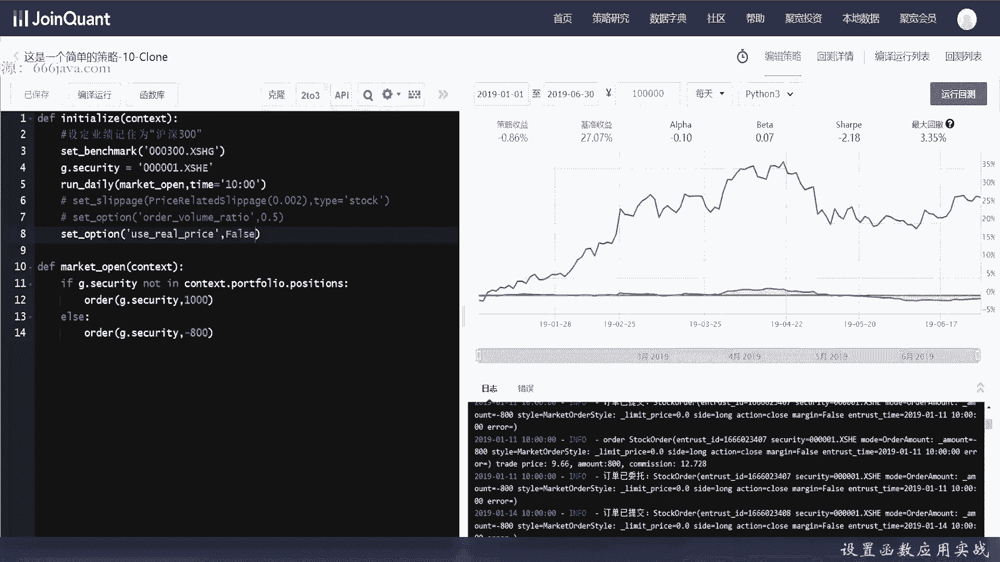
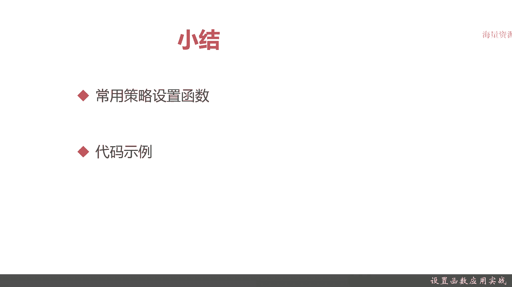

# 基于Python的股票分析与量化交易入门到实践 - P23：7.2 量化策略编写-Python量化交易编程第一步_设置函数应用实战 - 纸飞机旅行家 - BV1rESFYeEuA

大家好，我是米tea，在上一节呢，我们给大家介绍了简易量化交易策略的实战的，第一节主要是给大家介绍策略框架是啥，怎么样去编写，那么好，从这节呢我们将给项将给大家深入详细的介绍。

量化交易策略编写的一些常用的API，首先呢我们给大家介绍一下策略设置函数，首先呢给大家介绍常用的策略函数，它有哪些可以使用的地方，当然了，实际策略设置函数它有非常多的点可以去设置。

那接下来呢我们就进入代码实战，首先呢我们给大家介绍一下常用的设置函数，它有哪些点，第一点基准，什么是基准，基准就是业绩比较基准，它在我们区宽这里的API里面，它叫set benchmark。

一般来说你的股票债券基金这些交易的，它都要有一些业绩比较基准，比如说把你的涨跌幅，你的收益情况和沪深300比，那沪深300就是你的基准，和不同的基准进行比较，你可能会发现你有不同的业绩情况。

以及不同的收益率，甚至呢有他们常说的阿尔法贝塔，OK这是业绩比较基准，接着呢给大家设计一下，介绍一下佣金和印花税，股票类的交易啊，每笔交易时候都要进行收取手续费。

然后呢包括你的基金每笔交易的时候也会进行，要收取一些那个申赎的费率，那在股票里面呢一般佣金为万分之三，这是买入的时候，卖出的时候呢一般是佣金万分之三加1‰，因为它还有一个印花税，在我们的区宽这个平台呢。

它是set older cost，接着呢再给大家介绍一个滑点，那什么是滑点，华点的意思，就像这定义的一面来说，真实的成交价格与下单预期的时候价格的偏差，什么意思，比方说我的一个股票预计是八块三毛二买。

但是呢真实的成交价格它有可能是八矿三毛三，也有可能是八块三毛一，那中间可能有一到两分的差异，那你如果选择接受，你就可以买进或者卖出，当然你也可以选择不接受，那这个价格就一直挂在挂在交易所上。

考虑了有一些时间关系，交易嘛越快进行越好，所以允许也有一些误差，这就是实际的滑点，然后在实际的API里面加CSLIPAGE，它有三个参数，具体呢我们在实际给大家进行讲解。

再接下来是给大家介绍一个成交量比例，什么意思呢，就是有的情况下，你比如说一次性买十首或者50首，你可能一次性不能全部获得你的交易，比如说你要买十首，那市面上只有五手或者是一手可供交易。

那你后面剩余的你的需要成交的情况就要调整，通过调整价格或者等待时间，那成交量比例就是来设计模拟这个场景，这是一个相当于模拟真实交易的场景的函数，这种情况越真实越好，最后再再给大家介绍一下动态复权模式。

什么是动态赋权模式啊，先给大家简单介绍一下动态赋权，一般来说需要设置一个真实价格，建议开启，什么意思啊，动态赋权是说无论是股票还是基金，它都会有一些分红和拆分这种情况呢，在基金里更常见。

股票也有股票在分红或拆迁拆分以后呢，它就会折算成你的价格就会变化，比如说你本来是32块钱，那你拆分以后，那它可能就跌了，分红以后它又变化了，而基金呢它他的那个变化程度更高一点，比如说它是净值是1。0几。

1。04，那它分红以后，那你的虽然你购买还是1。0，虽然你实际上其实你等于是赚了，你拿的还是1。04的买入价，但你持有这么多手，其实上你是已经赚到了分红的收益，那一般来说在做那个金融量化交易的时候。

都会把复权可以考虑进去，但是由于是尽量是模拟的交易，那一般来说我们还是建议开启真实价格，以上就是我们简单给大家介绍，常见的五个常用设置函数，那么接下来呢我们进入实战coding环节。

我们呢接下来给大家进入实战coding环节，首先我们给大家介绍的是，怎么样去设置股票业绩基准，股票基准其实很容易啊，目前这个策略是还记得吗，是我上一节给大家进行demo，我这里就不重头给大家敲了。

我们节约时间，一般所有的就是那个设置函数，我们都是更新在initialize里面，还记得吗，一个是initialize，一个是你的策略函数。

策略函数一般在run情况有run daily和run wake，或者其他一些情况，策略还是我们复习一下，是由我们程序员自己编写的，而initialize是在每次程序初始化的时候。

那设置策略函数都是在设置之前，我们先给大家看一下，假设我们把业绩比较基准设置为浦发银行，那我们这笔交易会怎么样，好其实很简单，敲两行代码就有了，ID居然还不还不认识自家的API，这个倒是有提示啊。

好浦发银行出来了，那我们其他的都不用变，我们可以看到在这种情况下。

运行回测是什么样的嗯，回测失败。

我们先来编译运行一下，标的不存在对吧，这里下面我们要简单的把这里给改一下，首先我们就认为他是09：30来进行交易吧，好然后呢，我们把买入和卖出给，如果没有持仓的话，那我们这时候就下单一百一百股。

Order，就是下单，然后，这个它自动的变化了，那就1000股吧，否则我们就把它给卖出，这是一个最简单的策略，无脑买不考虑其他的策略型号，主要是给大家看一下业绩比较基准，这就是卖出，嗯又报错了。

我们看看为什么啊，那可能是这里写错了哦，多个空格对吧，应该是的好，可以看到这就是实际的运行结果了，大家可以看到，假设从2019年1月1号到，就是无脑买无脑卖，然后呢这个业绩基准收益28。8%。

策略收益我们这里是亏的，我们这样没有这个策略没什么收益，那我们来调整一下，我们把那个业绩比较基准换成沪深300，还记得吗，XSSH是上证的，那其实沪深300其实只要换一下编码就行了，好沪深300。

那剩下的只要运行一下就可以记住啊，这里原来是22。8，阿尔法是负的，0。10，贝塔是0。06，我们可能稍等一会好，可以看到这个时候基准反而收益更高的，27。0，那你可以看到阿尔法和贝塔变化了。

夏普也变化了，OK这个set benchmark大家知道了吗，就是调整业绩比较基准，它影响的是你的收益情况，OK好，那么接下来呢我们把这个给去掉，业绩比较基准不要了，我们来测试一下佣金。

我们设置一个夸张的用解，这是没有，那个就是哎我们还是不变，我玩沪深300，好那我们接下来呢我们来设置一下佣金的情况，首先呢这个情况是没有佣金的，可以看到这里是没有佣金的，那我们接下来来看有佣金的情况。

佣金是什么，Order cost，只要声明一个函数，肯定是，就0。03吧，然后还有一个应该是费率和印花税，这个呢，水率我们也迁一吧，好这个函数就写好了，我们看一下啊，不过他基本没什么提示。

我们只能自己测一下，那可以看到了我们的策略收益，算上了佣金和银行税以后，之前策略是四一点起，这个其实本来就是亏的债券吧，但是你看加上了印花税和佣金以后，我们亏了28%，因为为什么呢，因为我们交易的频繁。

那这里是看到每一笔订单，你交的税率这里都是有的，因为你交易的越多越频繁，那你交的税就越多，因为我们是交易是非常频繁的，基本上呢分钟和秒期，这就是设置了佣金和印花税以后出现的情况。

那么接下来呢我们来设置一下刚才说的华点，我们把英军和樱花暂时给关掉，我们假设我们每天这个调整一下，每天十点钟开始交易，我们滑点是多少呢，千二吧，还是set，这是个动态的滑点设置。

好我们来看一下price，好我们试一下，看一下滑点，好可以看到设置了滑点以后，我们的策略反而收益更高了，因为为什么呢，我们在2‰这个范围进行波动，其实呢也就一分两分的，那有有的时候我们也没人来得及卖。

那可能没来得及平仓，反而我们得到了收益，所以在这种情况设置了滑点，反而是OK的，我们接下来呢再给大家，编写一下成交量，成交量是set option，我们设置成交量不足50%吧。

他这个IDE基本上VR ratio，基本上不认识自己的API，好我们来编译一下，好可以看到成交量不足的时候，也有一定影响策略收益-0。86，那有的时候委托1000单，那没有全部交易成功，可以看到。

那我们最后一个呢，我们已经把成交量给设置好了，我们最后一个呢来设置复权，老样子，还是把这给注释吧，默认我们先是来true给大家对比一下，好看看到这个是-1。1，OK这是实际交易的情况，好的。

那我们再给大家看一下，我们假设把附件给关了是什么样子，我稍等片刻啊，哎把付钱关了，看上去反而更好一点对吧，初始金额10万，OK这个就是设置复权价格，当然了，同学们不要因为我看上去这个策略好一点。

不同的策略设置的不同参数，其实收益情况是不一样的，但是呢尽量模拟真实交易，所以费率其实可以看到，如果我们不算交易费率的话，其实我们的收益这块还可以，但是实际上你看我把费率已设置。

那我们其实我们亏了百分之将近30个点，好以上呢就是本节的内容，下面我们进行小结好。

下面呢进行本节的小结，我们这一节呢主要是给大家介绍了一些策略，常用的设置函数，这些设置函数呢，基本都是在natural的时候就进行使用的，首先给大家介绍了如何去设置业绩基准。

接着呢给大家介绍了如何去设置佣金，那设置佣金和不设置佣金，其实交易包括交易费率啊，印花税啊等等，同学们可以看到，中间将近有三四十%的差异，接着呢是给大家介绍一个华点，那什么是滑点呢，华点就是你真实价啊。

和真实的预期的那个交易的成交价，和你实际的成交价之间的差值，一般来说是1%或者1‰，或者是一分两分，接着呢我们给大家介绍了成交量比，就是你设置可能有十首或者是100手，那是或者是全仓买入。

或者是全仓清空，但是呢实际你的交易可能只能完成30%，50甚至百20%，这些呢都是尽量模拟实际情况的，最后呢给大家介绍了一个动态复权，动态复权呢建议同学们开启就行了，它主要是根据那你股票。

债券基金主要是股票和基金，它有一些分红，那其实债券也有这些情况，但是其算法是不一样的，因为它不影响面值，好了，最后呢给大家介绍了实际的代码实战，我们的课程呢把每一个函数在本节内容，每一个函数的差异情况。

你怎么去设置和对应，实际的主要是影响你的业收益，这都给大家演示了，OK好，以上就是本节的全部内容。

我是米tea。