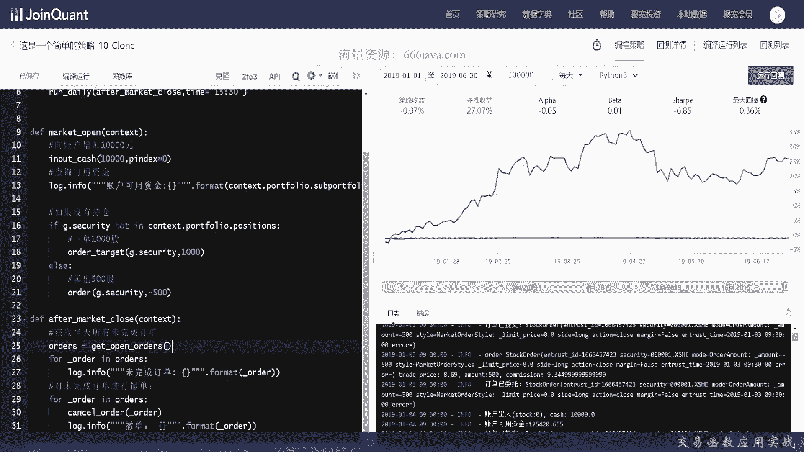
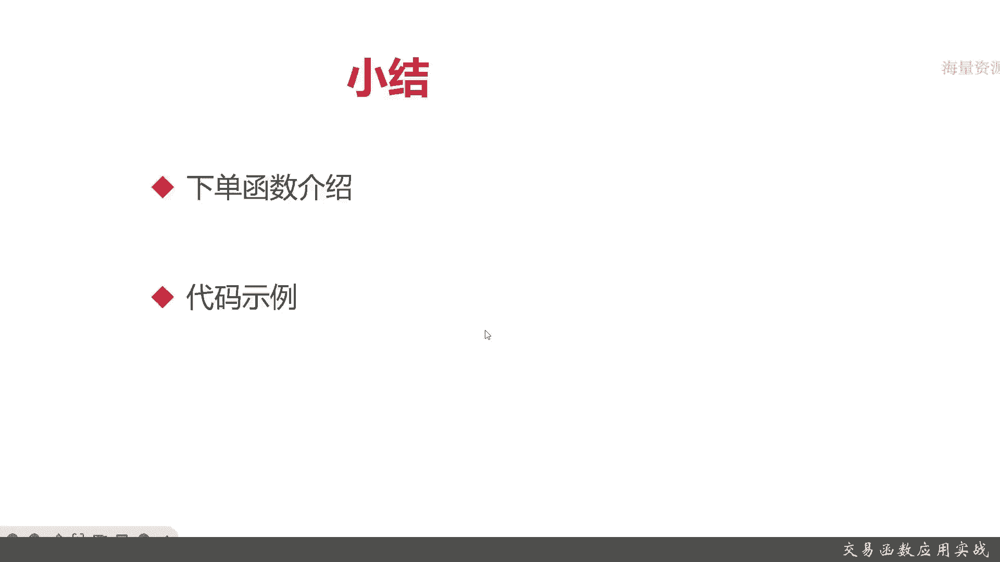

# 基于Python的股票分析与量化交易入门到实践 - P25：7.4 量化策略编写-Python量化交易编程第一步_交易函数应用实战 - 纸飞机旅行家 - BV1rESFYeEuA

大家好，我是米TIA，在上一节呢我给大家介绍了定时函数，那这一节呢我们接下来带大家讲，那么这一节呢我将向大家讲解交易函数，那么呢这一节呢，我将从两个方面给大家进行讲解，首先呢我们将会向大家详细的介绍。

交易函数有哪些类别，还有这些类别的函数，它们有哪些参数，还有呢有没有一些例子，接着呢我们会给大家进行一些代码的扣进实战，那么第一个呢我将向大家介绍，按照交易数量来进行交易的交易函数。

就是简单的order，它有旗下的几个参数，Security amount，style side和p index，那security呢就是股票代码，amount就是交易数量，在区块量化平台里面。

还有其他的常见的量化交易平台里面，负数都是表示卖出的，style是下单的类型，side的shout为空，long是多，因为我们中国A股它是不允许空头交易的，所以主要是long默认是选long就可以了。

t index是仓位号，默认为零，那么接下来呢给大家看一下，按照交易数量的一个例子，比如说我们按照现代价30买入100股，那OK就是以下这个例子，Limit order style，30就是现代价。

那么接下来呢我们给大家介绍另一种交易场景，按照股票价值，按照股票价值呢其实就是order value，这个函数其实就是按照价值的股票来进行交易，核心的函数，或者说有差异的函数，按照股票价值进行交易。

它的函数呢就是order value，它和上一个order这个函数有差异的参数就是value value，就是股票的价值，表示整体的股票价格，然后呢负数同样道理，负数就表示卖出，那我们给大家看一个例子。

假设按照卖出价值总价值为5000元的股票，就是out value，简单的付5000，像什么style side p index这些参数可以不填默认取值，我们再给大家介绍一个非常有用的交易场景。

就是目标数量就是一直保持交易，直到满足达到特定的条件为止，那这个函数呢就是out target，它的函数里面有一个不一样的参数，是amount，close today呢，这个一般同学们暂时应该用不到。

主要是一个amount，和之前的order函数一样，它呢参数里面amount复数也是表示卖出的，我们给大家介绍一下，我们接下来给大家看一个例子，假设买入平安银行所有股票到正好100股。

那就是下面这个例子，无论你现在持有平安的所是一股都没有，还是有99股，甚至有100股，那你如果一股都没有，他就要买100股，如果99股只要买一股，那如果已经100股了，他就这个函数它就不会进行交易了。

OK以上就是三个交易常用的场景，那么接下来呢再加再介绍几个交易函数常见的，那么接下来呢再给大家介绍几个常用的，其他类型的教育函数，首先是查询成交订单，Get orders，Get others。

常见有几种用法，一种是按照订单号，就是order id，还有一种呢是按照证券代码，这两个场景呢是基本上可以很好很常见的背景，大家可以用到，也可以按照STUSSTUS，在后面的介绍里面。

我会给大家详细介绍，接下来呢我给大家介绍一下，查询未完成的订单叫get open orders，这个函数呢没有什么参数，就直接获取就行了，比如说有以下这个例子，在每天交易结结束之后，在交易结束啊之后啊。

获取当天所有未完成的订单，其实很容易啊，我们取一个order等于get open orders就可以了，然后便利它就OK了，再给大家介绍一个常用的函数，撤单我们可以也撤出交易，叫撤单。

Cancel order，这个order呢也是一个参数订单，就比如说我们可以在每天交易结束之后，对完成的订单进行撤单，那否则呢它会第二天再进行交易，那可能会造成不必要的损失，就像这样。

orders等于get open order，然后我们查询到这些orders之后，我们对它进行撤单，最后呢，再给大家介绍一个，可能会常用的交易类型的函数，账户的出金入金什么意思呢。

就是类似于你的账户要充值，你只有账户里的有钱才能进行交易，这就是账户出入金的概念，In out catch，它还是有三个参数，一个cash，一个p index，cash一般是浮点数，负数表示出镜。

就是在整个区块量化交易平台，甚至很多常见的量化交易平台，都是通过正负来表示出入的，PDINDEX还是仓位号，再给大家介绍一个例子，比如说向账户增加1万元，很简单，in out开始1万。

p index等于零，甚至不写p index也可以。

那么接下来呢我们给大家介绍一个，coding的实战环节，首先呢我们要给大家演示一下，关于之前说的交易的相关的一些函数，当然我们并不给大家把所有的各种参数都省，因为那样可能时间会时间关系啊。

我们就不给大家设置所有的参数了，那感兴趣的同学可以自己去看API，首先我们要获取到这个账户下所有的现金，很简单，这也是一个内部的函数，Context，具体TOCAST，具体context的一些介绍呢。

我们将在后面的章节给大家详细介绍，现在大家看一下就可以了，Available，如果没有持仓，我们就判断，这个呢context其实就是策略，然后PORTFLAYER其实就是你的总账户，那这个就是你的持仓。

如果这只股票平安银行没有在你的持仓里面，那我们就全仓买入，那全仓买入怎么实现呢，要用到order value，然后呢只要把我们开始这里用到了开始就行了，因为之前开始已经给大家说过了。

就是开始就是获取当前账号里面的，所有的那个陷阱else我们就全仓卖出，那这回咱就要用到我们另外一个函数out target，雷我们接下来呢来看一下具体的运行结果，可以看到，开仓数量必须是100倍。

好像有点问题，我看一下啊，可以看到确实是满，好像收益不是特别好，我们再给大家给设计一个调整一下，下单1000股试试看，看到我们这样的策略收益呢稍微略亏一点，其实还好了，我们可以把变成卖出。

让它变成卖出500股，不用order，这只要跟同学之前说的，只要-500就行了，可以看到有的时候是-500，那当成为零的时候又买了，这是简单几个order函数的示例。

那么接下来呢我们给大家再介绍一下撤单啊，还有查询订单啊等等等等等等，首先我们给大家定义一个函数，叫after，Market clothes，它参数也是context，获取所有当天，那这个要用了什么呢。

大家应该还记得，应该就要用了，Get open orders，然后我们便利它，还是用ODDOS比较好吧，好format还是能提还是能提出出来的，接下来呢给大家获取了未完成订单以后，对未完成订单进行撤展。

就应该撤单，就是应该cancel order，这是我们写了一个每天交易结束之后的，那这里就要调用它，那，这个呢我们时间一般选在，03：30，那我们站在这里呢，先向账户里面增加，1万元吧。

当然这个实际情况你想写多少都可以，然后我们把它改一下，查询可用资金，看看我们有没有成功，这个logo呢log其实就是打印台控制台，它也有很多级别，Log info lock error。

具体感兴趣学他们自己可以自己去交流，我这里就不再演示给大家演示了，还是context对象，Port fli，这应该是sub portfolio，这就是查询可用资金，在接下来呢我们会给大家详细的介绍。

本节呢就不展开了，给大家看一下这种写法就行了，其他的保持不变啊，那OK我们再来给大家编译引擎看一下结果，可以看到我们这样站按照这样的策略，反而亏的比较少了，可以看到一开始查询09：30的时候。

账户的可用资金是1万1了，因为本来我们只有一，还有1000吗，然后买入，这时候买入1000单啊，订单号是这样，然后1月3号又来进行交易，那么整个market open呢这里就给大家输出完了。

然后after market close，就是交易以后呢，好像每笔没有输出，这是为什么呢，因为我们每一笔交易都成功了，所以get open orders呢是没有的，那我们呢可以再试着，这是为什么呢。

因为每一笔都已经交易完成了，所以get open orders呢它就是个空的结果，感兴趣的同学们可以自己试试，或者呢把获取当天未完成的订单，换成获取当天所有完成的订单来实施结果。

那么以上呢就是本期的全部内容，那么下面呢进入本章小结。

那么现在呢来进入本章小结，本章小结里面，首先第一个给大家回顾一下下单函数，那order简单的场景，那记住amount，它是交易数量正和负，正表示买入，负标示卖出。

然后呢order value是按照股票价值，然后order target是按照目标的数量，还有撤单，还有查询未完成的订单，还有查询已完成的订单，还有第七个呢是向我们的账户进行出入金。

In out cash，感兴趣的同学自己可以在课后，查询一下官方的API，接着呢我们给大家写了两个代码的实例，感兴趣同学们自己可以回看之前的视频，或者呢翻开我们后面给大家提供的源码。

以上就是本期的全部内容。

我是米夏。