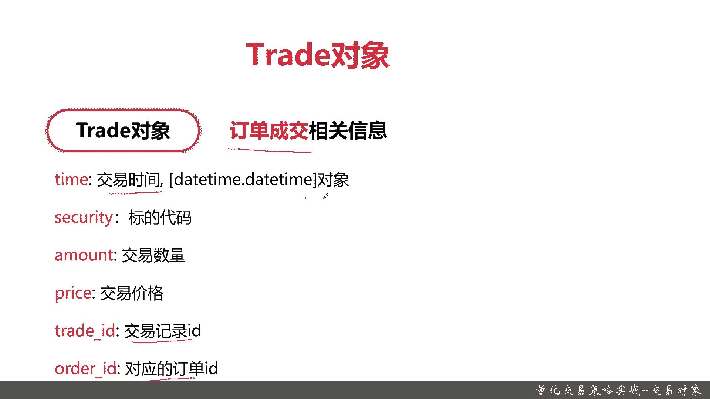
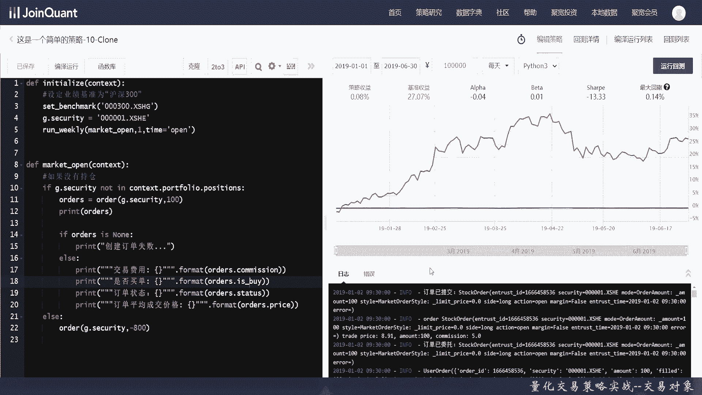
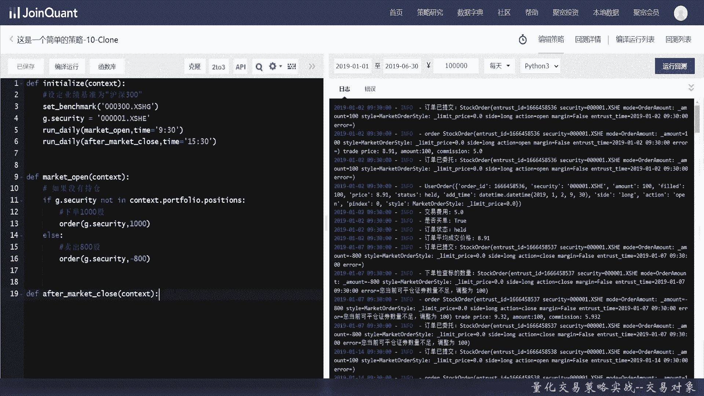
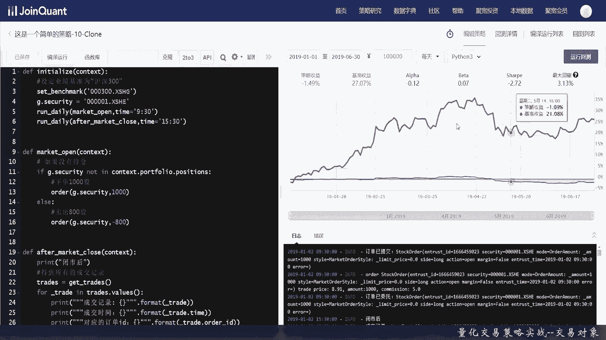
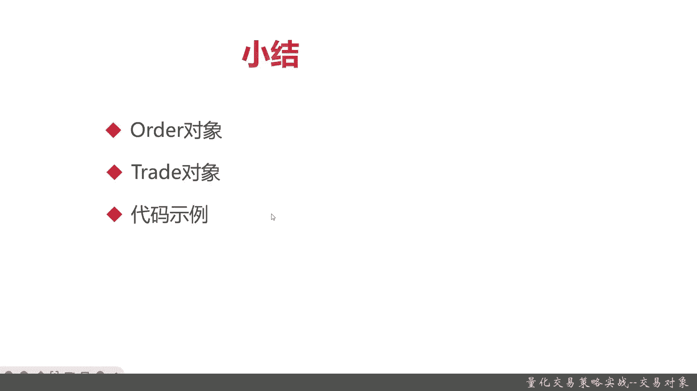

# 基于Python的股票分析与量化交易入门到实践 - P26：7.5 量化策略编写-Python量化交易编程第一步_量化交易策略实战--交易对象 - 纸飞机旅行家 - BV1rESFYeEuA

大家好，我是米铁，在上一节呢我给大家介绍了交易函数，还记得我给大家介绍的常见的七个交易的函数，和他们使用的场景吧，那么这一节呢我给大家介绍，交易函数里面会用到的一些常用的参数，主要是交易相关的对象。

交易对象主要有两块，一块是order对象，它主要是根据交易价单啊，订单具体的一些相关的信息，再一个呢是trade对象，trade对象表真的是交易成功的，一些订单的基本信息。

那我们第三个部分呢还是老样子跟大家一样，进行代码的coding的实战好，那么接下来呢我给大家介绍一下order对象，那首先呢是给大家介绍一下order对象的定义。

order对象记住主要是存储订单处理流程的，订单的一个流程呢是从创建到检查到报单，再到确认委托，最后是撮合什么意思，就是比如说你买一个平安的银行，那我要买100股，每股三毛二，每股三块五五毛钱。

那这个时候呢交易就完成了，创建呀，检查和报单这些，在这之后我们系统里会自动进行确认委托，那最后一步是撮合是什么意思，你买100股，然后花三块五，你并不可能在实际交易呢，并不是总是立刻。

场面上就已经有你想要的这些卖家了，而且正好是你想要的价格，那你比如说花三块五，有一个卖家卖了三块四毛九，那OK那你比他高，那你就成交，当然了，还有正好三也是卖价啊，也是买价三块四毛九的。

那OK那人家就比你先买，那你暂时就买不到，那如果你卖家只有200股，那你报了300股，你要买300股，那你也不能完全的处理，OK这个撮合是由整个的沪深交易所来完成的，这就是order对象的一个过程。

那它有哪些参数呢，一个是交易费用commission，还有买和卖is by，还有一个stus outer对象是状态值，还有平均成交价格，如果这笔out的对象已经成交了。

那些就是看股票的平均的整体的成交价格，OK这个是order对象，重点是大家记住了，它是会有一个撮合的过程，而且并不是每一笔order的定义对象，他都能完全的成功的。

或者说你的目标要买500股或者卖500股，不是一次性都能，正好市场上有合适的交易标标的能帮你，所以你可能会遇到拆单或者其他一种情况，OK这就是order对象，order只是订单，那么下呢是TRA的对象。

那TRA的对象到底是个啥呢，它就是订单成交，记住TRA的对象就和是订单成交，它存储的是成交的相关信息，那它有以下这些参数啊，交易时间它是一个data time的对象，还有security标的啊。

这个很正常数量价格，还有它会存储两个重要的id，一个是trade id，一个是order id，好，那么呢现在我们就给大家好，那么呢我们现在就已经把order对象和trading对象，都给大家介绍了。

那么接下来我们就可以给大家来进行coding实战，让大家看一看order对象和trade对象，究竟在交易里面，甚至在整个策略里面，他是怎么用的，然后它的作用是什么好。

那么接下来呢我们就给大家介绍一下，order对象和trade对象，它的一些怎么去实战代码，首先呢我们这里稍微改了一下，我们之前的呢是run daily，现在把它变成run weekly。

在开盘的时候第一个交易进行交易好，那么首先我们还是要判断是否有持仓，还记得是否有持仓吗，持仓就是这个port portfolio点positions，Ok，这个时候我们就要用到order对象了。

每次买入100股，其实可以看到order下单，它返回的是一个order的对象，那我们把这个order对象给打印出来，空这也和Python是一样的，然后我们把这些交易费用给打出来，那之前给大家说了吗。

orders里面有个commission这个属性，commission这个属性，然后是否买单了，再接着查看订单状态，这个时候大家就可以知道这些status，有什么样的值了。

好最后定量的评价价格就是price这个属性，这好像少一个引号，我们补一下，Ok，好最后，我们就把它给卖了，这个时候就不用打印了，我们主是为了查看一下order的对象的作用。

OK我们接下来看一下运行的状态，他报错了是否买单，这里报错了，哦is spy，拼错了，应该是这个，OK正常运行了，我们看一下结果好，这次的策略竟然是正收益，虽然跟沪深300基础还是差很多。

我们重点是来看看这几具体的结果，交易费用5。0，是否买单，买成功了，订单状态held平均降课八块九毛一，OK这是1月2号的，然后下一周1月7号可优情商数不足，我们把它都平仓了，好就到下一首，1月7号。

当然了，-100也是行的，我们的系统呢它只是看你的，它会有自动判断，OK这是具体的值事故买单处好的，这就比较贵了，就快齐了，当然了，我们可以在这里再把它打印出来，好以上就是order的使用。

感兴趣的同学，自己可以把MAD order的情况也打印出来，那么接下来呢我们将给大家介绍一下，trade相关的，在调用JIT的之前呢，我们还是要像之前一样把，Run weekly，改一下。

改成run daily，那是为什么呢，我们开盘要看一下，然后收盘看一下结果，Market clothes，好我们定义了一个market context，这里我们就不实际全部从中去敲了啊，我们改一下。

我们在阿尔法特，我们这after market clothes呢做一些确的相关操作，在market open呢，在开始阶段我们还做一些最简单的交易，这个写了很多遍了，同学们应该也也会非常熟练。

好我们现在变成1000和800，下单1000股，哎，不好意思，然后呢卖出800股，好market open，切好了。

那我们这次看看一些闭式之后，当然了，用print和用log info都是可以的，好首先我们要获得所有的成交记录，trade的便利要像数组一样，好接下来是成交的时间，时间订单号，最后A1下好。

那我们来看看trade相关的一些运行的结果啊，可以看到这些结果都算出来了，我们看看初步的还是亏了一点。

因为跟那稍微不一样，这个没事，重点是看到这一些，首先我们的交易就没有钱，但是币市后成功的看出结果了，成交记录是这些成交时间是怎么样对应的，递单号是啥都有了，当然了，平仓记录也可以看到，就是无论是买和卖。

它只要成功了，trader都是有值的，OK这以上呢就是本节的内容，下面呢我们进行小结好，那么接下来呢我们进行一下本章的小结，本章交易对象里面有两个重要的交易对象，一个是order对象。

它保存了订单的所有的基本信息，接着呢是trade对象，税的对象主要是订单的成交信息，无论是买和卖的成交现金都有，OK好，接下来呢我们给大家进行了代码的实战coding，感兴趣的同学自己可以回顾视频。

或者呢看一下我们后面附的源码好了。

以上就是本节的内容。