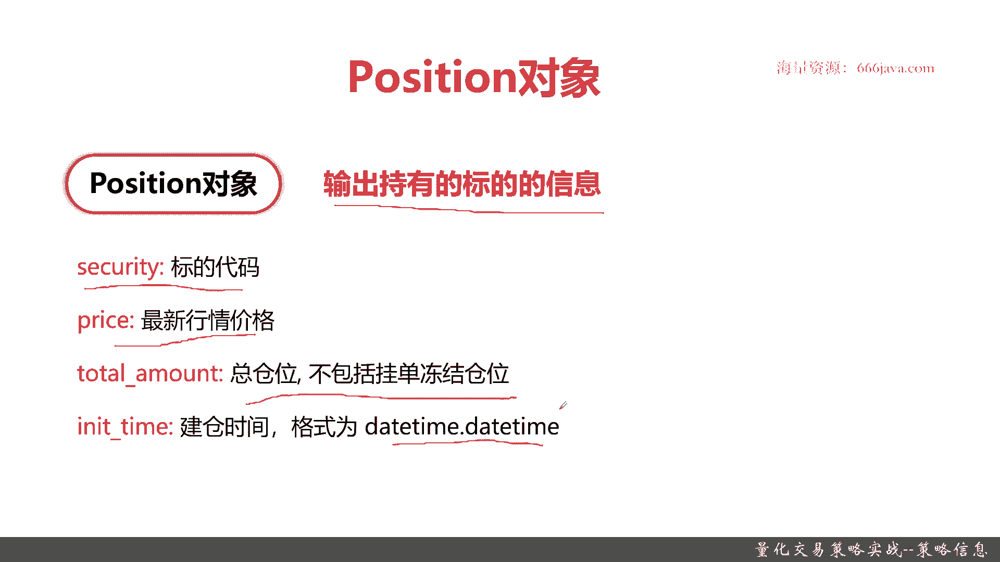
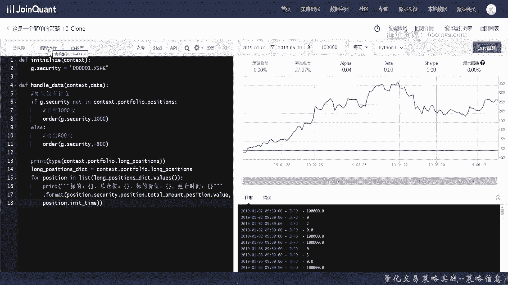

# 基于Python的股票分析与量化交易入门到实践 - P27：7.6 量化策略编写-Python量化交易编程第一步_量化交易策略实战--策略信息 - 纸飞机旅行家 - BV1rESFYeEuA

大家好，我是米田，在前两节呢，我分别向大家介绍了交易函数以及交易对象，交易对象呢我们简单回顾一下，order对象就是订单定期，然后呢trade对象订单成功的交易的信息，那么从本节开始呢。

我们将重点向大家介绍策略信息，其实就是策略相关的一些对象信息，策略信息呢主要有以下两个重要的对象，给大家介绍，首先呢是context对象，之前应该大家有看到过context的对象。

接着呢是position对象，position对象就是持仓，后面呢我们将给大家进行代码的实战，让大家压从代码层面看看这两个对象，它分别能返回哪些重要的信息，OK先给大家介绍一下context对象。

首先呢是context对象的定义，context对象就是策略信息的总览，就是你存储了你整个这个策略里面的，核心的信息，包括账户信息，时间信息，持仓信息等等等等等，都是存储在context对象。

那我们简单给大家介绍一下context，大家可能常用的参数和属性，那实际呢肯定官方提供的API，比这个context对象更多，那我们先只是给大家介绍一下常见的，首先是support flies。

它是什么呢，它是存储单个操作仓位的资金或者标的信息，那它是一个数组，它非常有01234这样去便利的，接着是portfolio信息，就是你的账户信息及所有的这些上面的support files。

这个数组的汇总信息，然后呢这个PFLASH单独指向数组零，当且仅当你进行单个操作的时候，否则它就是一个常数组，再下列一个是current dt，其实就是单位时间的开始时间是个data time对象。

接着呢是provides date，前一个交易日，注意这是一个日期，是date而不是date time，这个很重要，因为在Python里面的时间格式的处理，经常会出一些bug，接着呢是universe。

主要是通过set universe设定股票池，也就是说他可以context对象，不仅仅可以买买一只股票，他可以买买多只股票，就像这样，其实它就是一个数组。

以上呢就是可能同学们常用的一些context对象，后面呢我们给大家进行coding实战，同学们可能就更加了解了，好接着给大家加一介绍，position对象，首先是position对象的定义。

它其实就是持仓，也就是说它就是持有标记的信息，就是你到底买了哪些股票，当然如果你有债券或有其他的，他也算是标的，在我们这里呢主要是你买了哪些股票，包括证券代码，最新的行情价格。

因为你的股票的价格是一直在变化的，Total amount，总仓位不包括注意不包括挂单冻结的仓位，initial time建仓时间它也是data time类型的。

OK那么下面呢我们进入coding实战环节好。

那么现在呢我们给大家进入coding实战环节，首先呢给大家演示介绍的是context对象，为了更好的给大家解展示context对象的，我们把我们之前的代码呢用的非常的简易，也非常方便。

让大家看到context究竟能有些属性，它一般能返回什么，OK这次我们定义就不太一样了，我们给它定义叫handle，Handle data，传两个参数，首先我们要将content context。

portfolio变为整数一，context portflao对象是可以直接编译的，直接进行设置的，他这提示有点问题啊，是有点问题，不用自动提示好，这次我们给大家用。

同时给大家试试log info直接输出，这个删掉好，接着呢，恢复系统的变量，直接只要删除它就可以了，这个操作大家应该以后也会常用，好我们把这个账户里的所有的信息，所有的金额给输出一下。

这就是一个context对象，最简单的应用来看看效果，嗯他报错了哦，我们看看为什么啊，这个输错了，port flies没有这个，那他应该变成这样好，我们来看看效果。

每个交易日它默认是run daily嘛，就这样好，我们一开始的context对象成功了，我们再来把context对象做下其他的操作，这个可能是同学们以后会经常用到的，账户总资产也很简单。

刚才给大家就已经展示过了，Total value，然后接着输出持仓，少一个字持仓金额，装金额其实是position value，接着我们给输出日期，这个对象想必同学们之前已经看到了，Current。

这个有点拼错了啊，我们要把它重新给修复一下，好我们输出一下总权益的累计收益，其实就是return以后这些总收益啊，累计收益这些东西同学们可能会经常用到，最后再给大家看一个常见的，好获取可用资金。

而且是support files0的可用资金，可用资金，Support files0 x，可用资金就是avavailable cash，好我们来编译运行，看看结果，好可以看到这些结果都已经输出出来了。

每天这是账户总资产，这是持仓，因为你没买吗，都是0日期，2号是2号点对吗，点month就是一点year，然后累计收益你没有买东西，所以累计收益return是零，然后可用资资金还是1万。

因为默认就是1万以上，context对象相关的一些数据，我们给大家简单的呈现了一下，好接下来呢我们将给大家，那么context相关的一些对象呢，我们就给大家演示完了。

接下来呢我们给大家介绍一下possession对象，我们把一些还是老样子啊，把一些没有用的信息给输出给删掉，Position，position对象呢因为是持仓，所以呢肯定要下单的。

那现在同学们就应该知道了，context对象portfolio就是你的portfolio，就是你的账户信息，那这个呢positions就是你的持仓，下单1万股，那下单1000吧，好。

我们先来给大家看一下projection，相关对象的一些基本属性，这次我们再给大家用print展示type这个字段呢，这个基本的Python的函数呢不对称对象啊，type这个基本的函数呢。

我们的区块链平台也是支持的，dictionary其实现在已经给大家展示了，他其实就是一个dictionary，然后我们便利它，是先把它转移，我们干脆就一次把所有的都打印出来，当然了，实际你写代码的时候。

同学们可以稍微换换好，不过这个呢我们可以我们这样写吧，注意观感，这个是总仓位，Total amount，总价值，建仓时间，不论像函数相关的，我们都相关的coding呢我们都已经弄好了。

我们来接下来运行看一下结果。

可以看到section函数呢就已经弄好了，标记也打印出来了，总仓位也打印出来了，每天都不一样，可以看到对吗，然后标记价值，那这个总仓位其实是他的股数了，建仓时间，ok position对象也好了。

那么呢本节的coding我们就已经都完成了，现在呢进入我们的本章小结，我们下面呢进行本章小结，本章呢主要是给大家介绍一下策略信息，也就是context对象和它里面重要的position对象。

context呢它是策略信息，存储你整个策略的账户啊，时间等等等等非常重要的基本信息，很多的重要的参数和你的对象数据，都可以在context里面进行查询到，接着是position对象，它主要是你的持仓。

看你持有哪些标的，然后它的数量价值啊等等也都可以快速的查，后面呢我们给大家进行了代码coding，以上就是本章小结，我是meta。

