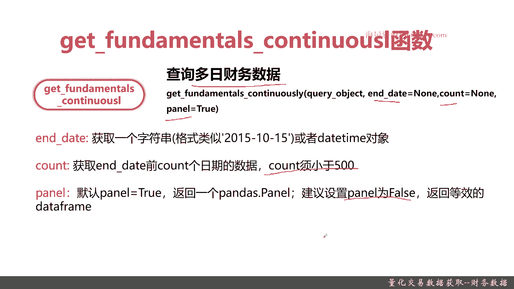
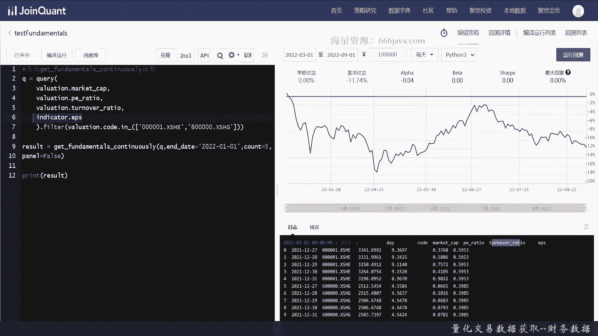
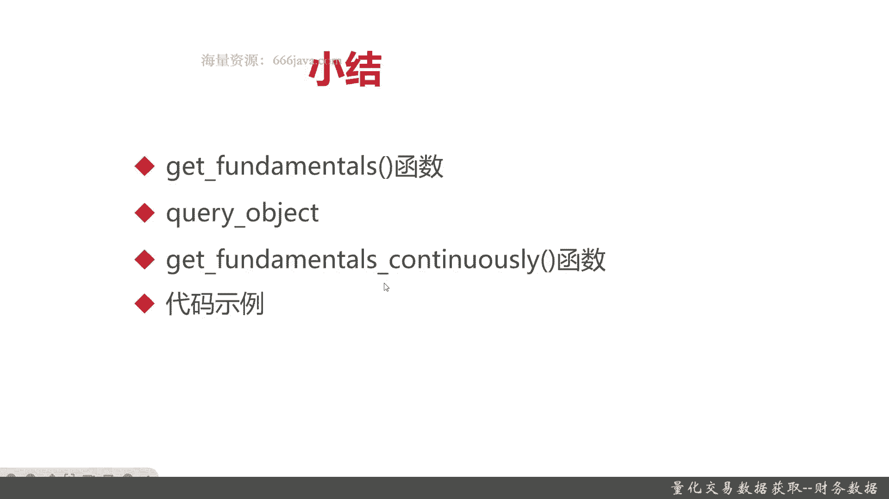

# 基于Python的股票分析与量化交易入门到实践 - P29：8.2 量化交易的前提-Python量化交易数据获取_量化交易数据获取--财务数据 - 纸飞机旅行家 - BV1rESFYeEuA

大家好，我是米tea，在上一节呢我们给大家交流了，如何通过聚宽的API获取股票的历史数据，那么呢这一节呢我将向大家介绍，如何获取股票的财务数据，本节将从四个方面给大家介绍，如何获取财务数据数据。

首先我们给大家介绍一下，常用的获取财务数据的函数，Get fundamentals，这个呢主要是查询，单日或者是单季度的财务数据，接着呢给大家介绍一个句宽里面常用的查询的，Query object。

它呢支持强大的语法支持，Filter，支持GOBY，支持alder by，支持limit等等等等等等，再接着呢给大家介绍一个连续的，多日期的查询财务数据的函数，get的fundamentals。

Continuously，有了这三块介绍呢，我们基本上查询财务数据的一些功能，函数就齐备了，然后呢我们就会向大家进行coding的实例，让大家实际看看如何去通过这些函数。

通过代码去获取我们想要的股票的财务数据，那么好，接下来呢我们先向大家介绍，get fundamentals这个函数呢，它的作用就是查询财务数据，它主要的参数有query object。

这个待会我会向大家详细解释，还有另外两个主要参数呢，一个是date，一个是state date，好，那么接下来呢我们详细给大家介绍一下，这些参数，注意date和state参数只能传入一个。

要么传入date，要么传入state d，传入date时指的是指定日期的data，收盘后所能看到的最近的数据，然后传入state date时，查询state指定的季度或者年份的财务数据。

date或者st它可以是一个字符串，类似于这种，也可以是一个date time类型，甚至可以是date time，点date或者DTIME，点DTIME都可以，或E或者比如说你传个2022Q2Q一。

这些它都是支持的，然后呢，query object其实就是我们Python的常用的二方库，CIRCUALCHEMY下面的一个query对象，这个对象呢它其实是一个SQLMYSQL的OM的封装。

是支持各类的查询的好，那么接下来呢我们给大家详细介绍一下，Query object，query object呢它主要就是一个Python的数据查询的API，注意它可以查整张表，也可以查多个字段。

或者甚至是计算出的结果，非常非常强大，它呢支持filter，就是填写过滤条件，那还甚至还支持逻辑表达式，and和or大雨小雨这些常见的都支持order by，就是排序，那正序倒序也都OK。

limit限制返回的个数，甚至它还支持古柏，接着呢我们给大家举个例子，如何去查询平安银行全部市值的数据呢，很简单，Query valuation，valuation呢其实在金融这里一般都是做估值表。

也是做一些市值的，在那个巨宽的数据IAPI里面的，它主要是做一些市值数据的表，那query表明，然后filter做个等于号判断就OK了，在这个查询的表呢，其实不仅仅支持valuation。

还有支持income啊等等等等，具体感兴趣的同学们可以去查询，巨宽量化交易平台里面的，关于财务数据的一些具体表的API和文文档说明，这样呢用起来更加得心应手，下面我们给大家介绍。

get fundamentals continuous类函数，其实呢别看它这么长，这么绕口，其实它就是查询多日的财务数据，它的参数呢和之前的get factentals，含这个函数略有不同，当然了。

query object这个参数都是有的区别，就是end date count panel，那么接下来呢我们给大家看一看这具体的参数，它具体的参数有以下几个，end date获取一个字符串，跟刚才一样。

它也支持2022Q2这种写法，count是具体的数据条数，因为呢为了考虑性能说count必须小于500，panel是一个true，其实就是pandas的panda。

那如果呢pandas的那个panda的，它返回你设置的panda设置成false，它就是DF，我们一般呢建议pandas panda返回false，这样的话呢就可以返回一个data frame。

就翻成一个DF，大家处理起来非常方便，那么以上呢就是本节的一些函数的介绍内容，下面呢我们进入coding实战好。

那么接下来的呢我们进入coding实战，首先呢我们来查询平安银行，2022年9月1日的总市值，这个应该怎么写呢，首先我们声明一个变量，把query object给封装起来。

那查呢就查valuation这个表，然后呢为了获取平安银行，所以要filter，那其实就是value filter里面内容就是valuation的code，好这样的呢。

我们的query这个object就写好了，下面呢我们把结果返回，From the mentors，好DF获取了，我们把总事实给打印出来，总市值呢就是这一列，这个每页字段的讲义呢，大家要去官方文档去查询。

这里我们就不详细展开了，那么接下来呢我们已经把代码给敲完了，然后我们检查一下是不是有什么问题，query函数哦，这个表达式写的有点问题，我们先稍微改一改，那我们来运行一下好，可以看到这个结果了。

这就是平安银行2020年9月1号的总市值，好我们接下来再换一个例子，我们来查询一下平安银行第二季度的财务数据，我们也不所有字段都查，查询一些最基本的，比如说每股收益啊这种，老样子Q等于query。

那这次呢query就不能是这张表了，就应该就不能是valuation，这张表应该是income，财务呢有一个基本的每股报酬，我们就先这样吧，然后filter还是跟刚才一样，只不过表明要换一换。

平安银行这个提示总是喜欢多出来，我们还得把它给敲掉，每股收益呢我们就用哦收益的财务数据，我们就用收益吧，假设这么命名，Fdiamonos，既然是Q2嘛，那就是state date好，那我们试一下。

把这个结果打印出来，好了可以看到这个就是Q2的Q2的财务，当然他区块链化平台能返回的财务数据，绝对不是只有这些，那我们去仅仅仅仅仅只是举个例子，感兴趣同学们自己可以去查找官方文档，然后去输出更多的。

第三个呢，我们来来查询一下，我们测试一下FDA，如此类函数类，这次呢我们试着用用一样不一样的，用一样不同的插法，查询一下多表，就是查询一下不同的表，valuation肯定是的，先查询它的市值。

然后我们再查询一下valuation里面的PE1回报率，就是股票嘛都有PE回报率，好像是P1ratio，再接着呢我们再查一下valuation的换手率吧，换手率应该是turn over ratio。

然后呢我们再查一下他的每股收益率，每股收益率就不在那个财务表里，就是不在income收益表，其实语法倒不难，这块主要是后，同学们后面要对这个那个区块的数据结构啊，尤其是API数据结构非常熟悉才行。

这次呢我们就不是查一只股票了，我们查多只多支股票，应该是这么写，我们先举个例子吧，先写个两只，一个浦发银行，一个平安银行，放dementors continuously，OK应该是没拼错的好。

它的参数有q and dm，就到1月1号吧，count我们就等于，等于false吧，然后我们把结果打印一下，这个query的语句呢就是查询平安银行，然后呢还有浦发银行，到2022年1月为一号为止。

最近五个那个五季度他的市值，PE的pe ratio换手率，还有呢每股收益，然后呢我们要以panel force，也就是DF形式返回，我们先看下运行结果，OK这就是反运行结果。

他是从2022年12月1号倒推倒推五天，看到吧，只不过呢他是把这两只股票，它是按照那个股票先排序，它不是按照完全的的时间排序，ok code是值PE1回报率turn over，然后每股回报率，当然了。

这个query还非常强大，还支持大雨啊，小雨啊等等等等，这个filter是真的很强大，古柏也做的很也很强大，这个呢我们就不在这里具体的介绍了，感兴趣的同学们可以自己去查询。

一个是sq economy这个三方库的函数和API文档，这个呢在网上都有，这个是非常公开的，还有一个呢要查询的是区块自己的API文档，好，以上就是本期内容，然后呢我们接下来进入本章小结。

那么接下来的呢我们就进入本章小结，本章呢我们主要给大家介绍了，如何去获取股票相关的财务数据，这块呢我们有三个方面给大家介绍，首先是介绍单日或者是单季度的get fundamentars。

这个函数记住他这个函，它这个函数里面有个特点，它传入的是一个query object，然后呢date或者是state date，一个是日期，一个是季度，这些只能二选一，否则就会报错。

然后呢我们给大家又回顾了一下query object，它呢是其实它是本身Python的三方库，就是secure economy这个库提供的一个接口，它支持filter。

古白out by limit等等等等，其实它背后就是等于把circle给结构化，那同学们只要对距宽的财务数据的，这些表都比较熟悉，到后面其实用它查询就非常非常方便，大雨小雨呀，and or都可以。

然后呢我们又介绍了一个可以连续查询多日的，Get fundamental continuously，这个函数，这其实就是查询多日或者是多季度，后面呢我们给大家进行了coding实战。

也给大家演示了如何去查询这些query，好的，以上就是本节内容。

我是米tea。