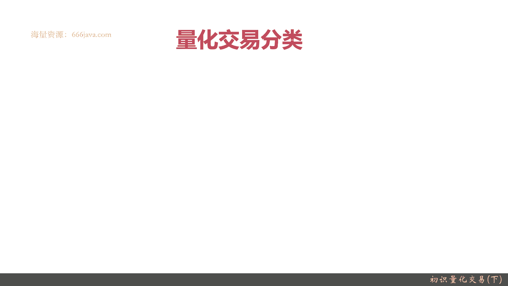
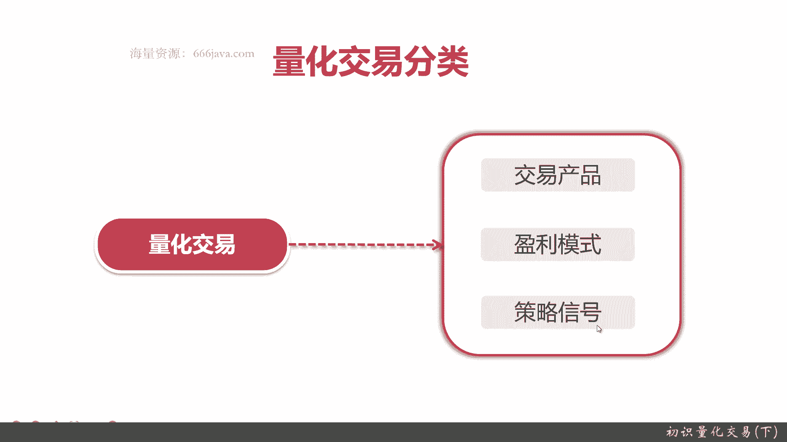
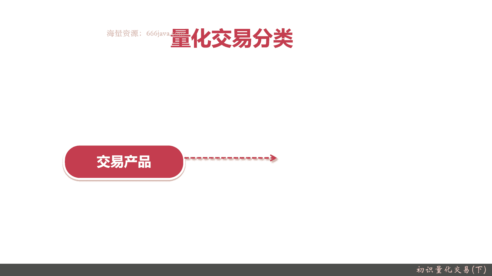
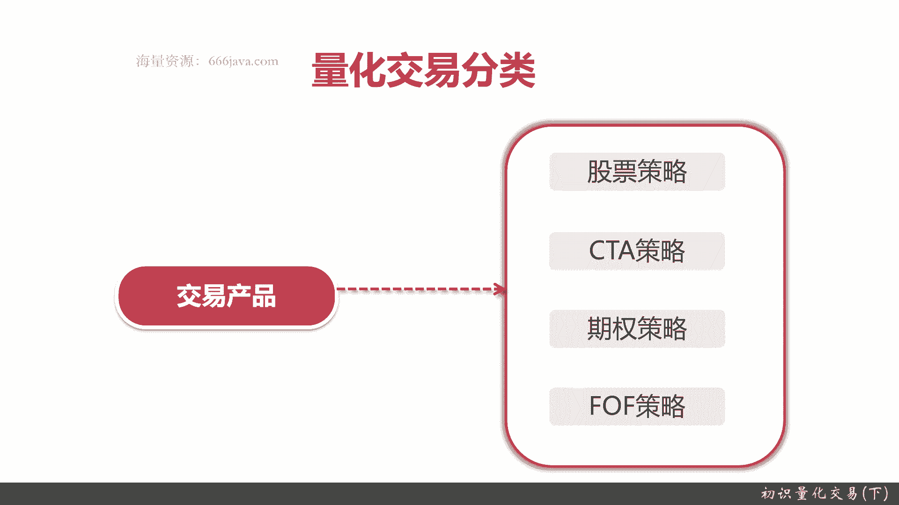
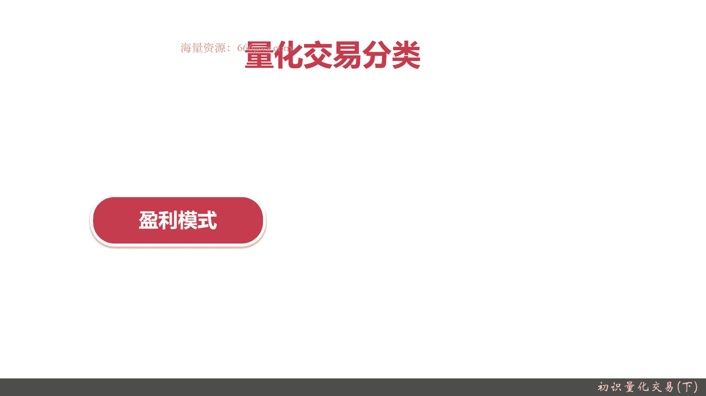
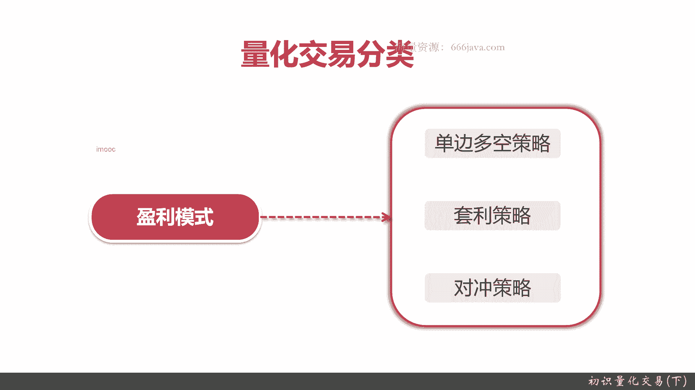
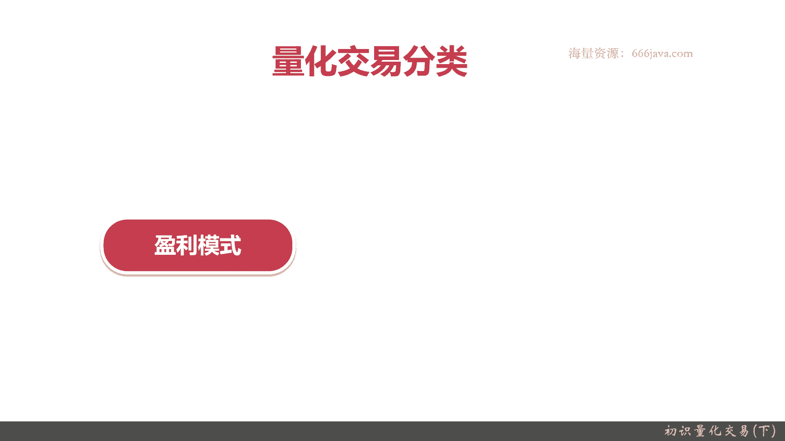
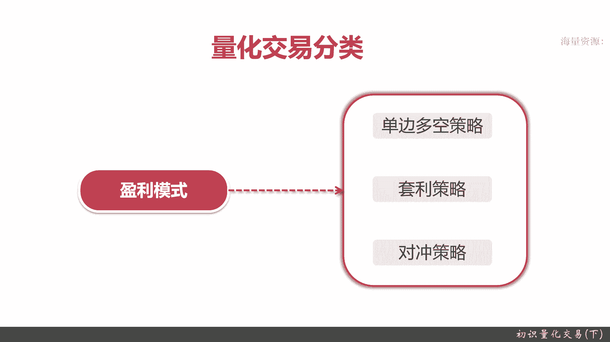
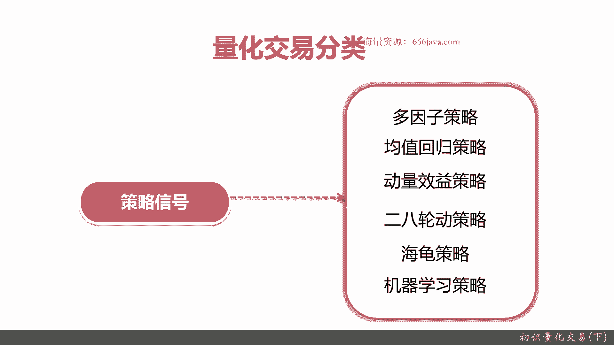
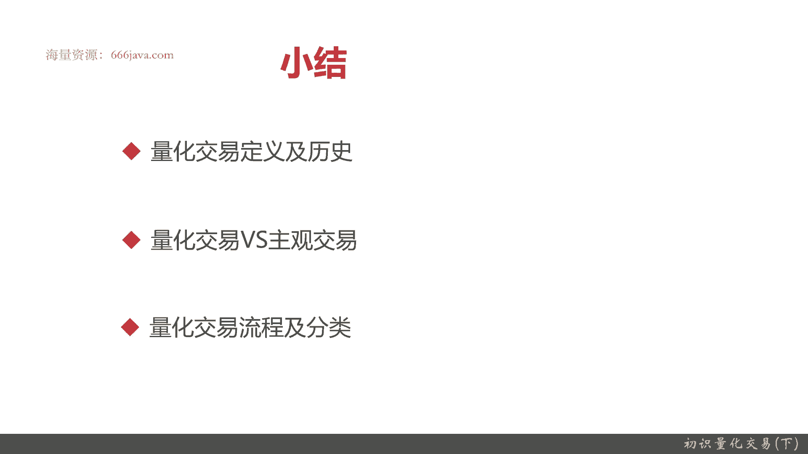

# 基于Python的股票分析与量化交易入门到实践 - P3：2.2 初识量化交易-必知的量化交易基础_初识量化交易(下) - 纸飞机旅行家 - BV1rESFYeEuA

下面一个给大家进行一个交换，交易的分类的介绍，教化交易分类从以下几个方面。

其实主要就是由交易产品就是量化交易，究竟是交易哪些产品，然后盈利模式，那还有他的策略信号。

给大家一起查一下交易，量化交易基于交易产品怎么进行分类啊。

股票策略做顾名思义就是我这个策略优于股票，就是在股票这种交易平台里面，我们继续了，然后CCTA还有CTA是什么意思呢，就是管理期货，管理期货是这个策略，大家可能对金融不是太了解的，可能你就可以理解为。

它是基于多空机制看资金头寸的，它是无关乎你股价上和场，它主要是基于波动，只要股价有波动，而且波动频繁越高，CCTA策略确实获利越好，下一个是期权策略，期权策略主要是期货这些。

这些期权策略关更关注的丰富策略，最最近股票啊，最近那个就是国内公募基金，私募基金就从那个19年二零年以后，基金这个领域发展的挺好，然后呢就是for福，这其实和富福特权这里还有个mom，我这个不展开了。

for福特点其实就是方到forth，就是说一些母基金，母基金是什么意思，就是我有一个策略，我可以购买股票交易，要股票，债券期货，甚至是基金都可以作为我的子标的，我来投资的。

这样那就把波动就是风险和相对可控，然后收益更高，这是for p策略做的事情，所以按照量化交易的分类，交易成本来主要是股票，那你可以推标记物，就是关注股股票策略关注的，然后CD呢它其实无关乎你的那个。

就是你的那个宣传标价，它主要是基于多空的交易机制，它主要是关注资金头寸，然后只要有波动，他就挺挺OK，然后是期权策略，它主要关于期货期权for p策略，主要是一个就是母基金fund of fund。

就是各种投资标的，我都OK，OK我既可以关注股票，又可以关注我期货，又可以看你债券，我甚至还可以去买其他的好。

下一个呢就是盈利模式，基于盈利模式的分类呢是什么意思呢，就是关注在你的策略怎么去获取我的利润。

这就叫盈利模式的出发点，当然呢常见有下面三种，一种是单边独特，一种是套利，一种是对冲，什么叫暧昧对空，很好理解，就是要么做多，要么做空做空对吧，然后呢套利他是什么，应该他是不管你涨还是跌多还是空。

那他都能捕捉到这种无风险的获利模式，比如说A可B两种商品，A涨好。

下面一个呢就是量化交易业的分类呢，主要是从盈利模式来，盈利模式很简单，就顾名思义就是关注在如何的我的策略，获得收益，怎么样进行超额收益。

常见有三种，单边多空策略，套利策略和对空和对冲策略，单边做空很好理解，就是做多和做空，做多了就看涨，做空就是看跌，当然了，它这里面有很多复杂的那个策略，我们就不展开了，然后你可以理解，比如说啊追涨杀跌。

追涨杀跌和相反的追跌杀涨，这个大家可以了解一下，下面一个就是套利策略，套利策略呢，它是追求一个稳定的无风险的收益率，什么意思呢，就是比如说有A和B两个，那个就是标的的投资标的，A涨了B就跌了。

B涨了A就跌了，是不是有这个可能我这样A和B买一定的比例，那我觉得无论如何就能保证，还有一种就是我可以给之前给举个例子，再给举个例子，就是跟他的博彩，那对于博彩公司来说，涉及这赔率，他是不是就是逃离他。

无论最后球赛是什么结果，我都能获取10%的利润，根据自己设计的那个利润模型来，你希望利润模型的比例更高，那你的赔率就相对弱一些，当然你也要考虑人性嘛，你赔率设计的这利润都给你吃定了。

都给你主上平台吃掉了，买的人他就不愿意买对吧，还有一种呢套利的意思就是价格，价格和价值呢呃在金融学上来说，不是一直绑定的，它会有变化，总会有之间发生偏移的地方，套利就是能保证无论怎么样。

我这个价格都能都能获取，具体呢后面我会再详细讲套利策略的时候，跟大家去讲就是无风险套利，有统计套利，无风险套利之间的套利，然后对冲对冲，其实套利策略一开始最传统的就是，它是一个套利套利策略。

就属于一个对冲策略，那现在慢慢慢慢演变呢，它有很多其他的，比如说阿尔法策略，什么是阿尔法追求的一个超额收益，是超过核心基准，比如说超过沪深300，沪深就是超过沪指，沪市A股它有3000。2000点。

我只要比我A股的效益好，那我就是阿尔法，然后呢市场中性，那无关市场涨还是跌，我都可以获取我的收益，还有一个事件驱动策略，这个具体在这里不展开了。

大家可以知道一下，那再下一点呢，我们给大家介绍一下，基于策略信号的量化交易的流派吧，这一节呢就很有意思了，其实核心呢其实可以大家理解为，我们这个量化策略它是哪种数学模型。

它其实都是不同种数学模型的情况好，我们看一下这个策略信号里面，策略信号里面这里主要是有多因子策略，均值回归动量，二八轮动策略，海归策略，核心学角度就有点像，根据你的策略是不同的数学模型。

比如说多基因子模型啊，因此我们后面在整体的这系列课程里面，专门会有一到两章详细的去讲，这个多因子因子是什么呢，其实就是你获取的那个收益的最核心的，甚至是组成你择时和选股，最基本的一个评价的要素。

你比如说我举个例子，it板块A股，然后大市值，也就是说我是假设市值要超过那个1000亿以上，行业top one，同时呢PE就是投资回报率要在20以下，最近一年同时被最大回撤，也就是跌破最高值30%以上。

这就可以算一个因子，而且这个多音词分类一般不是只用语音，它有很多很多音词，具体呢这是跟各家不同的，你的因子到底选的好不好，而且因此是怎么变化，这就是你的本事，四种呢其实我可以放在一起找。

它们呢都是一种数学不同的数学问题，比如说均值回归合，他会理解为骨架，它就是像人类的那个就是遗传学一样，总有一个均值回归的过程，那在一定的时间内，极值范围内它是高还是低，那我就可以判断出未来。

或者预测出未来的结果是高还是低，我举个例子啊，就是那个姚明姚明的那个就是姚明他很高，姚明的爸爸没他高，然后到姚明的应该是他们家族可能最高的，然后到姚明的女儿，虽然玉明儿肯定会很高，但是她应该是没有他高。

这叫均值回归策略，你可以这么理解，这只是一个数学模型的那个信号，我们举了姚明的那个例子啊，那实际均值回归策略，他在股票里面，比如说我们统计出了某一只或者某个板块，或者某几只股票。

它在那个近一年或者近几个月，近几周它是一直在上涨，那我们是不是可以预测出，它们可能站在未来一段时间它就会下跌，或者呢他最近一段时间，它已经跌了30%，40%了，那我根据净值回归策略，它是不是就会涨。

这个不仅仅是长线啊，就是年以上甚至中线短呃，那个月周这个级别，甚至它的日显就是日品或者小时秒嗯，苗可能会不一样，但是天这个级别均值回归这个策总体还是对，因为股票是有过波动的，价格是有波动的。

那捕捉这样一个波动，我们就会保持一致的收益，这就是均值回归策略做的事，那么下面一个呢就是动量效益策略，动量效益这个这个这个策略很有意思啊，他是一些93年由几个，两个美国人提出的那个效应。

他是借鉴了物理学的知识，就是说什么呢，股票整体的价格或者是金融投资标的物，它有延续原先运动的趋势的结果，这句话怎么解释呢，就比如说一个工程师要股票涨了，它应该后面还会涨，基于惯性，它跌了还会进行跌。

在什么情况下它会改变它的情况呢，那当超出了一个平衡态的时候，这其实是用物理的模型来去解释，我们金融的模型，类似的有基于流体力学，比如说波浪理论，我可以把它股票理解为一种波涛，有波谷和波峰。

也可以类似于理解为那个电磁波，还有呢把股票的那个价格和收益情况的解释呢，类似于天体运动，物理这种，类似呢都是可以理解为类似于中长教育这种呃，那个策略的情况，这些都是一些不仅仅是数学家了。

他们可能是涉及到天文，可能是涉及到那个就是物理，然后呢他们把用自己常见的，还有人用夸克，就是美国有个物理学家转的华尔街，宋美朋友后来成为一个私募大佬，他们用自己所学的知识理论。

设计一个数学或者是量化模型，来解释股价的波动和变化，从而获取收益，然后再说一个就是二八轮动策略，就是二八轮动策略是什么呢，他的那个原则思想，也就是说它是一个骨架，它也是类似于人类运行的基本原理。

就它总有20%的高收益或者特务股，他带领着后面80%的股票，它也是一个就是分波段的变化的情况，捕捉你20%至百分头部的20%，或者这20%的股票或者板块，你就能去理解百分之呃，剩下的那个80%。

当然二八轮动策略呢它也不仅仅是这一个内容，还可以理解为时间段就是一年365天，然后250个交易日，他的20%的时间的股价或波动，那影响了整体整年的一个趋势，这个阿巴格当然具体我只能用。

我用的是一个比较通俗一点，实际其实都是一些数学模型，最终其实都是些数学，我就不去查了，海归策略，海归策略也很有意思，它海归其实它是股价的上升和下降的趋势，它理解为一个通道。

它总是在一个非常有限的那个范围内进行变化，那这个模型想出来的人呢，他是对生物学他比较有研究，那借着海归的那个性，它就是用数学量化的思维来解释了股价，所以说我说那个就是均值回归，动量效应，二八轮动和对它。

其实这四种那个模型呢它是类似的，都是基于数学模型，或者是基于物理模型，或者针对于生物学，甚至基于电磁交易，就比如说把股价理解为正弦波的，或者是用正态分布等等等等，这种统计模型来设计和解。

甚至还有人提出像天体运动一样的模型来解释，总之他们的目的都是为了进行预测未来，剩下这四种就是刚才说的均值回归，动量效应，二八轮动，海归策略都是类似的，后面一个呢是机器学习策略。

机器学习策略跟那个多因子策略一样，它是一个非常多的分支，机器学习策略呢最近比较新，最近一两年或者最近两三年，才刚刚被国内和国外给就是关注起来，这个几个契机呢主要还是阿尔法go，他非常十分广大。

他把那个就是呃把谁都打败，甚至把我们的科技大王都过了，那所以呢大家觉得他是个可能性，那机器学习册里面呢有一个很重要分支，就是现在很多人在学习用深度学习的方法，然后呢机器学当然不提这些深度学习啊。

那些普通的机器统计学及有些学随机森林啊，这些那不一定要用多层的神经网络，只有一层的，它不叫深度学习吗，然后来解释股价，那可能有各种各样的平衡，他就是把各种各样的特征都扔进去。

然后训练具体跑出来什么模型呢，人也看不懂，因为它无法解释，时间比较短，它还是一个发展过程，但是现在比较火，因为技术嘛，技术这块应尽用一个非常大的计算量，人也无法与经验过，但是呢现在有个段子啊。

不知道大家知不知道阿尔法go的学家，这就是那个研究小组，他们在研究完了围棋，研究完星际争霸文，学完撸啊撸啊以后，他又开始研究A股了，结果呢他们宣布最近就是2021年研究。

我大A股用阿尔法go算法来进行什么的，大亏亏了几10万美元还是几百万美元，我记不清清了，反正证明我们大A股的策略水还是很深，机器学习目前还不能完全取代人，机器学习不完全不能完全取代人，这是事实。

但是阿尔法go那个段子是不是真，这个我就不知道了，给大家说一下好，以上就是那个量化交易分类里面的策略信号，基于分类，具体呢只是给大家简单一下每一块，其实每一个模型都可以拿出一本书。

甚至一个整个系列给大家，我们简单的介绍，让大家理解一下这些套路。

然后分明思想就行了，好先后面是本节的一个具体小结，然后我们给大家回顾了量化教育历史，然后给从一开始给大家讲解什么是量化交易，量化交易的量化思想，这个是最重要的，然后给大家让大家简单介绍一下。

量化交易的定义，然后呢给大家讲一讲，主观交易和人和交易的一些区别，然后呢具体到他有量化交易有哪几大特性，再有呢就是量化交易的基本流程和分类，大家要理解一下，量化交易就是真正的一个量化交易模型。

从被设计出来再到更新，它是一个非常经过周期的，而且要非常经历人的心血的过程，说白了量化三一模型好不好，最终就是实盘，你赚不赚钱，你赚钱，OK你就是好的，而且他这与持一致性，他要一直变化的。

你每一年甚至每几个月没几周，他可能都会有一些参数的微调，这个就是量合理，OK好，以上就是本节的具体内容。

