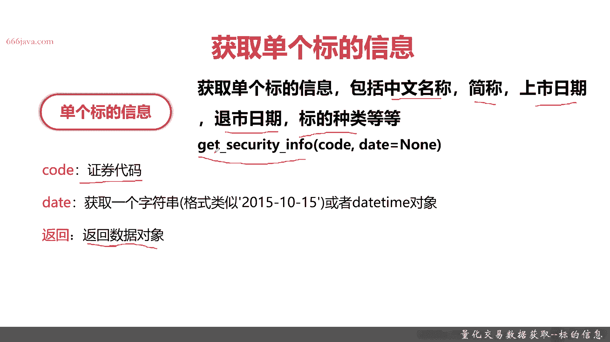
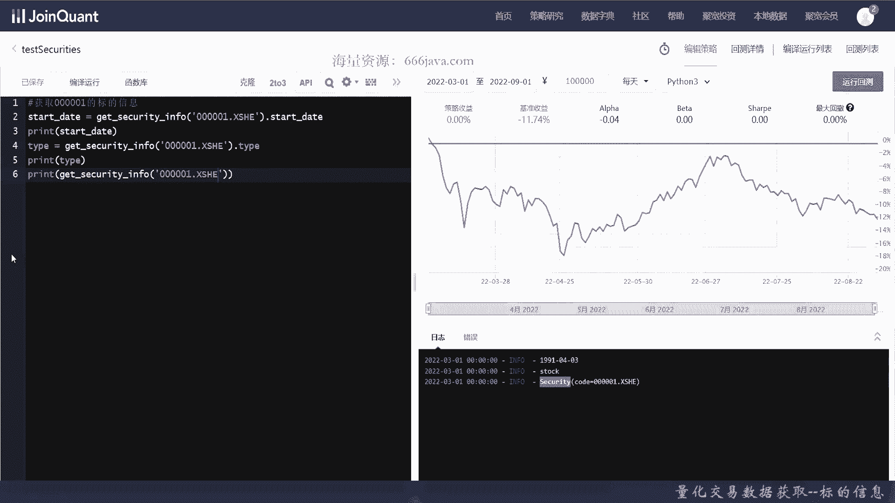
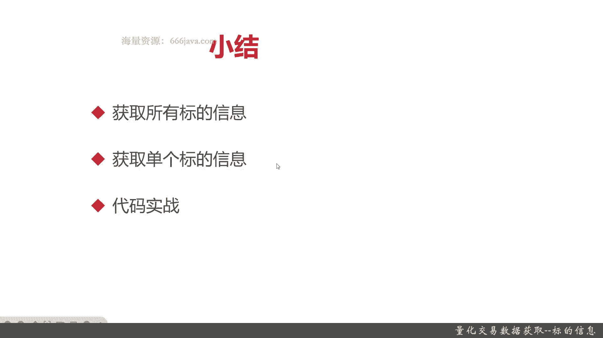

# 基于Python的股票分析与量化交易入门到实践 - P31：8.4 量化交易的前提-Python量化交易数据获取_量化交易数据获取--标的信息 - 纸飞机旅行家 - BV1rESFYeEuA

大家好，我是米TIA，在上一节呢，我向大家介绍了，如何去获取成份股的信息和数据，那么这一节呢我们将向大家介绍一下股票种类，也就是标的相关信息的获取，这一节呢我们将分三个方面给大家介绍，标的信息的获取。

首先我们给大家介绍一个，获取所有标的信息的函数，接着呢我们再给大家介绍一下，获取单个标的信息的函数，最后就是我们的代码实战了，那么接下来呢我们将向大家介绍，获取所有标题信息的函数。

所有标记信息的是这个聚欢量化交易平台里面，通用的一个函数，它呢指的是可以获取这个平台里面所有的股票，基金，指数期货期权等等种类，那它的函数名呢就是get all securities，它可以有两个参数。

一个是types，一个是data，它有两个参数，一个是types，一个是date，好，那我们接下来看看这两个参数，types呢它其实就是证券的种类，那它是一个数组支持，Stock，Fund，Index。

Future，stock就是股票，FD就是基金，index是指数future时期那个期货，还有棒的债券啊等等等等，ETF啊，loft啊等等等等，这是各种标的的种类，这都属于金融产品或者金融衍生品。

再接着呢是大家常见的一个date类型的参数，这里就不详细讲了，跟之前的date一样，它支持一个字符串，或者也支持data time对象，然后呢它会返回一个data frame的对象。

就是根据你所进行快速筛选的标的，的一个相关的信息，那下面呢我们给大家介绍一个，获取单个标的的信息函数好，那么接下来呢我将向大家介绍，如何获取单个标记的信息，获取单个标的的信息呢。

它其实可和之前获取所有标记的信息类似，也是一个函数就可以获取了，只不过这个函数的名称呢叫get security info，它可以获得单个标的信息的中文名称简称，上市日期，退市日期，标的种类等等。

这些都是它的属性，那同学们有兴趣，到时候可以自己展开来看一看，它支持两个参数，一个是code，一个是date，那code呢就是证券代码，任何一种标的，包括股票债券指数，期货基金等等。

那它都有唯一的证券代码，比如说那个平安A股的平安银行，然后比如说上证指数，比如说港股，比如说美股等等，它的都有唯一的证券代码，然后呢通过这个证券代码，我们就能唯一的查询出这个标的，他的所有的信息。

在另外一个字段呢是date类型的字段，字段呢跟之前一样，它可以获取，它可以支持字符串，也可以支持date time，然后呢获取单个标的信息，也就是get security inform函数。

和前面的获取所有表类型返回不一样，它是返回一个单独的数据类型的对象，这是封装好的，里面都是这个标的各自的属性，那么接下来我们进入coding实战环节。

那么接下来呢我们进入coding实战环节，首先呢我们来查询所有的标的信息，看看这个函数是怎么用的，这个函数很容易啊，只要输入它的函数名就可以了，有没有听错，Get all securities，Ok。

OK大家可以看到它就返回一个data frame，那它是按照证券代码来直接返回的，看到吗，然后它的列证券代码名称，然后start date，End date，还有type都是stock，就是股票。

那么接下来呢我们再调用一下其他的一些方式，把这些传参，我们就返回平台，所有的ETF信息，ETF是一种那个股票的，你可以理解为它是股票，也可以为是基金，它是场内的基金，它可以交易，感兴趣的同学们。

可以自己去后续去查一查相关的资料，然后呢types首先输入types，它是个list，所以直接这样，然后呢我们再把data给打印出来，好假设，就从今年的9月1号来看一下。

可以看到额平台里面的ETF有这些排名前十大，这个当然不是按照其他的一些指标来，主要是按照它的正确代码，你看第一个是货币ETF，第二个是招商快线，吧嗒吧嗒吧嗒，中证500稀有基金，稀有金属ETF。

那么接下来呢，我们就开始再来查询单个标点信息，好我们还是以平安银行为例，好，首先，它默认你可以不穿扣的，就比如这种写法，好我们来测试一下，可以看到这个就是平安银行的开始时间。

那我们接下来再来把他一个只打印一个类型吧，好它的类型是SLOCK，那我们再接下来打印的多一点，我们把整个这个对象都打印出来，好可以看到同学们它返回的就是一个security对象，那这个对象的字段呢。

感兴趣的同学们肯定不只有这些，肯定不只有type啊，start啊，and and data start date呀，还有display name啊等等等等，那这里呢我们就不展开了，这里呢我们就不展开了。

感兴趣的同学们呢可以自己去查看相关的资料，那么以上就是本期的coding环节。

那么下一节下面呢我们进入本章小结，下面呢进入本章小结，本章主要是给大家介绍了，如何去获取标记的信息，首先呢是获取所有标记的信息，其实就是一个get obsecurities这个函数。

这个函数呢它只是两个常用的字段，一个是types，这个字段呢就是你想要的证券的，或者叫标的类型种类，只要是常见的金融产品，它一般都是支持的，那它支持一个数组对象，你可以很方便地查询想要的信息。

它呢也只是一个时间范围，下面一个呢是获取单个标的信息，单，获取单个标题信息，和那个上面一个获取所有标记的信息的，唯一的区别，其实就是参数不一样，然后返回呢也略有个差异，它这个参数呢。

他传的就是就不是一个types的数组了，他传的是一个code正确代码，只要你知道这个标记的正确代码，你就能查询这个code，它返回呢是个聚花量化平平台，API里面自己封装的一个对象叫security。

那这个security呢支持嗯常用的属性有名称啊，中文名，简称啊，四大呃，开始日期，退市日期等等等等等等，那感兴趣的同学们呢，可以自己去查看相应的API文档，然后自己去练练手，最后呢就是代码实战了。

OK以上就是本节的全部内容，我是米田，大家下期再见。

