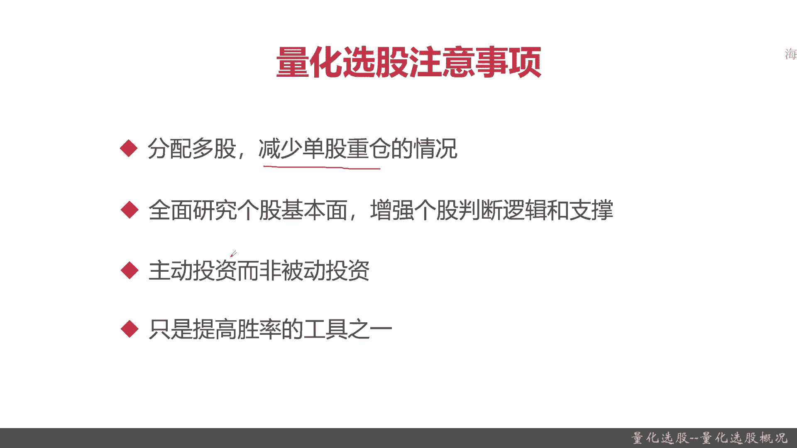
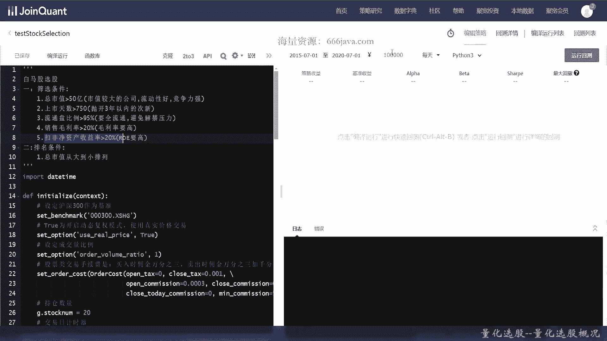
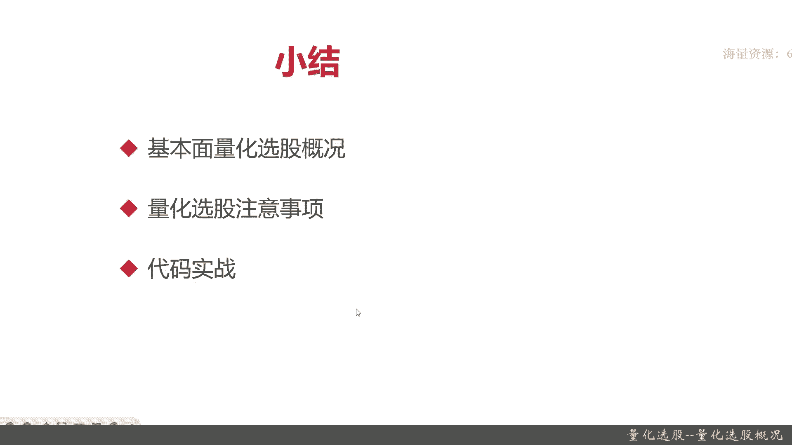

# 基于Python的股票分析与量化交易入门到实践 - P33：9.1 股市投资第一步-Python基本面量化选股_量化选股--量化选股概况 - 纸飞机旅行家 - BV1rESFYeEuA

大家好，我是米切，在上一节呢，我向大家介绍了如何通过聚宽量化交易平台，获取量化交易所需要的一些数据，那么从这一章开始呢，我们就要开始进行一些量化交易相关的，深入的一些知识点的介绍。

那这一章呢着重会大家向大家介绍量化选股，这一节呢我们将向大家介绍量化选股的概况，本节呢我们将从以下三个方面，向大家介绍量化选股，首先呢我们给大家介绍一下，量化选股的基本概况，也就是它量化选股是个啥。

然后他究竟有些什么内容，接着呢我们给大家讲解一下，量化选股的注意事项，最后呢，我们给大家以代码实战的方式来向大家介绍，一个经典的基于量化选股的交易的类别好，那么首先呢。

我们先想让大家先介绍量化选股的概况，量化选股啊，顾名思义，这个就给大家复习了，之前给大家介绍过，就是利用数量化的方法选择股票组合，记住是个组合，希望该股票组合能够获得超额收益。

那量化选股一般分为技术面选股和基本面选股，首先是技术面选股，主要是各种通过各种技术理论和技术指标，来分析和预测股票的未来价格趋势，那么技术面选股呢理论知识非常繁杂，对大家的金融和数学知识要求比较高。

那我们在本章呢就暂时不需详细的给大家介绍，技术面选股，后面呢我们会逐渐给大家讲解一下，那现在的重点呢，在本章重点主要是下面基本文选股，那基本评选股股呢，主要就是通过对一家上市公司在发展过程中。

面临的外部因素和自身因素进行分析，那其实呢就是把它的外部因素和自身因素，各种财务指标啊，可发展因素啊，还记得吗，之前给大家分析的进行量化，然后通过这些量化进行一些采用的筛选。

获取大家觉得有潜力的股票组合，这个就是基本本选股，那待会呢我也会像以一个实战的方式，向大家介绍一下基本面选股，它究竟是怎么玩的好，接下来的呢我们先介绍量化选股的注意事项，首先一定要分配多股。

就是最简单的例子，鸡蛋不能放在一个篮子里面，一定要减少单股重仓的情况，注意一定要减少单股重仓，我们选出的是股票的组合，不是某一只股票，接着呢需要全面研究个股，去平面，增强个股判断的逻辑和支撑。

也就是说你不能只通过某一个指标，或者某两个指标，你就认为这是你想要的股票，要综合去判断它，接着呢是主动投资而非被动投资，什么意思，就是通过你的算法，你的策略主动去轮动调仓，而非被动的一直放在那里不动。

最后呢要大家注意，无论是量化选股还是量化交易，它只是提高胜率的攻击之一，居然是胜率，也就是说你有赢了肯定也有亏的，所以大家一定要做好准备，做好这个准备，你不可能每次都是稳赚不赔的。

OK这个就是量化选股的注意事项，那么接下来呢以实战的方式给大家介绍，什么是量化选股，或者说说的更直接点，如何通过量化的方式来进行基本面选股。

OK那么进入扣定实战环节好，那么接下来呢我们将进行coding实战环节，可以看到就是我们这次要给大家介绍的，基于基本面选股，也就是量化选股的一个经典的策略，他呢主要是训寻白马股选股。

那白马股同学们之前应该也介绍过，就是上市流通非常大，业绩非常好，容易分红的一些股票，那我们把我们这里的筛选条件和排名条件，给写出来了，首先它总市值要大于50亿，那因为背后的逻辑支撑是什么呢。

市值越大的公司，它的流动性越好，竞争力越强，专家都喜欢买嘛，那些基金公司都喜欢，接着呢上市天数要大于750，750个交易日呢，就相当于3年的时间证明它稳定，然后呢流通盘比例要大于95%。

那这个是什么意思呢，每次一些高管或者要进行解禁的时候，股价就会有大幅度波动，这样呢对你的盈利其实你是不好预测的，所以流通栏比例金阳大大约95%，销售毛利率大约20%，这个很好理解，毛利率越高越好。

那它的债元增长，然后最后第五点扣除非净资产收益，就是LOE要高，这也很好理解，那我们的排名条件呢，你看了这里目前是有五个因子指标，那最终呢我们就只是按照总市值进行，从大到小排列好。

那我们已经先把这一个交易策略，这次呢是完整的，给大家带领大家写一下交易策略，本章的重点主要是给大家介绍一下量化选股，那怎么去选股，所以重点请大家看一下这几个函数，一个是筛选逻辑，一个是过滤停盘股票。

还有一个排除词性，那像初始化函数呢和trade函数呢，这一轮我们的那个不是重点，当然我会带着大家一起来进行coding，那我们下面开始编程，首先我们要设定沪深300作为基准。

这个函数就是set benchmark，这个之前已给您给大家介绍过，这次我们就直接敲了，好在这有提示，不过这个平台他总是喜欢多提示，然后开启复权动态复权模式，这样呢价格会更加的精准。

这些呢在一开始的初始化的函数里面，在我们这些都给大家介绍过，我们就不详细展开了，我们要以真实的价格来进行模拟，然后呢设定成交量比例，成交量瓶呢就是order volume ratio，好。

接着呢设定股票交易费，尽量，尽量的模拟真实，那股票交运营费呢，他有佣金，买出佣金和卖出佣金，还有印花税等等，这次呢我们尽量采用比较真实的模拟费率，那首先呢，顺捋这个open text text就等于零。

但是呢，Close text，那要是0。001就1‰，买入和卖出的佣金，卖出的税率是1‰，好佣金万三买入和卖出的佣金都是万三，Ok，然后呢，Close today，最后呢每笔单价手续费至少得付五块。

好然后这个就是印花税也有了，然后佣金买入和卖出的佣金也有了，然后最低手续费五块也有了，好接下来呢我们要设定一些交易的视频量，这是为后面持仓数量，就是说我每次最多购买多少只股票，我们就取20。

当然这个参数同学们后面可以自己调，然后再设定一下调仓频率，暂定100，因为这个肯定不是高频交易，所以没必要，最后运行函数每天运行一次，这个还是老规矩，用trade来进行交易，Every8，每个交易日。

那我们初始化选项参数就写好了，下面我们来写筛选逻辑，根据我们的，根据我们之前的策略啊，还在复习一下，首先总市值要大于等于51，上市天数大于750，这个呢这个条件就在我们下面的，过滤停牌和排除次星。

其实主要是排除次星啊来获取的，这是呢流通盘比例，销售毛利率，扣非金资产的，这些都是通过我们之前的这个check box，这个函数来获取，那其实呢它其实就是一个取数逻辑。

这里呢就要用到我们上章给大家介绍的，一个query，查询数据好，query里面有个很重要的INDEDICATE这个变量，然后呢还有valuation，Capitalization。

Capitalization，Okay，然后LOE，利润8G，好，然后是filter，然后这个valuation是什么呢，Valuation，点capital inalization。

其实呢这就是总市值单位是一元，对应一总市值，二，然后下面的是流通盘，这个呢就对应的要乘以0。95，我们这样可能同学们看的更清楚一点，这个呢就对应第三点，流通盘比例要大于95%，好那下面呢接下来是第四个。

销售毛利率，哎这个它又不能自动提示了，大于20%，那这个怎么写呢，其实之前给大家取出来了，这是growth prod uprofit magic，这个就是销售的毛利率，好单位呢是百分。

最后是这个同学们应该比较熟LOE，好这个他是什么呢，这是第五点，就不要OK就是LO1要高吗，好然后呢是排序，按照市值，这个市值呢同学们应该看过了，这就是市值由高到低，倒序，然后最后呢应该是个limit。

我们全部取出来也没用啊，6000多只对吧，当然了，符合白马股的可能不止6700，多吃好，那这就是我们的query条件了，那么接下来呢把这结果获取一下，获取财务的还知道什么。

就是这个found the data adment tato，这个是什么呢，我们要根据我们实际的时间来变context，这个变量也用到了，好仅仅这个还不够，我们还有一个条件是什么呢，就是这个。

那这个是怎么实现呢，要进行层层过滤，首先把停牌的给过滤，好然后呢首先把四星给过滤，然后再把那个平台给过滤了，然后我们就OK了，那我们最终呢取前20名，之前是100名吗，那我们现在来写过滤停牌股票的逻辑。

这也是个系统的常用函数，Get current date，然后一个表达式就行，这个以后同学们可能会经常用到这个呢，就是过滤停牌的股票，同学们可能以后可以把它作为一个常用的，底层的API。

两行代码就搞定了，然后呢最后呢是过滤四星，这个N呢就是时间我们默认是180天，那像我们这个里面呢需要过滤750，那为什么这里过滤是750呢，其实这个就是有了另外一个在量化交易之前的。

投研分析师们他们会去做的事情，那这就不在本系列的课程里面进行介绍，他应该是个list，那这个函数之前同学们也应该用过get security info，那当然你看竟然活用了我们这些。

之前去换量化权益平台里面的一些获取的API，这样的话整个这个策略其实我们就可以用，也就100行左右就可以写出来，否则你要完成这个基于白马股来选股，那你重新写的话，可不是一两百行就能完成的事情。

Time delta，这个是Python在DITTIME自带的，过滤一下就行了，好STO格雷斯也返回来，排除此性越好，最后我们来写交易函数，加角函数，这里呢有一些可能同学们没有接触过，可能比之前复杂。

不过没关系，以后会逐渐深入给大家，这次呢就简单给大家介绍一下，首先判断时间是什么时候进行调仓，那其实调用我们之前写好的函数就行了，对多打了个井号，持仓列表之前你刚刚给大家介绍过，这里就不再介绍了。

好的FLE，什么意思呢，我们去比较这一个时间点内，他的每掉一个长长日期，我们都去北下这个时间点内，我们的新的选择白马股，然后把不在这个白马股列表的呢，我们把它给卖了，那每次都是先卖再买。

这个就是order交易，全部抛售，好还是要去看他的持仓，然后这个计数器其实就是20了，只要变小了，OK先把不在里面的都清仓，然后就可以算出要买的数量，然后检查成账户的，总余额，然后呢默认是等比例分配。

好诶，等于零了，等于180，就是错了，然后就下单了，只有不在我们尺寸N列表里面的，我们才会下单购买，直接就交易了，OK最后呢计数，好这种时候呢你慢你完成一次调仓，然后计数器就开始重置。

否则计数器就要一直的，好了，那么基本上就写完了，当然了，我是比较熟，所以呢给大家一气呵成，实际上同学们在coin的时候，最好能一边写一边调试，写个几行就调试几行，这样可能比较好好。

那么呢我们这个代码也写完了，那么接下来呢我们还可以进行一下运行加回测，我们再给大家复习一下，这个呢就是一个经典的，基于基本面选股的一个交易策略了，因为他又有选股，又有交易，那可以看到这个筛选条件。

总市值大于50亿，市值较大公司公司流动性好，竞争力强，上市天数大于3年，流通盘大于95%，销售毛利率大约20%，LOE大于20%，总市值到总总市值就是从大到小就倒序排吗，OK那我们看一下，假设5年。

假设你从2015年7月到一日开始买，进行运行，这个球每天交易一次啊，每天算一个交易日，因为我们调仓是有周期的嘛，大概100个交易日算一次。

然后呢我们假设初始是10万，OK我们运行一下回车，你看因为是5年时间，他还在慢慢的运行，可以看到这201年其实都不怎么赚钱，但是到从2017年开始有了收益，因为那个时候很正常嘛。

2015年到2017年那段时有一段股灾，然后可以看到这个策略就开始挣钱了，当然了，你要考虑胜率嘛，下面是沪深300的基准，其实沪深300一直挺亏的，现在慢慢才开始有点挣钱，最近两年又不行了。

不过我们追求的是一个超额收益率，也就是跑赢沪深300，那OK可以看到，从2015年7月1号到2020年7月1号，这个基于基本面选股嗯，还是挺不错的的，年化收益高达20%几，当然了。

这个不能代表这个策略就稳赚不退的，没有任何一个策略是稳赚不退的，后面可以自己把我这个课程的代码拷出来，然后可以自己去跑一下这个策略，最近两年呢其实也不怎么赚钱，基本上他只能做到不亏。

因为跟实际情况有关系嘛，好以上呢就是本节的课程的全部内容，下面进入本章小结，我们呢刚才呢完成了那个coding实战，那么下面呢进入本章小结，本章呢我们给大家介绍了量化选股的概况，其实主要是基本面。

量化选股，技术面量化项目，暂时我们不进行介绍，然后呢我们给大家介绍量化选股的注意事项，那注意啊，量化选股首先一定要选多只股，你不能现在不能放在一个篮子里，还有呢不能迷信量化选股。

然后呢你要尽量用多的指标，你要有背后的支撑逻辑，你不是只在一个指标上吊死，最后呢大家记住量化选股，量化选股它不成为整个量化交易，它只是提高胜率的一个工具，你不能迷信他。

最后呢我们给大家进行了以白马股选股，还记得这白马股的那个筛选条件吗，有五点流通市值要大，然后呢不能太新，菜心呢它不稳定，至少要运行3年以上，然后呢它流通率要高，流通盘要在95%以上，还有两点。

一个是它的销售利润要在20%以上，还有IOE投资回报率要在20%以上，这五点是我们筛选白马股的基本的手段，这些量化量化为什么是这个量呢，那其实就是投研分析师做的事情了，我们在此就不进行展开了。

最后按照这里进行倒序排列，那大家最后可以看到我们这个策略，基本上在2015年到2020年，如果你一直持有的话，其实还是挺赚的，以上呢就是本节的全部内容。

我是米奇亚。