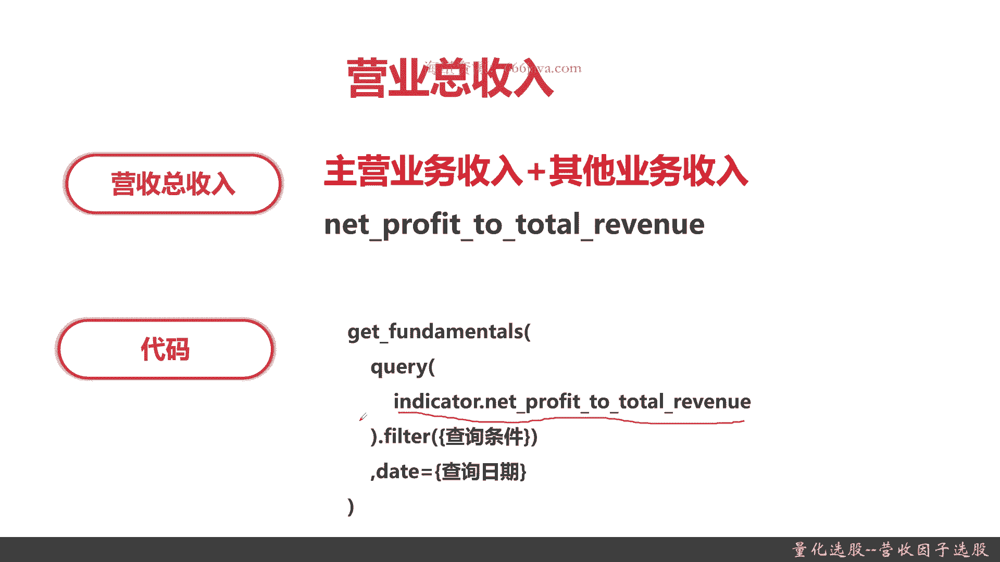
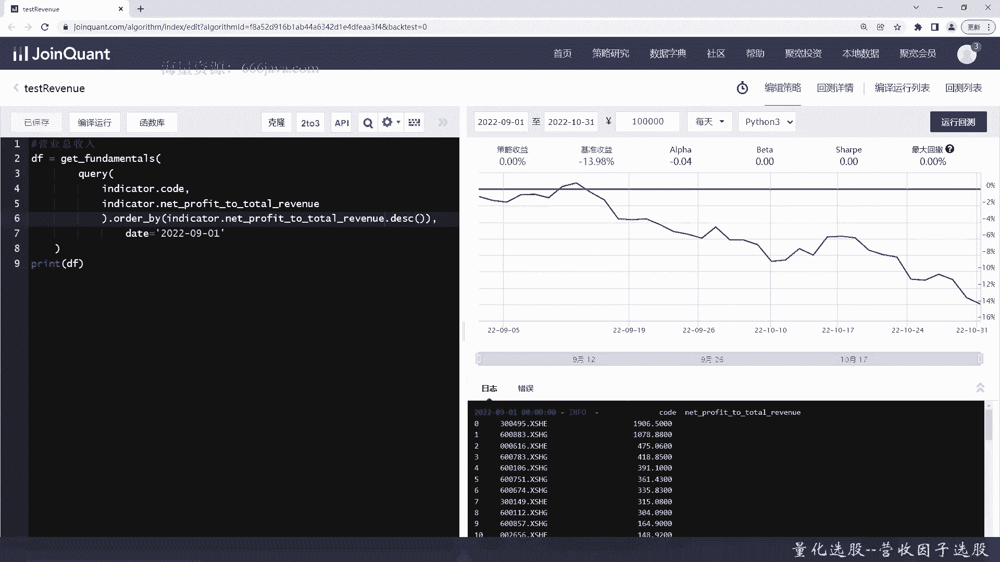
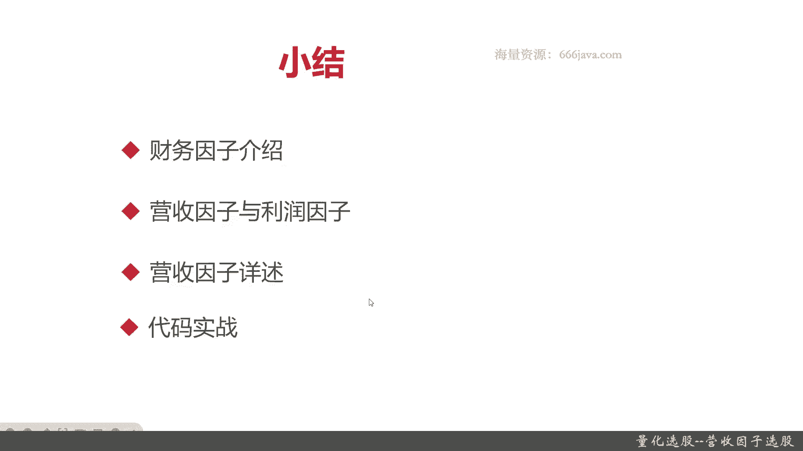

# 基于Python的股票分析与量化交易入门到实践 - P34：9.2 股市投资第一步-Python基本面量化选股_量化选股--营收因子选股 - 纸飞机旅行家 - BV1rESFYeEuA

大家好，我是米田，在上一节呢我们向大家介绍了量化选股的概况，以及常见的一个基本面选股的模型，基于白马股的选股，那么从这一节呢，我们给大家将详细的介绍一下，基于基本面的选股，那本节开始呢。

我们就向大家介绍财务因子选股呃，以及在财务因子下面有一个比较重要的分类，成长类，因此下的营收，因此的选股好，那么我们进入正题，本节我们将从以下四个方面给大家介绍，因呃营收因子相关的一些选股的内容。

首先我们给大家整体介绍一下财务因子，它是个啥，它都有哪些常见的类别，接着我们给大家详细介绍营收因子与与利润，因此在之后我们给大家强，再把营收因子进行分解给详细给大家介绍营收。

营收因子里面都有哪些常见的指标和内容，最后还是老样子进入coding实战环节好，那么接下来呢我今天向大家介绍财务，因此首先是财务因子的基本的概念和介绍，财务因子主要是评价企业的基本面情况，记住哦。

我们在量化交易这里，可能整个这个系列里面一般评价企业的基本面，我们用的就是财务因子，财务因子通常包括成长类因子，规模类，因此价值类，因此以及质量类，因此那么接下来呢我们对加。

分别介绍一下这四种不同种类的因子，首先是成长类因子，成长类因子是在财务因子选股当中，或者说是在基本面选股当中最常用的那个因子，选股方式和方法，那成长类因子主要包括营收，因此和利润，因此接着呢是规模类。

因此规模类因子主要反映的是公司的规模情况，主要是体现市值大小，那它包括总市值，流通市值，总股本以及流通股本，再接着呢就是价值类，因此价值投资是一个久经考验的投资策略，然后惯例是购买相对低价股票等等。

转换成基本面的标准度量，然后它是一种方法，它主要是度量基本面的股息，账面价值，利润现金流或者其他的公司价值等等，包括它的社会价值啊，或者算是他的行业地位等等等等等，这是价值投资，那其实它价值类因子。

就是衡量价值投资的一类重要的因子，那衡量价值类的因子有哪些指标呢，包括市净率，市销率以及市盈率，这三个是非常经典的衡量价值类，因此的指标，最后呢我们再向大家介绍质量类因素。

质量类因素包括净资产收益率以及总资产，净利率，其实主要是这两个方面，都是和收益有关系，还有它的资本结构，以上就是财务因子的基本介绍，和它常见的四种因子，那么接下来呢我们给大家详细介绍一下。

成长类因子下的营收因子和利润，因此营收因此其实很简单，主要是包括营业收入，同比增长率以及营业收入环比增长率，还有营业总收入，这是一个全称啊，其实一般营业收入其实就是营收。

其实大家可以听下为营收的同比增长，营收的环比增长以及总营收，那这些呢是衡量一个企业营收是好坏的，很重要的三个指标，接下来是利润，因此利润因此包括净利润同比增长率，净利润环比增长率，营业利润率。

销售净利润，销售毛利等五个常见的指标利润，因此呢其实它从这个指标的大家可以看到，这边都基本都是和利润相关的，那根据利润相关的不同的算法和指标呢，它其实又分营业相关的利润率，还有一些净利润或者是毛利率。

以及利润相关的增长，以上刚刚向大家介绍的财务因子，还有他下属的四种类不同的，因此以及利润，因此在本章后续的内容呢，我们都会给大家详细的一一的介绍，那么这一节呢，主要就是给大家介绍一下营收因子。

OK首先我们给大家介绍一下营业收入，同比增长率，既然是同比增长率啊，它的算法其实相当简单，其实就是当期的营业收入，减掉上一期的营业收入，再除一下上一期的营业收入乘以百分之百，这里注意啊。

上期的营业收入指的是上一年度或者是季度，或者月度同期的营业收入，那在我们这里面呢，主要是上一年度记住上期的营收，就是指上一个时间段年度或者季度或者月度，甚至那个一般来说一天都没有，或者是周比较多。

注意这里此处指的是上一年度，这就和在接下来的环比增长率可以进行区别，然后呢是他的coding代码代码，注意啊，所有的那个营业营收因子，那营收同比增长率呢其实就是r NC revenue year。

On year，这是他的查询的重要的query的字段，后面的filter和date呢，同学们根据会根据自己的实际的例子，来进行的输入，这个是同比增长，那么下面呢我们给大家介绍环比增长率。

环比增长率的公式呢，其实和同比增长率呢有一点差距，就是它不是当期了，是本期，那环比增长率呢它是针对的是上一期的，而同比增长率呢是针对的是上一年度的，因为在我们这个指标里面。

一般它都是以月份或者季度进行披露的，那在同比增长，它就是上一年度的同学们记住就是环比，就是上一期，比如说4月比上3月，那那个同比呢就是上一年度的，今年4月比上去年的4月，OK这样就记住了好。

那code呢是这样的，也是INC开头，也是INDEDICATE开头，只不过呢是revenue annual，这个呢就是营收的环比增长率，那么接下来呢是总营收讲呃，全称就叫营业总收入，那这个公式非常简单。

我们就很快概括了，它其实就是主营业务收入，加上其他营业业务收入，这里的公式呢我们就不详细展开了，这就是总营收，total revenue就是总营收，但是呢，它其实它相当于有一个净利润的意思在里面。

然后呢that profit to total revenue，以上呢，就把本节的基本的内容都向大家给介绍一遍，下面呢我们进入代码实战过程好。

我们现在呢进入代码实战，首先呢我们把营收同比增长率相关的代码，举个例子吧，我们就取个数大于300吧，还是用这个执行常见的fundamentals这个函数，那他是这个函数，它是取的啥呢。

他是取个query对象，我们只把指标打印出来是不行的，因为大家可能人看不懂，那我们把code也打印出来，INDICA点INC，Revenue year，On year，好query就出来了。

那么下面呢是filter，我们要大于300，好周围就有提示了，这个是百分啊，其实就是三倍啊，数学上我们再来个排序，我们按照额营收同比增长率倒序吧，好时间我们就选，今年的9月1号吧，好这就是结果了。

大家可以看到具体的增长率，那这个非常高，还有8000多的好吧，那这个初步的结果我们就打出来了，然后呢我们再把，好我们把最近几日的最高价给打出来，这个时候要用了history这个函数。

Security list，那么接下来要把这个最高价给打出来，好同学们看到这是他们最近几日的最高价，当然了，他排序是从2019年，因为我们的回测时间是这样，他这个时间呢是根据回测时间来。

我们如果把回的时间改一下也行，不过就先这样吧，好这个例子就给大家讲到这里了，那我们接下来，我们再打一下，音乐，收入环比增长率不是要300了吧，大于900，那这个其实就其实就是。

i think revenue animal就行了，其他的都不变，其实就只要换下指标就行了，嗯我们就时间吧，我们就看，我这样看一下，OK同学们可以看到这个结果就出来了，好，那么接下来最后呢。

我们给大家看一下营业总收入的，例一次啊，营业总数呢其实也就把指标换一换，还记得营业总数是什么呢，Net profit，To total revenue，好没有拼错吧。

Let profit to total revenue，我们这次呢就不要filter了，时间呢还是再调调，我们还是按照profit toto radio来排序，把这个时间回撤时间改一改。

好我们回撤就回撤这么点事情，然后看看结果啊，可以看到这是2022年9月营收，营收最大的这些股票，大概4700多是吧，基本上A股的都在里面，甚至还有一些那个总营收他是负的。

这个呢感兴趣的同学可以去深挖一下。

那么以上呢就是本节的全部内容，那么下面呢我们进入本乡小学，本章我们主要开始甚至是本章开始的，后面几节课程都是给大家介绍，财基于财务因子进行选股，那财务因子选股呢是基本面选股里面，一个非常重要的方法。

财务，因此呢它包括成长类，因此规模类，因此价值类，因此还有质量类，因此然后每种因子呢它有不同的指标，接着呢我们给大家详细介绍了，成长类因子下的营收因子与利润因子。

那本节呢我们最主要是给大家介绍了营收因子，营收因子呢常见的有下面的三种因子，一种是呢营收的同比增长率，接着呢是营收的环比增长率，最后呢是营业总收入，我们把这些函数呢以及它们的这些因子的。

算法以及函数都给大家详细的介绍了，最后呢我们给大家进行了coding实战环节，其实这些因子在coding上实现上，公式其实也不复杂，然后在coding实现上也不复杂，其实它们都是属于同学们。

只要记住关于营收因子，然后呢他们的具体的字段是不同的，在那个营收同比增长率呢，其实它就是i NC revenue year on year，为什么是这个呢，因为在居关这里呢，它的营收的同比增长率。

主要是按年度来进行区分的，年度就是本年度比上一年度相同日期，相同月份的就是同比增长率，同学们记住，然后环比增长率呢就是i NC revenue杠annual，这个就是环比。

比如说今年的4月比上今年3月的增长率相比，就是环比增长率，最后呢就是总营收，总营收呢就是network fit to total revenue，那距宽这里呢它跟可能是跟利润有关系，所以呢它的结果。

最后你可以看到有些公司它的营收竟然是，总营收竟然是负的好了，那么最后呢就是代码实战。

我是米切尔，大家下期再见。