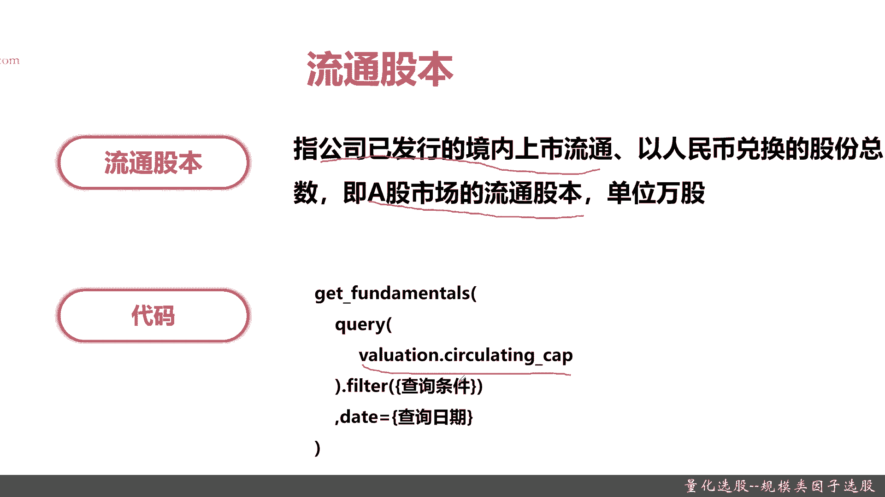
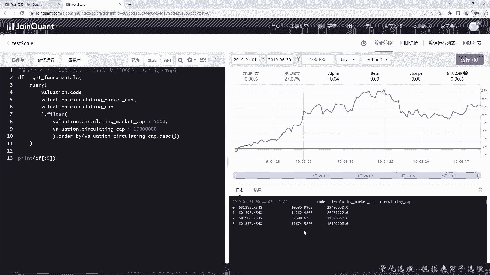
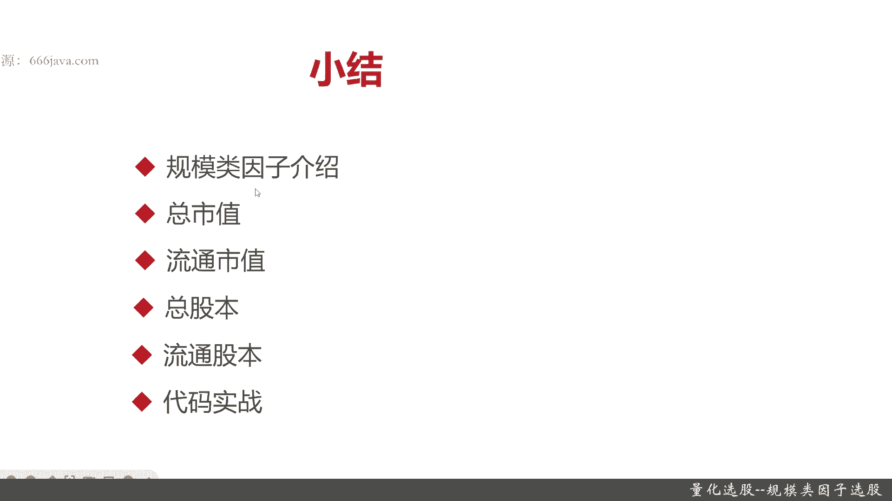

# 基于Python的股票分析与量化交易入门到实践 - P36：9.4 股市投资第一步-Python基本面量化选股_量化选股--规模类因子选股 - 纸飞机旅行家 - BV1rESFYeEuA

大家好，我是米TIA，在上一节呢我向大家介绍了如何通过利润，因此进行选股，那么在这一节呢，我将向大家介绍如何通过规模类因此进行选股，我们将从以下几个方面给大家介绍，如何通过规模类因此进行选股。

首先我们给大家介绍规模类，因此它究竟是是些什么，然后呢它有哪些基本的指标，接着呢我们接下来将向大家详细分解，每一个基本指标，包括总市值，流通市值以及总股本，还有流通股本，然后呢是我们经典的扣进实战环节。

那么接下来呢我们将将向大家介绍，什么是规模类，因此规模类，因此呢它就是反映公司整体规模的情况，注意它主要体现的是市值大小，对投资收益的影响，那规模的因此呢主要有以下四个指标。

就是刚刚在给大家进行介绍的时候，说到的总市值，流通市值，总股本以及流通股本，那么接下来呢，我们将给大家对这四个指标进行分解，首先我们给大家介绍总市值，总市值是什么意思呢，就是说在特定时间内股票的总价值。

注意是股票的总价值，它的公式呢就是总股本数乘以股价，OK总市值，它的作用是用来表示个股，权重大小或大盘的规模大小，这句话比较绕口啊，并不能拿来说总市值越大，这股票就越好，也不能说总市值小，这股票就不行。

只能说这个总市值表示是个股，它个股的权重的大小，或者大盘的整体的规模大小，总市值的变化情况是一个表征，整体盘式的和这股票的一个流通性，还有它的活跃的资本的情况。

总市值的coding是下面这个用的是valuation，这个类里面的marketing杠cap，这是总市值，那有总市值呢，接下来就是流通市值这块，同学们要记住啊，什么是流通市值。

流通市值是在内特定市内可交易的流通股票，它的总价值，注意它的限制条件是可交易的，流通股的股数乘以股价，并不是所有的股票都可以交易，比方说高管或者CEO董事，他们持有的这些股票，在上市一段时间内是不能的。

或者因为某些质押等等一些情况，它是无法进行被交易的，这个都不会被计入流通市值里面，而流通市值占总市值比重越大，说明这个股票的市场价格，越能反映出真实的价格，OK那流通市值它的coding是什么呢。

就是代码实现是啥呢，也是有专用的属性，还是valuation，只不过呢它是circulating market cap，这个属性好给大家介绍完了总事实和流通事实，那我们再给大家接下来介绍的股本。

首先给大家介绍总股本，什么是总股本啊，指公司已发行的普通股的股份的总数，注意它包括A股，B股和H股，那什么是A股啊，A股就是普通咱们普通老百姓可以购买到的，B股指的是非人民币结算。

一般是美元或者是外汇可以购买的股票，然后H股是港股，在中国的上市公司一般都是有这三种股票发行，总股本的单位一般是万股，咱们一般可以被交易到的都是A股，当然了，现在越来越放宽了，H股也可以被交易了。

但是B股的话，一般普通投资呃，普通投资者是交易不了的，那么总股本的coding呢也是get fundamentals，还是valuation，这个类里面一个叫capitalization这个属性。

这是总股本，有了总股本相对应的就是流通股本，那流通股本它的意思就是指公司已发行的，境内的上市流通，其实就是A股的流通股本，单位也是万股好，那流通股本它是个就是怎么样通过扣印实现呢。

Valuation circulating cap，以上呢就是关于规模类因子的四个指标，那么接下来呢我们进入coding实战环节。

首先呢我们来打印一下总市值相关的，我们找一些大一点的股票，是先把代码也打出来，然后是filter，因为我们限制条件是总市值要大于Y1，这个单位是E啊，所以你看这样就可以了，然后要倒序，因为top5嘛。

好就这样吧，我们来看一下，把结果输出一下，我们也不加时间了，虽然它特定时间不停留时间都是不一样的，我们来保存一下，然后运行一下回测，好可以看到在19年的1月1号，那个时候top5是这些。

那个时候你看还没有2万亿的股票呢，那么接下来我们再把流通市值，那5000亿还是top5，那其实很简单啊，我们只需要把这换一下，Market cap，Circulating，对，差点拼错了。

检查一下circulating，OK这里应该是circulating，这里应该是security，好那我们来看一下啊，这里是应该是5000，我保存一下，看一下结果。

可以看到流通股本比较大的1万4000亿，那么接下来呢我们换一个就是总股本了，总股本呢给大家大家看一下，总股本还要大于1000亿股股啊，老样子，我们还是先把基本的查询给写出来，Fundamentals。

Capital，The capitalization，好注意啊，他是1000亿股，而股本单位是万股，那所以1000亿就相当于一千万万好，那就先输个1000，然后再加四个零好，后面还是排序。

Order by，好了，那我们直接打印出来，好了，我们保存一下，然后编译一下，看下结果，其实之前我们那还是这些什么，因为他们本身也大于1万亿，但是你们看到的那股本数不一样，好吧好，那我们看最后一个例子。

这回从股本呢变成流通股本了，然后还是1000亿股吧，然后总市值呢我们变成流通市值，要稍微调整一下，然后开比这个得改，他也是，好，有通谷歌也好了，流通市值大于5000，那下面就应该是，流通股本了。

这个不变，嗯然后排序按照流通股本排序，OK我们检查一下，没什么问题好，那我们来保存运行一下，可以看到能满足这个要求的没有超过五值，所以只返回了四值，那以上就是本节的全部内容。

下面进入本章小结，本章呢我们首先给大家介绍了，什么是规模类因子，那规模类因子，其实他就是反映这个股票规模大小的，然后呢它并不能说规模越大就越好，但是呢从一定意义上说呢。

它可以反映股票投资规模对企业市值这些影响，然后规模因子呢有以下四个常用的指标，分别是总市值，流通市值，总股本和流通股本，那总市值呢其实就是整个这个公司所有的股票，包括能流通的和不能流通的乘以股价。

就是总市值了，然后流通市值呢就是可以被交易的，比方说那些上市公司的一些高管，还有一些股票质押导致的无法被交易的，没有这些股本的，它不能被算，那仅仅能被交易的呢，它就是流通市值，流通市值一大呢。

说明这个股票的总市值，越接近这个上市公司的真实的价值，下面一个呢是总股本，总股本就是这一个上市公司，已发售的所有的股本，包括A股啊，B股和H股，A股之前给大家介绍，就是我们平常正常可以购买到的。

B股呢是外资机构，非人民币结算的股票，然后H股呢是港股，现在同学们也可以买到H股，后面唉港股也会越来越放开吧，然后呢流通股本仅仅只计算A股的，不计算那个BB股和H股的，以上就是规模类因子的介绍。

和艾瑞他们常用的四个指标，最后呢就是代码实战了，我是米tea，感谢大家收看本节的内容。

我们下次再见。