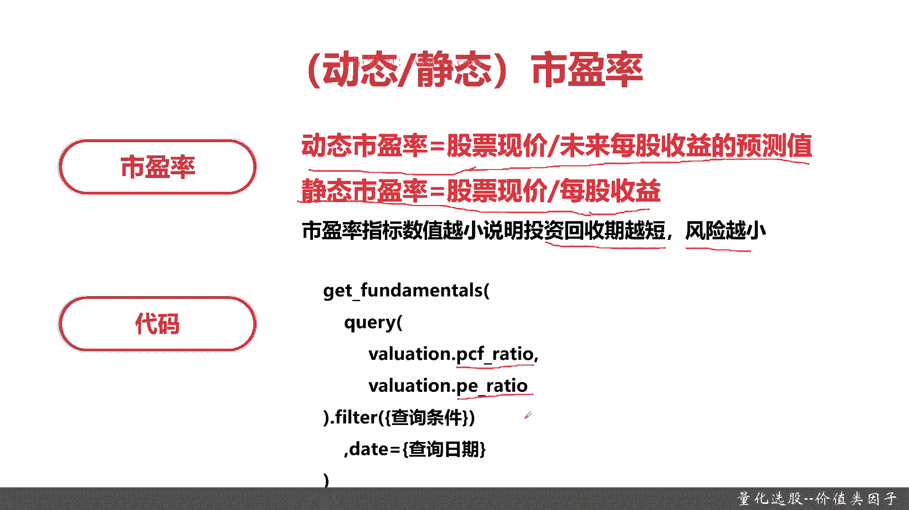
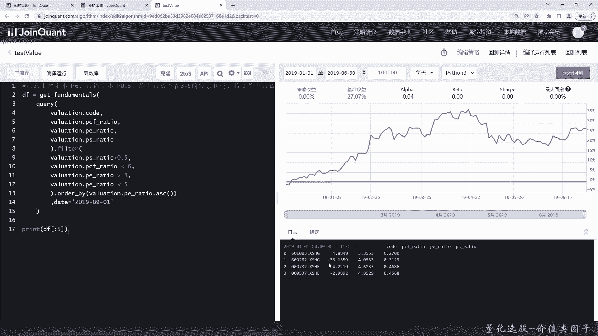
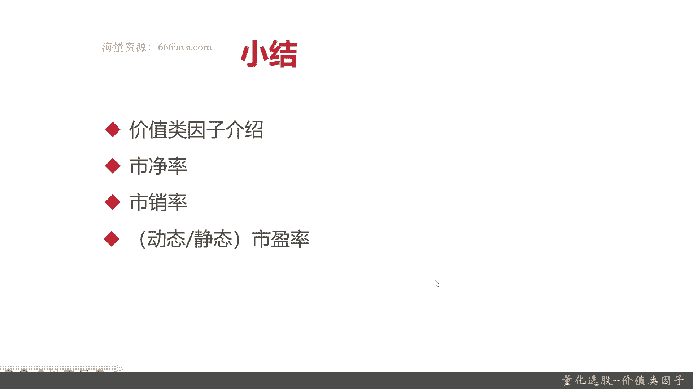

# 基于Python的股票分析与量化交易入门到实践 - P37：9.5 股市投资第一步-Python基本面量化选股_量化选股--价值类因子 - 纸飞机旅行家 - BV1rESFYeEuA

大家好，我是米田，在上一节呢，我向大家介绍了规模类因子的选股的方法，那么在这一节呢，我将向大家介绍价值类因子选股，那么这一节呢我将从以下几个方面，给大家介绍一下价值类因素。

首先我们会给大家介绍价值类因子的定义，然后它有哪些常用的指标，接着呢我们给大家介绍一下价值类因子，具体的指标，首先是市净率，接着呢是市销率，再呢就是市盈率，那市盈率呢它分动态的市盈率与静态的市盈率。

那么最后呢又是到我们的代码实战环节了，那么接下来呢我向大家介绍一下价值类因子，那什么是价值类，因此啊其实就是人们常说的价值投资，那根据定义啊，它是一个久经考验的投资策略，价值投资它其实是一种投资策略啊。

具体说明后面这么长，比如说他是要通过购买那种相对低价，记住啊，相对低价的股票，然后呢在转换成在基本基本面度量的股息，账面价值，利润现金流或其他公司价值的方法，其实呢价值投资，价值投资。

其实主要就是找那些在当前，它的股价被相对低估的方法，那具体呢主要是一些财务类的，和它的利润类的一些计算方式，比如说股票股息，比如说它的账面价值，比如说利润等等，那么价值类因子有哪些指标呢。

价值类因子的指标包括市净率，市销率，还有动态和静态的市盈率，当然了，价值类因子也不仅仅是这些指标，不过最常用的是这三个，那么接下来呢我向大家再介绍一下市净率，市净率的公式其实很简单。

就是每股的市价除上每股的净资产，同学们可能听过可能没有听过，市净率呢就是最常用的的PB市净率，一般来说市净率较低的股票呢投资价值较高，相反呢投资价值较低，但是呢这也不绝，这也不绝对，为什么呢。

因为在不同行业，比方说传统的行业，能源行业，它和互联网网行业市净率就不一样，普遍来说市净率在互联网行业都是比较高的，一般都是30~50，当然了，如果一般超过55或者60来说。

就说明这个股票它是被别人短期内跟风炒作的，它可能会有那个什么呢泡沫现象，那这个时候就不要跟进了，但是呢如果市净率太低的，比如说只有一或者五，那说明这家公司其实也不是那么好。

所以呢他是一个可以基本可以衡量它的，一个价值的指标，但是呢不是，那么绝对也要综合其他来看，那市净率这个指标的代码它是哪个呢，就是valuation pb ratio，它因为它就是常用的PB嘛。

好这是市净率，那么下一个呢是市销率，市效率它就是股票股价除以每股销售额，那个这个市效率这个指标呢，主要在那个国内证券市场用的比较多，它是可以剔除那些市盈率很低，但主营业务没有核心竞争力，然后呢。

主要是依靠非盈利性损益而增加利润的股票，这个是这句话是比较绕口，是什么意思，就是说有些股票，他比如说主营主营的是那个媒体，但是呢这两年大家都知道媒体非常不赚钱，虽然在这种情况，这家公司它其实还是挣钱了。

甚至看到财报上利润很好，这是为什么呢，因为他可能主要收入来源是房地产，市销率和市盈率，这两个指标一般都是连在一起用的，那个市盈率和市净率，这包括市盈率和市效率，也可能是一起用，这些指标一起用了以后呢。

你我们就可以把人发现，在这家公司的主营业务上，它其实并不好的，那些上市公司可以把它剔除掉好，那么市效率的代码是什么呢，我们看一下它就是VOLUTION，PS杠ratio，记住啊，那个市净率是PB。

试效率就是P，那么下下一个是大家最常听到的市盈率，市盈率呢分动态的市盈率和静态的市盈率，首先给大家介绍介绍一下动态的市盈率，动态市盈率主要是首先没有真正实现的，下年度的盈利预测的利润，这个是什么意思呢。

就比如说今年是2022年，那我们今年还没有过完，一般来说上市公司它都会在每年的年末，这也就是第2年的那个1月2月，他出上一年的财报，那出了上一年的财报呢，根据这个财报，很多公司会去预测下一年。

这家公司的那个利润情况，这个呢是静态市盈率，静态市盈率其实就是该公司需要了解，积累多少年，那静态市盈率哪些也是广泛意义上市盈率，也就是说，它一般来说是根据上一年这家公司的财报，它的利润比来看的。

而动态市盈率呢一般都是指当前，比如说今年是202呃，22年，那那我根据今年的一季度，我没过完吗，我根据一季度或者是二季度甚至三季度，这个具体的季报或者是半年报，那我去预测2023年或者2022年。

这些情况呢，它的整体的那个股票情况主要是预测下一年，就是这个叫动态市盈率，一般来说静态市盈率和动态市盈率，差异还是比较大的，这跟他们算法比较有关系，记住静态市盈率是指，该公司需要累积多少年的盈利。

一般来说，静态市盈率，它都是根据上一年的财报而推算出来的，那个呢相对比较准确，而动态市盈率呢，一般都是根据今年的季报，或者是半年报来推算的，OK这个是动态市盈率和静态市盈率的定义。

那么接下来给大家看看公式，动态市盈率的公式就是股票现价除以，未来每股收益的预测值，然后静态市盈率指的是股票现价除以每股收益，其实差异呢一个是一个，一般来说一个是上亿年的财报，一个呢是这一年的那个收入。

当然了，有可能有的公司它披露的数据不准，就会导致整体的市盈率啊，市净率啊，甚至市效率有问题，这种情况在上市公司是绝对不允许，如果一旦查清，查出来就会出问题，那最近有一个案例就是我们的某某咖啡，他被做空。

就是因为他谎报了他的销售，门店销售和利润情况，那最后被做空被罚了很多，市盈率指标越小，说明投资周期越短，风险越小，就比如说它市盈率就是一，那他可能一年就回本了，但是一般来说呢没有这么低的对吧。

一般都是10~20倍，甚至还有30倍的市盈，论代码动态的就有p cf ratio，静态的就是PE，接下来呢就要进入代码的实战环节。

首先我们来把试镜率给实验一下，一般来说没有专门把市净率进行，单独作为一个指标进行筛选的，好这是代码出来了，市净率也给他返回出来，当然还有市值，我们现在写filter，好我们的filter写好了。

那下面写order by，这个写错了，我们把最终结果打印出来，我们现在敲完了代码，我们来看一下，编译一下，看一下结果，括号对的上吧，好像有点追不上对，检查一下，好这就是市净率小于1。5。

从2019年1月1号那段时间开始，那么接下来呢我们给大家看一下，市净率和市销率一起的，那这里其实只要做的稍微修改一下就行了，那实效率是什么呢，没错就是p ratio，PSV需要小于0。5，是几率小于1。

5，当然这个具体参数同学们可以去看，嗯这个时间随便写吧，其实写不写都无所谓，那我保存运行一下，你看他既然还有是负的，那为什么呢，他其实利润是负的，所以他一直收收不起来，好那么最后呢我们再修改一下。

这次就稍微改动有点大了，我们先把试经历给关了，我们这次不要试经理，我们把动态市盈率和静态市盈率一起算出来，我们要近在市盈率排序，还是上一行吧，那我们再来看一看啊，这些基本上大部分是不用变的。

稍微要进行修改一下，首先是动态市盈率，它是什么呢，它是pcf ratio，然后呢PS有了得有PE了，PE就是同学们呃市面上最常说的市盈率，也就是静态市盈率，首先p s ratio0。5，这个不用变。

然后pcf ratio应该是小于六，然后是两个静态市盈率，他这个一般好像没有比between and的，所以如果是这样的话，得写两个，然后我们按照p e ratio来排序的排序好。

那么看一下市盈率小于六，市效率小于0。5，静态市盈率小额在3~5之间的，我们来看一下代码，就敲完了，我们再检查检查啊，这里好像应该少了个逗号，我们来运行一下，这个就是结果可以看到动态市盈率。

一开始有他们他们这些静态市盈率是正的，但是动态市盈率在变化，因为那段时间亏，第二节他亏钱了吗，他亏钱了，那动态市盈率是不一样的。

以上呢就是本章的全部内容，下面进入本章小结，本章呢主要给大家介绍了价值类因子，价值零零，因此呢其实就是人们常说的价值投资，它的其实不要看那么那么长的那个定义啊，同学们记住几个核心点。

首先它也是一种投资策略，其次他的终极目标就是找到那些被低估的股票，那怎么去衡量呢，那主要是根据这个股票，首先它的股价要价相对低位，太高位了就不加价值的投资了，接着要找到它的股息利润。

公司那个现金流或者其他价值等等等等，这就是价值类型意思，价值类因子呢它的核心的指标有以下三个，第一个是市净率，市净率呢同学们可以去看一下，其实你这也记不下市净率呢，把这个记住就行了，就是PB。

那市净率一般来说呢它越小越好，当然了，不同行业它是不一样的，你像互联网行业肯定就比能源行业高得多，然后那个他的code呢就是valuation，Valuation，杠pb ratio。

一般来说很少把市净率单独给拿出来，再一个呢是市销率，市销率它是衡量什么呢，就是衡量这个公司它的主营业务到底挣不挣钱，可以这么理解，那失效率和市盈率一般和市效率，那么一般市效率和市盈率是一起用的。

当然了有的时候也会把市净率一起用，这样就能甄别出那些看上去很赚钱，但是呢它主营业务在行业里，没有什么地位的公司，最后一个呢常用的价值类因子呢就是市盈率，它分动态的和静态的。

静态的呢是一般来说是上沿的那个利润情况，一般多出出资的上市公司的财报，而动态市盈率是当前这一年发生的，然后他是预测未来下一年的情况，以上呢就是本节的全部内容。

我是米tea，大家下期再见。