# 基于Python的股票分析与量化交易入门到实践 - P39：10.1 Python量化择时--技术指标函数_量化择时基本概念 - 纸飞机旅行家 - BV1rESFYeEuA

大家好，我是meta，在上一章呢我向大家介绍了量化选股，那么整个这一章呢我将先向大家介绍量化择时，本节呢我们先向大家介绍一下，量化测试的基本概念。

本节呢我们将从四个方面给大家介绍一下，量化测试，首先呢给大家介绍一下量化测试，对相关的一些基本概念，定义什么的，接着呢，我们给大家介绍一下量化择时的常用方法，接着呢我们给大家介绍一下量化择时。

常用的一些技术分析，技术指标的一些理论，最后给大家介绍一下这些技术指标的一些分类，还有他们的一些特点好，那么接下来呢我将向大家介绍一下，量化择时的基本概念。

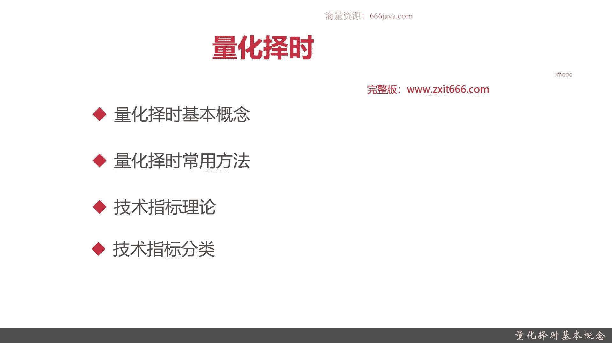

先给大家介绍一下量化择时的定义啊，量化择时就是利用数量化的方法，注意是数量化的方法，通过对各种宏观微观指标的量化分析，试图找到影响大盘走势的关键信息，注意它是通过量化的方法，找到大盘走势的关键信息。

然后并对未来进行预测，这个是量化择时的一个学院派的定义啊，通俗来说大家记住这句话，量化测试，其实就是才通过量化的方式来判断买点和卖点，无论是股票还是债券还是基金，就是通过量化的方式方法找到买点和卖点。

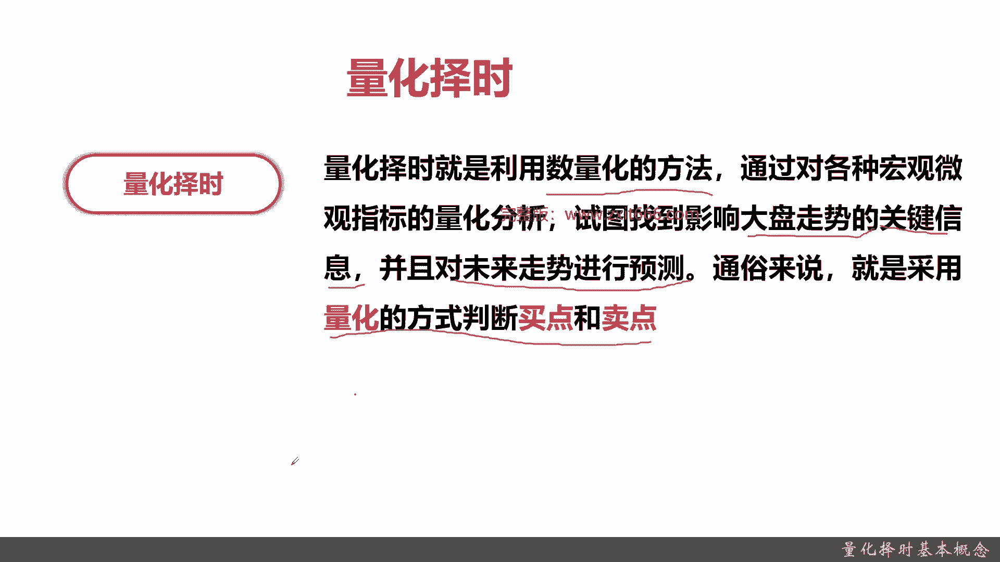

然后量化择时常用方法有两种，一种是趋势量化测试，还有一种是市场情绪量化测试，这是目前在量化这个领域，最常用的两种方式方法，或者可以理解为两种流派好，那么接下来呢我们分别给大家介绍一下。

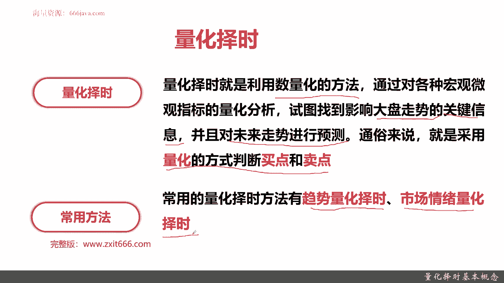

趋势量化测试和市场情绪量化测试。

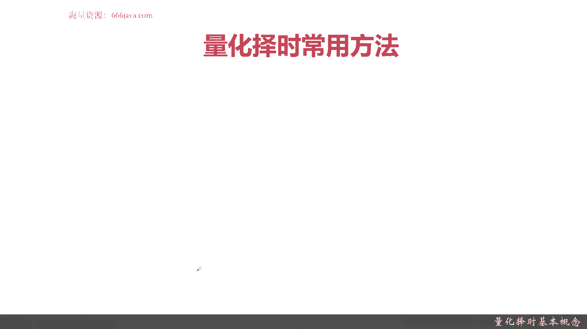

首先给大家介绍一下什么是趋势量化测试，趋势量化则是它的基本思想，就主要来源于技术分析，那我们在前面几章给有给大家提到过技术分析，那趋势量化测试基本上都是来源于技术分析，技术分析有一个基本的理论。

他就认为趋势是存在延续性的，记住趋势是存在延续，这样的话我才能去分析啊，通过分析当前和历史的趋势，然后去预测未来，然后趋势则是有各种各样很多这种指标，我们整个这一章将来都会向大家详细的介绍。

各种趋势择时的指标，那常见的ma均线，MACD金叉DMA等等等等，后面一种是市场情绪测试，这个量化择时的方法和趋势择时完全不一样。

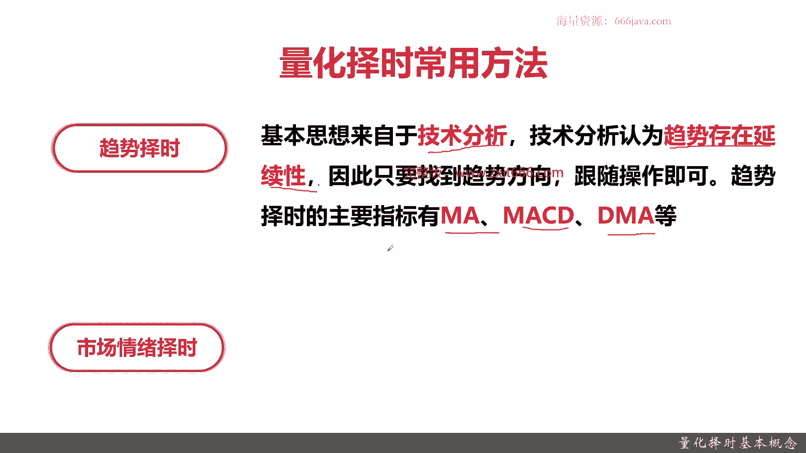

它呢是通过判断投资者的热情程度，然后判断大腿趋势，它和技术分析的那个引入点就不一样。

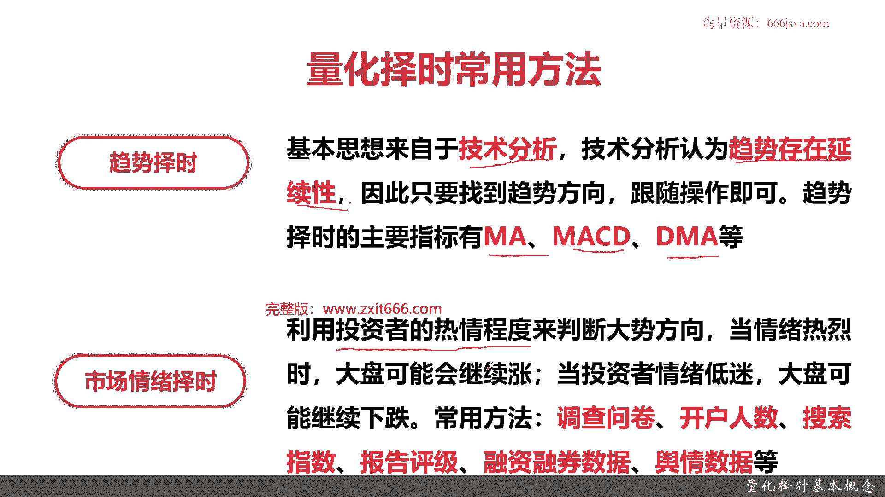

他的假设是当情绪热烈时候，大盘会涨，也就是情绪热了，大盘就涨，然后情绪低迷，大盘就跌。

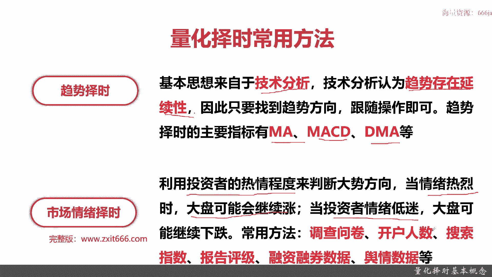

所以呢它的分析的指标的维度，包括数据的来源和趋势则是也完全不一样，常用一种调查问卷。

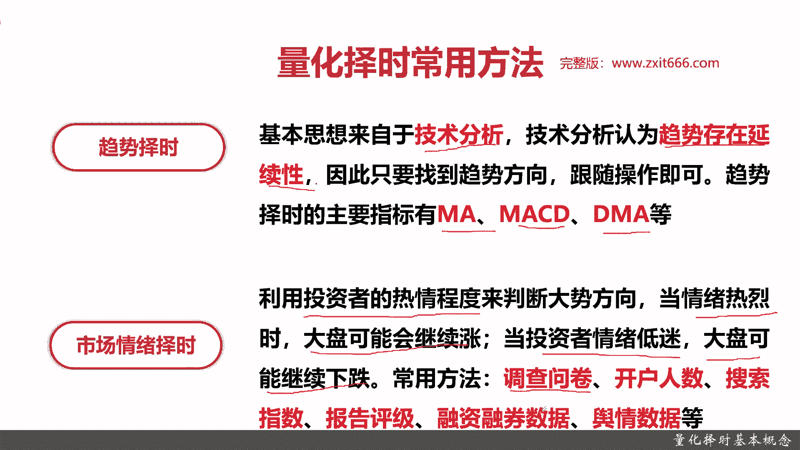

开户人数，搜索指数报告评级，融资融券指数据，舆情数据等调查问卷比较好理解，就是给一些核心的投资人。

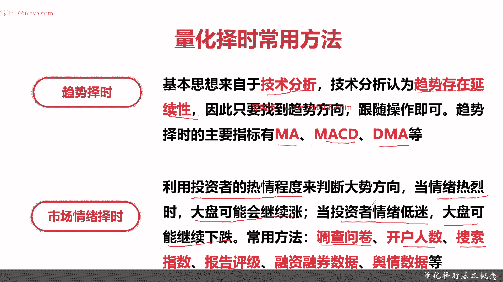

或者是随机的一些股民进行一些调查问卷，然后进行抽样的方式，还有一种呢是对比各个时间段。

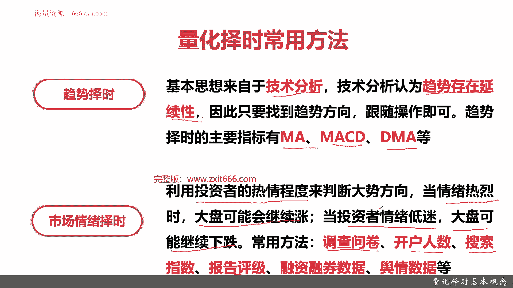

整体市场的开户人数新增的情况，然后这个搜索指数呢就是比如说百度，谷歌的一些搜索关键词的搜索指数。

然后报告评级主要是一些专业性的报告，对于这些机构，他们发行的某只股票或者某些股票，他的评级，买入啊还是持有啊。

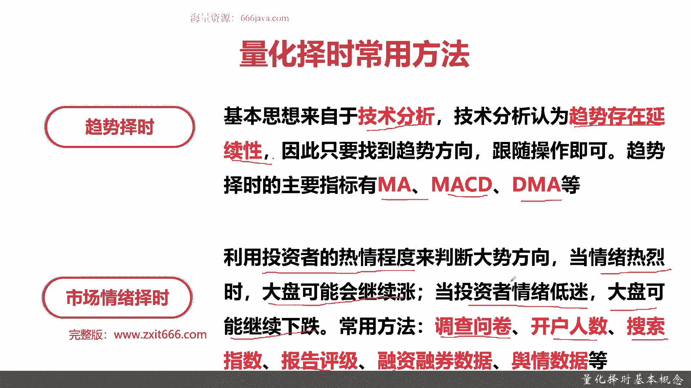

还是卖出啊等等，这种融资融券的数据也是根据整体的宏观大盘，在整体的一些融资加杠杆的情况。

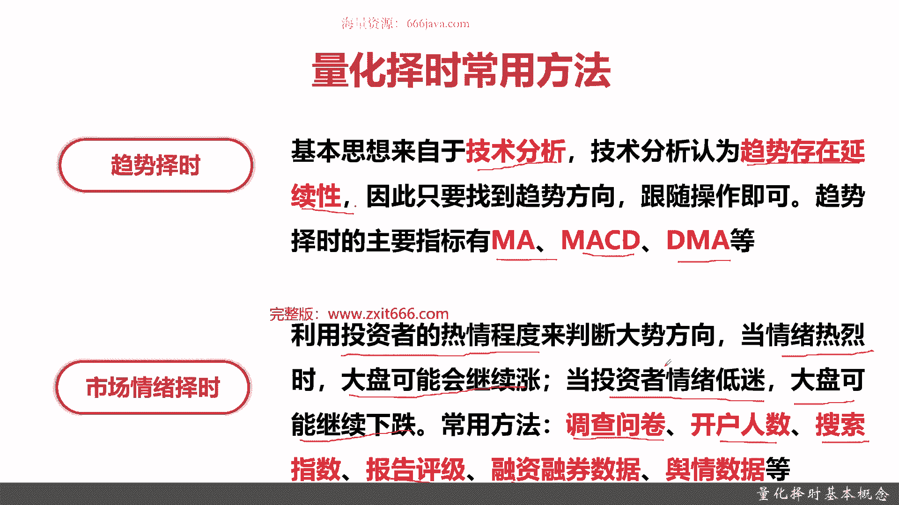

那大盘涨的比较多的时候，融资情况就比较多，杠杆就加的比较多，大盘比较不好，那融资融券的数据就比较不好。

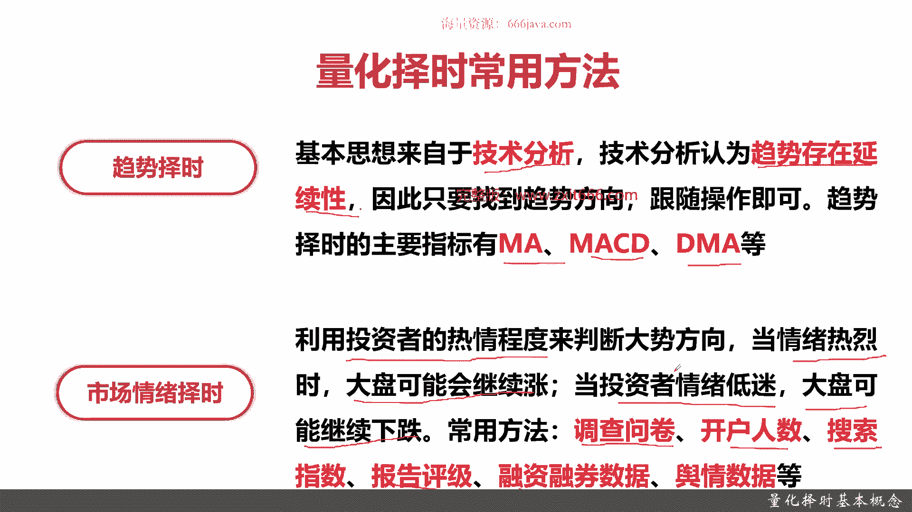

举个例子，就比如说像最近整体经济其实还不是那么景气，买房的贷款，这些情况也是类似一个容错元件，它的数据可能就不好看。

但是前两年其实这个杠杆数相对来说就比较高，最后一个就是一些舆情数据，比如说常见的新闻稿，比如说一些分析师文章等等。

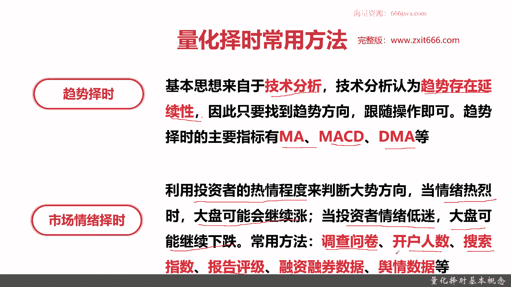

这从可以从侧面来，或者说是一个整体分析，可以找到一个市场的情绪，那我们在本系列课程里面。

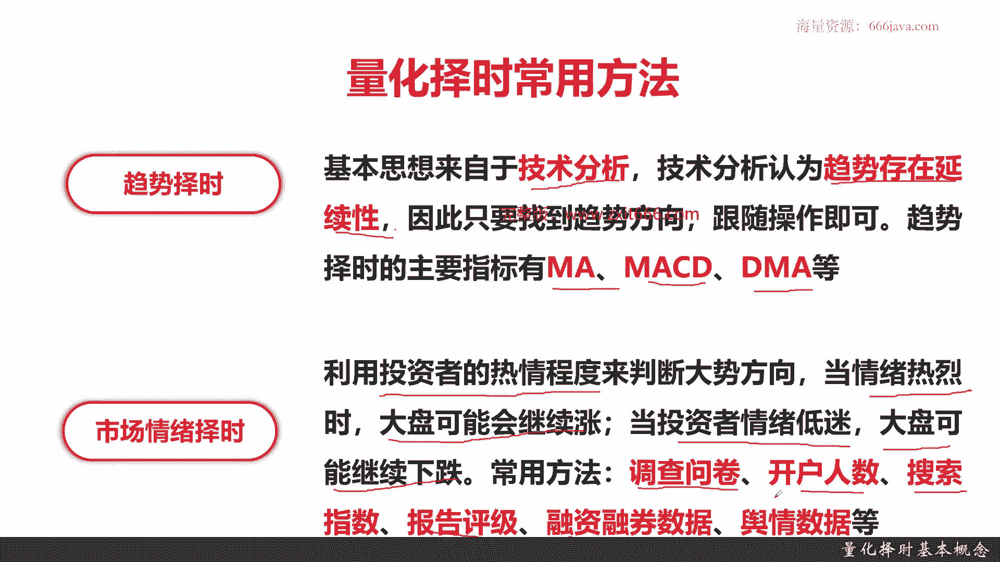

主要向大家介绍的是趋势择时，市场情绪则是，这一块是需要建立在一些宏观的数据库，还有自建数据库上。

这个呢咱们本系列课程暂时不涉及本系列，主要是给大家介绍一下趋势测试好，那么下面呢给大家介绍一下趋势。

则是常用的技术流派，技术分析，首先给大家介绍技术分析之前呢，我们会给大家介绍一下三个假设，这是技术分析，它之所以能成立的重要的三个假设，所有的技术分析的指标理论均取决于三项时间。

假设一市场行为涵盖一切信息，二价格沿趋势移动，三历史会重演，这三者缺一不可，你比如说那个市场行为，如果不会给我们带来任何的分析信息，那它是一个无序的，没有规律的，那我们也不可能进行技术指标的分析。

如果价格它不会沿趋势进行移动，那它就无法被预测，那无法被预测，我们这个技术分析这套理论就不存在，还有如果我们不能参考历史，那我们如何去预测未来，所以整个技术指标的理论，就来源于这三项市场假设。

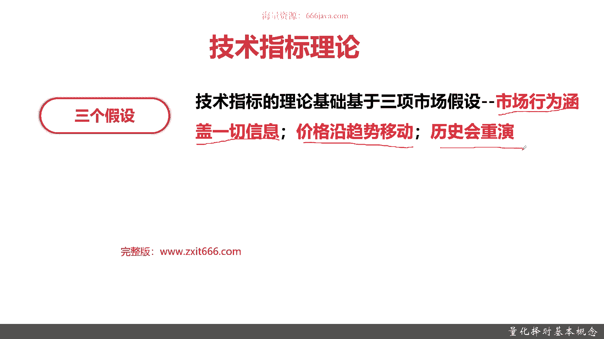

然后技术指标定义就是这个技术指标。

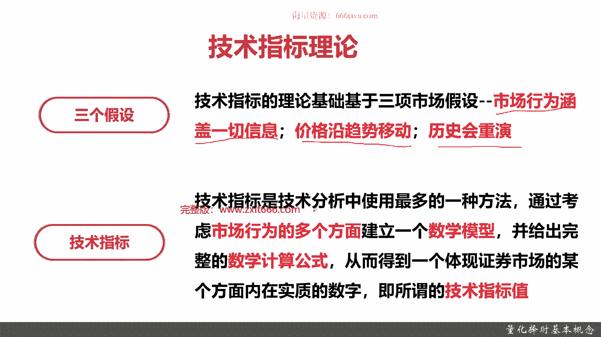

是技术分析中使用最多的一种方式，注意它主要是考虑市场行为的多个方面，其实就是想尽一切办法去衡量市场行为的。

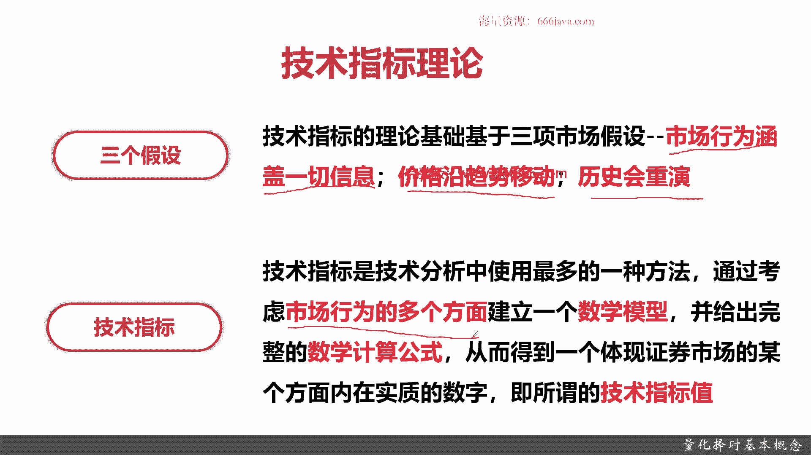

各种信息维度，然后考虑好以后给他建立一个数学模型，注意是建立一个数学模式，同时要给到完整的数学计算公式，就类似于物理化学等等，都是可以通过数学计算公式来预测的，最终他要得到证券市场的某个方面的实践数字。

就是一些技术指标值，就比如说我们呢可以衡量它的预测的未来，买点和卖点，最后通过我的数学公式进行计算出买点和卖点。

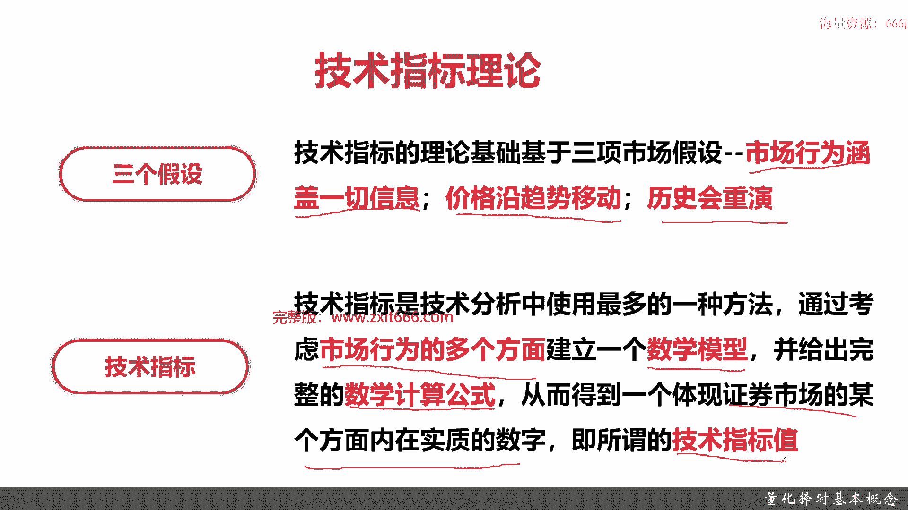

大家可以这么通俗地理解，那如果以物理来说，比如说我们引力是可以被计算的，光能量是可以被计算等等等等等，技术指标，其实就是把金融，证券市场的一些详细信息通过计算出来，然后进行预测未来。

那么接下来呢我给大家进行介绍一下。

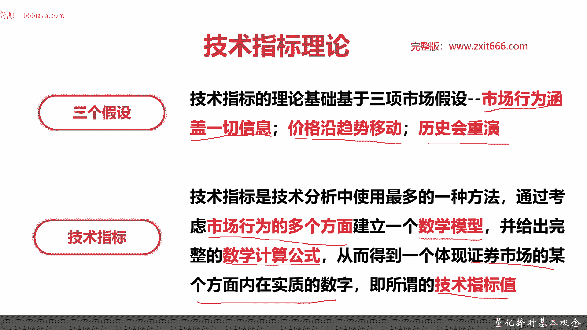

技术指标的一些具体分类，首先是趋向指标，趋向指标是识别和追踪有趋势的图形类指标，注意它是图形类指标，然后关键它是有趋势的，它的特点是不试图补顶和侧底，什么意思啊，这个就是。

如果各位同学对股票或者债券有所了解，就会发现常用的股民里面经常会判断顶部，那是不是已经涨到头了，或者已经是不是跌到底了，但是在趋向指标这个理论里面，首先假设它的目的，就从来不是试图去捕捉顶部和侧体。

它只是反映了一个有趋势概念的事情，只是未来可能是，但它是不是底或者是不是价格底部，不考虑，因为在实际情况里面，你很难每一次都踩中顶，就是买在价格的底，然后卖在那个价格高，这是基本上是不可能做到的。

所以在趋势指标这个理论里面，他就不考虑去捕捉顶部和特点，然后常见的趋势指标有均线指标，其实就ma macd指标，金叉模型等等，这是趋向指标。

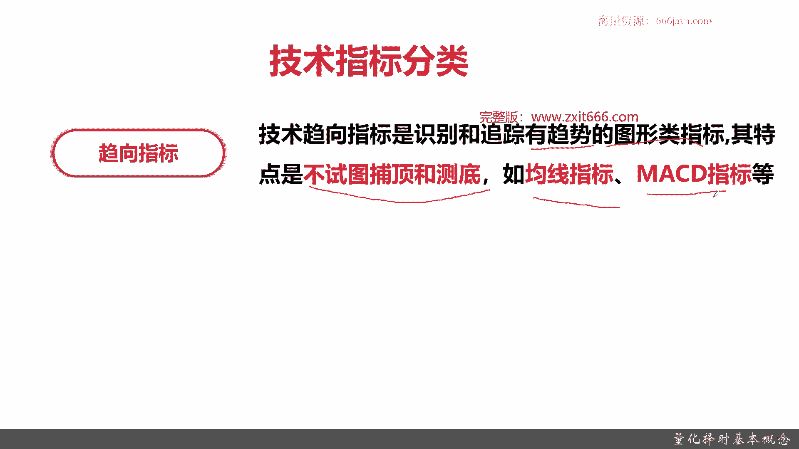

既然有趋向指标，那接下来就有反趋向指标。

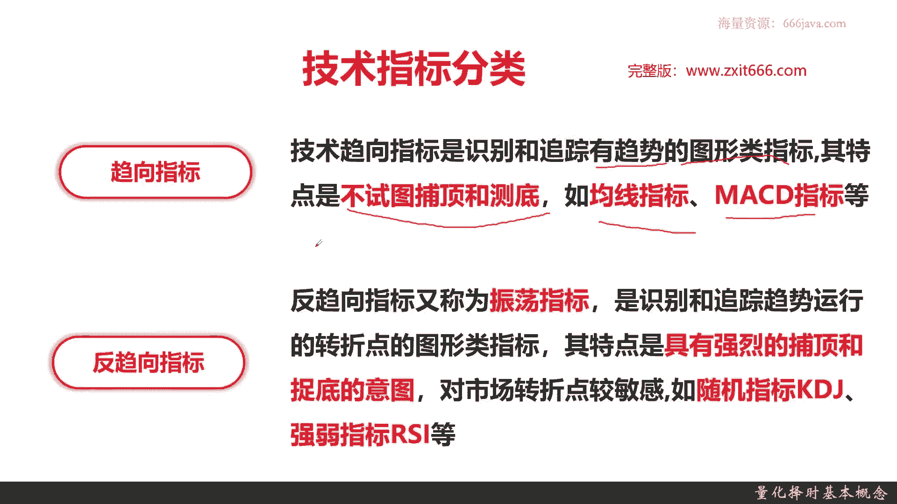

反趋向指标其实就是震荡指标，它是理解为市场，其是震荡的，它其实是波形，那只要是波形，它就有转折，有转折其实就有顶部和桌底，所以反趋向指标的意思就是，它和趋向指标不一样的，它是具有强烈的补给和桌底的意图。

那他重点是判断市场的转折点，常见的反趋向指标有KDJISI，如果同学们对这两种类型指标比较了解的话，可以知道，他们呢很多都是由一些能量波的波形计算，而反向生成的模型，这是技术指标的两种不同的分类。

一种是趋向指标，它不试图捕捉顶部和侧底，一种呢是专门用来捕捉顶部和侧底的，反趋向指标，给大家介绍，完了好。

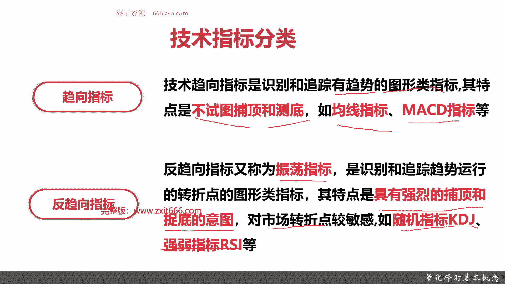

那么再下两个呢，一个是压力支撑指标。

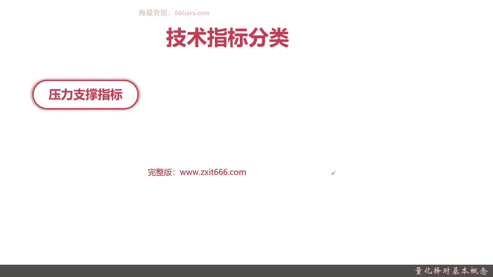

压力支撑指标又称通道指标，注意是通道，那为什么是通道呢，常见的它会有一个，首先它顶部会有轨道线，然后呢他还有底部的轨道线，那这两个轨道线是什么意思呢，它主要是反映了行情的顶部和底部。

然后呢再被技术分析的类型的理论呢，他会理解为它是具有明显的压力线，也有支撑线，顶部的就是压力线，底部的就是支撑线，那这个呢就是压力支撑指标，它们的特点，压力支撑指标常见的呢是有布林带指标。

还有血丝通道指标，布林带之前我跟大家进行介绍过薛斯通道，可能同学们没有介绍过，不过没关系，这些呢在本章的系列课程里面，都会给大家详细介绍好，最后一个呢是量价指标。

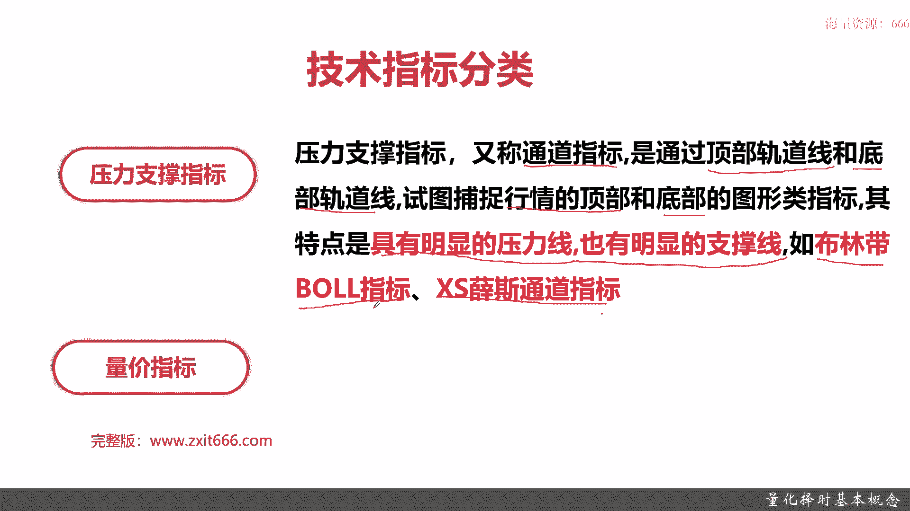

量价指标是什么意思呢，它重点是通过成交量的变动来分析捕捉价格，就是在他的假设里面。

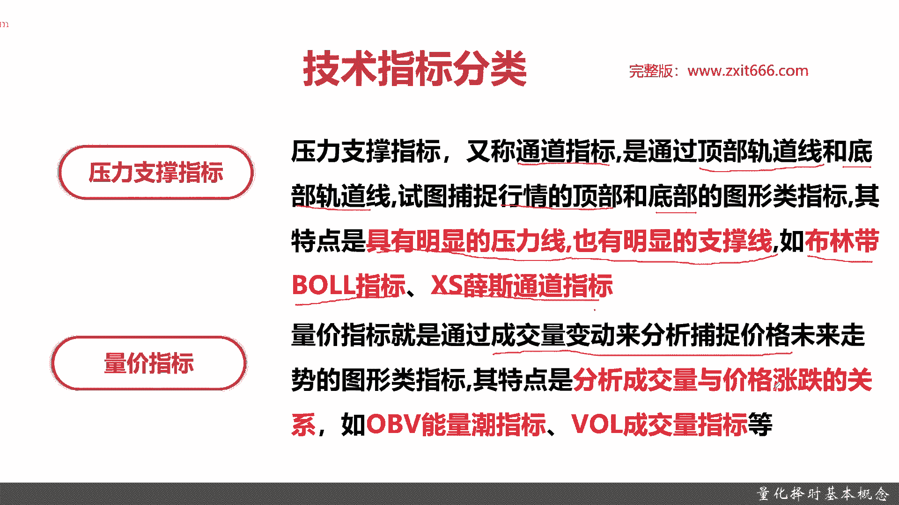

他认为某一只股票它的成交量的变化，它会反映出未来的价格走势，那它的特点呢就是成交量和价格涨跌的关系。

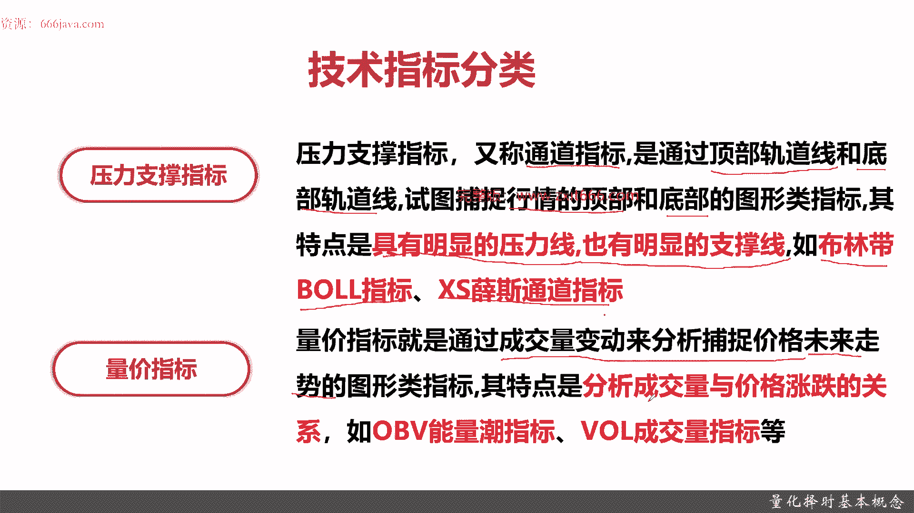

它重点只关注于这块，像其他的，比如说行情顶部和底部，它都不关心它，重点就关系于成交量与价格涨跌关系。

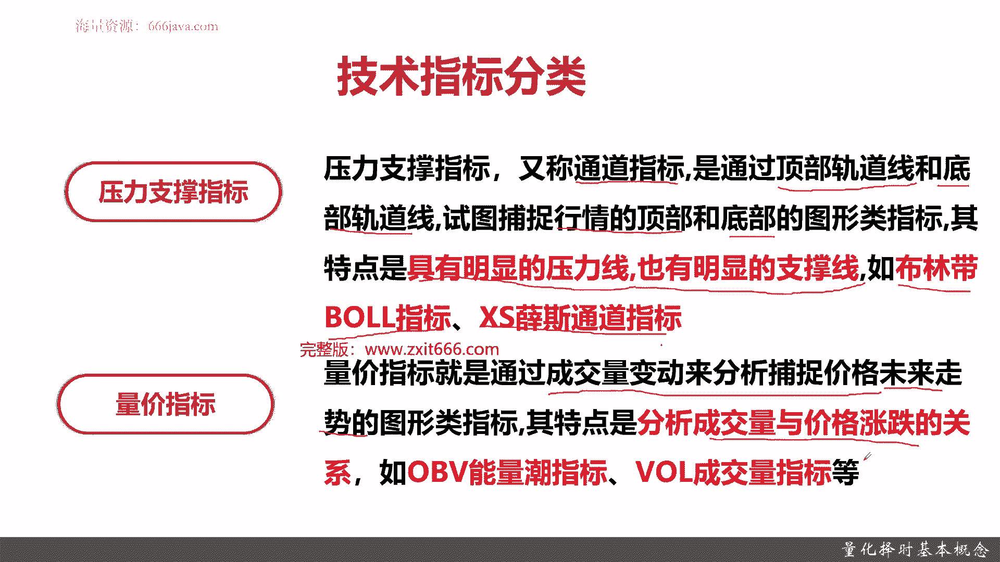

如ob v能量场指标，还有vol volume这个成交量指标等等等等，好以上呢就是本节的全部内容。

那么下面呢进入本章小结，首先我们给大家介绍了量化择时的基本概念，那些学院派的定义的同学们可以不用去看，或者不用这么详细的去记住，量化择时，通俗来说，就是通过量化的方法去找到买点和卖点，这个就是量化测试。

接下来呢我们给大家介绍量化择时的分类，量化择时有一种是趋向类分析，然后还有一种呢是市场情绪类择时，那趋向择时呢其实主要它的来源呢，就是技术分析，之前我们也给大家介绍过技术分析。

在量化则是目前来说应用的比较多的，也就是趋向分析，也就是技术分析，它其实主要是通过各种指标去分析，市场的各种情况，常用指指标反映的维度，价格啊，成交量啊等等等等等，通过市场情绪去择使呢。

它会用一些宏观的，或者说一些和股票的价格，还有时间这些关系不是那么密切的方法，他去反映他们呢主要的假设就是市场情绪好，大盘就会涨，那市场情绪差，那大盘就会跌，市场情绪择时的方法呢。

它其实主要都是一些通过宏观数据，或者一些侧面的数据，去反映这个价格的变化趋势，比如说调查问卷，开户人数，融资融券的指数，搜索指数，还有舆情等等等等等等，接下来呢我们给大家介绍了技术指标理论。

技技术指标理论呢其实就是技术分析里面，基于技术分析，它有三个假设前提，首先市场的信息，市场行为涵盖一切信息，接着价格是随趋势而变化的，然后第三个呢是历史会重演，那基于这三个假设才有技术指标。

其实大家理解一下技术分析技术指标，它的假设是根据这上面三个它的原理，或者说的定义呢，大家可以通俗地理解一下，就是通过一套数学模型，然后同时可以被量化的数学公式能被计算，然后最后计算出市场某一个值。

来去判断我们的买点和卖点，这就是技术分析，那技术指标的分类呢，常见有这四种，一种是趋向类的指标，那他们呢的特点就是，他不会去试图去捕捉价格顶部，也不会去试图猜测价格的底部，不补顶也不捉底。

那它只是去反映价格的趋势，常见的是均线ma和MACD等等，而和它相对的反趋向指标，他就是要去捕捉价格的顶，然后去捉底压力支撑指标，这里特定指标的特点呢，它就会有一个压力线，是价格的顶部线。

还有一个是支撑线，是价格的底部线，他们的常用的指标一个是布林带，还有一个是学磁通道，反正他们其实就是各种通道有两根线，一个顶部的压力线，一个是底部的支线线判断，然后呢。

最后一种是专门反映成交量和价格的趋势，变换关系的那个量价指标，他们只考虑成交量和价格的涨跌关系，他们不考虑其他的，常见的一个是OBJ能量超指标，还有一个呢是VOL成交量指标，好的。

以上呢就是本节量化择时的基本概念，那从下一节起呢，我们就会详细给大家去介绍这四类技术指标的，详细的具体的指标，他们的技术与原理，和通过我们的平台怎么去扣进实战，它好。

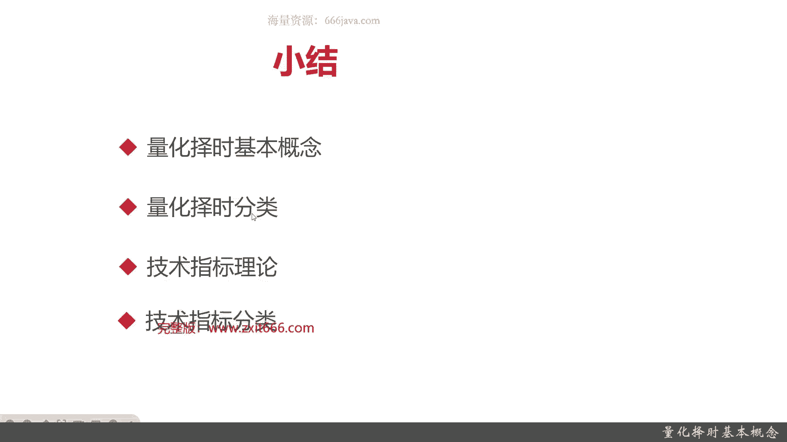

我是米tea，大家下期再见。