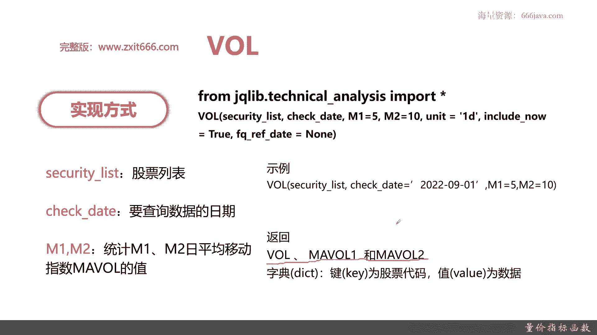
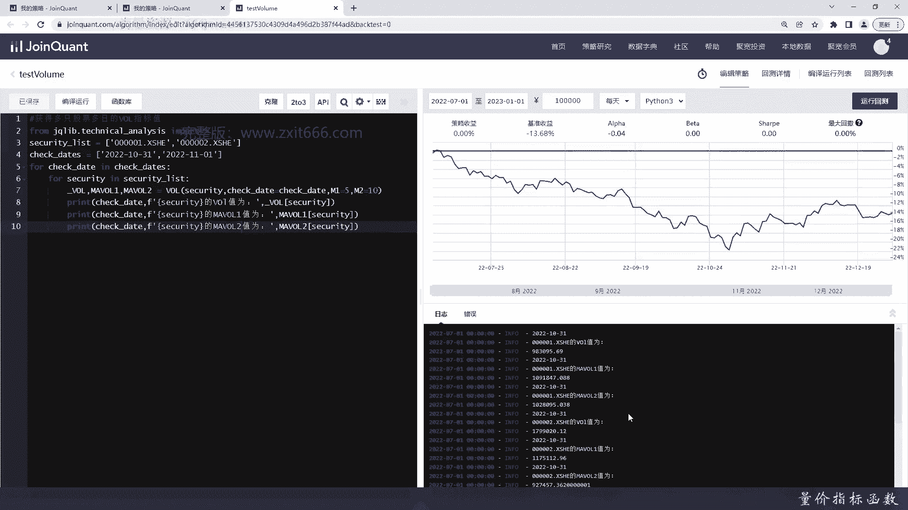
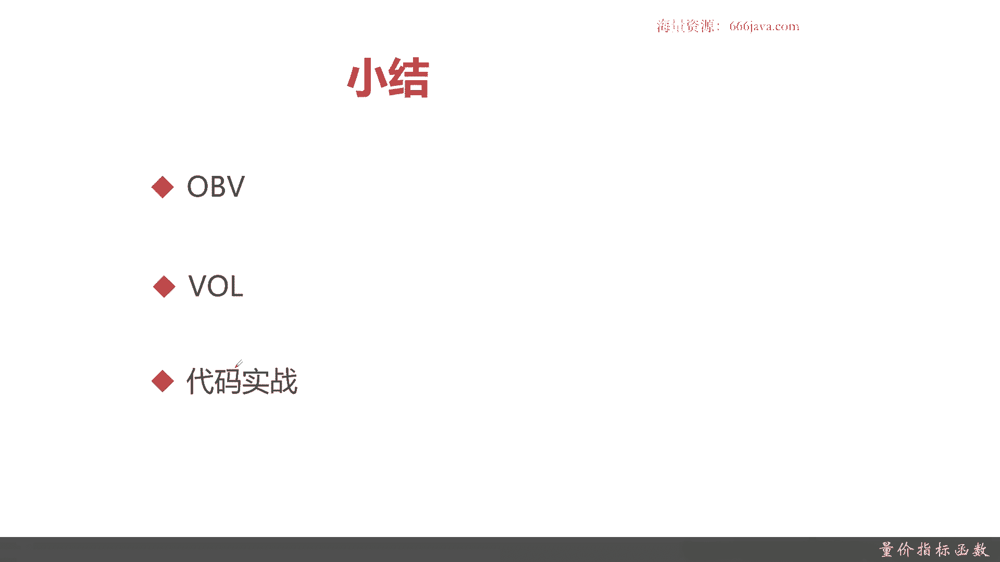

# 基于Python的股票分析与量化交易入门到实践 - P46：10.8 Python量化择时--技术指标函数_量价指标函数 - 纸飞机旅行家 - BV1rESFYeEuA

大家好，我是米tea，在上一节呢我向大家介绍了压力支撑指标，那么这一节呢我将向大家介绍量化择时里面，最后一类指标量价指标，本节呢我们将从三个方面给大家介绍量价指标，首先我们给大家介绍一下OBV能量潮。

接着呢我们给大家介绍一下VL成交量指标，最后呢是代码实战环节好，那么接下来的呢，我先向大家介绍一下OBV能量潮指标，能量潮指标呢，也是格兰维那在上世纪60年代提出来的，能量潮信息呢。

依据成交量的变化汇集统计出来，OBV线呢为股市注意是短期波动啊，技术分析里面很多都是短期波动，OBV也是O呃，OBA线是短期波动的重要判断方法，然后呢，一般来说OBV线需要配合股价趋势予以研判。

那么接下来呢给大家介绍一下ob v的算法呃，OBA算法呢，就是昨日的OVAA加上符号函数乘以今天的，今天的成交量，符号函数呢它的结果就是正一，当那个今日收盘价大于等于，等于昨日收盘下限的时候呢。

复合函数就是那个就是正一，当那个今日收盘价小于左盘日，则是数盘价的时候，复含量而出就是一，注意啊，这里的成交量它是一般都是手数，不是金额，一般来说第一次日的初始值呢，它的成交量就用整个你已知的股价的。

第一日的成交量代替即可呃，OBA的公式其实计算起来还是比较容易的，那么给大家看一下OBA的图形，这个呢就是ova的图形，OBVA有两种啊，一种就是普通的OBA就是这个黄色的线，还有一种OBA的均线好。

那么接下来呢给大家说一下ova的应用，首先如果股价一顶比一顶高，那OBV1顶比一顶低，这个其实就是一个反差对称，那暗示就已经到了波峰了，头部已经形成，这是一个卖点，股价一底比一底低。

rob v呢一底比一底高，那就暗示着底部将形成，这是个买点，然后呢这上面两种都是趋势连盘再向下，接下来介绍两种呢，可以量化分析的OBA突破其N字型波动，然后高达五次就是短线的卖点。

同样的ob v跌破其N字形波动的低点，次数达到五次，为短线的买点，三和四呢就是ob a的可以量化的，一个那个应用点，当然了，还有一点非常重要，ob v不能单独使用，注意这个是非常重要的。

OBBA绝对不能单独使用，那一定要跟股价的曲线结合才能发挥作用，如果OBV单独使用，它不能说明任何的问题，那么接下来呢给大家介绍一下ob v的函数，实现一样的，OBV呢也是调用了那个技术分析的库。

然后呢它的函数名就叫OBV，多了一个参数，Time period，那这个统计参数呢就是ABA要统计的量，一般来说都是以30天为准，给大家看一下ABA的示例啊，以上呢就是OBA的示例。

默认的他们P的等于30，然后他返回的是OBA的值，一样的，也是一个dictionary，接下来呢给大家介绍一下vol，val是成交量指标，那成交量呢就是指个股和大盘的成交总手数，这个定义这个概念。

同学们应该都非常了解了，那成交量指标一般呢在形态上用一根立式柱子，注意啊，是立式柱子来表示，左面的坐标值与和柱子的横向对应处，就是当日当时的成交总数，如当天收盘价高于或等于当天的开盘价，成交额注呈红色。

反之成交主成绿色，这个呢呃就是成交量网图的解释，那待会给大家先给大家介绍一下成交量的算法，那当日的总的成交量，然后呢再除以那个一星的参数，默认的是十或者30，这些呢跟成交量均线也是有关系的。

接下来呢给大家看一下那个成交量的图，接下来给大家看一下成交量图，这些有绿有红的柱状就是成交量，这个在每个K线图啊，和还有炒股各种场炒股软件上都是非常常见的，比如说这里，这就证明股价继续在涨。

成交量也在上升，这里呢股价跌了，成交量在下降，这些线呢就是成交量的均线，有5日的，有10日的，有20日的，有30日的，那么接下来呢给大家介绍一下成交量的应用，那么接下来呢给大家先介绍一下成交量的应用。

当前股价处在盘整的行情的时候呢，成交量注意，这个是主要是看他什么时候从横盘，就是盘整变成向上或者向下突破，那要突然增加股价短时间内突破的可能性较高，OK第二个当成交量连出现连续三条会更多。

一般来说这个阈值是三更多的成交量的时候，说明当前市场买卖频繁，股价下跌可能性比较小，这是一个大数的概率啊，就是当那个成交量买卖频繁的时候，就是就市场就是这个股票交易比较频繁的时候。

股价下跌的可能性就比较小了，大概率就是股价是上升的，那最后一个股价在上涨了一定的时间内，成交量依然是大幅上涨，但是最后收尾那个趋势，阴线或者是比较小的阳线的收尾的时候。

说明当前上涨的成交量支持支撑量已经衰退了，股价走势会在短时间内的发展，呃这句话是什么意思呢，就是在股价一直在上涨，那连续好几天的上涨以后，成交量虽然看上去还是在上涨，但是在当天收盘以后。

整体的趋势它是变成了阴线，就是看看整体趋势收盘价微跌，或者呢呃它的上涨幅度没有之前那么高了，那说明那个其实这就说白了，说白了说明庄家已经要考虑撤退了，但是呢还是散户在往前顶。

那就说明当前上涨的支撑的力量就已经衰退了，整体的这一轮涨势应该是见顶了，然后股价就会在短时间内反转，OK这三点呢是成交量常见的三种形态，那么接下来呢给大家介绍一下成交量的函数。

成交量的函数呢也是用技术分析的这个呃类库，然后呢它有两个特殊的函数，一个是M1，一个是M2，其中MEMI分别表示那个成交量的，M1日均线和M2日均线，默认取呢和十，当然你取十和20也行啊，这个看个人。

那么给大家再说一下成交量那个代码的示例，像这个就是一个实例，然后呢成交量返回的是三个值，成交量，M1日的均线和M2日的均线返回的数据格式，它也是字典类型的，以key和value。

以上就是本小节的课程的部分。

下面进入代码实战，老样子啊，我们要进入代码实战了，这个呢我也提前把一些准备好了，我们现在先把能量场的例子给大家举一下，先还是一样，先引入技术分析这个包，好循环遍历，然后呢便利两轮。

security这一类便利，因为他是个N方复杂度嘛，好我们把OBV给打印出来，先求得OBV，Time period，我们选30，好好B打印出来，OK我们检查一下有没有问题，初步看下没什么问题。

我们来运行一下，OK可以看到这001002和60121，这三只股票，在1010月31号，那个和11月1号这两天的那个OBH，就分别是这个，接下来呢我们给大家看一下vol，这样之前改过了就不用改那么多了。

那vi呢我们就少输出一点，就两只吧，其实这个也没什么VL的参数比较多，没有前两个参数都一样，关键是有一个M1和M5，M1呢我们取默认的五，然后，那可以利用刚才打印出来的，我们可以少少打一些字母。

好MIVOL，我们来检查有没有错误的地方，OK看上去还好，那我们来给大家看一下结果，这个呢就是00001和0002VOL，在十呃，那个二零20月31号和，202年11月1号的值。

以上呢就是本节的千元部内容。

下面呢进入本章小结，本章呢我们给大家介绍了量价指标，那首先给大家介绍ob v能量潮，能量潮呢就是是格兰威，于上个世纪60年代提出的，它主要是为了成交量的变化统计而绘制的。

OBA线呢是短期波动的一个重要研判方法，它的算法呢其实就是比较，今日和上一日的收盘价大小，如果是今日比上一日的收盘价，大于等于上一日顺向交量，那它今日的那个OBV的那个值呢，他就会加上今天的成交量。

那如果今日的收盘价比上一日的收盘价小，那它就会减去今日的成交量，OBV的那个应用呢，一般来说啊，它不能单独使用，必须和骨架连在一起，如果OBA突破N次曲线，波动高达五次的时候呢，它就是短期的卖点。

如果ob v跌破N字型的波动的低点，次数达到五次呢，它就是一个短线的买点，然后呢OBV和股价呢如果一顶，那正好是相反的，在波峰和波谷的情形呢，比如说OBV呃，一顶比一顶低，股价一顶比一顶高。

那这个头部就像石形成了OBV，一底比一点高，但是呢股价一底比一底低，那暗示底部呢就这样形成，下面呢给大家介绍的是VLVL成交量指标，这个指标呢它指的是个股大板的成交手数，它不是金额。

然后呢成交量这图同学们应该都测，如果用过炒股软件，应该都可以看到，它就是一个立式的柱子，那一般来说这个柱子图呢，它还结合了那个骨架的那个情况，比如说一般来说那个绿色的图，就等于就是拿今日的收盘价。

和今今天的开盘价比，如果开盘价大于今日的收盘价，就是绿色图，如果呢今日的收盘价大于等于今天的开盘价，它就是红色的图，然后呢vol其实就是N天的成交量的加总，然后再除以N这个移动均线也出来了。

如果没有移动呢，就不用除以N，就是一个值VOL的应用呢，主要是看它那个在上涨以后，它是没有没有没有成反转，比如说在当成交量出现了三条，或者更多的成交量的时候，就是连续三天啊或者更高还在往上涨。

那说明市场买卖频繁，那买卖频繁一般来说下跌可能性就比较低，但是如果那个股价在上涨一段时间以后，成交量虽然还是在上涨的，但到最后一天或者到到到到当天为止，这个时候收尾的时候就收盘，那已经是股价成了下跌。

或者说比较小的阳线，也就是涨幅没有之前那么高了，那说明那个上涨的支持恩力量他已经要撤退，就基本上是庄家或者机构就已经撤退了，这个时候只有散户在苦苦支撑股价的走势，就会在短时间内反转。

如果股价一直在进行盘整，这个时候某一天或者某几天成交量突然增加了，那就说明庄家要开始拉股价了，那股价在短时间内突破的可能性就比较高了，这个时候也就是一个合适的买点，好后面呢就是代码实战了。

vol和那个能量场的OOOBV呢，都是调用相应的那个，就是呃都都是调用相应的函数，那当然他们也同属于技术分析库，OBV能量场呢它有个特殊的参数，Time period，就是统计多少天的OBV值。

而VOI呢他要统计多了两个参数，一个是M1，一个M2，主要是跟他的一要统计MAVOL1，就是M1均线的VL值和M2均线的VL值，一般来说这个VOL的M1和M2，默认取五和十，好，以上就是本节的全部内容。

我是李铁。