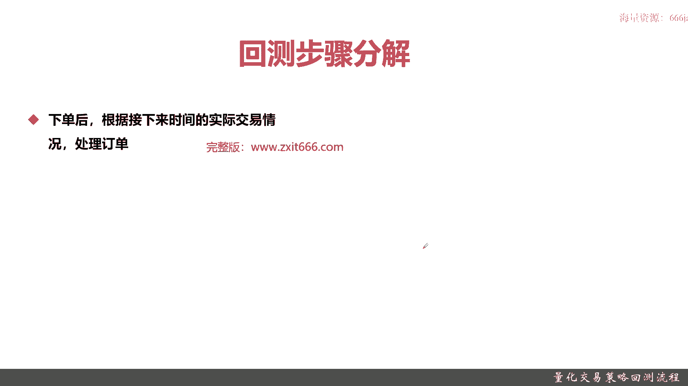
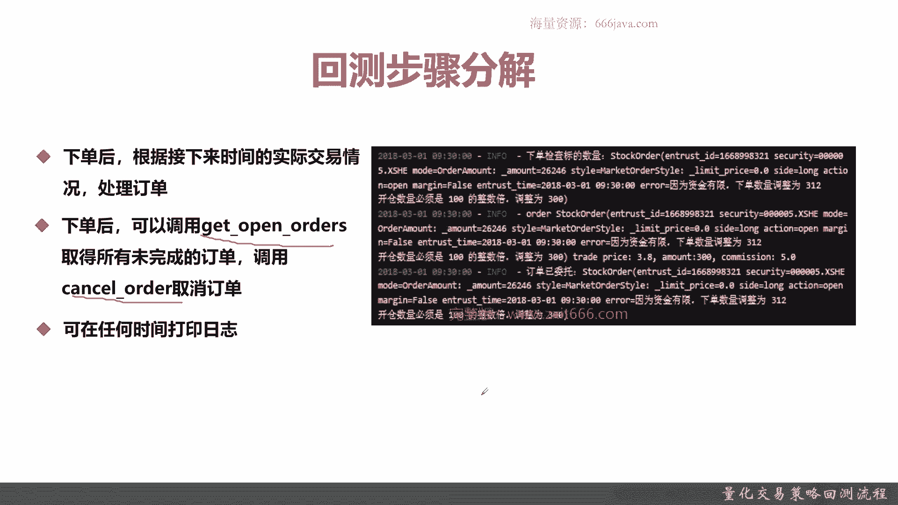
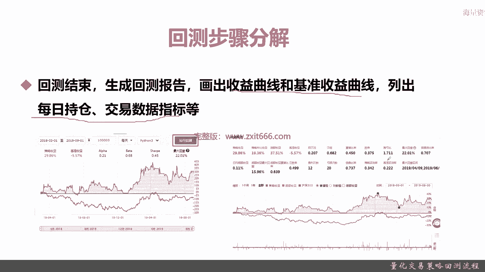
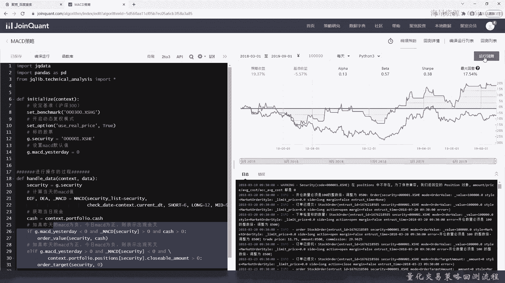
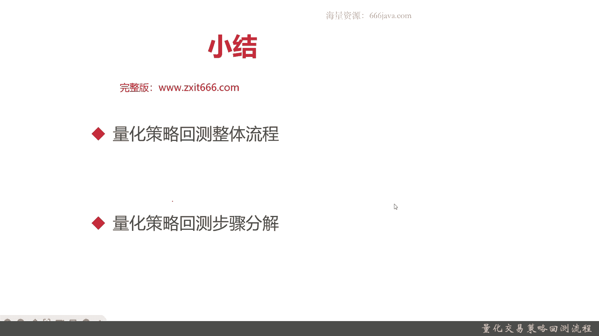

# 基于Python的股票分析与量化交易入门到实践 - P47：11.1 Python量化交易--策略回测实现_量化交易策略回测流程 - 纸飞机旅行家 - BV1rESFYeEuA

大家好，我是米切尔，在上一章呢我向大家介绍了量化择时，那么在这一章呢我将向大家介绍量化策略回测，那么本节呢我将向大家介绍，量化策略回测的整体流程，本节将从两个方面给大家介绍一下，量化策略回测的流程。

首先我会给大家介绍分化策略回测的整体流程，接下来我会给大家介绍一下量化策略回测，具体的步骤，并对他们进行分解，因为我们之前在第一大章的时候，给大家介绍了量化策略的回测流程。

那么这一章和第一章里面量化策略混合呢，它它们的内容和深度都是不一样的，本章主要是给大家介绍一下聚宽平台，量化策略回撤的流程，还有他们具体的内部的实现，还有一些注意的。

一些常见的一些量化策略回测的指标等等，那么接下来我们就将将向大家介绍一下，量化策略回程的整体流程，第一步是，我们需要选择股票池和具体实现的回测函数，第二步我们不仅要设定回撤的时间段。

还要设定初始金额以及具体的调仓频率，第三点，那就是历史数据的载入了，其实呢我们要实现这个handle data，然后进行并且调用它，后面就是区块链量化平台自己做的事情了。

那经过上面这些设定和数据初始化呢，量化平台本身就会进行自动的运行，首先第一步他会去处理订单，第二步他在处理流进程的过程当中呢，他会去判断哪些订单他是无法完成的，比如说我我的仓位里面只有200手。

但是呢按照我的量化策略的函数，我要卖出1000首，那这800首其中800首就是无法完成的，这个策略回撤的平台，就是它需要有取消未完成订单的功能，第三步在运行的时候呢，它要输出日志。

最后一步这回测的日期都跑完，每天的情况都输出完以后，它就会生成回测报告，OK以上呢是一个整体比较粗的那个回测的流程，那么接下来呢给大家进行步骤分解，首先第一步，第一步我们要去选择股票值。

那这个可以通过我们的具体的量化交易策略，来设定，那比方说，同学们还记得之前的白马股的那个股票池，然后呢，还有我们这一章会用到的MACD的量化回测策略，同时我们还要实现回测函数。

然后实现handle data函数，并且编写量化策略，这几步其实都是要回撤的，第一步准备工作，那么在页面上呢，其实就是编写量化交易策略的页面，那重点是一定要实现这个handle data特的函数。

你可以我们可以选举策略列表就去实现它，第二步呢，要选定回测的开始时间和结束时，也就是回测的时间段，同时选定初始金额和强酸频率，就像右图一样，这一块是开始和结束时间，那有同学之前会问我们这块的时间呢。

为什么和我们的信息打印的有些不一样，那其实在我们的日志里面呢有第一步，那它是根据我的选择的回测的，开始时间和结束日期去输出的，当然了，你每次根据你get data的和具体的参数。

那你选择日期的不同和你的取数，比如说MSCD技术分析，那个技术分析的指标的函数，check data不同，它的数据的日期是不一样的，记住一个是回测的时间，一个是数据本身的日期。

那这个就是这个10万就是我们的初始金额，这块运行的时间是频率是每天，然后第三步就取得股票数据，调用HDATE函数，那这个时候就会有一些日志的输出了，这个时候就开始一开始运行了。

好我们来看看后面几部是什么，然后是第四步，这些东西呢从第四步开始，4567步骤，都是距宽量化平台给我们自动处理的。

首先它会处理订单，就比如说是这样，根据每天每时每刻的那些股票的具体的情况，市场的价格，那他会给我们输出额交易订单，那么接下来的一步呢是取消未处理的订单，那我们人工可以调用get open door。

Get open orders，取得当前没有完成的订单，并且呢cancel order取消订单，如果我们的仓位不足以，支持我们的一些平仓的订单，那系统也会帮我们自动处理，比如说刚才我举的一个例子。

那假如我的仓位呃，我的仓位只有200首，那我们需要卖出1000首，那其中有800啊，800首他是无法完成的，无法完成，系统就会自动的取消，第五步，咱们这个可以支持主动的取消，当然系统也有被动的取消。

第六我们可以在任何时间打印日志，我们可以在当天打印，也可以在交易完成打错日志，像刚才这些info呢是系统自动帮我们生成的日志，我们也可以额外的调用log或者print生成日志。

好那么最后一步就是那个量化回测的报告。

那回测报告呢一般有收益曲线，基准收益曲线，这个是同学们看的最多的，那还有每日持仓交易数据，当然还有各种指标，那指标呢后面的分解我们会在后面进行介绍，我们可以给大家先看看例子，那像这一步。

你这个初始完跑完以后，你点击一下运行回测，那自动就回去运行详细的那个回测结果，可以生成类似的报告，好，那么以上呢就是本节的一个课程的基本内容。

好，接下来呢我们给大家实际演示一下，量化回测的具体例子，这个呢左边这块是我提前写好的，MACD的策略，那在后面的本章后面的内容呢，我会给大家详细介绍一下，在本章的一些回测，都是以这个策略作为演示的。

结果好呃，首先给大家看这块就是我们提前写好的ho data，那有计算MACD的值啊，然后具体交易的类型啊等等，然后这里是量化交易这个回测的时间段，这个是初始金额，这个是频率，那么接下来呢我们就可以运行。

首先我们不是运行回测，我们首先编译运行一下，好可以看到现在系统正在帮我们进行回测，他会每一天每一天帮我们回撤，然后呢这是一个下面这一块是回撤的，具体的因特，每一笔交易可能成功，可能失败都有好吧。

那这块我们就不展开了，这个大概初步的回测大概是18个呃，18个一年半的时间，那么接下来呢我们给大家再看一下，详细的预测和回测的结果，这是一个简要的报告，你看我们测验收率19%，以沪深300为例。

其沪深三短期作战时间，那个亏了5。57%，阿尔法0。13，贝塔是0。57，夏普0。38其实还不错，最大回撤17。54，有点高。

但也还行，那么我们看云点击一下运行回撤，好的，那可以看到整体的那个量化交易回测的报告，就比我们刚才看到的，一般编译运行的结果好得多，当然了，因为更详细，它其实运行的时间也稍微更长一点。

那会把一些额策略收益啊，超额收益啊，沪深300这些轴都打印出来，具体呃这些可以看到现在指标有很多，策略收益，年化收益，超额收益基准，阿尔法贝塔下补比胜率，巴拉巴拉巴拉一大堆，那这边呢额交易详情日日输出。

同学们都可以自己去点一点，都是有不同的内容的，性能分析还没有，那只是策略的整体收益，那是基准收益阿尔法贝塔，具体的值好，以上呢就是本节的具体内容好，下面呢进入本章小学，首先呢本节主要是给大家介绍一下。

量化策略的回测的流程，首先我们给大家介绍了这个回测的整体流程，整体流程有有七步，第一步到第三步，主要都是我们人工自己控制的，首先我们要操作选择在操作的股票时，然后其实说白了这个操作股仓时。

跟你的量化选股是有关系的，那跟我们的策略也是有关系的，然后实现handle data函数，同时编写好量化策略，第二步我们要选择回测的时间段，然后初始金额和调仓频率，第三步我们要取得股票数。

数据提示程序就是调用看到data函数，这样呢它可以获取历史数据，同时方呃可以进行准备调仓了，第四步，那就是开始就是区块链和平台帮我们去做的，首先他会处理订单，然后第五步。

那我们人工可以去调用那个get open orders，取得所有未完成的订单，同时调用cancel orders取消订单，那系统也会帮我们把一些无法完成的订单，自动取消掉，然后第六步就是打印日志。

当然打印日志我们可以在任何时间打印，以任何方式打印，那如果我们不强制打印系统用户，包括我们自动打印，每一笔交易的详情和持仓情况，最后呢回撤结束，系统会自动生成回测报告，那包括收益曲线和基准曲线。

这些都是常见的分析，然后同时把每日的持仓啊，交易数据等等都取都展现出来，接下来呢我们是详细的给大家介绍了，量化回测的步骤分解，同时我们在每一步介绍了那个以以后呢，我们给大家整体的演示了一遍。

整体的量化或交易额，交易回测的整体的流程，其实这因为我们有了那个这个可视化的，量化平台以后呢，这块其实还是相对比较容易的，以上就是本期的全部内容，我是米田。

大家下期再见。