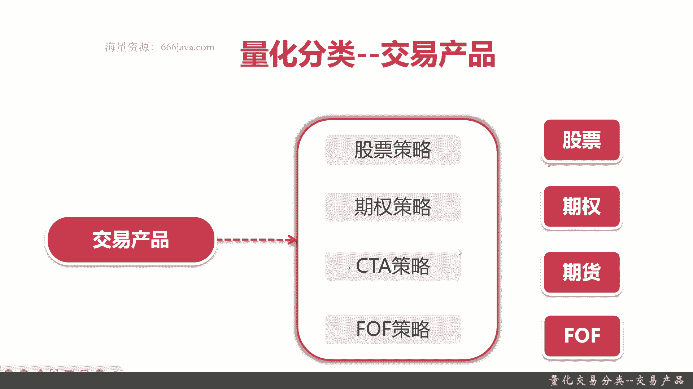
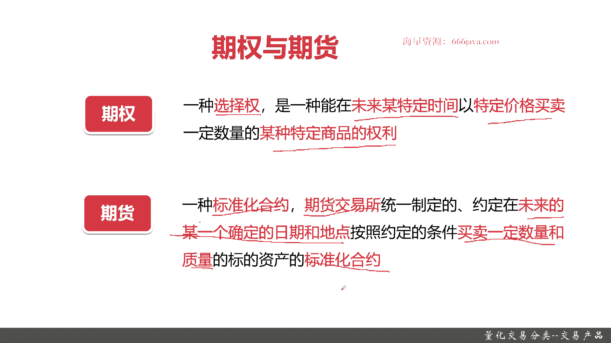
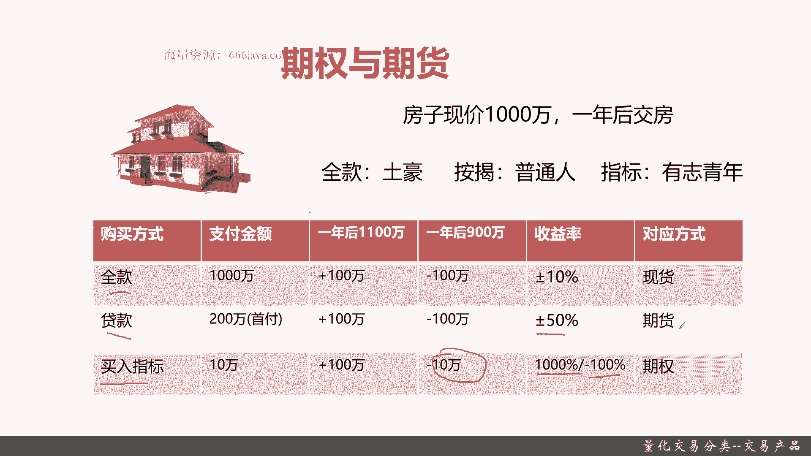
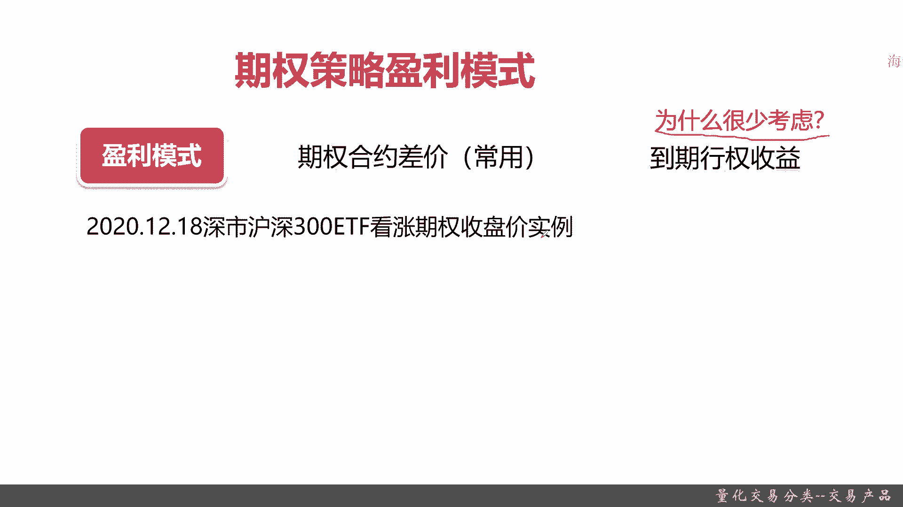
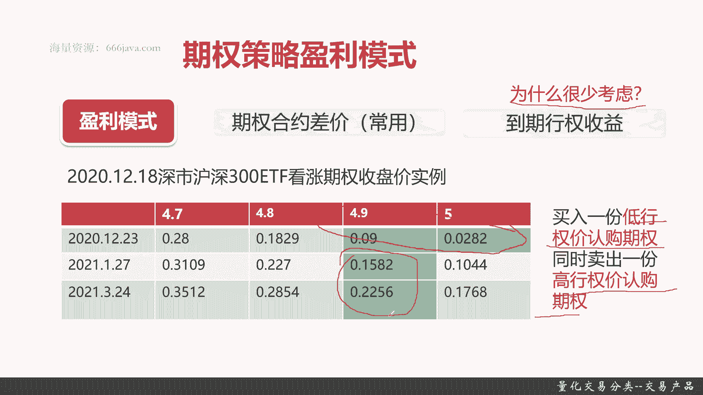
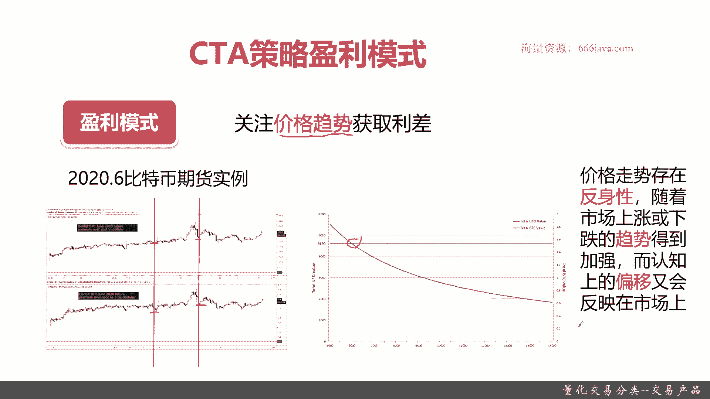
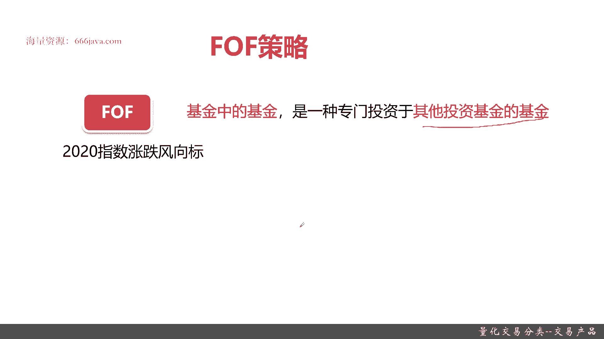
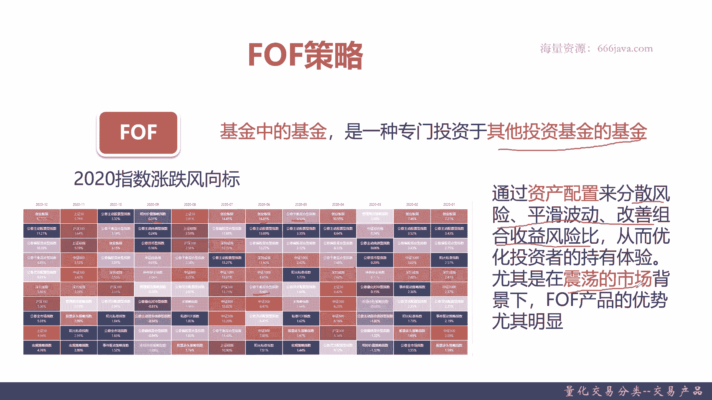
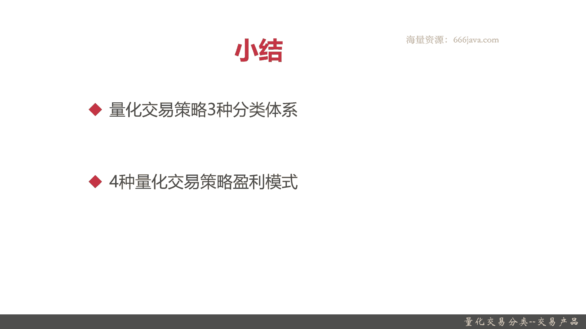

# 基于Python的股票分析与量化交易入门到实践 - P5：2.4 初识量化交易-必知的量化交易基础_量化交易分类--交易产品 - 纸飞机旅行家 - BV1rESFYeEuA

大家好，我是米铁，在上一节呢我向大家介绍量化交易的开发流程，那么这一节开始呢，我将向大家介绍量化交易策略的分类，首先呢我们给大家介绍，按照交易产品这个类型进行分类，那量化交易策略能够分成哪几类。

我们将从以下两个部分给大家介绍，量化交易策略的分类，首先我们给大家完整的介绍一下，量化交易策略的分类体系，接着呢我们向大家介绍一下交易产品这个分类，它相关的量化策略，盈利的一些模式。

那么接下来呢我们将向大家介绍，量化交易策略整体的分类体系，量化交易的分类体系呢有以下三个，首先呢是交易产品，其次呢是盈利，盈利模式，接着呢就是策略信号，后面呢逐一向大家详细介绍交易产品分类。

盈利模式分类以及策略信号分类，那么接下来呢我将向大家介绍，交易产品的具体的分类，交易产品的分类呢有以下四个，首先是股票策略，那他关注的呢其实就是股票，首先是股票策略，那他关注的呢就是股票。

接着呢是期权策略，那他关注的呢就是期权，再后面一个呢是CCTA策略，可能同学们听过，可能同学也没有听过，不过不要紧，那他自然关注的就是期货，最后呢是ff策略，那其实他就是关注的呢是ff。

这四种交易产品的分类呢，可能同学们只对股票有所了解，不过没关系，像后面的期权期货和forth，我们都会在本节给大家详细的介绍。

那么首先呢我们给大家介绍一下，股票策略的盈利模式，首先给大家介绍一下股票，首先我们给大家介绍一下股票，股票是股份公司，它是为筹集资金而发行的一种持股凭证，那它可以分给我们的股东股息和红利。

它是一种有价证券，那既然是有价证券呢，就可以被交易，那既然可以被交易呢，就有价差，那就可以获利，然后呢股票还有一种获利的方式呢，就是一直把这股票牢牢的攥在手里面，获取它的股息或者是红利好。

那么接下来呢给大家举个例子，这个呢是我们常见的沪市，也就是它的一个整体的走势，那可以看到它的价格呢是有各种波动的，在各种时间是有波峰和波谷的，那么如果我们在价格低的时候买入，价格高的时候抛出。

那我们就可以获取了，这个股票的这些利润的价差，OK这个就是股票的策略盈利模式，那股票策略的盈利模式用一句话总结一下，就是通过股价的波动进行盈利，重点记住关注是股价是波动的，如果这个股价是一条线。

那你就很难进行获利，那么接下来呢我将再向大家介绍期权和期货，首先呢给大家介绍一下期权和期货的定义，什么是期权，期权，记住是一种选择权，它是在未来特定时间，以特定价格，买卖一定数量的某种特定商品的权利。

记住它只是一种买卖特定商品的权利，期权其实只是一种选择权，它只是能买卖特定商品，在未来特定时间和特定价格的一种权利，比较绕口，待会给大家详细举个例子，再接下来呢是期货啊，期货是一种标准化的合约。

它和期权不同的，它是一种合约，期货是由期货交易所制定的，那也是在未来的一个确定时间，但是这里不仅是时间，还有日期，按照约定的条件买卖一定数量，这一点和期权有点类似，它要买卖一定数量和质量的标的。

资产的标准化合约，记住期货它是一种合约，而期权只是一种选择权，当然这两块都只是定义，可能对同学们不太不是特别好理解，那么接下来呢我给大家看一个实际例子，方便大家快速的了解。

这里呢是一个独门独院房子，那为了给大家区分一下什么是期权和期货，那我们就给大家来以这个买这个房子为例，假设这个房子现价是1000万，那一年后交房，那那那你如果要去买这个房子有三种形式，首先你全款购买。

你就是个土豪，一次性付清1000万，那这个房子就是你的，还有一种呢是按揭，我们普通人嘛首付有第一次首呃，首套房30%，你付额300万或者是20%，你付200万，当然了，你二套房可能是额首付要50%了。

这个我们不去看了，这是一个比例，所以是按揭，再一个呢是指标，就是说我在某年某月，我可能未来一年内，我有权利优先去购买这个房子，它只是一个指标，我是有志青年，我可以先和房东约定付一笔定金，这个就叫指标。

那这三种付款方式，它背后的金融知识或者金融产品，分别代表了什么呢，或者他们有什么不同呢。

我们来给大家详细解答一下，首先根据购买方式不同，那它分全款贷款和买入指标，既然是购买方式不同，你支付的金额就不同，那全款呢你需要支付1000万贷款的，你只需要支付200万，当然了，我们这个是一个参考。

当然现实中也要支付300万的，但是你买入指标你就是付个定金，那你就很低了，可能只需要付10万，那一年后房子有两种情况，一种是涨100万，所以房价变成了那个1100万。

还有呢一年后可能房子会跌变成900万，在这两个不同的场景之下呢，全款贷款买入指标它的利润分别是多少，或者它的那个盈亏分别是多少，首先在一年后，房子涨价变成了1000万。

那全款贷款买入指标那都是盈利100万，而一年后如果房子跌了变成900万，那么那你全款的就亏了100万，贷款也亏了100万，但是买入指标的这个有志青年他就不一样了，他只亏了10万，为什么呢。

因为我有这个优先购买权，但是我可以不买啊，那我只不过是把这10万给损失了，OK所以这么看来，就是买入指标的风险是不是相对较低，好那刚才是这种情况，我们只是看一个那个收益的盈亏情况，是在这两种情况下。

记住啊，这个买入指标的有志青年，他和全款和贷款是不一样的，主要是他的亏损额比较低，然后收益率呢，那比如说我全款支付了，那我就其实就是赚就赚10%，亏也亏百分之是，那么收益率呢其实就是正负10%。

而如果是贷款，那你的话正负收益率，因为你首付是200万，那你其实正亏100万或者互亏100万，那你收益率就是正负50%，OK那在买入指标上，这就差距更大了，比如说你买入指标。

从房价从1000万涨到1100万，那你涨了100万，那你赚了就赚了1%，1000，其实就涨了十倍嘛对吧，因为你剩下这个那个1000呃，呃那990万你完全可以去借，OK假设你们没有任何利益的情况下。

当然现实中也不可能是这么让你，完美无缺的对吧，然后你会亏，如果你亏的话是怎么亏呢，你其实就亏10万就亏百分之百，所以呢对应的方式分别是现货，期货和期权，那从这里可以看出，其实根据那个风险来看。

现货相对来说风险较低，那你看就算亏和赚，它只有10%吗，但是期货就比较高，正负50%，那更刺激的是期权，你要么赚1000%，要么亏百分之百，那有的同学们就说，那我这么好的话，那我干脆我大的都去玩期权。

首先你得买得到期权，你这个房价房东肯这样，按照你给锁定你的房价给愿意给，其次你还得保证你能尽量的去挣钱，因为有可能这个房价就是跌的好吧，OK举这个例子呢，主要是给大家要参考和理解一下，期权和期货的关系。

还有以及它的异同，那么接下来呢我们给大家详细分析一下，期权相关的策略，以及期货相关的CCTA策略之间有什么差异。

那么接下来呢，首先给大家介绍一下期权策略的盈利模式，那期权策略呢根据刚才的介绍，它其实有两种，一种是期权的合约差价，这个是常用的，另外一种呢是到期行权，那比如说我那个房子，那我如果到期涨了100万。

那OK那我行权的话，那不就是赚了整整100万吗，那我可能赚了1000%，但是为什么现实中却不是很常用呢，所以同学们要考虑一下他为什么很少考虑，OK让同学们自己思考一下，其实原因很简单。

因为你的期权一般来说选权的话，它会锁定期非常长，它不是像这里只是一年，可能是两年或3年，那你这个时间肯定你把这时间长度呃一扩张，那你想想看中间的不可变的因素会不会有很多。

那这样的话你的权的周转其实就会差很多了，金融里面有个很重要的情况，就是你的仓位，你的现金流这块很重要，接下来呢给大家具体介绍下期权策略，具体的盈利模式，比如说我们以2020年12月18日。

深市沪深300ETF看涨期权的收盘价为实例。

看看有什么差异，或者其中有哪些机会，我呢提前给大家标了两个颜色，一个是绿色的，一个是蓝色的，这两块呢，在那个沪深300这个看涨的期权里面呢，它收盘价变化都不是不一样的。

比如说在那个2020年12月23日，这个时间点，假设我们300ETF看涨到四块七，那他的那个期权价格是0。28，4。8是0。1829，四块九是0。09，那五块是0。00282，那其实在五和4。9之内。

这个价格其实中间是有差异的，那有差异其实我们就可以做差好吧，当然了，你跟实际情况也有关系，你比如说你非要说我是从0。1829，就是四块八和四块九，中间也有差异，0。28和0。18，中间也也有差异。

这个其实呢你还要去考虑具体的这个沪深300，它具体的那个行情走势，O然后呢比如说同样的是四块九，那它形成价格在2021年的1月27日，他就是0。1582，那在2021年的3月24日呢。

他的行权价格就是0。2256，OK那其实时间是不一样的，时间不一样的，行权价格也是不一样的，好吧，期权记住，它是根据你的时间和你的价格进行行权的，那么这个呢在整体这两块，实际上它就有很大的一个利差。

具体是怎么去盈利的呢，其实很简单，买入一份第一行权架构的认购期权，同时卖出一份高行权架构的认购期权，中间保证一些差异，比如说你看我四块九在20204是0。09，那到2021年1月20就是0。1582了。

那甚至到2021年3月十二十四号呢，就是0。256了，通过这个方式来做套利，因为你买入一笔再卖出一笔，其实你始终保持手上有笔，但是中间因为有价格的波动，你就可以进行获利，这个呢就是期权策略的盈利模式。

那么接下来呢是CCTA策略的盈利模式，CCTA策略的盈利模式呢，其实它其实主要是关注价格趋势，那什么叫价格计数呢，它其实是期货和实际现货中间，它总归有个价格背离曲线呃，价格曲线会有一个差异的情况。

那在这里面其实就可以做空或者做多好，那么接下来呢我们以2020年6月份，比特币期货的实例作为一个例子，给大家分析一下，你们看一下，这个是2020年6月份，比特币现货和期货的价格走势。

我们给大家标了两个线，你可以看一下，仔细看一下这两个线，对比下生产有什么差异，比如说在这一段，那你看其实现货它虽然是跌的，但是波动不是特别大，但是你看期货就有一个大的下跌按空间，然后呢在这一段。

其实呢现货有一个较大的较陡的上涨空间，而期货就没有，所以呢在一定时间内，期货和现货它的时差是中间是有一个波动的，可能是分钟，甚至可能是秒，大，都是一些稍纵即逝的机会。

但是这些就形成了一些那个CCTA策略，盈利的一些套利模式，我们再给大家举个例子啊，看这张图，那你可以看到这个是比特币的那个价值，这个是美元的一些价值，那在这个时间看，其实中间是有个焦点。

当下面网轩一直是跌下去的时候，那你的期货和现货的价格中间差就越来越大，越来越大越来越大，那以这个焦点来，那个期货其实高于期货，那最终其实中间就是有做空和做多机会。

那CCTA策略它的具体的盈利模式是什么呢，其实有一个金融知识里面常见的一个特性，叫反身性，这一块呢我们的索罗斯这个大鳄，它用的非常牛逼，他说的是价格走势存在反身性，随着市场上涨或者下跌的趋势。

它会被市场情绪进行加强，而认知上的偏移又会反映在市场上，在这两个例子呢，就充分体现了反身性的这个特性，你看价格总是突然的有些变化，然后这块变化呢呃并不宜人类的意志为转移，它反而是加强了它上涨了一下。

突然上涨或者涨的更多了，跌了会跌的更多，就比如说像比特币，你这个右边这个错位，看本来11。8的，那最后只有到0。6，这只用了多长时间，你们看是吧，所以CTI策略其实是关注价格趋势，中间的一些差异。

从而进行套利，更多的其实它关注的是些期货好。

那么最后呢我们再给大家介绍一下force策略，ff同学们可能听过也有可能没没听过，没关系，ff其实比较好理解，就是fond of fund基金中的基金，是一种专门投资于其他投资基金的基金。

一般来说呢FOOLF它主要就是购买各种基金的，当然也有一些for福呢，它他没有那么纯粹只是投基金，那可能他会投一些股票或者是债券，或者期货等等等等等，然后呢给大家看一下这张图。

为什么forth这个策略会有市场，这是整个2020年，那个我们收集的所有的这些指数，它的涨跌的风向标。

比如说你看2020年12月，那创业板指数它是效果最好，但是到了2020年的11月，他是上证五零，那么再看到2020年的5月，公募平衡混合指数那个月收益的最好，然后在2020年9月是相对价值策略。

你看它的涨和跌其实分别是不一样的，而且每个月最好的表现的，无论是指数或者你可以理解为，这指数背后可以理解为一只基金吗，它的涨跌幅都是不一样的，这是为什么呢，因为市场它是由很多板块和很多人组成。

没有人能完全预测市场，而且市场的风格也就是它涨跌的倾向，变化得非常快，好吧这一块，所以为了综合评估平衡，为了综合平衡那个市场上指数的风险与收益，所以才会诞生出ff专门研究各种基金。

然后统一把基金进行采购，这样的话其实它会把风险相对来说变得更低，因为很简单，你基金都是专业人士，基金肯定比老百姓，甚至比一师独立的股票，他其实收益更加稳定，那么好，接下来呢ff其实它就是通过资产配置。

那资产配置这个词大家可能听得比了，它关键是它的目的就是要分散风险，平滑波动，然后从而改善组合的收益，风险比希望风险相对较低，然后收益相对较高，他是追求的一个风险收益比，尤其在震荡的市场，你比如说这个月。

在2020年5月表现最好的是3。53，到了下个月就变成了16。85，那我如果同时又有创业板尺，我又购买了公募平衡嗯，混合型指数，那假设同时购买，那我这两个月平均收益就是16。85，加3。53。

就是那个将近10%的收益，非常稳定，因为无论怎么样都可以，但是如果我只买了公务平衡的，那我是不是只有3%点几，然后如果在2020年6月的时候，公用平衡是8。8。6，那就是平衡嗯，这两如果你只卖它。

其实这两个加一加，那你可能只有5%左右收益，但是如果你买的是创意股，创意股指呢，你又能保证创业股指，其实你看在这张图里面，在2020年5月份，他是亏的，他不挣钱，那你综合收益起来下来。

肯定没有10%这么高，OK所以同学们尤其是在正当的市场背景下，丰富产品的优势尤其明显，那为什么现在这两年丰富产品市场上这么好呢，因为很简单，你看每年都会有很多特殊的情况，有疫情，有战争。

这种市场是经常震动。

所以负负表现其实相对来讲好，以上呢就是本节的全部内容，那个我们下面进行小结，这一节呢我们首先给大家介绍了，量化交易策略的三种分类体系，分别是那个交易产品分类体系，盈利策略分类体系和策略信号分类体系。

那么接下来呢我们给大家介绍了，那四种量化交易产品，这个分裂体系，就是关于交易产品这个分类体系的，具体的那个盈利模式，分别是股票，那股票主要是通过股价的波动，然后期权期权主要是通过期权的价差获取。

它并不是为了那个到期行权而获益，然后是期货，期货其实更多是CTA套利，而策略它其实为了CTACTA其实为了套利，但他主要是和现货和期货之间一个反身性，来通过一个价格走势的背离，从而获取大量的利润。

最后呢是for富策略，for富策略其实又是fond of f基金中的基金，其实它是通过稳定的购买不同站，或者叫资产配置不同的基金，来获取相对的风险和收益，相对稳定的一种策略，因为基金更加专业嘛，而且在。

尤其是在现在这种市场比较震荡的情况下，那基金的表现效果更好，市场上的forth策略的基金越来越多，也从侧面能印证这个情况，就是在震荡的条件下，FX策略表现的相对较好，好以上就是本节的全部内容。

我是米切尔，大家下期再见。

